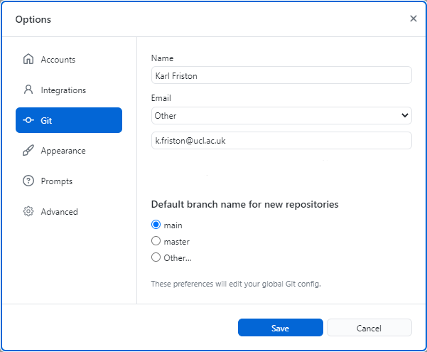
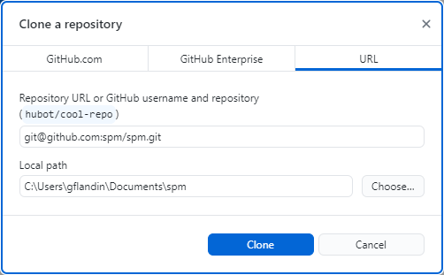
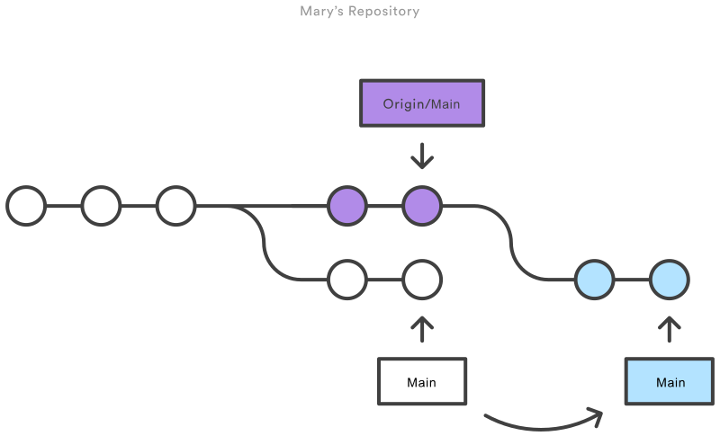

# SPM Development with Git and GitHub

We use the [Git](https://git-scm.com/) version control system for the development of SPM. [GitHub](https://github.com/) is used as the collaborative code hosting platform (with a local mirror using [Gitea](https://gitea.io/)): the authoritative copy of the SPM repository is available at [spm/spm](https://github.com/spm/spm).

We provide here instructions to interact with the SPM repository using the [GitHub Desktop](https://desktop.github.com/). This mainly concerns Windows developers -- we also mention the command line equivalents when relevant.

##  Git Installation

First, please install the GitHub Desktop:

* [GitHub Desktop](https://desktop.github.com/)

Once installed, you need to authenticate with your [GitHub account](https://docs.github.com/en/get-started/onboarding/getting-started-with-your-github-account). To do so, follow the online instructions:

* [Authenticating to GitHub](https://docs.github.com/en/desktop/installing-and-configuring-github-desktop/installing-and-authenticating-to-github-desktop/authenticating-to-github)

!!! tip "Two-factor authentication (2FA)"
    Two-factor authentication (2FA) is not required yet but might be by the [end of 2023](https://github.blog/2023-03-09-raising-the-bar-for-software-security-github-2fa-begins-march-13/). See [here](https://docs.github.com/en/authentication/securing-your-account-with-two-factor-authentication-2fa) for instructions on how to configure 2FA on your account.

<!--
You can also, optionally, install the Git command line tool and TortoiseGit:

* [Git](https://git-scm.com/downloads) or [Git for Windows](https://gitforwindows.org/)
* [TortoiseGit](https://tortoisegit.org/)

-->

<!--

It is also recommended to install the Visual Studio Code text editor and WinMerge:

* [Visual Studio Code](https://code.visualstudio.com/)
* [WinMerge](https://winmerge.org/)

### Visual Studio Code Extensions

Visual Studio Code has a native support of Git:

* [Git Support in Visual Studio Code](https://code.visualstudio.com/docs/editor/versioncontrol#_git-support)

but some extra extensions are worth considering for MATLAB development:

* [Code Spell Checker](https://marketplace.visualstudio.com/items?itemName=streetsidesoftware.code-spell-checker)
* [MATLAB](https://marketplace.visualstudio.com/items?itemName=Gimly81.matlab)
* [Remote - SSH](https://marketplace.visualstudio.com/items?itemName=ms-vscode-remote.remote-ssh)

-->

## Git Configuration

### Username and commit email address

Git commits are associated with a name and email address. GitHub then uses the email address to associate commits with your account on GitHub.com. It is therefore essential to set these before making any commit (and to set them again on all computers).

* [Setting your username](https://docs.github.com/en/get-started/getting-started-with-git/setting-your-username-in-git)
* [Setting your commit email address](https://docs.github.com/en/account-and-profile/setting-up-and-managing-your-personal-account-on-github/managing-email-preferences/setting-your-commit-email-address)

The instructions to set your commit name and email address in GitHub Desktop are available here:

* [Configuring your global author information](https://docs.github.com/en/desktop/installing-and-configuring-github-desktop/configuring-and-customizing-github-desktop/configuring-git-for-github-desktop#configuring-your-global-author-information)

<figure markdown>
  
  <figcaption>Specify your commit name and email address in GitHub Desktop.</figcaption>
</figure>

The command line equivalent is:

```
git config --global user.name "Karl Friston"
git config --global user.email "k.friston@ucl.ac.uk"
```

If you use another personal email for most of your repositories, make sure to set the SPM repository to specifically use your institutional email address:

```
git config --local user.email "k.friston@ucl.ac.uk"
```

This can also be done with GitHub Desktop by following [these instructions](https://docs.github.com/en/desktop/installing-and-configuring-github-desktop/configuring-and-customizing-github-desktop/configuring-git-for-github-desktop#configuring-different-author-information-for-an-individual-repository).

!!! note
    Note that you can [associate multiple email addresses](https://docs.github.com/en/account-and-profile/setting-up-and-managing-your-personal-account-on-github/managing-email-preferences/adding-an-email-address-to-your-github-account) with a single GitHub account.

### Merge Strategy

The default of [`git pull`](https://git-scm.com/docs/git-pull) to reconcile divergent branches is to call `git merge`. Here this default is changed to call `git rebase` instead. This has the advantage of creating a linear history, like in a traditional SVN workflow.

```
git config --global pull.rebase true
```

This is equivalent to using `git pull --rebase`.

To apply this setting from GitHub Desktop, you need to open the command prompt by selecting ++"Repository"++ then ++"Open in Command Prompt"++ from the top menu and enter the above command line.

!!! note "Enforcing a linear commit history"
    Note that the option to [require a linear history](https://docs.github.com/en/repositories/configuring-branches-and-merges-in-your-repository/defining-the-mergeability-of-pull-requests/about-protected-branches#require-linear-history) has been enabled on the SPM repository. This prevents from pushing merge commits to the main branch.

## Clone the SPM repository

Follow [these instructions](https://docs.github.com/en/desktop/contributing-and-collaborating-using-github-desktop/adding-and-cloning-repositories/cloning-a-repository-from-github-to-github-desktop) with the SPM repository: [https://github/spm/spm](https://github/spm/spm)

<figure markdown>
  
  <figcaption>Clone the SPM repository from its GitHub URL.</figcaption>
</figure>

From the command line, the equivalent is:

```
git clone git@github.com:spm/spm.git
```

## Git Commits

After editing some files in the `main` branch, select the changes to include in a commit, write a commit message and push the changes to `origin`:

* [Making changes](https://docs.github.com/en/desktop/contributing-and-collaborating-using-github-desktop/making-changes-in-a-branch/committing-and-reviewing-changes-to-your-project#selecting-changes-to-include-in-a-commit)

From the command line, this is obtained with:

```
git add spm_example.m
git commit -m "<commit message>"
```

Ideally, "each commit should be a perfect, atomic unit of change". Do commit related changes, commit often but don't commit half-done work (use branch or stash instead).

### Commit Messages

Use the imperative and prefix the commit message with one of:

* ++"New feature"++
* ++"Enhancement"++
* ++"Bug fix"++
* ++"Documentation"++
* ++"Refactoring"++

You should be able to suffix a commit message to the phrase "If applied, this code will ...".

Commit messages should begin with a short summary of the changes (up to 70 characters) followed by a blank line and the body text, i.e.:

```
Enhancement: replace this with that in such and such

Longer description that might contain bullet points:
* item 1
* item 2
```

## Git Workflow

We are using a [Centralised Workflow](https://www.atlassian.com/git/tutorials/comparing-workflows#centralized-workflow). This is also called [Trunk Based Development](https://trunkbaseddevelopment.com/) (see this [article](https://medium.com/@mattia.battiston/why-i-love-trunk-based-development-641fcf0b94a0) for a discussion). Popular other workflows include [GitHub Flow](https://githubflow.github.io/) and [Gitflow](https://www.atlassian.com/git/tutorials/comparing-workflows/gitflow-workflow).

<figure markdown>
  
  <figcaption><code>git pull</code> is used to incorporate upstream changes into the repository. The <code>--rebase</code> option tells Git to move all of the local commits to the tip of the <code>main</code> branch after synchronising it with the changes from the central repository. From <a href="https://www.atlassian.com/git/tutorials/comparing-workflows#centralized-workflow">Atlassian documentation</a>]()</figcaption>
</figure>

## Pull Requests

Recommendation for pull request reviewers: When merging, we generally like `squash+merge`. Unless it is the rare case of a PR with carefully staged individual commits that you want in the history separately, in which case `merge` is acceptable, but usually prefer `squash+merge`.

## References

* [Dangit, Git!?!](https://dangitgit.com/)
* [On Git and Cognitive Load](https://dzone.com/articles/on-git-and-cognitive-load)
