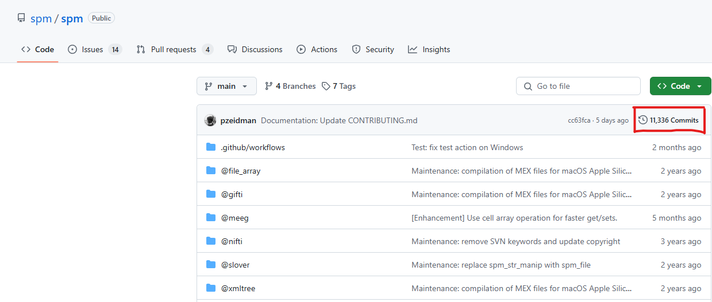
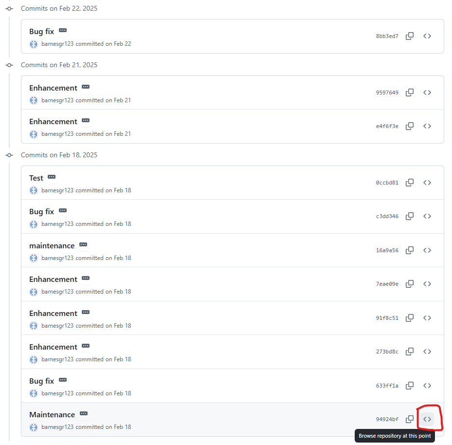
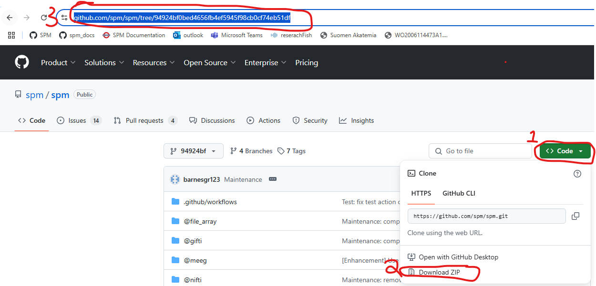

# SPM version numbers
SPM has a **version** and a **release**. For example, the version may be **SPM25** and the release may be **25.01**. 

Other toolboxes that depend on SPM use this information to check whether a compatible SPM version is installed. A common pattern is to split the version string into two parts, e.g. SPM12 becomes **SPM** and **12**, and then the latter part is compared to the desired version number.

## Calendar versioning
With the introduction of SPM25, SPM moved to [calendar versioning](https://calver.org/). The format is **YY.0M[.MICRO]**, where YY is the short year (e.g. 25 for the year 2025), 0M is the zero padded month (e.g. 06 for June or 12 for December) and .MICRO is an optional integer for patches.

For backward compatibility, the version and release are set as follows:

-	**Version**: SPMYY, where YY is the year of the most recent release, e.g. SPM25
-	**Release**: either 00.00 for the development version on Github or for a release: YY.0M[.MICRO], e.g. 25.07 for July 2025

## Where the SPM version number is stored
The SPM version is stored on the second line of the file Contents.m in the root directory, or Contents.txt when SPM is in deployed mode (i.e., compiled).

## Querying SPM’s version number
To obtain the version and release call:

```Matlab
[v, r] = spm('ver')
```

where v is the version and r is the release. For convenience, to return the version and release as a single string, instead call: 

```Matlab 
spm('version')
```
please note that when using the development version of SPM the release string will be 00.00

## Uniquely identifying the development version of SPM 
If you use the development version of SPM you will need to be able to uniquely identify what version of SPM that you are using. This is important when you either write papers or share code with others. By way of example let's say you were using the development version that was available on the 18th of February 2025. To uniquely identify this version of SPM you must first locate the commit associated with the version you are using. This can easily be done by pressing the commits button in the repository 

<figure markdown>
  <div class="center">
    
  </div>
</figure>

When you press this button you will be redirected to the list of commits over time. Hovering your mouse over the two  angular brackets next to the appropriate commit will allow you to explore the repository at that point in time. 


<figure markdown>
  <div class="center">
    
  </div>
</figure>

When you click on these brackets you will be redirected to the repository at that point in time. You can now 

1. Hover over the code button
2. Click download ZIP
3. Save the link to the repository 


<figure markdown>
  <div class="center">
    
  </div>
</figure>

You should now have the correct code for your project and a link that you can share in scripts or in papers. An example of what you might put in a script is given below. 


```matlab
% code runs with SPM development version
% https://github.com/spm/spm/tree/94924bf0bed4656fb4ef5945f98cb0cf74eb51df
```