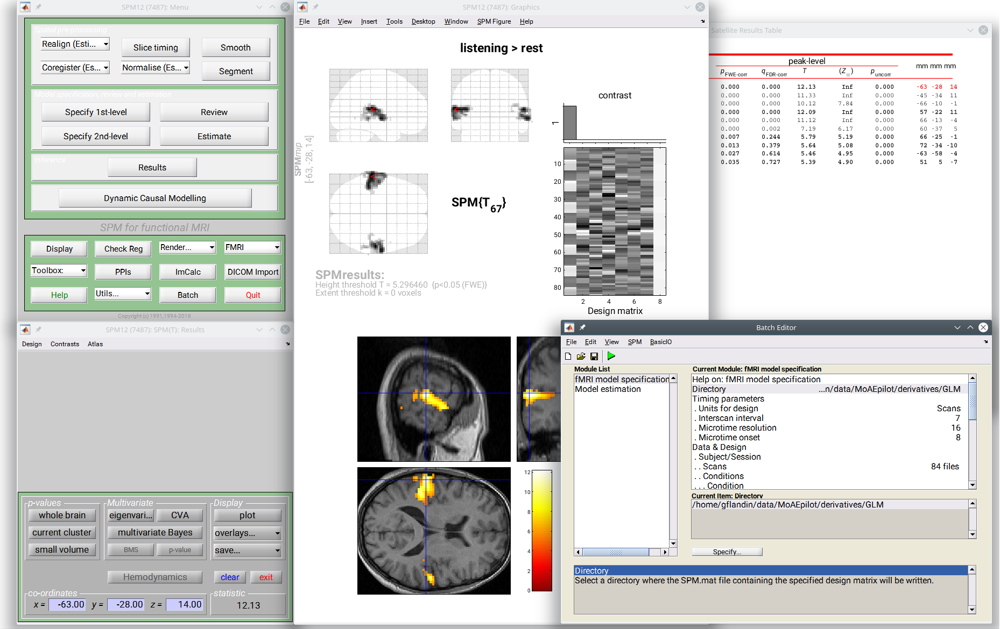

# Statistical Parametric Mapping

<figure markdown>
  { width="700" }
  <figcaption></figcaption>
</figure>

## Getting started

Statistical Parametric Mapping refers to the construction and assessment of spatially extended statistical processes used to test hypotheses about functional imaging data. These ideas have been instantiated in a free and open source software that is called **SPM**.

The SPM software package has been designed for the analysis of brain imaging data sequences. The sequences can be a series of images from different cohorts, or time-series from the same subject. The current release is designed for the analysis of **fMRI**, **PET**, **SPECT**, **EEG** and **MEG**.

-   :material-lock-open:{ .lg .middle } __Open Source Software__

    ---

    SPM is an academic free and open source software.

    [:octicons-arrow-right-24: **Installation** ](installation/index.md)

-   :material-monitor:{ .lg .middle } __Educational materials__

    ---

    We provide a curated list of tutorials for different imaging analyses.

    [:octicons-arrow-right-24: **Tutorials**](tutorials/index.md)

-   :fontawesome-solid-graduation-cap:{ .lg .middle } __Courses__

    ---

    Regular SPM courses run every autumn and spring, both online and in-person in London.

    [:octicons-arrow-right-24: **Courses information**](https://www.fil.ion.ucl.ac.uk/spm/course/)

-   :material-account-question:{ .lg .middle } __Support__

    ---

    The SPM discussion list provides live support to your queries.

    [:octicons-arrow-right-24: **SPM discussion list**](https://www.fil.ion.ucl.ac.uk/spm/support/)

## History

The SPM suite and associated theory was originally developed by [Karl Friston](https://www.fil.ion.ucl.ac.uk/~karl/) for the routine statistical analysis of functional neuroimaging data from Positron Emission Tomography (PET), while at the Medical Research Council Cyclotron Unit. Now known as SPMclassic, this software was made available to the emerging functional imaging community in 1991, to promote collaboration and a common analysis scheme across laboratories.

SPM'94 was the first major revision of the SPM software. SPM'94 was written primarily by [Karl Friston](https://www.fil.ion.ucl.ac.uk/~karl/) during the summer of 1994, with invaluable conceptual and technical help from [John Ashburner](https://www.fil.ion.ucl.ac.uk/~john/), Jon Heather, Andrew Holmes and Jean-Baptiste Poline. SPM'95, [SPM'96](https://www.fil.ion.ucl.ac.uk/spm/software/spm96/), [SPM'99](https://www.fil.ion.ucl.ac.uk/spm/software/spm99/), [SPM2](https://www.fil.ion.ucl.ac.uk/spm/software/spm2/), [SPM5](https://www.fil.ion.ucl.ac.uk/spm/software/spm5/), [SPM8](https://www.fil.ion.ucl.ac.uk/spm/software/spm8/) and [SPM12](https://www.fil.ion.ucl.ac.uk/spm/software/spm12/) are based on SPM'94, and represent the ongoing theoretical advances and technical improvements.

!!! abstract "Further reading"

    [Penny, W., Friston, K., Ashburner, J., Kiebel, S., & Nichols, T. (2006). *Statistical parametric mapping: The analysis of functional brain images*.](https://www.fil.ion.ucl.ac.uk/spm/doc/#books)

    [Friston, K.J. *A short history of statistical parametric mapping in functional neuroimaging*.](https://www.fil.ion.ucl.ac.uk/spm/doc/history.html)

    [Flandin, G. and Friston, K.J. *Statistical parametric mapping (SPM)*.](http://www.scholarpedia.org/article/Statistical_parametric_mapping_(SPM))

    [Ashburner, J. (2012). *SPM: A history*.](https://doi.org/10.1016/j.neuroimage.2011.10.025)

--8<-- "addons/abbreviations.md"
