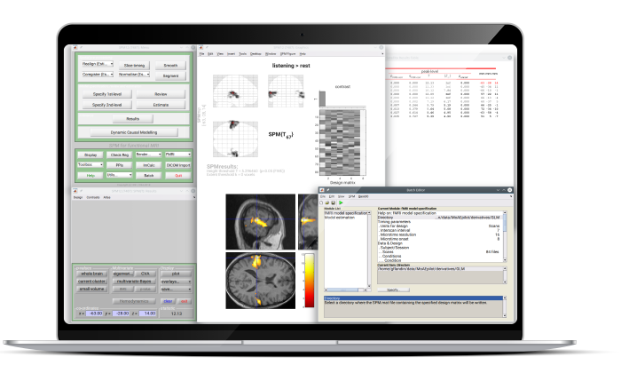

# Statistical Parametric Mapping

## Overview
Statistical Parametric Mapping is the construction and assessment of spatially extended statistical processes used to test hypotheses about functional imaging data. These ideas have been instantiated in a free and open source software that is called **SPM**.

The SPM software package has been designed for the analysis of brain imaging data sequences. The sequences can be a series of images from different cohorts, or time-series from the same subject. The current release is designed for the analysis of **fMRI**, **PET**, **SPECT**, **EEG** and **MEG**.

<figure markdown>
  
  <figcaption></figcaption>
</figure>

## Getting started

<div class="grid cards" markdown>

-   :material-lock-open:{ .lg .middle } __Software__

    ---

    SPM is free and open source academic software.

    [:octicons-arrow-right-24: **Installation** ](installation/index.md)

-   :material-monitor:{ .lg .middle } __Educational materials__

    ---

    We provide a curated list of tutorials for different imaging analyses.

    [:octicons-arrow-right-24: **Tutorials**](tutorials/index.md)

-   :fontawesome-solid-graduation-cap:{ .lg .middle } __Courses__

    ---

    Regular SPM courses run every autumn and spring, both online and in-person in London.

    [:octicons-arrow-right-24: **Courses information**](courses/index.md)

-   :material-account-question:{ .lg .middle } __Support__

    ---

    The SPM discussion list provides live support to your queries.

    [:octicons-arrow-right-24: **SPM discussion list**](https://www.fil.ion.ucl.ac.uk/spm/support/)

</div>

## Citing SPM

Please acknowledge using SPM by citing:

Tierney et al., (2025). SPM 25: open source neuroimaging analysis software. *Journal of Open Source Software, 10*(110), 8103, https://doi.org/10.21105/joss.08103

```
@article{Tierney2025, 
    title = {SPM 25: open source neuroimaging analysis software}, 
    author = {Tierney, Tim M. and Alexander, Nicholas A. and Ashburner, John and Avila, Nicole Labra and Balbastre, Yaël and Barnes, Gareth and Bezsudnova, Yulia and Brudfors, Mikael and Eckstein, Korbinian and Flandin, Guillaume and Friston, Karl and Jafarian, Amirhossein and Kowalczyk, Olivia S. and Litvak, Vladimir and Medrano, Johan and Mellor, Stephanie and O'Neill, George and Parr, Thomas and Razi, Adeel and Timms, Ryan and Zeidman, Peter}, 
    journal = {Journal of Open Source Software} 
    doi = {10.21105/joss.08103}, 
    url = {https://doi.org/10.21105/joss.08103}, 
    year = {2025}, 
    publisher = {The Open Journal}, 
    volume = {10}, 
    number = {110}, 
    pages = {8103}, 
}
```


--8<-- "addons/abbreviations.md"
