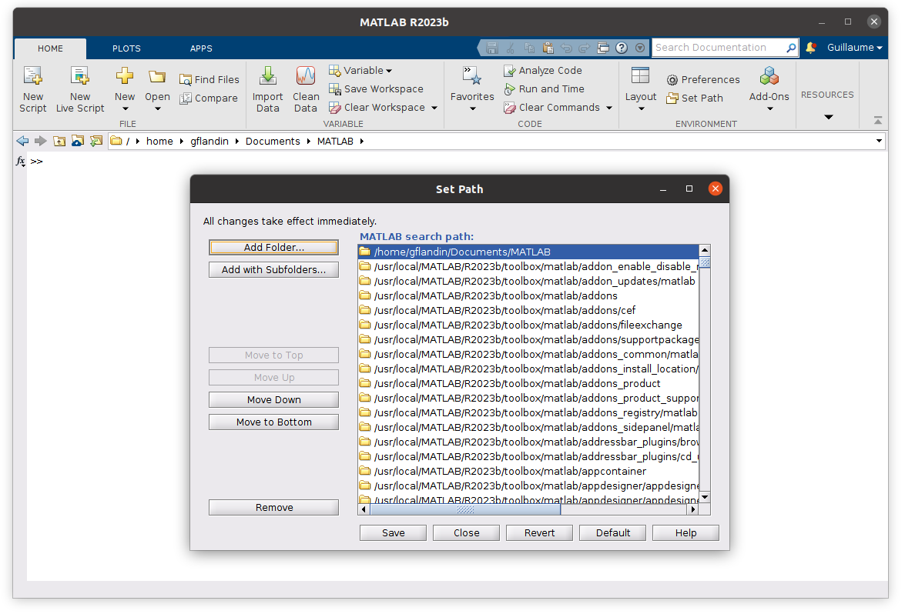

# SPM Installation with MATLAB

!!! info "Prerequisites"
    The SPM software is a collection of [MATLAB](https://www.mathworks.com/products/matlab.html) functions and thus requires the MATLAB (or GNU Octave) software to be installed on your computer in order to run. SPM requires only core MATLAB to run (no special toolboxes are required - unless stated otherwise).

    SPM is tested against MATLAB 2020a and newer but may work with earlier versions.

## Installation

=== "Windows"

    1. Download the spm ZIP file (not standalone) from the newest [GitHub release](https://github.com/spm/spm/releases/latest/).

    2. Unzip `spm_<version>.zip` in a folder of your choice, such as `C:\Users\login\Documents\MATLAB\spm`.

    3. Start MATLAB and add SPM to your path, either using:

        `Home` :material-arrow-right-bold: `Set Path` :material-arrow-right-bold: `Add Folder...`: select the directory containing your SPM installation then click on `Save` and `Close`.

        or type the following at the MATLAB prompt:

        ```matlab
        addpath('C:\Users\<login>\Documents\MATLAB\spm')
        savepath % if you want to save the current MATLAB path
        ```

=== "macOS"

    1. Download the spm ZIP file (not standalone) from the newest [GitHub release](https://github.com/spm/spm/releases/latest/) in your home directory.

    2. Uncompress the archive by typing the following in a terminal:
    
        ```bash
        cd /Users/<login>
        unzip spm_<version>.zip
        ```

    3. Start MATLAB and add SPM to your path, either using:

        `Home` :material-arrow-right-bold: `Set Path` :material-arrow-right-bold: `Add Folder...`: select the directory containing your SPM installation then click on `Save` and `Close`.

        or typing the following at the MATLAB prompt:

        ```matlab
        addpath /Users/<login>/spm
        savepath % if you want to save the current MATLAB path
        ```

    ??? info "MEX file validation issues"
        If you have **validation issues** with MEX files with one of these errors:

        ```
        "*.mexmaci64" cannot be opened because the developer cannot be verified.
        macOS cannot verify that this app is free from malware
        ```
        or:
        ```
        Code signature not valid for use in process using Library Validation: library load disallowed by system policy
        ```
        Open a Terminal, `cd` to the SPM directory and type:

        ```
        find . -name "*.mexmaci64" -exec xattr -d com.apple.quarantine {} \;
        ```

        If it doesn't work, please try this equivalent alternative, replacing `SPM_PATH` with the path of your SPM installation:

        ```
        sudo xattr -r -d com.apple.quarantine SPM_PATH
        sudo find SPM_PATH -name "*.mexmaci64" -exec spctl --add {} \;
        ```

=== "Linux"

    1. Download the spm ZIP file (not standalone) from the newest [GitHub release](https://github.com/spm/spm/releases/latest/) in your home directory.

    2. Uncompress the archive by typing the following in a terminal:

        ```bash
        cd /home/<login>
        unzip spm_<version>.zip
        ```

    3. Start MATLAB and add SPM to your path, either using:

        `Home` :material-arrow-right-bold: `Set Path` :material-arrow-right-bold: `Add Folder...`: select the directory containing your SPM installation then click on `Save` and `Close`.

        or typing the following at the MATLAB prompt:

        ```matlab
        addpath /home/<login>/spm
        savepath % if you want to save the current MATLAB path
        ```

    ??? failure "`Crash at startup`"

        The following concerns a situation where MATLAB generates a segmentation fault when opening the SPM interface with errors like:
        ```
        BadWindow (invalid Window parameter)
        serial 20133 error_code 3 request_code 20 minor_code 0
        Pango-CRITICAL **: pango_font_description_from_string: assertion 'str != NULL' failed
        GLib-CRITICAL **: g_once_init_leave: assertion 'result != 0' failed
        GLib-GObject-CRITICAL **: g_type_register_dynamic: assertion 'parent_type > 0' failed
        ```

        This is likely to be an issue with the display of the welcoming message in the Graphics window as a web document.

        One fix is to [comment one line in spm.m.](https://github.com/spm/spm12/blob/r7771/spm.m#L352). Another fix not requiring to modify the SPM source code is to [define an environment variable.](https://github.com/spm/spm12/blob/r7771/spm_browser.m#L54):
        ```
        setenv('SPM_HTML_BROWSER','0')
        ```

If you are using MATLAB without its desktop, you can open the Set Path dialog box by typing `pathtool` at the MATLAB prompt.

!!! danger
    If using the graphical interface, make sure to use the `Add Folder...` button and not `Add with Subfolders...`. SPM will automatically add the appropriate subfolders to the MATLAB path at runtime.



You can then launch SPM by typing `spm` at the MATLAB prompt.

## Update

If you have just downloaded the `spm_<version>.zip` archive, it already contains the latest set of updates. To update SPM when a new version is released:

1. Download the latest [`spm_<version>.zip`](https://github.com/spm/spm/releases/latest/).
2. Replace your current SPM installation with the newer version so that newer files overwrite existing files.

Alternatively, you can use the `spm_update.m` function:

```matlab
spm_update
```

If a new version is available, it can be applied to your local installation by typing:

```matlab
spm_update update
```
