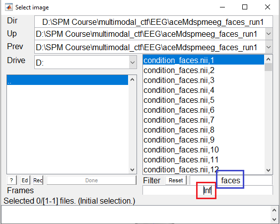
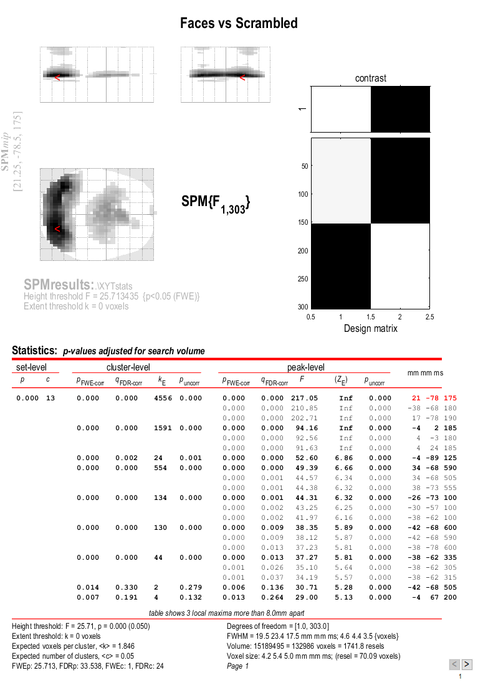
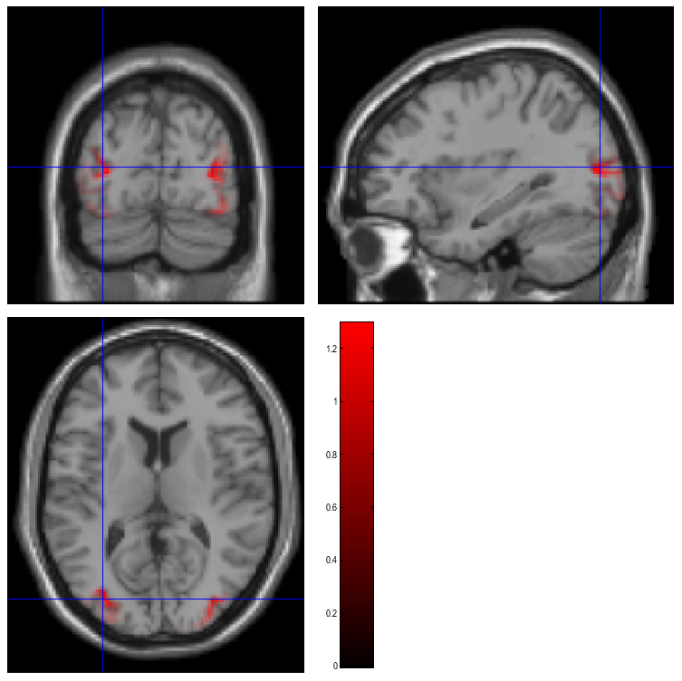

# Multimodal face-evoked responses <span id="Chap:data:multimodal" label="Chap:data:multimodal"></span>

## Overview

This dataset contains EEG, MEG, functional MRI and structural MRI data
on the same subject with the same paradigm, which allows a basic
comparison of faces versus scrambled faces.

The dataset can be downloaded from the [SPM website](https://www.fil.ion.ucl.ac.uk/spm/data/mmfaces/).
It can be used to demonstrate, for example, 3D source reconstruction of
various electrophysiological measures of face perception, such as the
"N170" evoked response (ERP) recorded with EEG, or the analogous "M170"
evoked field (ERF) recorded with MEG. These localisations are informed
by the anatomy of the brain (from the structural MRI) and possibly by
functional activation in the same paradigm (from the functional MRI).

The demonstration below involves localising the N170 using a distributed
source method (called an "imaging" solution in SPM). The data can also
be used to explore further effects, e.g. induced effects (Friston et al,
2006), effects at different latencies, or the effects of adding fMRI
constraints on the localisation.

The EEG data were acquired on a 128 channel ActiveTwo system; the MEG
data were acquired on a 275 channel CTF/VSM system; the sMRI data were
acquired using a phased-array headcoil on a Siemens Sonata 1.5T; the
fMRI data were acquired using a gradient-echo EPI sequence on the
Sonata. The dataset also includes data from a Polhemus digitizer, which
are used to coregister the EEG and the MEG data with the structural MRI.

Some related analyses of these data are reported in Henson et al (2005a,
2005b, 2007, 2009a, 2009b, in press), Kiebel and Friston (2004) and
Friston et al (2006). To proceed with the data analysis, first download
the data set from the SPM website[^1]. Most of the analysis below can be
implemented in MATLAB 7.1 (R14SP3) and above. However, recoding
condition labels using the GUI requires features of SPM8 only available
in MATLAB 7.4 (R2007a) and above.

## Paradigm and Data

The basic paradigm involves randomised presentation of at least 86 faces
and 86 scrambled faces
Figure 1, based on Phase 1 of a
previous study by Henson et al (2003). The scrambled faces were created
by 2D Fourier transformation, random phase permutation, inverse
transformation and outline-masking of each face. Thus faces and
scrambled faces are closely matched for low-level visual properties such
as spatial frequency content. Half the faces were famous, but this
factor is collapsed in the current analyses. Each face required a
four-way, left-right symmetry judgment (mean RTs over a second;
judgments roughly orthogonal to conditions; reasons for this task are
explained in Henson et al, 2003). The subject was instructed not to
blink while the fixation cross was present on the screen.


<figure markdown>
  { width="500" }
  <figcaption>One trial in the experiment. Trials involved either a
Face (F) or Scrambled face (S).</figcaption>
</figure>

### Structural MRI

The T1-weighted structural MRI of a young male was acquired on a 1.5T
Siemens Sonata via an MDEFT sequence with resolution
$1 \times 1 \times 1 mm^3$ voxels, using a whole-body coil for RF
transmission and an 8-element phased array head coil for signal
reception.

The images are in NIfTI format in the sMRI sub-directory, consisting of
two files:

        sMRI/sMRI.img
        sMRI/sMRI.hdr

The structural was manually positioned to roughly match Talairach space,
with the origin close to the Anterior Commissure. The approximate
position of 3 fiducials within this MRI space - the nasion, and the left
and right peri-aricular points - are stored in the file:

        sMRI/smri_fid.txt

These were identified manually (based on anatomy) and are used to define
the MRI space relative to the EEG and MEG spaces, which need to be
coregistered (see below). It doesn't matter that the positions are
approximate, because more precise coregistration is implemented via
digitised surfaces of the scalp ("head shape functions") that were
created using the Polhemus 3D digitizer.

### EEG data

The EEG data were acquired on a 128-channel ActiveTwo system, sampled at
2048 Hz, plus electrodes on left earlobe, right earlobe, and two bipolar
channels to measure HEOG and VEOG. The 128 scalp channels are named: 32
A (Back), 32 B (Right), 32 C (Front) and 32 D (Left). The data acquired
in two runs of the protocol are contained in two Biosemi raw data files:

        EEG/faces_run1.bdf
        EEG/faces_run2.bdf

The EEG directory also contains the following files:

        EEG/condition_labels.txt

This text file contains a list of condition labels in the same order as
the trials appear in the two files - "faces" for presentation of faces
and "scrambled" for presentation of scrambled faces. The EEG directory
also contains the following files:

        EEG/electrode_locations_and_headshape.sfp

This ASCII file contains electrode locations, fiducials and headshape
points measured with Polhemus digitizer.

The 3 fiducial markers were placed approximately on the nasion and
preauricular points and digitised by the Polhemus digitizer. Later, we
will coregister the fiducial points and the head shape to map the
electrode positions in the "Polhemus space" to the "MRI space". Also
included as reference are some SPM batch files and SPM scripts (though
these are recreated as part of the demo):

        EEG/batch_eeg_XYTstats.mat
        EEG/batch_eeg_artefact.mat
        EEG/eeg_preprocess.m
        EEG/faces_eeg_montage.m

### MEG data

The MEG data were acquired on a 275 channel CTF/VSM system, using
second-order axial gradiometers and synthetic third gradient for
denoising and sampled at 480 Hz. There are actually 274 MEG channels in
this dataset since the system it was recorded on had one faulty sensor.
Two runs (sessions) of the protocol have been saved in two CTF datasets
(each one is a directory with multiple files)

        MEG/SPM_CTF_MEG_example_faces1_3D.ds
        MEG/SPM_CTF_MEG_example_faces2_3D.ds

The MEG data also contains a `headshape.mat` file, containing the
headshape recorded during the MEG experiment with a Polhemus digitizer.

The locations of the 3 fiducials in the `headshape.mat` file are the
same as the positions of 3 "locator coils" the locations of which are
measured by the CTF machine, and used to define the coordinates (in "CTF
space") for the location of the 274 sensors.

Also included as reference are two SPM batch files and two trial
definition files (though these are recreated as part of the demo):

        MEG/batch_meg_preprocess.mat
        MEG/batch_meg_TFstats.mat
        MEG/trials_run1.mat
        MEG/trials_run2.mat

### fMRI data

The fMRI data were acquired using a gradient-echo EPI sequence on a 3T
Siemens TIM Trio, with 32, 3mm slices (skip 0.75mm) of $3\times 3 mm^2$
pixels, acquired in a sequential descending order with a TR of 2s. There
are 390 images in each of the two "Session" sub-directories (5 initial
dummy scans have been removed), each consisting of a NIfTI image and
header file:

        fMRI/Session1/fM*.{hdr,img}
        fMRI/Session2/fM*.{hdr,img}

Also provided are the onsets of faces and scrambled faces (in units of
scans) in the MATLAB file:

        fMRI/trials_ses1.mat
        fMRI/trials_ses2.mat

and two example SPM batch files (see fMRI
Section).


        fMRI/batch_fmri_preproc.mat
        fMRI/batch_fmri_stats.mat

## Getting Started

You need to start SPM and toggle `EEG` as the modality (bottom-right of
SPM main window), or start SPM with `spm eeg`. In order for this to
work you need to ensure that the main SPM directory is on your MATLAB
path.

## EEG analysis 

First change directory to the EEG subdirectory (either in MATLAB, or via
`Utils` :material-arrow-right-bold: `CD`.

### Convert

Select `Convert` :material-arrow-right-bold: `Convert` and select the
`faces_run1.bdf` file. At the prompt `Define settings?` select `just
read`. SPM will now read the original Biosemi format file and create an
SPM compatible data file, called `spmeeg_faces_run1.mat` and
`spmeeg_faces_run1.dat` in the current MATLAB directory. After the
conversion is complete the data file will be automatically opened in
SPM reviewing tool. By default you will see the `info` tab. At the top
of the window there is some basic information about the file. Below it
you will see several clickable tabs with additional information. The
`history` tab lists the processing steps that have been applied to the
file. At this stage there is only one such step - conversion. The
`channels` tab lists the channels in the file and their properties, the
`trial` tab lists the trials or in the case of a continuous file all the
triggers (events) that have been recorded. The `inv` tab is used for
reviewing the inverse solutions and is not relevant for the time being.
At the top of the window there is another set of tabs. If you click on the
`EEG` tab you will see the raw EEG traces. They all look unusually flat 
because the continuous data we have just converted contains very low 
frequencies and baseline shifts.
Therefore, if we try to view all the channels together, this can only be
done with very low gain. If you press the `intensity rescaling` button
(with arrows pointing up and down) several times you will start seeing
EEG activity in a few channels but the other channels will not be
visible as they will go out of range. You can also use the controls at
the bottom of the window to scroll through the recording. If you press
the icon to the right of the mini-topography icon, with the rightwards
pointing arrow, the display will move to the next trigger, shown as a
vertical line through the display. (New triggers/events can be added by
the rightmost icon). At the bottom of the display is a plot of the
global field power across the session, with the black line indicating
the current timewindow displayed (the width of this timewindow can be
controlled by the two leftmost top icons).

### Downsample

Here, we will downsample the data in time. This is useful when the data
were acquired like ours with a high sampling rate of 2048 Hz. This is an
unnecessarily high sampling rate for a simple evoked response analysis,
and we will now decrease the sampling rate to 200 Hz, thereby reducing
the file size by more than ten fold and greatly speeding up the
subsequent processing steps. Select `Preprocessing` :material-arrow-right-bold: `Downsample`.
In the batch window that will open, double click on `File name`
and select the `spmeeg_faces_run1.mat` file. Then double click on `New sampling
rate` and enter 200 for 200 Hz. The :material-play: button will change its colour to green. 
Press it. The progress bar will appear and the resulting data
will be saved to files `dspmeeg_faces_run1.mat` and
`dspmeeg_faces_run1.dat`. Note that this dataset and other intermediate
datasets created during preprocessing will not be automatically opened
in the reviewing tool, but you can always review them by selecting
`Display` :material-arrow-right-bold: `M/EEG`  and choosing the corresponding
`.mat` file.

### Montage

In this step, we will identify the VEOG and HEOG channels, remove
several channels that don't carry EEG data and are of no importance to
the following and convert the 128 EEG channels to "average reference" by
subtracting the mean of all the channels from each channel[^2]. We
generally recommend removal of data channels that are no longer needed
because this will reduce the total file size and conversion to average
reference is necessary for source modelling to work
correctly. To do so, we use the `Preprocessing` :material-arrow-right-bold: `Montage`
tool in SPM, which is a general approach for pre-multiplying the data
matrix (channels $\times$ time) by another matrix that linearly weights
all channel data. This provides a very general method for data
transformation in M/EEG analysis.

The appropriate montage-matrix can be specified in SPM by either using a
graphical interface in the `Convert` :material-arrow-right-bold: `Prepare`
tool, or by supplying the matrix saved in a file. We will
do the latter. The script to generate this file is
`faces_eeg_montage.m`. Running this script will produce a file named
`faces_eeg_montage.mat`. In our case, we would like to keep only
channels 1 to 128. To re-reference each of these to their average, the
script uses MATLAB "detrend" to remove the mean of each column (of an
identity matrix). In addition, there were four EOG channels (131, 132,
135, 136), where the HEOG is computed as the difference between channels
131 and 132, and the VEOG by the difference between channels 135 and
136.

You now call the montage function by choosing
`Preprocessing` :material-arrow-right-bold: `Montage`
and:

- Under `File name' select the M/EEG-file `dspm8_faces_run1.mat`.

- Make sure `Write` is selected for `Mode` and `Load montage from file` under `Montage specification`.

-  Double click on `Montage file name` and select the generated `faces_eeg_montage.mat` file.

- `Keep the other channels?` should be set at  `No`.

This will remove the uninteresting channels from the data. The progress
bar appears and SPM will generate two new files `Mdspmeeg_faces_run1.mat`
and `Mdspmeeg_faces_run1.dat`.

### Epoch

To epoch the data select `Preprocessing` :material-arrow-right-bold: `Epoch`.
Double click on `File name` and select the `Mdspmeeg_faces_run1.mat` file. 
For `How to define trials` select `Define trial`. And for `Time window` specify [-200 600]. 
Under `Trial`, click `New`. There is no information in the file at this stage to
distinguish between faces and scrambled faces. We will add this
information at a later stage. You can specify anything for `Condition label`, for
instance "stim".  `Event type` and `Event value` might mean
different things for different EEG and MEG systems. So you should be
familiar with your particular system to find the right trigger for
epoching. To explore a complete list of all events in the EEG file you can use
the `Convert` :material-arrow-right-bold: `Prepare` tool selecting
`Batch inputs` :material-arrow-right-bold: `Event list`.
In our case, it is not very difficult as all the events but one
appear only once in the recording, whereas the event with type "STATUS"
and value 1 appears 172 times which is exactly the number of times a
visual stimulus was presented. So in the batch window specify 'STATUS' for `Event type`
and '1' for `Event value`. Run the batch, The progress bar will appear and the epoched data
will be saved to files `eMdspmeeg_faces_run1.mat` and `eMdspmeeg_faces_run1.dat`. 
The epoching function also performs baseline
correction by default (with baseline -200 to 0ms). Therefore, in the
epoched data the large channel-specific baseline shifts are removed and
it is finally possible to see the EEG data clearly in the reviewing
tool.

### Reassignment of trial labels

Open the file `eMdspmeeg_faces_run1.mat` in the reviewing tool (under
`Display` :material-arrow-right-bold: `M\EEG` ). 
The first thing you will see is that in the history
tab there are now 4 processing steps. Now switch to the "trials" tab.
You will see a table with 172 rows - exactly the number of events we
selected before. In the first column the label "stim" appears in every
row. What we would like to do now is change this label to "faces" or
"scrambled" where appropriate. We should first open the file
`condition_labels.txt` (in the EEG directory) with any text editor, such
as MATLAB editor or Windows notepad. In this file there are exactly 172
rows with either "faces" or "scrambled" in each row.
Unfortunately, with the latest changes in Matlab table interface, using GUI
to update the labels is no longer possible and we'll have to use the following
code snipped to achieve the same effect:

```matlab
D = spm_eeg_load('eMdspmeeg_faces_run1.mat')
D = conditions(D, ':', importdata('condition_labels.txt'));
save(D)
```

`D` is an object, this is a special kind of data structure that makes it possible to keep
different kinds of related information (in our case all the properties
of our dataset) and define generic ways of manipulating these
properties. For instance we can use the command:

```
D = conditions(D, ':', importdata('condition_labels.txt'));
```

to update the trial labels using information imported from the
`condition_labels.txt`[^3]. Now, `conditions`' is a "method", a special function that knows where to
store the labels in the object. All the methods take the M/EEG object
(usually called `D` in SPM by convention) as the first argument. The
second argument is a list of indices of trials for which we want to
change the label. We specify ':'  which is interpreted as
"all". The third argument is the new labels which are imported from the
text file using a MATLAB built-in function. We then save the updated
dataset on disk using the `save` method. If you now write `D.conditions`
or `conditions(D)` (which are two equivalent ways of calling the
`conditions` method with just D as an argument), you should see a list
of 172 labels, either "faces" or "scrambled".

If you reopen the file now in the reviewing tool, the new labels should
now appear for all rows. 

### Using the history and object methods to preprocess the second file

At this stage we need to repeat the preprocessing steps for the second
file `faces_run2.bdf`. You can do it by going back to the "Convert"
section and repeating all the steps for this file, but there is a more
efficient way. If you have been following the instructions until now the
file `eMdspmeeg_faces_run1.mat` should be open in the reviewing tool. If
it is not the case, open it. Go to the "history" tab and press the "Save
as script" button. A dialog will appear asking for the name of the
MATLAB script to save. Let's call it `eeg_preprocess.m`. Then there will
be another dialogue suggesting to select the steps to save in the
script. Just press "OK" to save all the steps. Now open the script in
the MATLAB editor. You will now need to make some changes to make it
work for the second file. Here we suggest the simplest way to do it that
does not require familiarity with MATLAB programming. But if you are
more familiar with MATLAB you'll definitely be able to do a much better
job. First, replace all the occurrences of "run1" in the file with
"run2". You can use the "Find & Replace" functionality (Ctrl-F) to do
it. Secondly, add the lines we previously used to update the trial labels at the end of the file  (the two runs had identical trials). 

```matlab
D = conditions(D, ':', importdata('condition_labels.txt'));
save(D)
```

This is necessary because the steps done with custom code are not recorded in the file history.
Save the changes and run the script by pressing the "Run"
button or writing `eeg_preprocess` in the command line. SPM will now
automatically perform all the steps we have done before using the GUI.
This is a very easy way for you to start processing your data
automatically once you come up with the right sequence of steps for one
file. After the script finishes running there will be a new set of files
in the current directory including `eMdspmeeg_faces_run2.mat` and
`eMdspmeeg_faces_run2.dat`.  

### Merge

We will now merge the two epoched files we have generated until now and
continue working on the merged file. Select `Preprocessing` :material-arrow-right-bold: `Merge`. 
Under `File names` select both `eMdspmeeg_faces_run1.mat` and `eMdspmeeg_faces_run2.mat`. 
There are additional options in the `Merge` tool to recode the condition labels but you can leave
them at default meaning that the trial labels we have just specified will be copied as
they are to the merged file. A new dataset will be generated called
`ceMdspmeeg_faces_run1.{mat,dat}`.

### Prepare

In this section we will add the separately measured electrode locations
and headshape points to our merged dataset. In principle, this step is
not essential for further analysis because SPM automatically assigns
electrode locations for commonly used EEG caps and the Biosemi 128 cap
is one of these. Thus, default electrode locations are present in the
dataset already after conversion. But since these locations are based on
channel labels they may not be precise enough and in some cases may be
completely wrong because sometimes electrodes are not placed in the
correct locations for the corresponding channel labels. This can be
corrected by importing individually measured electrode locations. Select
`Convert` :material-arrow-right-bold: `Prepare` and then  `File` :material-arrow-right-bold: `Open`
and in the file selection window select `ceMdspmeeg_faces_run1.mat`. A menu will
appear at the top of SPM interactive window (bottom left window). Choose
`Sensors` :material-arrow-right-bold: `Load EEG sensors` :material-arrow-right-bold: `Convert locations file`. In
the file selection window choose the
`electrode_locations_and_headshape.sfp` file (in the original EEG
directory). Then from the "2D projection" submenu select "Project 3D
(EEG)". A 2D channel layout will appear in the Graphics window. Select
`2D Projection` :material-arrow-right-bold: `Apply` and `File` :material-arrow-right-bold: `Save`.
Note that the same functionality can also be accessed from the reviewing tool by
pressing the `Prepare SPM file` button.

### Artefact rejection

Here we will use SPM artefact detection functionality to exclude from
analysis trials contaminated with large artefacts. Select 
`Preprocessing` :material-arrow-right-bold: `Detect artefacts`. 
Click on `File name` and select the `ceMdspmeeg_faces_run1.mat`
file. Double click `How to look for artefacts` and a new branch will
appear. It is possible to define several sets of channels to scan and
several different methods for artefact detection. We will use simple
thresholding applied to all channels. Click on `Detection algorithm` and
select `Threshold channels` in the small window below. Double click on
`Threshold` and enter 200 (in this case $\mu V$). The batch is now fully
configured. Run it by pressing the green button at the top of the batch
window.

This will detect trials in which the signal recorded at any of the
channels exceeds 200 microvolts (relative to pre-stimulus baseline).
These trials will be marked as artefacts. Most of these artefacts occur
on the VEOG channel, and reflect blinks during the critical time window.
The procedure will also detect channels in which there is a large number
of artefacts (which may reflect problems specific to those electrodes,
allowing them to be removed from subsequent analyses).

In this case, the MATLAB window will show:

        There isn't a bad channel.
        39 rejected trials: 38   76   82   83   86   88   89   90   92   [...]

(leaving 305 valid trials). A new file will also be created,
`aceMdspm8_faces_run1.{mat,dat}`.

### Exploring the M/EEG object

We can now review the preprocessed dataset from the MATLAB command line
by typing:

        D = spm_eeg_load

and selecting the `aceMdspmeeg_faces_run1.mat` file. This will print out
some basic information about the M/EEG object `D` that has been loaded
into MATLAB workspace.

        SPM M/EEG data object
        Type: single
        Transform: time
        2 conditions
        130 channels
        161 samples/trial
        344 trials
        Sampling frequency: 200 Hz
        Loaded from file  ...\EEG\aceMdspmeeg_faces_run1.mat
        Use the syntax D(channels, samples, trials) to access the data.

Note that the data values themselves are memory-mapped from
`aceMdspmeeg_faces_run1.dat` and can be accessed by indexing the `D`
object (e.g, `D(1,2,3)` returns the field strength in the first sensor
at the second sample point during the third trial). You will see that
there are 344 trials (`D.ntrials`). Typing `D.conditions` will show the
list of condition labels consisting of 172 faces ("faces") and 172
scrambled faces ("scrambled"). `D.badtrials` will return a $1\times 39$
vector of indices of the rejected trials.
`D.condlist` will display a list of unique condition labels. The order
of this list is important because every time SPM needs to process the
conditions in some order, this will be the order. If you type
`D.chanlabels`, you will see the order and the names of the channels.
`D.chantype` will display the type for each channel (in this case either
"EEG" or "EOG"). `D.size` will show the size of the data matrix, \[130
161 344\] (for channels, samples and trials respectively). The size of
each dimension separately can be accessed by `D.nchannels`, `D.nsamples`
and `D.ntrials`. Note that although the syntax of these commands is
similar to those used for accessing the fields of a struct data type in
MATLAB, what's actually happening here is that these commands evoke
special functions called "methods" and these methods collect and return
the requested information from the internal data structure of the `D`
object. The internal structure is not accessible directly when working
with the object. This mechanism greatly enhances the robustness of SPM
code. For instance you don't need to check whether some field is present
in the internal structure. The methods will always do it automatically
or return some default result if the information is missing without
causing an error.

Type `methods(’meeg’)` for the full list of methods performing
operations with the object. Type `help meeg/method_name` to get help
about a method.

### Basic ERPs

Select `Average` :material-arrow-right-bold: `Average` and select the
`aceMdspmeeg_faces_run1.mat` file under `File name`. At this point you can perform either
ordinary averaging or "robust averaging" (Wager et al., 2005). Robust
averaging makes it possible to suppress artefacts automatically without
rejecting trials or channels completely, but just the contaminated
parts. Thus, in principle, we could do robust averaging without rejecting
trials with eye blinks and this is something you can do as an exercise
and see how much difference the artefact rejection makes with ordinary
averaging vs. robust averaging. For robust averaging select `Robust` under 
`Averaging type` [^4].

Finally,run the batch. A new dataset will be generated
`maceMdspmeeg_faces_run1.{mat,dat}` ("m" for "mean") and automatically
opened in the reviewing tool so that you can examine the ERP. 

Select `Average` :material-arrow-right-bold: `Contrast`. This
function creates linear contrasts of ERPs/ERFs. Select the
`maceMdspmeeg_faces_run1.mat` file, and create two new contrats, one with coefficients
 $[1\: -1]$ and label "Difference",and another with coefficients
$[1/2\: 1/2]$ and label "Mean". Set `Weight by replications` to `No` and run the batch. This
will create new file `wmaceMdspmeeg_faces_run1.{mat,dat}`, in which the
first trial-type is now the differential ERP between faces and scrambled
faces, and the second trial-type is the average ERP for faces and
scrambled faces.

To look at the differential ERP, again select  `Display` :material-arrow-right-bold: `M/EEG`, and
select the `wmaceMdspmeeg_faces_run1.mat` file. Switch to the `EEG` tab
and to `scalp` display by toggling a radio button at the top of the tab.
The Graphics window should then show the ERP for each channel (for Trial
1 the "Difference" condition). Hold SHIFT and select Trial 2 to see both
conditions superimposed. Then click on the zoom button and then on one
of the channels (e.g, "B9" on the bottom right of the display) to get a
new window with the data for that channel expanded, as in
Figure 2.

<figure markdown>
  { width="500" }
  <figcaption>Average (green) and differential (blue) ERPs for faces
and scrambled faces at channel B9 in
`wmaceMdspmeeg_faces_run1.mat`</figcaption>
</figure>

The green line shows the average ERP evoked by faces and scrambled faces
(at this occipitotemporal channel). A P1 and N1 are clearly seen. The
blue line shows the differential ERP between faces and scrambled faces.
The difference is small around the P1 latency, but large and negative
around the N1 latency. The latter likely corresponds to the "N170"
(Henson et al, 2003). We will try to localise the cortical sources of
the P1 and N170 in the section on 3D source reconstruction.

To see the topography of the differential ERP, click on Trial 1 again,
press the "topography" icon button at the top of the window and scroll
the latency from baseline to the end of the epoch. You should see a
maximal difference around 180ms as in
Figure 3 (possibly including a small
delay of about 8ms for the CRT display to scan to the centre of the
screen).

<figure markdown>
  { width="500" }
  <figcaption>2D topography for faces minus scrambled faces at 180ms.</figcaption>
</figure>

### 3D SPMs (Sensor Maps over Time) 
A feature of SPM is the ability to use Random Field Theory to correct
for multiple statistical comparisons across N-dimensional spaces. For
example, a 2D space representing the scalp data can be constructed by
flattening the sensor locations (using the 2D layout we created earlier)
and interpolating between them to create an image of $M\times M$ pixels
(when $M$ is user-specified, eg $M=32$). This would allow one to
identify locations where, for example, the ERP amplitude in two
conditions at a given timepoint differed reliably across subjects,
having corrected for the multiple t-tests performed across pixels. That
correction uses Random Field Theory, which takes into account the
spatial correlation across pixels (i.e, that the tests are not
independent). This kind of analysis is described earlier in the SPM
manual, where a 1st-level design is used to create the images for a
given weighting across timepoints of an ERP/ERF, and a 2nd-level design
can then be used to test these images across subjects.

Here, we will consider a 3D example, where the third dimension is time,
and test across trials within the single subject. We first create a 3D
image for each trial of the two types, with dimensions
$M\times M\times S$, where S=161 is the number of samples. We then take
these images into an unpaired t-test across trials (in a 2nd-level
model) to compare faces versus scrambled faces. We can then use
classical SPM to identify locations in space and time in which a
reliable difference occurs, correcting across the multiple comparisons
entailed. This would be appropriate if, for example, we had no a priori
knowledge where or when the difference between faces and scrambled faces
would emerge[^5].

Select `Images` :material-arrow-right-bold: `Convert to images`,
and select the `aceMdspmeeg_faces_run1.mat` file. Under `Mode` select
`scalp x time`. Under `Channel selection` choose `Select channels by type` :material-arrow-right-bold: `EEG`.
Then click again on `Channel selection` and scroll to the bottom of the menu below to 'Delete: All(1)' item
and click on it. This is the way in batch to remove the default option of using all the channels. Then you
can run the batch.

It will take some time as it writes out an image for each trial
(except rejected trials), in a new directory called
`aceMdspmeeg_faces_run1`, which will contain two files

```
condition_faces.nii
condition_scrambled.nii
```

one for each trialtype. These are 4D NIfTI files with the dimensions 
being X and Y on the scalp, time and trials. You can press `Display` :material-arrow-right-bold: `Image` 
to view one of these images. By default, only the first trial/frame is shown. You can change that by modifying
the value in the `Frames` box. If you set the value to `inf` as shown in Figure 3, all the frames will appear as a list that you can choose from. It might be helpful to combine this option with the use of the `Filter` box that allows to select frames from only one condition to be displayed by the use of regular expressions (e.g. `faces` to only see the frames for faces).

<figure markdown>
  { width="500" }
  <figcaption>Interface for selecting trials/frames from 4D NIfTI</figcaption>
</figure>


You can select any of the frames and examine it in the image viewer.
It will have dimensions $32\times 32\times 161$, with the
origin set at \[16 18.6 41\] (where 41 samples is 0ms), as in Figure 4

<figure markdown>
  { width="500" }
  <figcaption>3D image for a single trial of
`aceMdspm8_faces_run1.mat`. The bottom image is a 2D x-y
space interpolated from the flattened electrode locations (at one point
in time). The two top images are sections through x and y respectively,
now expressed over time (vertical (z) dimension).</figcaption>
</figure>

#### Smoothing 

Note that you can also smooth these images in 3D (i.e, in space and
time) by selecting `Images` :material-arrow-right-bold: `Smooth images`. When
you get the Batch Editor window, you can enter a smoothness of your
choice (eg \[9 9 20\], or 9mm by 9mm by 20ms). Note that you should also
change the default "Implicit masking" from "No" to "Yes"; this is to
ensure that the smoothing does not extend beyond the edges of the
topography.

As with fMRI, smoothing can improve statistics if the underlying signal
has a smoothness close to the smoothing kernel (and the noise does not;
the matched filter theorem). Smoothing may also be necessary if the
final estimated smoothness of the SPMs (below) is not at least three
times the voxel size; an assumption of Random Field Theory. In the
present case, the data are already smooth enough (as you can check
below), so we do not have to smooth further.

#### Stats 

To perform statistics on these images, first create a new directory, eg.
`mkdir XYTstats`.

Then press the "Specify 2nd level" button, to produce the batch editor
window again. Select the new `XYTstats` as the "Directory", and
"two-sample t-test" (unpaired t-test) as the "Design". Then select the
frames from "condition_faces.nii" for 'Group 1 scans'. To do that, you should make 
all the frames visible by entering `inf` in the `Frames` box and `faces` in the `Filter` box. It might be a 
good idea to first enter the filter string so that you can make sure that only the file you wanted to select is visible
and only then expand it to frame list.
Then right-click on the frames list and press `Select All` in the pop-up menu.
Follow similar steps to select all the frames from  "condition_scrambled.nii"  for `Group 2 scans`.
You might want to save this batch specification, but then press :material-play:[^6].

This will produce the design matrix for a two-sample t-test.

Then press `Estimate`, choose the "SPM.mat" from `XYTstats` file and
run the batch.  When it has finished, press "Results", select the same "SPM.mat"
and define a new F-contrast as \[1 -1\]. Keep the default contrast options,
but threshold at $p<.05$ FWE corrected for the whole search volume and
select "Scalp-Time" for the "Data Type". Then press "whole brain", and
the Graphics window should now look like that in Figure 5.

<figure markdown>
  { width="500" }
  <figcaption>3D sensor-time SPM F at p<.05 FWE corrected for the
amplitude difference between face and scrambled face trials. The x, y
coordinates refer to position in the 32x32 electrode plane (with units
of mm); the z coordinate refers to peristimulus time in ms (to the
nearest sampling of 5ms). </figcaption>
</figure>

This will reveal "regions" within the 2D sensor space and within the
-200ms to 600ms epoch in which faces and scrambled faces differ
reliably, having corrected for multiple F-tests across pixels and time.
There are a number of such regions, but the largest has maxima at \[-13
-78 180\] and \[21 -68 180\], corresponding to left and right posterior
sites at 180ms.

To relate these coordinates back to the original sensors, right-click in
some white space in the top half of the Graphics window, to get a menu
with various options. First select "goto global maxima". The red cursor
should move to coordinates \[21, -78, 175\].  Then right-click again to
get the same menu, but this time select "go to nearest suprathreshold
channel". You will be asked to select the original EEG/MEG file used to
create the SPM, which in this case is the `aceMdspmeeg_faces_run1.mat`
file. This should output in the Matlab window:

spm_mip_ui:	Jumped 4.25mm from [ 21, -78, 175],
			to nearest suprathreshold channel (A28) at [ 17, -78, 175]

In other words, it is EEG channel "A28" that shows the greatest
face/scrambled difference over the epoch (itself maximal at 175ms).

Note that you can also
overlap the sensor names on the MIP by selecting `display/hide
channels`. If the display gets too crowded you can zoom in.

Note that an F-test was used because the sign of the difference reflects
the polarity of the ERP difference, which is not of primary interest
(and depends on the choice of reference). Indeed, if you plot the
contrast of interest from the cluster maxima, you will see that the
difference is negative for the first posterior, cluster but positive for
the second, central cluster. This is consistent with the polarity of the
differences in Figure 3[^7].

If one had more constrained a priori knowledge about where and when the
N170 would appear, one could perform an SVC based on, for example, a box
around posterior channels and between 150 and 200ms poststimulus. See
[3D Sensor SPMs page](http://imaging.mrc-cbu.cam.ac.uk/meg/SensorSpm) for more details.

If you go to the global maximum, then press `overlays`, `sections` and
select the `mask.img` in the stats directory, you will get sections
through the space-time image. A right click will reveal the current
scalp location and time point. By moving the cursor around, you can see
that the N170/VPP effects start to be significant (after whole-image
correction) around 150ms (and may also notice a smaller but earlier
effect around 100ms).


### 3D "imaging" reconstruction 

Here we will demonstrate a distributed source reconstruction of the N170
differential evoked response between faces and scrambled faces, using a
grey-matter mesh extracted from the subject's MRI, and the Multiple
Sparse Priors (MSP) method in which multiple constraints on the solution
can be imposed (Friston et al, 2008, Henson et al, 2009a).

Press the `3D source reconstruction` button, and press the `load` button
at the top of the new window. Select the `wmaceMdspmeeg_faces_run1.mat`
file and type a label (eg \"N170 MSP\") for this analysis[^8].

Press the "MRI" button, select the `smri.img` file within the `sMRI`
sub-directory, and select `normal` for the cortical mesh.

The "imaging" option corresponds to a distributed source localisation,
where current sources are estimated at a large number of fixed points
(8196 for a "normal" mesh here) within a cortical mesh, rather than
approximated by a small number of equivalent dipoles (the ECD option).
The imaging approach is better suited for group analyses and (probably)
for later-occuring ERP components. The ECD approach may be better suited
for very early sensory components (when only small parts of the brain
are active), or for DCMs using a small number of regions (Kiebel et al,
2006).

The first time you use a particular structural image for 3D source
reconstruction, it will take some time while the MRI is segmented (and
normalisation parameters determined). This will create in the `sMRI`
directory the files `y_smri.nii` and `smri_seg8.mat` for normalisation
parameters and 4 GIfTI (`.gii`) files defining the cortical mesh, inner
skull, outer skull and scalp surface.

When meshing has finished, the cortex (blue), inner skull (red), outer
skull (orange) and scalp (pink) meshes will be shown in the Graphics
window with slices from the sMRI image, as shown in
Figure 6. This makes it possible to
visually verify that the meshes fit the original image well. The field
`D.inv{1}`.mesh field will be updated in MATLAB . Press `save` in top
right of window to update the corresponding `mat` file on disk.

<figure markdown>
  { width="500" }
  <figcaption>Cortex (blue), inner skull (red), outer skull (orange)
and scalp (pink) meshes with transverse slices of the subject’s MRI.</figcaption>
</figure>


Both the cortical mesh and the skull and scalp meshes are not created
directly from the segmented MRI, but rather are determined from template
meshes in MNI space via inverse spatial normalisation (Mattout et al,
2007).

Press the `Co-register` button. You will first be asked to select at
least 3 fiducials from a list of points in the EEG dataset (from
Polhemus file): by default, SPM has already highlighted what it thinks
are the fiducials, i.e, points labelled "nas" (nasion), "lpa" (left
preauricular) and "rpa" (right preauricular). So just press "ok".

You will then be asked for each of the 3 fiducial points to specify its
location on the MRI images. This can be done by selecting a
corresponding point from a hard-coded list ("select"). These points are
inverse transformed for each individual image using the same deformation
field that is used to create the meshes. The other two options are
typing the MNI coordinates for each point ("type") or clicking on the
corresponding point in the image ("click"). Here, we will type
coordinates based on where the experimenter defined the fiducials on the
`smri.img`. These coordinates can be found in the `smri_fid.txt` file
also provided. So press "type" and for "nas", enter \[0 91 -28\]; for
"lpa" press "type" and enter \[-72 4 -59\]; for "rpa" press "type" and
enter \[71 -6 -62\]. Finally, answer "no" to "Use headshape points?" (in
theory, these headshape points could offer better coregistration, but in
this dataset, the digitised headshape points do not match the warped
scalp surface very well, as noted below, so just the fiducials are used
here).

This stage coregisters the EEG sensor positions with the structural MRI
and cortical mesh, via an approximate matching of the fiducials in the
two spaces, followed by a more accurate surface-matching routine that
fits the head-shape function (measured by Polhemus) to the scalp that
was created in the previous meshing stage via segmentation of the MRI.
When coregistration has finished, a figure like that in
Figure 7 will appear in the top of the
Graphics window, which you can rotate with the mouse (using the Rotate3D
MATLAB Menu option) to check all sensors. Finally, press `save` in top
right of window to update the corresponding mat file on disk.

<figure markdown>
  { width="500" }
  <figcaption>Graphical output of Co-registration of EEG data, showing
(upper panel) cortex (blue), inner skull (red) and scalp (black) meshes,
electrode locations (green), MRI/Polhemus fiducials (cyan/magneta), and
headshape (red dots).</figcaption>
</figure>

Note that for these data, the coregistration is not optimal, with
several EEG electrodes appearing inside the scalp. This may be
inaccurate Polhemus recording of the headshape or inaccurate surface
matching for the scalp mesh, or "slippage" of headpoints across the top
of the scalp (which might be reduced in future by digitising features
like the nose and ears, and including them in the scalp mesh). This is
not actually a problem for the BEM calculated below, however, because
the electrodes are re-projected to the scalp surface (as a precaution).

Press `Forward Model`, and select `EEG BEM`. The first time you do this,
there will be a lengthy computation and a large file `smri_EEG_BEM.mat`
will be saved in the `sMRI` directory containing the parameters of the
boundary element model (BEM). In the Graphics window the BEM meshes will
be displayed with the EEG sensors marked with green asterisks as shown
(after rotating to a "Y-Z" view using MATLAB rotate tool) in
Figure 8. This display is the final
quality control before the model is used for lead field computation.

<figure markdown>
  { width="500" }
  <figcaption>BEM meshes with the EEG sensors marked as
asterisks.</figcaption>
</figure>

Press `Invert`, select `Imaging` (i.e, a distributed solution rather
than DCM; Kiebel et al (2006)), select `yes` to include all conditions
(i.e, both the differential and common effects of faces and scrambled
faces) and then `Standard` to use the default settings.

By default the MSP method will be used. MSP stands for "Multiple Sparse
Priors" (Friston et al. 2008a), and has been shown to be superior to
standard minimum norm (the alternative IID option) or a maximal
smoothness solution (like LORETA; the COH option) - see Henson et al
(2009a). Note that by default, MSP uses a "Greedy Search" (GS) (Friston
et al, 2008b), though the standard ReML (as used in Henson et al, 2007)
can also be selected via the batch tool (this uses Automatic Relevance
Determination - ARD).

The `Standard` option uses default values for the MSP approach (to
customise some of these parameters, press `Custom` instead).

At the first stage of the inversion lead fields will be computed for all
the mesh vertices and saved in the file
`SPMgainmatrix_wmaceMdspmeeg_faces_run1_1.mat`. Then the actual MSP
algorithm will run and the summary of the solution will be displayed in
the Graphics window.

Press `save` to save the results. You can now explore the results via
the 3D reconstruction window. If you type 180 into the box in the bottom
right (corresponding to the time in ms) and press `mip`, you should see
an output similar to Figure 9. This fit explains approx 96%
of the data.

<figure markdown>
  { width="500" }
  <figcaption>Graphical output of an MSP estimation of the differential ERP
  between faces and scrambled faces at 180ms</figcaption>
</figure>

!!! tip “”
    Including several conditions in an inversion forces the algorithm to fit them all with the same set of sources.
    This is critical in this example because the "Difference" condition is likely to be too weak and noisy by itself to be reconstructed well. Combining it with the "Mean" that is generated by the same set of sources helps obtain a stable solution.


Note the hot-spots in bilateral posterior occipitotemporal cortex,
bilateral mid-fusiform, and right lateral ventral temporal. The
timecourses come from the peak voxel. The red curve shows the condition
currently being shown (corresponding to the `Condition 1` toggle bar in
the reconstruction window); the grey line(s) will show all other
conditions. `Condition 1` is the differential evoked responses for faces
vs scrambled; if you press the `condition 1` toggle, it will change to
`Condition 2` (average evoked response for faces and scrambled faces),
type "100"ms for the P100, then press `mip` again and the display will
update (note the colours of the lines have now reversed from before,
with red now corresponding to average ERP).

If you toggle back to `Condition 1` and press `movie`, you will see
changes in the source strengths for the differential response over
peristimulus time (from the limits 0 to 300ms currently chosen by
default). If you press `render` you can get a very neat graphical
interface to explore the data (the buttons are fairly self-explanatory).

You can also explore other inversion options, such as COH and IID
(available for the "custom" inversion), which you will notice give more
superficial solutions (a known problem with standard minimum norm
approaches). To do this quickly (without repeating the MRI segmentation,
coregistration and forward modelling), press the `new` button in the
reconstruction window, which by default will copy these parts from the
previous reconstruction.

In this final section we will concentrate on how to prepare source data
for subsequent statistical analysis (eg with data from a group of
subjects).

Press the `Window` button in the reconstruction window, enter "150 200"
as the timewindow of interest and keep "0" as the frequency band of
interest (0 means all frequencies). The Graphics window will then show
the mean activity for this time/frequency contrast (top plot) and the
contrast itself (bottom plot; note additional use of a Hanning window).

Then press `Image`, select `image` as the output format and SPM will write 3D NIfTI images corresponding to
the above contrast for each condition:

```
        wmaceMdspmeeg_faces_run1_1_t150_200_f_1.nii
        wmaceMdspmeeg_faces_run1_1_t150_200_f_2.nii
```

The last number in the file name refers to the condition number; the
number following the dataset name refers to the reconstruction number
(i.e. the number in red in the reconstruction window, i.e, `D.val`, here
1). The reconstruction number will increase if you create a new
inversion by pressing `new`.

The smoothed results for Condition 1 (i.e, the differential evoked
response for faces vs scrambled faces) will also be displayed in the
Graphics window, see
Figure 10
(after moving the cursor to the right posterior hotspot), together with the normalised
structural. Note that the solution image is in MNI (normalised) space,
because the use of a canonical mesh provides us with a mapping between
the cortex mesh in native space and the corresponding MNI space.


<figure markdown>
  { width="500" }
  <figcaption>3D reconstruction saved as a smoothed NIfTI image of the
differential evoked response for faces vs scrambled faces around the
N170.</figcaption>
</figure>

You can also of course view the image with the normal SPM
`Display` :material-arrow-right-bold:`Image` option (just the functional image with no structural
will be shown), and locate the coordinates of the "hotspots" in MNI
space. Note that these images contain RMS (unsigned) source estimates
(see Henson et al, 2007). Given that one has data from multiple
subjects, one can create a NIFTI file for each. Group statistical
analysis can the be implemented with eg. second level t-tests as
described earlier in the chapter.

!!! danger ""
    Since the images generated by inverting the "Difference" condition are nonnegative, it would not
    be statistically valid to enter them into a one-sample T-test. To do a statistical test at the second level
    images should be generated separately for "faces" and "scrambled" i.e. the `maceMdspmeeg_faces_run1.mat` should
    be inverted and then the pairs of images should be entered into a paired T-test design.

## MEG analysis 

### Preprocessing the MEG data

First change directory to the MEG subdirectory (either in MATLAB, or via
`Utils` :material-arrow-right-bold:`CD`)

### Adjust trigger latency

For the EEG data, the faces were displayed directly via a CRT monitor.
For the MEG data on the other hand, the faces were displayed inside the
MSR via a projector. This projector produces a delay of 1.5 screen
refreshes, which at 60Hz, is 25ms. This means that the subject actually
saw the stimuli 25ms after the trigger was sent to the MEG acquisition
machine. We can correct for the visual delay when doing the trial definition[^9].
In the EEG case, we defined the trials at the epoching stage. Another way to
do it is to define trials before conversion and read just the necessary segments
from the data. This is especially useful when the epochs or interest comprise just a small
fraction of the recording (e.g. in sleep studies). 
There is a slight problem, however, in that trial definition requires information about trigger
timings from the dataset that has not been converted yet. To get around that, we will first convert
just the dataset header containing all the meta-data related to the recording and then convert the dataset itself.

Select `Convert` :material-arrow-right-bold:`Convert`, navigate into `SPM_CTF_MEG_example_faces1_3D.ds` folder and select the SPM_CTF_MEG_example_faces1_3D.meg4 file. Answer `yes` to 'define settings'. In the batch window that will open click on `Reading mode` and choose `Header only` from the menu. Run the batch. This will generate the file `spmeeg_SPM_CTF_MEG_example_faces1_3D.mat`.

Now select `Convert` :material-arrow-right-bold:`Prepare`. A menu will appear at the top of the interactive window (the small window at the bottom left). In that menu select `File` :material-arrow-right-bold:`Open` and choose the header file generated at the previous step. Then select `Batch inputs` :material-arrow-right-bold: `Trial definition`.


- Enter `-200 600` for `TIme window \[ms\]` 

- Enter 2 for `How many conditions?`.

  - Enter "`faces`" for `Label of condition 1`. A dialog with a list of
    events will come up and Select the event with type `UPPT001_up` and
    Value 1.

- For `Shift triggers (ms)` enter 25 to shift by 25 ms as discussed above.

  - Enter "`scrambled`" for `Label of condition 2`. Select the event with
    type `UPPT001_up` and Value 2.

- For `Shift triggers (ms)` enter 25 again.

- Answer `no` to the question about reviewing trials.

- Answer `yes` to the prompt to save the trial definition.

- Enter a filename like `trials_run1.mat` and save in the MEG directory.

Then type `load trials_run1.mat` in MATLAB, to see the contents of the
file you just saved. It a few variables, including `trl` and
`conditionlabels`. The `trl` variable contains as many rows as triggers
were found (across all conditions) and three columns: the initial sample
of the epoch, the final sample of the epoch and the offset in samples
corresponding to a peristimulus time of 0. The sampling rate for the MEG
data was 480Hz. Thus the figure of -96 samples in the third column corresponds to the 200ms
baseline period that you specified. 

### Convert

Select `Convert` :material-arrow-right-bold:`Convert, and in the file
selection window again select the `SPM_CTF_MEG_example_faces1_3D.ds`
subdirectory and the `SPM_CTF_MEG_example_faces1_3D.meg4` file. At the
prompt `Define settings?` select `yes`. Here we will use the option to
define more precisely the part of data that should be read during
conversion. For `Reading mode`, switch to `Epoched`. Click on `Epoched`
and choose `Trial file` in the menu. Then double click on `Trial file` and
in the file selector window, select the new
`trials_run1.mat` file. Run the batch. After the conversion is
complete. You can open the dataset `spmeeg_SPM_CTF_MEG_example_faces1_3D.mat` in the reviewing tool.
If you click on the `MEG` tab you will see the MEG data
which is already epoched. By pressing the `intensity rescaling` button
(with arrows pointing up and down) several times you will start seeing
MEG activity.

### Baseline correction

We need to perform baseline correction as it is not done automatically
during conversion. This will prevent excessive edge artefacts from
appearing after subsequent filtering and downsampling. Select
`Preprocessing` :material-arrow-right-bold: `Baseline-correct`
select the `spmeeg_SPM_CTF_MEG_example_faces1_3D.mat`
file. Enter $[-200\: 0]$ for `Baseline`. The
progress bar will appear and the resulting data will be saved to dataset
`bspmeeg_SPM_CTF_MEG_example_faces1_3D.{mat,dat}`.

### Downsample

Select `Preprocessing` :material-arrow-right-bold: `Downsample`.
In the batch window that will open, double click on `File name`
and select the `spmeeg_SPM_CTF_MEG_example_faces1_3D.mat` file. Then double click on `New sampling
rate` and enter 200 for 200 Hz. Run the batch. The progress bar will appear and the resulting data
will be saved to files `dbspmeeg_SPM_CTF_MEG_example_faces1_3D.{mat,dat}`.


### Batch preprocessing

Here we will preprocess the second half of the MEG data using using the
SPM batch facility. But first you should repeat the steps describe above to generate trial definition
for the second recording block. You can save it in `trials_run2.mat` 

Press the `Batch` button (lower right
corner of the SPM menu window). The batch tool window will appear. We
will define exactly the same settings as we have just done using the
interactive GUI. From the "SPM" menu, "M/EEG" submenu select "M/EEG
Conversion". Click on `File name` and select the
`SPM_CTF_MEG_example_faces2_3D.meg4` file from
`SPM_CTF_MEG_example_faces2_3D.ds` subdirectory. Click on `Reading mode`
and switch to `Epoched`. Click on `Epoched` and choose `Trial file`,
double-click on the new `Trial file` branch and then select the
`trials_run2.mat` file. 
Then click on `Channel selection` and select `MEG` as done previously. 
Do not forget to delete the `All` setting. 

Now select 'Baseline correction' from 
`SPM` :material-arrow-right-bold: `M/EEG` :material-arrow-right-bold: `Preprocessing`
submenu. Another line will appear in the Module list on the left. Click
on it. The baseline correction configuration branch will appear. Select
`File name` with a single click. The file that we need to downsample has
not been generated yet but we can use the `Dependency` button. A dialog
will appear with a list of previous steps (in this case just the
conversion) and we can set the output of one of these steps as the input
to the present step. Now just enter enter $-200\: 0$ for `Baseline`.
Similarly we can now add `Downsampling` to the module list, define
the output of baseline correction step for `File name` and 200 for the
`New sampling rate`. This completes our batch. We can now save it for
future use (e.g, as `batch_meg_preprocess` and run it by pressing the
green :material-play: button. This will generate all the intermediate datasets and
finally `dbspmeeg_SPM_CTF_MEG_example_faces2_3D.{mat,dat}`.

### Merge

We will now merge the two epoched files we have generated until now and
continue working on the merged file. Select 
`Preprocessing` :material-arrow-right-bold: `Merge`.
The merging is done similarly to what is described above for EEG. A new dataset will
be generated called `cdbspmeeg_SPM_CTF_MEG_example_faces1_3D.{mat,dat}`.

### Reading and preprocessing data using Fieldtrip

Yet another even more flexible way to pre-process data in SPM is to use
the [Fieldtrip toolbox](https://www.fieldtriptoolbox.org/) that
is distributed with SPM. All the pre-processing steps we have done until
now can also be done in Fieldtrip and the result can then be converted
to SPM dataset. An example script for doing so can be found in the
`man`$\backslash$`example_scripts`$\backslash$`spm_ft_multimodal_preprocessing.m`.
The script will generate a merged dataset and save it under the name
`ft_SPM_CTF_MEG_example_faces1_3D.{mat,dat}`. The rest of the analysis
can then be done as below. This option is more suitable for expert users
well familiar with Matlab. 

### Prepare

In this section we will add the separately measured headshape points to
our merged dataset. This is useful when one wants to improve the
coregistration using head shape measured outside the MEG. Also in some
cases the anatomical landmarks detectable on the MRI scan and actual
locations of MEG locator coils do not coincide and need to be measured
in one common coordinate system by an external digitizer (though this is
not the case here). First let's examine the contents of the headshape
file. If you load it into MATLAB workspace (type `load headshape.mat`),
you will see that it contains one MATLAB structure called `shape` with
the following fields:

- `.unit` - units of the measurement (optional)

- `.pnt` - Nx3 matrix of headshape points

- `.fid` - substruct with the fields .pnt - Kx3 matrix of points and
  .label -Kx1 cell array of point labels.

The difference between `shape.pnt` and `shape.fid.pnt` is that the
former contains unnamed points (such as continuous headshape
measurement) whereas the latter contains labeled points (such as
fiducials). Note that this Polhemus space (which will define the "head
space") has the X and Y axes switched relative to MNI space.

Now select `Convert` :material-arrow-right-bold: `Prepare`. 
A menu will appear at the top of SPM interactive window (bottom left window). 
Select `File` :material-arrow-right-bold: `Open` and select the merged MEG dataset.
In the `Sensors` submenu choose `Load MEG Fiducials/Headshape`. In the file selection
window choose the `headshape.mat` file and save the dataset with
`File` :material-arrow-right-bold: `Save`.

If you do not have a separately measured headshape and are planning to
use the original MEG fiducials for coregistration, this step is not
necessary. As an exercise, you can skip it for the tutorial dataset and
later do the coregistration without the headshape and see if it affects
the results.

### Basic ERFs

Select `Average` :material-arrow-right-bold: `Average` and select the
`cdbspmeeg_SPM_CTF_MEG_example_faces1_3D.mat` file. Set `Averaging type`
to `Robust`. Run the batch. A new dataset will be created in the MEG directory called
`mcdbspmeeg_SPM_CTF_MEG_example_faces1_3D.{mat,dat}` ("m" for "mean").

As before, you can display these data by `Display` :material-arrow-right-bold: `M/EEG` and selecting
the `mcdbspmeeg_SPM_CTF_MEG_example_faces1_3D.mat`. In the MEG tab with
the scalp radio button selected, hold the Shift key and select
trial-type 2 with the mouse in the bottom right of the window to see
both conditions superimposed (as Figure 11).

<figure markdown>
  { width="500" }
  <figcaption>SPM Display window for mean, smoothed ERF
'mcdbspmeeg_SPM_CTF_MEG_example_faces1_3D.mat; for all 275
MEG channels. </figcaption>
</figure>

Select `Average` :material-arrow-right-bold:`Contrast`. This
function creates linear contrasts of ERPs/ERFs. Select the
`mcdbspmeeg_SPM_CTF_MEG_example_faces1_3D.mat` file, enter $[1\: -1]$ as
the first contrast and label it `Difference`, enter $[1/2\: 1/2]$ as the second contrast and label it
`Mean`. Set `Weight by replications` to `No`. This will create new file
`wmcdbspmeeg_SPM_CTF_MEG_example_faces1_3D.mat`, in which the first
trial-type is now the differential ERF between faces and scrambled
faces, and the second trial-type is the average ERF for faces and
scambled faces.

To see the topography of the differential ERF, select `Display` :material-arrow-right-bold: `M/EEG`,
MEG tab and click on Trial 1, press the "topography" button at the top
of the window and scroll to 180ms for the latency to produce
Figure 12.

You can move the slider left and right to see the development of the
M170 over time.

<figure markdown>
  { width="500" }
  <figcaption>2D topography of the ERF of faces minus scrambled faces
at 180ms </figcaption>
</figure>


### Time-Frequency Analysis

SPM can use several methods for time-frequency decomposition. We will
use Morlet wavelets for our analyses.

Select `Time-freqiency` :material-arrow-right-bold: `Time-frequency`.
SPM batch tool with time-frequency
configuration options will appear. Double-click on `File name` and
select the `cdbspmeeg_SPM_CTF_MEG_example_faces1_3D.mat` file. Then click
on `Channel selection` and in the box below click on `Delete: All(1)`
and then on `New: Custom channel`. Double-click on `Custom channel` and
enter "MLT34".[^10] Double-click on `Frequencies of interest` and type
\[5:40\] (Hz). Click on `Spectral estimation` and select `Morlet wavelet
transform`. Change the number of wavelet cycles from 7 to 5. This factor
effectively trades off frequency vs time resolution, with a lower order
giving higher temporal resolution. Select `yes` for `Save phase?`.

This will produce two new datasets,
`tf_cdbspmeeg_SPM_CTF_MEG_example_faces1_3D.{mat,dat}` and
`tph_cdbspmeeg_SPM_CTF_MEG_example_faces1_3D.{mat,dat}`. The former
contains the power at each frequency, time and channel; the latter
contains the corresponding phase angles.

Here we will not baseline correct the time-frequency data because for
frequencies as low as 5Hz, one would need a longer pre-stimulus
baseline, to avoid edge-effects[^11]. Later, we will compare two
trial-types directly, and hence any pre-stimulus differences will become
apparent.

Select `Average` :material-arrow-right-bold: `Average` and select the
`tf_cdbspmeeg_SPM_CTF_MEG_example_faces1_3D.mat` file. You can use
straight (or robust if you prefer) averaging to compute the average
time-frequency representation. A new file will be created in the MEG
directory called `mtf_cdbspmeeg_SPM_CTF_MEG_example_faces1_3D.{mat,dat}`.
Note that you can use the reviewing tool to review the time-frequency
datasets.

This contains the power spectrum averaged over all trials, and will
include both "evoked" and "induced" power. Induced power is
(high-frequency) power that is not phase-locked to the stimulus onset,
which is therefore removed when averaging the amplitude of responses
across trials (i.e, would be absent from a time-frequency analysis of
the `mcdbspmeeg_SPM_CTF_MEG_example_faces1_3D.mat` file).

The power spectra for each trial-type can be displayed using the usual
Display button and selecting the
`mtf_cdbspmeeg_SPM_CTF_MEG_example_faces1_3D.mat` file. This will produce
a plot of power as a function of frequency (y-axis) and time (x-axis)
for Channel MLT34. If you use the `trial` slider to switch between
trial(types) 1 and 2, you will see the greater power around 150ms and
10Hz for faces than scrambled faces (click on the magnifying glass icon
and on the single channel to get scales for the axes, as in
Figure 13. This corresponds to the M170 again.

<figure markdown>
  { width="500" }
  <figcaption>Total power spectra for faces (left) and scrambled faces
(right) for channel MLT34</figcaption>
</figure>

We can also look at evidence of phase-locking of ongoing oscillatory
activity by averaging the phase angle information. We compute the vector
mean (by converting the angles to vectors in the complex plane), which yields
complex numbers. We can generate two kinds of images from these numbers.
The first is an image of the angles, which shows the mean phase of the
oscillation (relative to the trial onset) at each time point. The second
is an image of the absolute values (also called "Phase-Locking Value",
PLV) which lie between 0 for no phase-locking across trials and 1 for
perfect phase-locking.

Select `Average` :material-arrow-right-bold: `Average` and select the
`tph_cdbspmeeg_SPM_CTF_MEG_example_faces1_3D.mat` file. Set `Compute phase locling value` to `yes`. 

Run the batch. The MATLAB window will echo:

      mtph_cdbspmeeg_SPM_CTF_MEG_example_faces1_3D.mat: Number of replications per contrast:
      average faces: 168 trials, average scrambled: 168 trials

and a new file will be created in the MEG directory called
`mtph_cdbspmeeg_SPM_CTF_MEG_example_faces1_3D.mat`.

If you now display the file
`mtph_cdbspmeeg_SPM_CTF_MEG_example_faces1_3D.mat` file, you will see PLV
as a function of frequency (y-axis) and time (x-axis) for Channel MLT34.
Again, if you use the "trial" slider to switch between trial(types) 1
and 2, you will see greater phase-locking around for faces than
scrambled faces at lower frequencies, as in
Figure 14. Together with the above
power analysis, these data suggest that the M170 includes an increase
both in power and in phase-locking of ongoing oscillatory activity in
the alpha range (Henson et al, 2005b).

<figure markdown>
  { width="500" }
  <figcaption>Phase-Locking Values for faces (left) and scrambled
faces (right) for channel MLT34</figcaption>
</figure>


### 2D Time-Frequency SPMs

Analogous to the 3D case, we can also use Random Field Theory to correct for multiple statistical
comparisons across the 2-dimensional time-frequency space.

Select `Images` :material-arrow-right-bold: `Convert to images`, and select the
`tf_cdbspmeeg_SPM_CTF_MEG_example_faces1_3D.mat` file. Set `Mode` to
`time x frequency`. Run the batch.

This will create 2 NIfTI files with 2D time-frequency images in each frame
with dimensions $36\times 161\times 1$, as for the example shown
in Figure 15. These file can be be found
in the  `tf_cdbspmeeg_SPM_CTF_MEG_example_faces1_3D` subfolder.
and examined by pressing `Display` :material-arrow-right-bold: `Image` 
in the main SPM window.

!!! tip ""
    If you want to repeat this analysis for other channels the folder with images is in danger of being overwritten every time you
    do it. To avoid that change the `Directory prefix` field. You could use a meaningful label like "Left_temporal_".

<figure markdown>
  { width="500" }
  <figcaption>3D image for trial 1 within
`condition_faces.nii` file. The bottom left
section is through frequency (x) and time (y) (the other images are
strips because there is only one value in the z dimension, i.e, this is
really a 2D image).</figcaption>
</figure>

As in the 3D case, these images can be further smoothed in time and frequency if desired.

Then as in section on time-domain statistics , we
then take these images into an unpaired t-test across trials to compare
faces versus scrambled faces. We can then use classical SPM to identify
times and frequencies in which a reliable difference occurs, correcting
across the multiple comparisons entailed (Kilner et al, 2005).

First create a new directory, eg. `mkdir TFstatsPow`.

Then press the `specify 2nd level` button,
select `two-sample t-test` (unpaired t-test), and define the images for
`group 1` as all the frames in `condition_faces.nii` (see the previous 
discussion of statistical analysis for tips on how to select the right frames)
and the frames from `group 2` as all those
in the `condition_scrambled.nii` file. Finally, specify the new
`TFstatsPow` directory as the output directory.

!!! tip ""
    This would be faster if you saved and could load an SPM job file from
     the Section on 3D SPMs. In
    order to just change the input files and output directory.
    
Then add an `Estimate` module from the `SPM` :material-arrow-right-bold: `Stats` menu,
and select the output from the
previous factorial design specification stage as the dependency input.
Run the batch.

Press `Results` and define a new T-contrast
as $[1\: -1]$. Keep the default contrast options, but threshold at
$p<.05$ FWE corrected for the whole search volume, and then select
`Time-Frequency` for the `Data Type`. Then press `whole brain`, and the
Graphics window should now look like that in
Figure 16.

<figure markdown>
  { width="500" }
  <figcaption>2D time-frequency SPM T at p<.05. FWE-corrected for the
power difference between face and scrambled faces at Channel MLT34.</figcaption>
</figure>


This will list two "regions" within the 2D time-frequency space in which
faces produce greater power than scrambled faces, having corrected for
multiple T-tests across pixels. The larger one has a maximum at 5 Hz and
185 ms post-stimulus, corresponding to the M170 seen earlier in the
averaged files (but now with a statistical test of its significance, in
terms of evoked and induced power). The second, smaller region has a
maximum at 12 Hz and 100 ms, possibly corresponding to a smaller but
earlier effect on the M100 (also sometimes reported, depending on what
faces are contrasted with).

### "Imaging" reconstruction of total power for each condition 

Previously, we localised the differential evoked potential difference in EEG data corresponding
to the N170. Here we will localise the total power of faces, and of
scrambled faces, ie including potential induced components (see Friston
et al, 2006).

Press the `3D source reconstruction` button, and press the `load` button
at the top of the new window. Select the
`cdbspmeeg_SPM_CTF_MEG_example_faces1_3D.mat` file and type a label (eg
`M170`) for this analysis.

Press the `MRI` button, select the `smri.img` file within the `sMRI`
sub-directory and select the `normal` mesh.

If you have not used this MRI image for source reconstruction before,
this step will take some time while the MRI is segmented and the
deformation parameters computed (see
above for more details on these files). When meshing has finished, the cortex (blue),
inner skull (red) and scalp (orange) meshes will also be shown in the
Graphics window with slices from the sMRI image. This makes it possible
to verify that the meshes indeed fit the original image well. The field
`D.inv{1}.mesh` will be updated. Press `save` in top right of window to
update the corresponding mat file on disk.

Both the cortical mesh and the skull and scalp meshes are not created
directly from the segmented MRI, but rather are determined from template
meshes in MNI space via inverse spatial normalisation (Mattout et al,
2007; Henson et al, 2009a).

Press the `Co-register` button. You will be asked for each of the 3
fiducial points to specify its location on the MRI images. This can be
done by selecting a corresponding point from a hard-coded list
(`select`). These points are inverse transformed for each individual
image using the same deformation field that is used to create the
meshes. The other two options are typing the MNI coordinates for each
point (`type`) or clicking on the corresponding point in the image
(`click`). Here, we will type coordinates based on where the
experimenter defined the fiducials on the `smri.img`. These coordinates
can be found in the `smri_fid.txt` file also provided. So press `type`
and for `nas`, enter \[0 91 -28\]; for `lpa` press `type` and enter
\[-72 4 -59\]; for `rpa` press `type` and enter \[71 -6 -62\]. Finally,
answer `no` to `Use headshape points?` (see EEG Section).

!!! tip ""
    To determine the coordinates of MRI fiducials in your subjects' scans
    you can open the images using `Display` :material-arrow-right-bold: `Image`,
    identify the anatomical landmarks, locate them with the cursor and copy the
    coordinates from the `coordinates mm` box. These can then be saved for future use
    via the type option.


This stage coregisters the MEG sensor positions with the structural MRI
and cortical mesh, via an approximate matching of the fiducials in the
two spaces, followed by a more accurate surface-matching routine that
fits the head-shape function (measured by Polhemus) to the scalp that
was created in the previous meshing stage via segmentation of the MRI.
When coregistration has finished, the field `D.inv{1}.datareg` will be
updated. Press `save` in top right of window to update the corresponding
mat file on disk. With the MATLAB Rotation tool on (from the `Tools` tab
in the SPM Graphics window, if not already on), right click near the top
image and select `Go to X-Z` view. This should produce a figure like
that in Figure 17, which you can rotate with
the mouse to check all sensors. Note that the data are in head space
(not MNI space), in this case corresponding to the Polhemus space in
which the X and Y dimensions are swapped relative to MNI space.

<figure markdown>
  { width="500" }
  <figcaption>Graphical output of registration of MEG and sMRI data,
showing (upper panel) cortex (blue) and scalp (black) meshes, sensor
locations (green), MRI and Polhemus fiducials (cyan/magneta), and
headshape (red dots).</figcaption>
</figure>

Press the `Forward Model` button. Choose `Single Shell` (you may
also try the other options; see Henson et al, 2009a). A figure will be
displaying showing the inner skull surface on which the single shell model
is based with the sensors. 

Press `Invert`, select `Imaging`, select `yes` to `All conditions or
trials?`, and `Standard` for the model (i.e, to use defaults; you can
customise a number of options if you press `Custom` instead) (see Friston
et al, 2008, for more details about these parameters). There will be
lead field computation followed by the actual inversion. A summary plot
of the results will be displayed at the end.

You can now explore the results via the 3D reconstruction window. If you
type 180 into the box in the bottom right (corresponding to the time in
ms) and press `mip`, you should see several ventral temporal hotspots,
as in Figure 18. Note that this localisation
is different from the previous EEG localisation because 1) condition 1
now refers to faces, not the difference between faces and scrambled
faces, and 2) the results reflect total power (across trials), induced
and evoked, rather than purely evoked[^12]. The timecourses come from
the peak voxel (with little evidence of a face/scrambled difference for
this particular maximum). The red curve shows the condition currently
being shown (corresponding to the `Condition 1` toggle bar in the
reconstruction window); the grey curve(s) will show all other
conditions. If you press the `condition 1` toggle, it will change to
Condition 2, which is the total power for scrambled faces, then press
`mip` again and the display will update (note the colours of the lines
have now reversed from before, with red now corresponding to scrambled
faces).

<figure markdown>
  { width="500" }
  <figcaption>Graphic output for MSP-estimated activity at 159ms for
faces</figcaption>
</figure>

If you press `movie`, you will see the changes in the source strengths over
peristimulus time (from the limits 0 to 300ms currently chosen by
default).

If you press `render` it will open a graphical interface that is very
useful to explore the data (the buttons are fairly self-explanatory).

You can also explore the other inversion options, like COH and IID,
which you will note give more superficial solutions (a known problem
with standard minimum norm; see also Friston et al, 2008; Henson et al,
2009a). To do this quickly (without repeating the MRI segmentation,
coregistration and forward modelling), press the `new` button in the
reconstruction window, which by default will copy these parts from the
previous reconstruction.

In the following we will concentrate on how one prepares this single
subject data for subsequent entry into a group analysis.

Press the `Window` button in the reconstruction window, enter "150 200"
as the timewindow of interest and "5 15" as the frequency band of
interest (from the SPM time-frequency analysis, at least from one
channel). Then choose the `induced` option. After a delay (as SPM
calculates the power across all trials) the Graphics window will show
the mean activity for this time/frequency contrast (for faces alone,
assuming the condition toggle is showing `condition 1`).

If you then press `Image` and  select `image` as the output format,
SPM will write 3D NIfTI images corresponding
to the above contrast for each condition:

        cdbspmeeg_SPM_CTF_MEG_example_faces1_3D_1_t150_200_f5_15_1.nii
        cdbspmeeg_SPM_CTF_MEG_example_faces1_3D_1_t150_200_f5_15_2.nii

The last number in the file name refers to the condition number; the
number following the dataset name refers to the reconstruction number
(i.e. the number in red in the reconstruction window, i.e, `D.val`, here
1).

The smoothed results for Condition 1 will also be displayed in the
Graphics window, together with the normalised structural. Note that the
solution image is in MNI (normalised) space, because the use of a
canonical mesh provides us with a mapping between the cortex mesh in
native space and the corresponding MNI space.

You can also of course view the image with the normal SPM
"Display:image" option, and locate the coordinates of the "hotspots" in
MNI space. Note that these images contain RMS (unsigned) source
estimates (see Henson et al, 2007).

If you want to see where activity (in this time/freq contrast) is
greater for faces and scrambled faces, you can use SPM `ImCalc` facility
to create a difference image of
`cdbspmeeg_SPM_CTF_MEG_example_faces1_3D__t150__f5__1.nii` -
`cdbspmeeg_SPM_CTF_MEG_example_faces1_3D__t150__f5__2.nii`: you should

see bilateral fusiform. For further discussion of localising a
differential effect vs. taking the difference of two localisations, as here, see Henson et al
(2007). The above images can then be used at the second level (assuming
one also has data from other subjects) to look for effects that are
consistent over a group of subjects.

!!! tip ""
    All the steps of 3D source reconstruction can also be carried out via batch
    by chaining the `Head model specification`, `Source inversion` and `Inversion results`
    from `SPM` :material-arrow-right-bold: `M/EEG` :material-arrow-right-bold: `Source reconstruction` batch menu.


## fMRI analysis 

Only the main characteristics of the fMRI analysis are described below;
for a more detailed demonstration of fMRI analysis, read previous
tutorial chapters describing fMRI analyses.

Toggle the modality from EEG to fMRI, and change directory to the fMRI
subdirectory (either in MATLAB, or via the "CD" option in the SPM
"Utils" menu)

### Preprocessing the fMRI data

Press the `Batch` button and then:

- Select `Spatial` :material-arrow-right-bold: `Realign' :material-arrow-right-bold: `Estimate & Reslice` 
  from the SPM menu, create two sessions, and select the
  390 `fM*.img` EPI images within the corresponding Session1 / Session 2
  subdirectories (you can use the filter `^fM.*` where `^` indicates that the file name
  must start with 'fM' rather than contain it anywhere). In the `Resliced
  images` option, choose `Mean Image Only`.

- Add `Spatial` :material-arrow-right-bold: `Coregister` : `Estimate` module,
  and select the `smri.img` image in the `sMRI` directory for the
  `Fixed Image` and select a `Dependency` for the `Moved Image`,
  which is the Mean image produced by the previous Realign module. For
  the `Other Images`, select a `Dependency` which are the realigned
  images (two sessions) from Realign (you can use shift-click to seect both).

- Add a `Spatial` :material-arrow-right-bold: `Segment` module, and
  select the `smri.img` image as `Volumes`. Set the `Save INU corrected`
  option to `Save INU corrected`. Scroll all the way to the bottom of the options
  list and set the `Deformation fields` to `Forward`.

- Add a `Spatial` :material-arrow-right-bold: `Normalise` :material-arrow-right-bold: `Normalise: Write` 
  module, make a `New: Subject`, and for the `Deformation Field`, select a
  `Dependency` of the `Segment: Forward Deformations` (from the prior
  segmentation module). For the "Images to Write", select a `Dependency`
  on the `Coreg: Estimate: Coregistered Images` (which will be all the
  coregistered EPI images) and `Segment: INU corrected` (which will
  be the intensity nonuniformity corrected structural image). Also, change the `Voxel
  sizes` to \[3 3 3\], to save diskspace.

- Add a `Spatial`: :material-arrow-right-bold: `Smooth` module, and for
  `Images to Smooth`, select a `Dependency` on `Normalise: Write:
  Normalised Images (Subj 1)`.

- Save the batch file (e.g, as `batch_fmri_preproc.mat`), and then press
  the :material-play: button.

These steps will take a while, and SPM will output some postscript files
with the movement parameters and the coregistration results (see earlier
chapters for further explanation). The result will be a series of 2 sets
of 390 `swf*.img` files that will be the data for the following
1st-level fMRI timeseries analysis.

### Statistical analysis of fMRI data

First make a new directory for the stats output, e.g, a `Stats`
subdirectory within the fMRI directory.

Press the `batch` button and then:

- Select "Stats: fMRI model specification" from the SPM module menu, and
  select the new `Stats` subdirectory as the "Directory".

- Select "Scans" for "Units of design".

- Enter `2` for the "Interscan interval" (i.e, a 2s TR).

- Create a new session from the "Data & Design" menu. For "Scans",
  select all the `swf*.img` files from the `Session1` subdirectory
  (except the mean). Under "Multiple Conditions", click "Select File",
  and select the `trials_ses1.mat` file that is provided with these
  data. (This file just contains the onsets, durations and names of
  every event within each session.). For "Multiple regressors", click
  "Select File", and select the `rp*.txt` file that is also in the
  `Session1` subdirectory (created during realignment).

- Repeat the above steps for the second session.

- Under "Basis Functions", "Canonical HRF" add the "Time and Dispersion"
  derivatives.

- Then add a "Stats: Model estimation" module, and for the "Select
  SPM.mat", choose the "Dependency" of the `SPM.mat` file from the
  previous "fMRI model specification" module.

- Add a "Stats: Contrast Manager" module, and for the "Select SPM.mat",
  choose the "Dependency" of the `SPM.mat` file from the previous "Model
  Estimation module".

- Under "Contrast Sessions", create a new F-contrast with a "Name" like
  `faces vs scrambled (all BFs)` and then enter
  `[eye(3) -eye(3) zeros(3,6)]`. This will produce a 3x12 matrix that
  picks out the three basis functions per condition (each as a separate
  row), summing across the two conditions (with zeros for the movement
  parameter regressors, which are of no interest). Then select
  "Replicate (average over sessions)".

- Under "Contrast Sessions", create a new F-contrast with a "Name" like
  `faces + scrambled vs Baseline (all BFs)` and then enter the
  `[eye(3) eye(3) zeros(3,6)]`. Again, select "Replicate (average over
  sessions)".

- Save the batch file (e.g, as `batch_fmri_stats.mat`), and then press
  the "Run" button.

When this has finished, press `Results` and
select the `SPM.mat` file that should have been created in the new
`Stats` directory. The Contrast Manager window will appear, and you can
select the "faces vs scrambled (all BFs)" contrast. Do not mask, keep
the title, threshold at $p<.05$ FWE corrected, use an extent threshold
of 60 voxels, and you should get the MIP and table of values (once you
have pressed "whole brain") like that in Figure 19. This shows clusters in
bilateral midfusiform (FFA), right occipital (OFA), right superior
temporal gyrus/sulcus (STS), in addition to posterior cingulate and
anterior medial prefrontal cortex. These clusters show a reliable
difference in the evoked BOLD response to faces compared with scrambled
faces that can be captured within the "signal space" spanned by the
canonical HRF and its temporal and dispersion derivatives. Note that
this F-contrast can include regions that show both increased and
decreased amplitude of the fitted HRF for faces relative to scrambled
faces (though if you plot the "faces vs scrambled" contrast estimates,
you will see that the leftmost bar (canonical HRF) is positive for all
the clusters, suggesting greater neural activity for faces than
scrambled faces (also apparent if you plot the event-related
responses)).

There is some agreement between these fMRI effects and the localisation
of the differential ERP for faces vs scrambled faces in the EEG data
(see earlier section). Note however that the fMRI BOLD response reflects
the integrated neural activity over several seconds, so some of the BOLD
differences could arise from neural differences outside the 0-600ms
epoch localised in the EEG data (there are of course other reasons too
for differences in the two localisations; see, eg, Henson et al, under
revision).


<figure markdown>
  { width="500" }
  <figcaption>SPM{F} for faces vs scrambled faces.</figcaption>
</figure>

You can also press `Results` and select the
"faces + scrambled vs Baseline (all BFs)" contrast. Using the same
threshold of $p<.05$ FWE corrected, you should see a large swathe of
activity over most of the occipital, parietal and motor cortices,
reflecting the general visuomotor requirements of the task (relative to
interstimulus fixation). The more posterior ventral occipital/temporal
BOLD responses are consistent with the MEG localisation of faces (or
scrambled faces) versus baseline, though note that the more anterior
ventral temporal activity in the MEG localisation is not present in the
fMRI data, which suggests (but does not imply) that the MEG localisation
may be erroneous.

These contrasts of fMRI data can now be used as spatial priors to aid
the localisation of EEG and/or MEG data, as in the next section.

## Multimodal fusion

Here, we will illustrate here two types of multimodal integration:

1.  "Fusion" of the EEG and MEG data (Henson et al, 2009b),

2.  Use of the fMRI data as spatial priors on the MEG/EEG data (Henson
    et al, in press).

### EEG and MEG fusion 

Make a new directory called "Fused', and change into it.

#### Merging the EEG and MEG datafiles 

The first step is to combine the MEG and EEG data into a single SPM
file. We will use the (weighted) averaged files for each modality.

Select `Preprocessing` :material-arrow-right-bold: `Fuse', and select the
`wmcdbspmeeg_SPM_CTF_MEG_example_faces1_3D.mat` in the MEG directory and
the `wmaceMdspmeeg_faces_run1.mat` in the EEG directory. This will create
a new file called `uwmcdbspmeeg_SPM_CTF_MEG_example_faces1_3D.mat` in the
MEG directory. Note that the two files need to have the same
number of trials, conditions, samples, etc. Display the new file, and
you will see the EEG and MEG data within their respective tabs.

We have to do one extra bit of "preparation" for the EEG data. Because
in general, one might want to merge more than one EEG file, integrating
all their locations could be tricky. So the simple answer is to clear
all locations and force the user to re-specify them. So (as in earlier
EEG section), select `Convert` :material-arrow-right-bold: `Prepare` and
open the `uwmcdbspmeeg_SPM_CTF_MEG_example_faces1_3D.mat` file.
Then in the `Sensors` submenu, choose
`Load EEG sensors` :material-arrow-right-bold: `Convert locations file`, and select the
`electrode_locations_and_headshape.sfp` file (in the original EEG
directory). Then from the `2D projection` submenu select `Project 3D
(EEG)`. A 2D channel layout will appear in the Graphics window. Select
`Apply` from `2D Projection` and `Save` from `File` submenu.

#### 3D fused "imaging" reconstruction 

Now we can demonstrate simultaneous reconstruction of the MEG and EEG
data, as described in Henson et al (2009b). This essentially involves
scaling each type of data and gain matrix, concatenating them, and
inverting using the normal methods, but with separate sensor error
covariance terms for each modality.

- Press the `3D source reconstruction` button, and load the
  `uwmcdbspmeeg_SPM_CTF_MEG_example_faces1_3D.mat` file. Type a label (eg
  "N/M170").

- Press the `MRI` button, select the `smri.img` file within the `sMRI`
  sub-directory, and select `normal` for the cortical mesh. Because this
  MRI was normalised previously, this step should not take long,
  finishing with display of the cortex (blue), inner skull (red), outer
  skull (orange) and scalp (pink) meshes.

- Press the `Co-register` button. Press `type` and for `nas`, enter \[0
  91 -28\] for `lpa` press `type` and enter \[-72 4 -59\] for `rpa`
  press `type` and enter \[71 -6 -62\]. Finally, answer `no` to `Use
  headshape points?`. Then select either `EEG` or `MEG` to display
  corresponding data registration. Note that the MEG data will have been
  coregistered to the EEG data in the headspace. If you want to display
  the other modality afterwards, just press the `display` button below
  the `Co-register` button.

- Press `Forward Model`, and select `EEG BEM` for the EEG and `Single Shell`
  for the MEG. Then select either `EEG` or `MEG` to display the
  corresponding forward model. (If you want to display the other
  modality afterwards, just press the `display` button below the
  `Forward Model` button). In the Graphics window the meshes will be
  displayed with the sensors marked with green asterisks.

- Press `save` to save progress.

- Press `Invert`, select `Imaging`. Because the fMRI data (see below)
  already come from a contrast of faces versus scrambled faces, we will
  only invert the differential ERP/ERFs. So press `no` to the question
  about invert `all conditions or trials`, press `yes` to invert the
  Difference (between faces and scrambled) but `no` to invert the Mean
  (of faces and scrambled versus baseline).

  Then press `Standard` to use the default inversion settings (MSP), and
  then to select both the `EEG` and `MEG` modalities in the new `Select
  modalities` window, in order to fuse them (simultaneously invert
  both).

  Lead fields will first be computed for all the mesh vertices and saved
  in the file
  `SPMgainmatrix_uwmcdbspmeeg_SPM_CTF_MEG_example_faces1_3D_1.mat`. This
  will take some time. Then the actual MSP algorithm will run and the
  summary of the solution will be displayed in the Graphics window.

- Press `save` to save the results. You can now explore the results via
  the 3D reconstruction window. If you type 180 into the box in the
  bottom right (corresponding to the time in ms) and press `mip`, you
  should see an output similar to
  Figure 20.

<figure markdown>
  { width="500" }
<figcaption>Graphical output of an MSP estimation of the
differential evoked response between faces and scrambled faces at 180ms,
after fusing both EEG and MEG data.</figcaption>
</figure>

Note that because we have inverted only the differential ERP/ERF, these
results cannot be compared directly to the unimodal inversions in the
previous sections of this chapter. For a fairer comparison:

- Press the `new` button and type "N170" as the label, press `Invert`
  again (note that all forward models are copied by default from the
  first inversion) and select the same options as above, except that
  when asked `Select modalities`, select just `EEG`. This should produce
  the results in

  Figure 21. Notice the more posterior maxima.

<figure markdown>
   { width="500" }
 <figcaption>Graphical output of an MSP estimation of the
  differential evoked response between faces and scrambled faces at 180ms,
  after inverting just EEG data.</figcaption>
</figure>

- Press the `new` button and type "M170" as the label, press `Invert`
  again and select the same options as above, except that when asked
  `Select modalities`, select just `MEG` this time. This should produce
  the results in Figure 22. Notice the more
  anterior and medial activity.


<figure markdown>
   { width="500" }
 <figcaption>Graphical output of an MSP estimation of the
  differential evoked response between faces and scrambled faces at 180ms,
  after inverting just MEG data.</figcaption>
</figure>

By comparing these figures, you can see that the multimodal fused
inversion (first inversion) combines aspects of both the unimodal
inversions. Unfortunately one cannot simply compare the multi-modal vs
uni-modal reconstructions via the log-evidence, because the data differs
in each case (rather, one could use an estimate of the conditional
precision of the sources, as in Henson et al, 2009b). With multiple
subjects though, one could compare statistics across subjects using
either multimodal or unimodal inversions.

### EEG, MEG and fMRI fusion 

Now we can examine the effects of using the fMRI data as
spatial priors on the sources (Henson et al, in press). But first we
need to create an 3D volumetric image of the clusters that we wish to
use as spatial priors. These clusters can be defined by thresholding an
SPM for a given fMRI contrast: here we will use the contrast of
faces versus scrambled faces (using all three basis functions). So press
`Results` and select the `SPM.mat` file from the `fMRI/Stats` directory.
Select the previous faces vs scrambled F-contrast, do not mask or change
title, use FWE correction at 0.05 and a 60-voxel extent to reproduce the
SPM{F} shown in Figure 19 (if you are still in SPM's
"EEG" mode, you will also be asked the type of images, for which you
reply `Volumetric 2D/3D`).

Now press the `save` button in the Interactive window and enter a
filename like `FacesVsScrambled_FWE05_60`. This will produce a 3D image
(which you can display as normal) in which all subthreshold voxels are
set to zero (ie, where only 6 clusters containing non-zero voxel values
are left).

Now we can use this cluster image in a new inversion:

- Press the `new` button to create a fourth inversion, and type
  "N/M170+fMRI" as the label.

- Press `Invert`, select `Imaging`, press `no` for `all conditions or
  trials`, and select only the Difference (not Mean), as before \...

- \... but this time, press `Custom` rather than `Standard` to get more
  flexibility in the inversion settings. Select `GS` for the type of
  inversion (the default MSP with a Greedy Search), enter default time
  window of "-200 to 600", `yes` to a Hanning window, `0` for the
  highpass and `48` for the lowpass, and then press `yes` to the
  question of `Source priors?`\...

- \... select the `FacesVsScrambled_FWE05_60.img` file in the
  "fMRI/Stats" directory, and select `MNI` for the `Image space`
  (because the fMRI images were spatially normalised).

- Say `No` to `Restrict solutions`, and then select both the `EEG` and
  `MEG` modalities in the `Select modalities` window, in order to fuse
  them (together with the fMRI priors).

  Note that, once the inversion has finished, a new image will be
  created (in the "fMRI/Stats" directory) called
  `cluster_FacesVsScrambled_FWE05_60.img`, which contains the six binary
  priors, as will a GIfTI version called
  `priors_uwmcdbspmeeg_SPM_CTF_MEG_example_faces1_3D_4.func.gii`. If you
  want to display each spatial prior on the cortical mesh, first make
  sure you save the current reconstruction, and then type in the MATLAB
  window:

        D = spm_eeg_load('uwmcdbspmeeg_SPM_CTF_MEG_example_faces1_3D.mat');
        val = 4;    % Fourth inversion; assuming you have followed the above steps
        G = gifti(D.inv{val}.mesh.tess_mni);
        P = gifti(D.inv{val}.inverse.fmri.texture);
        for i=1:size(P.cdata,2);
          figure, plot(G,P,i);
        end

  Finally, a new MATLAB file called
  `priors_uwmcdbspmeeg_SPM_CTF_MEG_example_faces1_3D_4.mat` will also be
  saved to the current directory, which contains the information
  necessary to construct the covariance components for subsequent
  inversion. So if you want to use these fMRI priors in another
  inversion, next time you are prompted for the "Source priors?", rather
  than selecting an image ("img" file) as we did above, you can select
  this "mat" file, so SPM will not need to recreate the covariance
  matrices from the image file, but can use the covariance matrices
  directly.

- Again, type 180 into the box in the bottom right and press "mip". This
  should produce the output in
  Figure 23. Notice how the more
  posterior midfusion clusters (particularly on the left) have become
  stronger (where there were fMRI priors). (Note also that fMRI priors
  have generally been found to have a greater effect on IID or COH
  inversions, given the implicit flexibility of MSP priors, Henson et
  al, in press).

<figure markdown>
   { width="500" }
 <figcaption>Graphical output of an MSP estimation of the
  differential evoked response between faces and scrambled faces at 180ms,
  after fusing EEG, MEG and fMRI data.</figcaption>
</figure


- Press `save`.

You can repeat the above steps to use the common fMRI effect of faces
and scrambled faces versus baseline (though at a higher threshold
perhaps) as an alternative set of spatial priors for inverting either
the differential evoked MEG/EEG response, or the mean evoked MEG/EEG
response vs baseline.

## References

. Friston, K, Daunizeau, J, Kiebel, S, Phillips, C, Trujillo-Barreto, N,
Henson, R, Flandin, G, Mattout, J (2008). Multiple sparse priors for the
M/EEG inverse problem. Neuroimage, 39(3):1104-20.  
. Friston, K, Carlton Chu, Janaina Mouro-Miranda, Oliver Hulme, Geraint
Rees, Will Penny and John Ashburner (2008). Bayesian decoding of brain
images. NeuroImage, 39(1):181-205.  
. Friston K, Henson R, Phillips C, and Mattout J. (2006). Bayesian
estimation of evoked and induced responses. Human Brain Mapping, 27,
722-735.  
. Henson, R, Goshen-Gottstein, Y, Ganel, T, Otten, L, Quayle, A. and
Rugg, M. (2003). Electrophysiological and hemodynamic correlates of face
perception, recognition and priming. Cerebral Cortex, 13, 793-805.  
. Henson R, Mattout J, Friston K, Hassel S, Hillebrand A, Barnes G and
Singh K. (2005a) Distributed source localisation of the M170 using
multiple constraints. HBM05 Abstract.  
. Henson R, Kiebel S, Kilner J, Friston K, Hillebrand A, Barnes G and
Singh K. (2005b) Time-frequency SPMs for MEG data on face perception:
Power changes and phase-locking. HBM05 Abstract.  
. Henson, R, Mattout, J, Singh, K, Barnes, G, Hillebrand, A and Friston,
K.J. (2007). Population-level inferences for distributed MEG source
localisation under multiple constraints: Application to face-evoked
fields. Neuroimage, 38, 422-438.  
. Henson, R, Mattout, J, Phillips, C and Friston, K.J. (2009a).
Selecting forward models for MEG source-reconstruction using
model-evidence. Neuroimage, 46, 168-176.  
. Henson, R, Mouchlianitis, E and Friston, K.J. (2009b). MEG and EEG
data fusion: Simultaneous localisation of face-evoked responses.
Neuroimage, 47, 581-589.  
. Henson, R, Flandin, G, Friston, K.J. and Mattout, J. (in press). A
Parametric Empirical Bayesian framework for fMRI-constrained MEG/EEG
source reconstruction. Human Brain Mapping.  
. Kilner, J., Kiebel, S and Friston, K. J. (2005). Applications of
random field theory to electrophysiology. Neuroscience Letters,
374:174-178.  
. Kilner, J. and Penny. W. (2006). Robust Averaging for EEG/MEG. HBM06
Abstract.  
. Kiebel S and Friston K (2004). Statistical Parametric Mapping for
Event-Related Potentials II: A Hierarchical Temporal Model. NeuroImage,
22, 503-520.  
. Kiebel, S.J., David, O. and Friston, K. J. (2006). Dynamic Causal
Modelling of Evoked Responses in EEG/MEG with lead-field
parameterization. NeuroImage, 30:1273-1284.  
. Mattout J, Pelegrini-Issac M, Garnero L and Benali H. (2005a).
Multivariate source prelocalization (MSP): use of functionally informed
basis functions for better conditioning the MEG inverse problem.
Neuroimage, 26, 356-73.  
. Mattout, J, Phillips, C, Penny, W, Rugg, M and Friston, KJ (2005b).
MEG source localisation under multiple constraints: an extended Bayesian
framework. NeuroImage.  
. Mattout, J., Henson, R N. and Friston, K.J. (in press). Canonical
Source Reconstruction for MEG. Computational Intelligence and
Neuroscience.  
. Phillips, C, M.D. Rugg, M and Friston, K.J. (2002). Systematic
Regularization of Linear Inverse Solutions of the EEG Source
Localisation Problem. NeuroImage, 17, 287-301.  
. Spinelli, L, Gonzalez S, Lantz, G, Seeck, M and Michel, C. (2000).
Electromagnetic inverse solutions in anatomically constrained spherical
head models. Brain Topography, 13, 2.  
. Wager, TD, Keller, MC, Lacey SC and Jonides J. (2005). Increased
sensitivity in neuroimaging analyses using robust regression.
NeuroImage, 26(1), 99-113.  

[^1]: Multimodal face-evoked dataset:
    <http://www.fil.ion.ucl.ac.uk/spm/data/mmfaces/>

[^2]: Re-referencing EEG to the mean over EEG channels is important for
    source localisation. Note also that if some channels are
    subsequently marked "bad" (see later), one should re-reference
    again, because bad channels are ignored in any localisation.

[^3]: You might need to change the full path to this text file inside
    the single quotes, depending on your current directory and the
    directory of the original data.

[^4]: When there are approximately equal numbers of trials in each
    condition, as here, it is probably safer to compute weights across
    all conditions, so as not to introduce artifactual differences
    between conditions. However, if one condition has fewer trials than
    the others, it is likely to be safer to estimate the weights
    separately for each condition, otherwise evoked responses in the
    rarer condition will be downweighted so as to become more similar to
    the more common condition(s).

[^5]: Note that the 2D location in sensor space for EEG will depend on
    the choice of montage.

[^6]: Note that we can use the default "nonsphericity" selections, i.e,
    that the two trial-types may have different variances, but are
    uncorrelated.

[^7]: The former likely corresponds to the "N170", while the latter
    likely corresponds to the "VPP", which may be two signs of the same
    effect, though of course these effects depend on the choice of
    reference.

[^8]: Note that no new M/EEG files are created during the 3D
    reconstruction; rather, each step involves updating of the
    cell-array field `D.inv`, which will have one entry per analysis
    performed on that dataset (e.g, `D.inv{1}` in this case).

[^9]: Alternatively, you could correct by 1 refresh, to match the delay
    in the EEG data.

[^10]: You can of course obtain time-frequency plots for every channel,
    but it will take much longer (and result in a large file).

[^11]: For example, for 5Hz, one would need at least N/2 x 1000ms/5,
    where N is the order of the Morlet wavelets (i.e, number of cycles
    per Gaussian window), e.g, 600ms for a 6th-order wavelet.

[^12]: Though in reality, most of the power is low-frequency and evoked
