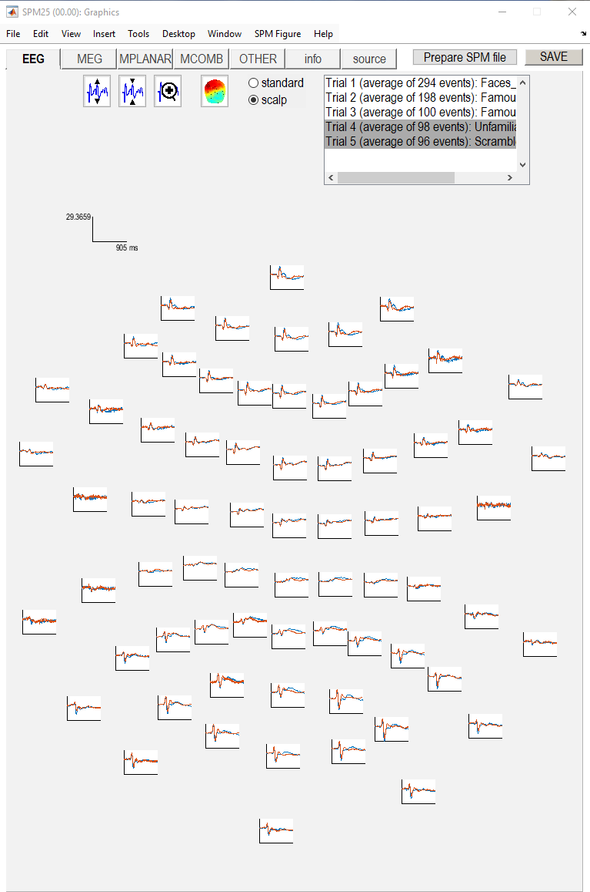
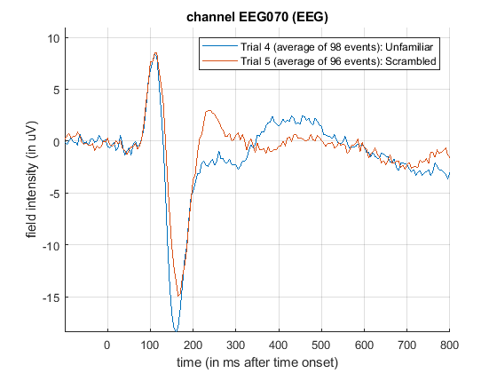
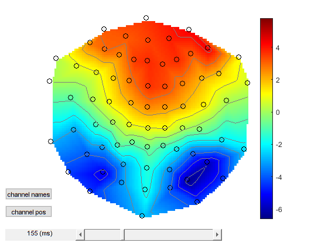
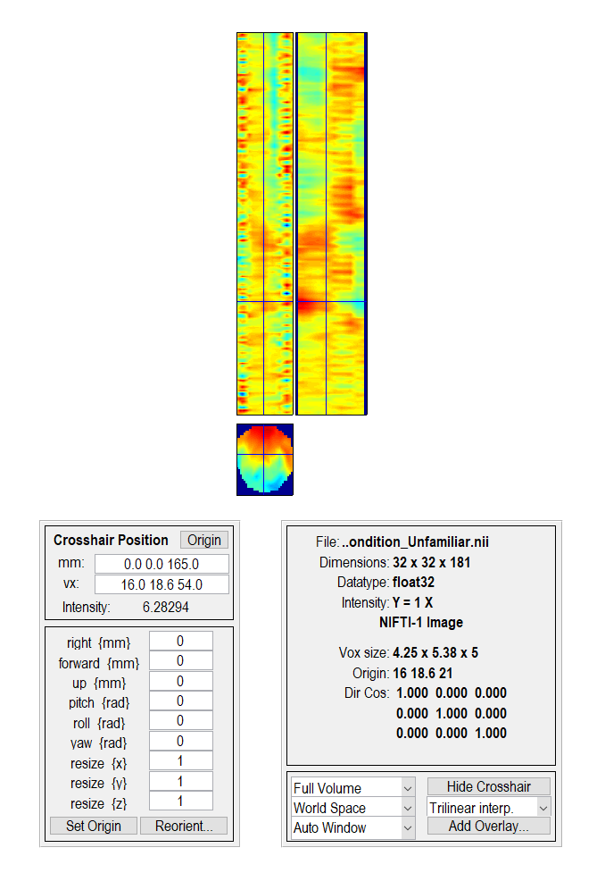
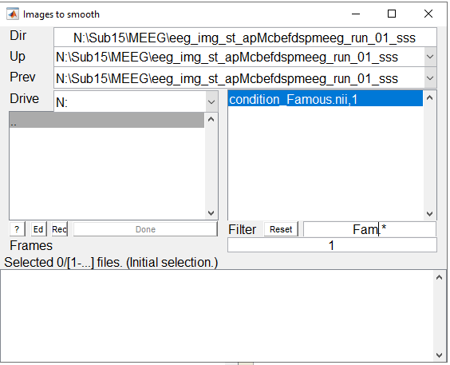
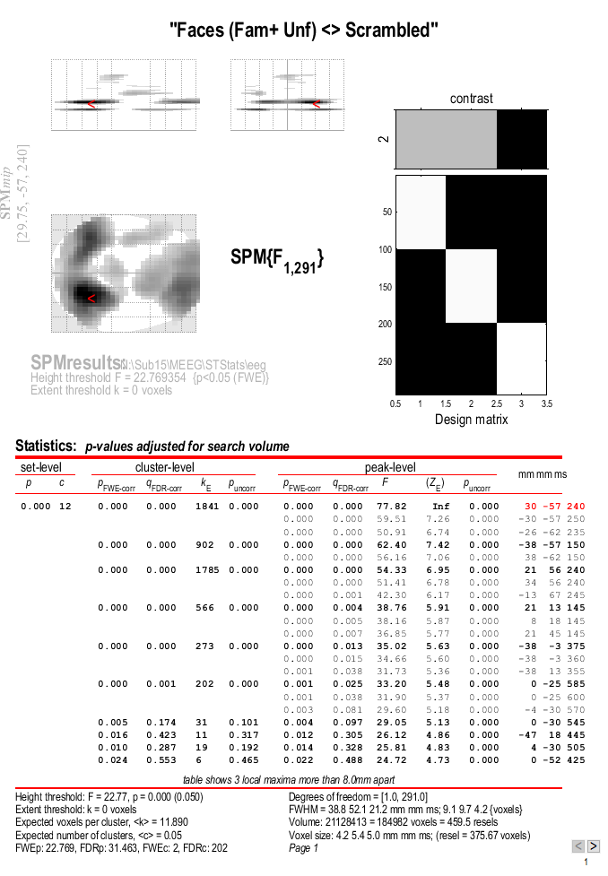
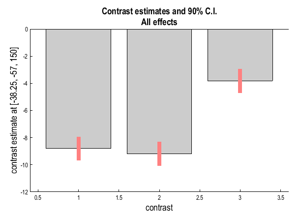
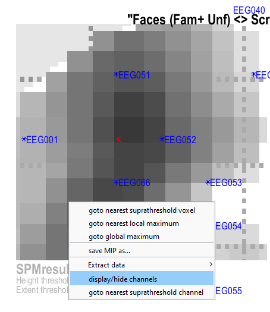

# Multimodal, Multisubject data fusion 

## Evoked analysis

At this point, the preprocessing forks into two strands: one for
trial-averaged amplitude analysis and one for time-frequency analysis.
The first of these corresponds to a typical evoked response (ER)
analysis, where we simply average across trials in each condition (note
this will attenuate any non-phase locked, i.e. induced responses; to
detect these, we will later perform time-frequency analysis before
averaging). Before averaging though, we will crop the 400ms buffer
around each trial (which is only necessary for the time-frequency
analysis).

Previously, for instructive purposes, you ran the preprocessing steps one-by-one, saved a batch for each individual step and then chained these batches to make a pipeline. Now, when you are familiar with the idea of a dependency, we will create a single batch that contains all the preprocessing steps, which can then be run in one go.

### Crop

To crop the data, select the crop option from "SPM -- M/EEG --
Preprocessing -- Crop". Select the datafile called
`Mcbefdspmeeg_run_01_sss.mat` produced from the final EEG re-referencing
("Montage") step above. A 100ms pre-stimulus baseline period is normally
sufficient, and we do not care about responses after 800ms for this
particular analysis, so we can cut off 400ms at the start and end of
each trial to produce an epoch from -100ms to +800ms. To do this, select
"Time Window" from the "Current Module" window, then the "Specify"
button. Within the pop up window, enter `[-100 800]` as a 1-by-2 array.
The channel selection will be "all". This file output will be prepended
with a `p`.

### Artefact detection

There are many ways to define artifacts. Here we focus on just one simple means
of detecting blinks by thresholding the EOG channels. Select "Artefact
detection" from the "SPM -- M/EEG -- Preprocessing" menu. For the input
file, select a dependency on the output of the previous step ("Crop").
Next, select "New: Method" from the box titled "Current Item: How to
look for artefacts". Back in the "Current Module" window, highlight
"Channel selection" to list more options, choose "Select channels by
type" and select "EOG". Then do not forget to also delete the default
"All" option! Then press the "<-X" to select "threshold channels",
click the "Specify" button and set this to `200` (in units of
microvolts). The result of this thresholding will be to mark a number of
trials as "bad" (these can be reviewed after the pipeline is run if you
like). Bad trials are not deleted from the data, but marked so they will
be excluded from averaging below. The output file will be prepended with
the letter "a".

> **Tip:** How is the threshold set?
>
> You would usually set the threshold by reviewing data visually, for example by plotting the EOG channels and looking for large deflections that correspond to blinks. You could open the `Mcbefdspmeeg_run_01_sss.mat` file in the reviewing tool (`Display -- M/EEG`) switch to the `Other` tab and look at the panels corresponding to the two EOG channels. You can figure out the channel name and type by right-clicking on the plot which will show a pop-up menu with these details. In the top right corner of the window, you see a trial list where you can switch between trials by clicking on them. You can also Shift- and Ctrl- click to plot a few trials together. If you click on the first trial and then scroll to the bottom of the list and click on the last trial while holding Shift, you can plot all trials in between together (though it can take a while). If you then right-click on an EOG channel plot and select the channel name in the popup menu, the plot will open in a separate figure (after some time) where you can examine the y-axis values, zoom in and out and get an idea of what a good threshold might be. Note that some of the subjects were very good and you might get no blinks at all within the peristimulus time depending on what subject you are working on. In this case try comparing your plots to the ones of your fellow students.

### Trial averaging

To average the data across trials, select "SPM -- M/EEG -- Average --
Averaging", and define the input as dependent on the output of the
artefact detection module. Keep the remaining options as the default
values. (If you like, you could change the type of averaging from
"standard" to "Robust". Robust averaging is a more sophisticated version
of normal averaging, where each timepoint in each trial is weighted
according to how different it is from the median across trials. This can
be a nice feature of SPM, which makes averaging more robust to atypical
trials, though in fact it does not make much difference for the present
data, particularly given the large numbers of trials, and we do not
choose it here simply because it takes much longer than conventional
averaging.) Once completed, this file will have a prefix of `m`.

### Contrasting conditions

We can also take contrasts of our trial-averaged data, e.g., to create a
differential ER between faces and scrambled faces. This is sometimes
helpful to see condition effects, and plot their topography. These
contrasts are just linear combinations of the original conditions, and
so correspond to vectors with 3 elements (for the 3 conditions here).
Select "SPM -- M/EEG -- Average -- Contrast over epochs", and select the
output of "Averaging" above as in the dependent input. You can then
select "New Contrast" and enter as many contrasts as you like. The
resulting output file is prepended with `w`.

For example, to create an ER that is the difference between faces
(averaged across Famous and Unfamiliar) and scrambled faces, enter the
vector `[0.5 0.5 -1]` (assuming conditions are ordered
Famous-Unfamiliar-Scrambled; see comment earlier in "Prepare" module),
and give it a name by specifying "New condition label" as e.g. 'Faces_vs_Scrambled'. 
Or to create the differential ER between Famous and
Unfamiliar faces, enter the vector `[1 -1 0]`. Sometimes it is worth
repeating the conditions from the previous averaging step by entering,
in this case, three contrasts: `[1 0 0]`, `[0 1 0]` and `[0 0 1]`, for
Famous, Unfamiliar and Scrambled conditions respectively. These will be
exactly the same as in the averaged file above, but now we can examine them, 
as well as the differential responses, within the same file (i.e.
same graphics window when we review that file), and so can also delete
the previous `m` file by adding a 'Delete' module'. Set 'Weight by replications' to 'No'.
This option is useful e.g. for combining averages over blocks with different numbers of trials. But
in this case we don't want our contrasts to be affected by trial numbers.

### Save batch and review

At this point, you can save batch and script again as `batch_preproc_meeg_evoked_meeg`.  The script file can
be run (and possibly combined with the previous script created).

We will start by looking at the trial-averaged ERs to each of the three
conditions. Select the "Display" button on the SPM Menu and select the
file `wmapMcbefdspmeeg_run_01_sss.mat`. Then select, for example, the
"EEG" tab, and you will see each channel as a row ("strip", or "standard
view") for the mean ER for Famous faces. If you press "scalp" instead,
the channels will be flat-projected based on their scalp position (nose
upwards). You can now display multiple conditions at once by holding the
shift-key and selecting Trials 4 and 5 (Unfamiliar and Scrambled).
If you press the expand y-axis button (top left) a few times
to up-scale the data, you should see something like in
the below figure. You can see the biggest evoked
potentials (relative to average over channels) at the back of the head.



*Figure: Trial-averaged ERPs for each condition displayed across all EEG channel positions on the scalp. The scalp projection shows the spatial distribution of evoked responses, with the largest potentials visible at posterior channels.*

If you press the magnifying glass icon, then with the cross-hairs select
Channel `EEG70` (in bottom right quadrant of display), you will get a new
figure like below that shows the ERPs for that
channel in more detail (and which can be adjusted using the usual MATLAB
figure controls). You can see that faces (blue and green lines) show a
more negative deflection around 170ms than do scrambled faces (red
line), the so-called "N170" component believed to index the earliest
stage of face processing.



*Figure: Trial-averaged ERPs for each condition from EEG channel 70 (right posterior). The faces (blue and green lines) show a more negative deflection around 170ms than scrambled faces (red line), demonstrating the N170 component.*

To see the topography of this differential N170 component, select
instead the fourth trial (contrast) labelled "Faces -- Scrambled". Then
press the coloured topography icon, and you will get a new figure with
the distribution over the scalp of the face-scrambled difference. If you
shift the time-slider on the bottom of that window to the leftmost
position, and then repeatedly click on the right arrow, you will see the
evolution of the face effect, with no consistent difference during the
prestimulus period, or until about 155ms, at which point a clear dipolar
field pattern should emerge.



*Figure: Topography of differential ERP for faces (famous and unfamiliar) vs scrambled at 155ms. A clear dipolar field pattern emerges, indicating the neural response to face stimuli.*


> # Assessment question
>
> **Effects of Digital Filtering on the Shape of Visual Evoked Responses**
>
> Using a single channel that displays a clear evoked response, investigate how digital filtering affects the waveform. To make things simpler, you can only process one data run (one raw file) and define only one experimental condition by selecting events corresponding to all the three stimulus types (famous, unfamiliar and scrambled faces) together.
>
> Follow these steps:
>
> 1. **Baseline:** Repeat the preprocessing pipeline without applying any filters. Extend both the baseline and post-stimulus periods to capture potential filtering artefacts.
> 2. **Systematic Filtering:** Apply and compare the following filters, both separately and in combination:
>     - **High-pass filters:** Test several cut-off frequencies (e.g., 0.1 Hz, 1 Hz, 2 Hz).
>     - **Low-pass filters:** Test at different cut-offs (e.g., 30 Hz, 40 Hz, 70 Hz).
>     - **Notch filters:** Apply at 50 Hz and harmonics (e.g., 100 Hz, 150 Hz) to suppress line noise.
> 3. **Analysis:** For each filtering condition, plot the evoked response and describe the effects on waveform morphology, latency, and amplitude.
> 4. **Artefact Identification:** Highlight any artefacts introduced by specific filters.
> 5. **Justification:** Based on your observations, justify the optimal filtering strategy for your data.
>
> ### Tips:
>
> 1. To make the pipeline run faster, you can only process the selected single channel. To do that, use the `Channel selection` settings in the `Conversion` module. First, delete the default `All` option, then select `Custom channel` enter the name of the channel you want to process (e.g., `EEG052`).
> 2. To facilitate comparison, consider overlaying the evoked responses from different filtering conditions on a single plot. This will help visualize how each filter affects the waveform. You can do this by first changing the prefix in the `Filter` tool to indicate the filter frequency for each block and then using the `Merge` tool to merge all the averaged datsets for different filtering settings together. If you set `New label for the merged file` to `#file#`. the condition label in the merged file will be set to the original file name which will help you identify the different filtering conditions.
> 3. You can use the reviewing tool to plot the different waveforms together as described above for eyeblink artefacts.


You can of course also explore the magnetometers (MEG)
which will show an analogous "M170".
You can also examine the EOG and ECG channels, which appear under the
"OTHER" tab. (Note that the VEOG channel contains a hint of an evoked
response: this is not due to eye-movements, but due to the fact that
bipolar channels still pick up a bit of brain activity too. The
important thing is that there is no obvious EOG artefact associated with
the difference between conditions, such as differential blinks.)

But how do we know whether this small difference in amplitude around
150-200ms is reliable, given the noise from trial to trial? And by
looking at all the channels and timepoints, in order to identify this
difference, we have implicitly performed multiple comparisons across
space and time: so how do we correct for these multiple comparisons
(assuming we had no idea in advance where or when this face-related
response would occur)? We can answer these questions by using random
field theory across with scalp-time statistical parametric maps. But
first, we have to convert these sensor-by-time data into 3D images of
2D-location-by-time.

### Time-Sensor images

To create 3D scalp-time images for each trial, the 2D representation of
the scalp is created by projecting the sensor locations onto a plane,
and then interpolating linearly between them onto a 32×32
pixel grid. This grid is then tiled across each timepoint. To do this,
you need to select the "SPM -- M/EEG -- Images -- Convert2Images" option
in the batch editor. For the input file, select the
`apMcbefdspmeeg_run_01_sss.mat` file that contains every cropped trial
(i.e, before averaging), but with bad trials marked (owing to excessive
EOG signals; see earlier). Next select "Mode", and select "scalp x
time". Then, select "conditions", select "Specify" and enter the
condition label "Famous". Then repeat for the condition labels
"Unfamiliar" and "Scrambled".

To select the channels that will create your image, highlight the
"Channel selection", and then select "New: Select channels by type" and
select "EEG". The final step is to name the Directory prefix
`eeg_img_st_` this can be done by highlighting "directory prefix",
selecting "Specify", and the prefix can then be entered.

This process can be repeated for the MEGMAG channels
(although we will focus only on the EEG here). If so, the
easiest way to do this is to right-click "Convert2Images" in the Module
List, and select "replicate module", and
then update the channels selected, and the directory prefix to
`mag_img_st_` indicate the magnetometers (MEGMAG).

### Save batch and review.

At this point, you can save batch and script again e.g. as `batch_preproc_meeg_erp_images_job.m` 
Once you have run this script (note that this step might be quite slow on your system so you might want to 
run it overnight), a new directory will be created for each channel-type, which is based on the
input file and prefix specified above (e.g.,
`eeg_img_st_apMcbefdspmeeg_run_01_sss` for the EEG data). Within that
directory will be three 4D NIfTI files, one per condition. It is very
important to note that these 4D files contain multiple "frames" (i.e. 3D
scalp-time images), one per trial (i.e. ~100 in the case of unfamiliar
faces). To view one of these, press "Display -- Images" in the SPM Menu
window, and select, say, the `condition_Unfamiliar.nii` file. But note
that by default you will only see the first scalp-time image in each
file (because the default setting of "Frames" within the Select Image
window is `1`). To be able to select from all frames, change the
"Frames" value from `1` to `Inf` (infinite), and now you will see all
~100 frames (trials) that contained Unfamiliar faces. If you select, say,
number 50, you should see an image like below (this was created after selecting
"Edit -- Colormap" from the top toolbar, then "Tools -- Standard
Colormap -- Jet", and entering `[0 0 165]` as the coordinates in order
to select 165ms post-stimulus). You can scroll will the cross-hair to
see the changes in topography over time.



*Figure: Example 3D scalp-time image for a single trial*

## Scalp-Time Statistics across trials within one subject

Now we have one image per trial (per condition), we can enter these into
a GLM using SPM's statistical machinery (as if they were fMRI or PET
images). If we ignore temporal autocorrelation across trials, we can
assume that each trial is an independent observation, so our GLM
corresponds to a one-way, non-repeated-measures ANOVA with 3 levels
(conditions).

### Smoothing

Random Field Theory, used to correct the statistics below,
assumes a certain minimum smoothness of the data (at least three times
the voxel size). To ensure that the data meet this criterion, we will
add an additional step of Gaussian smoothing of the
images.

Start a new batch and add an "SPM -- Spatial -- Smooth" module.
A key parameter for smoothing is the full-width at half maximum (FWHM) the smoothing kernel.
In this case it's defined by a 1x3 vector `[8 8 8]` meaning 8x8 mm on the scalp and 8 ms.
We will use this default but you could change the parameters and see how that affects the results.

> **Tip:** A general principle useful for determining the optimal degree of smoothing is the "Matched Filter Theorem" that says
> that the smoothing kernel should be similar in its dimensions to the features of interest. You will be able to make a better use of this
>idea once you develop an intuition for the spatial and temporal characteristics of the effects we are looking for.

Click on `Images to smooth` and navigate to the `eeg_img_st_apMcbefdspmeeg_run_01_sss` folder. You will see the 3 NIfTI files corresponding to the 3 conditions. What we need to do no is select all the trials for the first condition - Famous. A convenient way to do that is to first use a filter
to exclude the other conditions. The filter box is just below the file list and contains the string `.*` by default. This means 'all files'. This is a particular case of a 'regular expression', which is a powerful tool for matching patterns in text. If you want to learn more about how these work  you can look at the documentation page of the 'regexp' function via

```matlab
doc regexp
```

For our purposes, it is sufficient to change the string in the box to `Fam.*` and press `Enter`. If everything worked as intended you should now see only the  'condition_Famous.nii,1' file as in the below figure.



*Figure: Selecting the first condition using a regular expression.*

Now you can change the value in the `Frames` box from `1` to `Inf` and press `Enter`. This will show a list of all the trials in the file.
You can now select them by right-clicking in the file list box and choosing `Select all` from the popup menu. You should now see that all the trials for the Famous condition are selected (listed in the box at the bottom of the dialogue). Click `Done` to return to the batch editor.

Now repeat this process for the Unfamiliar and Scrambled conditions (add a new "SPM -- Spatial -- Smooth" module for each). Note that if you replicate the module and want to select a new set of files you need to unselect the original selection first by right-clicking on any name in the bottom box and choosing `Unselect all`. An alternative way to do that is to right-click on the `Images to smooth` item in the batch and choose `Clear value` from the popup menu before selecting a new set of files.

### Model Specification

Now add  "SPM -- Stats -- Factorial design specification" module to the batch. 
The first thing is to specify the output directory where
the SPM stats files will be saved. So first create such a directory
within the subject's sub-directory, calling it for example `STStats`,
and then create a sub-directory `eeg` within `STStats` (and potentially
one more called `meg` if you want to examine the MEG
data too). Then go back to the batch editor and select this new
`eeg` directory.

Highlight "Design" and from the current item window, select "One-way
ANOVA". Highlight "Cell", select "New: Cell" and repeat until there are
three cells. Select the option "Scan" beneath each "Cell" heading
(identified by the presence of a "<-X"). Select `Dependency`, and choose
one of the smoothing outputs in the corresponding order for each cell. It is
vital that the dependencies are selected in the order in which the conditions
will later appear within the Contrast Manager module (i.e., Famous,
Unfamiliar, Scrambled). Make sure "Independence" is set to "Yes",
and the variance to "Unequal". Keep all the remaining defaults.

This now completes the GLM specification, but before running it, we will
add two more modules.

### Model Estimation

The next step within this pipeline is to estimate the above model. Add a
module for "SPM -- Stats -- Model Estimation" 
and define the `SPM file` as being dependent on the results of the
factorial design specification output. For "write residuals", keep "no".
Select classical statistics.

### Setting up contrasts

The final step in the statistics pipeline is create some planned
comparisons of conditions by adding "SPM -- Stats -- Contrast Manager" module.
Define `SPM file` as dependent on the model estimation.
The first contrast will be a generic one that tests whether significant
variance is captured by the 3 regressors. This
corresponds to an F-contrast based on a 3×3 identity matrix. Highlight
contrast sessions and select a new F-contrast session. Name this
contrast "All Effects". Then define the weights matrix by typing in
`eye(3)` (which is MATLAB for a 3×3 identity matrix).
(Since there is only one "session" in this GLM, select "Don't replicate"
from the "replicate over sessions" question.) We will use this contrast
later to plot the parameter estimates for these 3 regressors.

More interestingly perhaps, we can also define a contrast that compares
faces against scrambled faces (e.g. to test whether the N170 seen in the
average over trials in right posterior EEG channels is reliable given the variability
from trial to trial, and to also discover where else in space or time
there might be reliable differences between faces and scrambled faces).
So make another F-contrast, name this one "Faces (Fam+ Unf) <>
Scrambled", and type in the weights `[0.5 0.5 -1]` (which
contrasts the main effect of faces vs scrambled faces, ignoring any time
effects). Note that we use an F-test because we don't have strong interest in the
polarity of the face-scrambled difference (whose distribution over the
scalp depends on the EEG referencing). But if we did want to look at
just positive and negative differences, you could enter two T-contrasts
instead, with opposite signs on their weights.

### Save batch and review

Once you have added all the contrasts you want, you can save this batch
file (as e.g. `batch_stats_meeg_ANOVA.m` ). This only runs a GLM for one sensor-type
(we cannot combine the sensors until we get to source space later), so
you can write a script around this batch that calls it twice, once
per sensor-type, just changing the output directory and input files.

### Reviewing statistical results

Once you run the batch (it could take a long time to run in Desktop@UCL so you could run it overnight),
the results can be viewed by selecting "Results" from the
SPM Menu window. Select the `SPM.mat` file in the `STStats/eeg`
directory, and from the new "Contrast Manager" window, select the
pre-specified contrast "Faces (Fam+Unf) <> Scrambled". Within the
Interactive window which will appear on the left hand side, select the
following: Apply Masking: None, P value adjustment to control: FWE, keep
the threshold at 0.05, extent threshold {voxels}: 0; Data Type:
Scalp-Time. The Graphics window should then be similar to the Figure below.



*Figure: Scalp-Time SPM for F-contrast, thresholded at p<.05
FWE corrected, for faces vs scrambled faces across trials for one
subject.*

Note that since you might be working on a different subject, your
results might look different. Compare your results with those of your
fellow students to get an idea of the variability across subjects.

The three plots in the top left corner of the graphics window show the
SPM thresholded at p<0.05 FWE-corrected, in three orthogonal
planes. The bottom panel shows the scalp topography similar to the ones
we saw when plotting raw sensor data, except the head is rotated 90
degrees so front is right and back is left. The panel above it, combines time
with antero-posterior (front-to-back) spatial axis that matches the scalp topography below and the top right panel is similar except the spatial axis is left-to-right. These plots show maximal intensity projections (MIPs), that you might be familiar with from fMRI, where the most significant voxel along each line of sight is shown.

The panel at the top right of the graphics window shows a representation of the GLM design matrix and the contrast we are looking at.

The table in the bottom half of the graphics window shows the statistical results in greater details. The rightmost column lists the coordinates of most prominent local peaks in space and time. You can click on any of these rows to move the cross-hairs in the three orthogonal views to that peak. Focus on peaks close to 170ms and look for one with a posterior scalp distribution (for each subject the exact timing and location will vary a bit).

If you then press "Plot -- Contrast Estimates --
All Effects", you will get 3 bars like in the below
Figure. They  reflect the three main conditions (the red bar is the standard error from the model fit). You can see that Famous and Unfamiliar faces produce a more negative amplitude at this space-time point than Scrambled faces (the "N70").



*Figure:Effects of interest from a posterior sub-peak around 170ms.
The three bars are mean evoked response amplitude vs baseline for
Famous, Unfamiliar and Scrambled faces.*

To find out which channel is closes to the effect peak, right-click on the MIP
plot and select `display/hide channels` from the popup menu. You will be asked to
choose an M/EEG dataset. Any dataset with the same channel set from our preprocessing pipeline will work. Once you have selected a dataset, the channel locations will be overlaid on the MIP plot. It might be difficult to read the labels as they will overlap but you can zoom in around the peak as shown in the below Figure.



*Figure:Finding the channel nearest to the effect peak*

There are many further options you can try. For example, within the
bottom left window, there will be a section named "Display", in the
second drop-down box, select "Overlay -- Sections" and from the browser,
select the `mask.nii` file in the analysis directory. You will then get
a clearer image of suprathreshold voxels within the scalp-time-volume.
Or you can of course examine other contrasts, such as the difference
between famous and unfamiliar faces, which you will see is a much weaker
and slightly later effect.

You can also repeat this analysis for the MEG data, which will show an
M170 effect that is very similar to the EEG N170, but with a different
topography (because the MEG is insensitive to radial sources, unlike
EEG). 