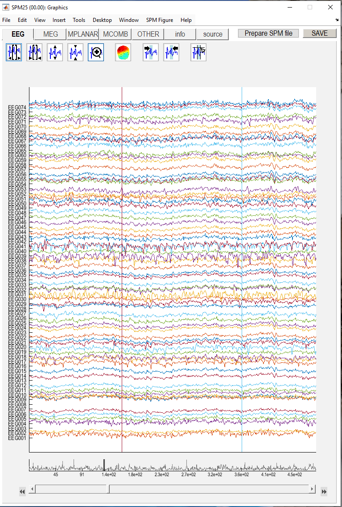
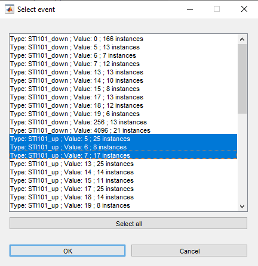
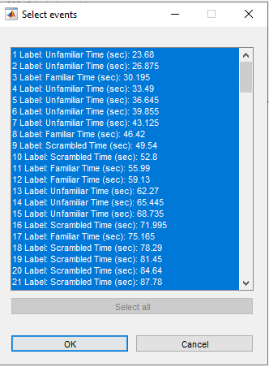

# Multimodal, Multisubject data fusion 

## Preprocessing M/EEG data

We will start by performing the different preprocessing steps one by one, then will chain these steps to create a pipelines (using SPM's batch interface) for
preprocessing the M/EEG data for a single subject, and then scripting
these pipelines to repeat over multiple subjects.

### Getting the data

If you are working with Desktop@UCL Anywhere, the data can be found in the
`S:\FBS_CLNE0068\Data\Faces` folder. Find the subject you were previously working with for the fMRI part of the course, and copy their `anat` and `meg` subfolders to your working folder. If you are working on your own computer, you can download a zip file with your subject's data from the `MEEG` sharepoint folder. A link is available in the `Data analysis resources` section of the course Moodle page. Make sure you have a good connection as the zip file can be quite large.

### Running SPM

You should already be familiar with SPM from the previous term and SPM should be set up in your Matlab environment. This term, we will be using the M/EEG functionality of SPM and you should access it by running

```matlab
    spm eeg
```
from the command window.

If you write any scripts, it's good practice to start them with the line

```matlab
    spm('defaults', 'eeg');
```

to make sure that all the relevant functions are loaded.

### Convert
The first step is to convert raw M/EEG data from its native format
(which depends on the acquisition system) to the format used by SPM. In
the present example, the raw data are continuous. 

In the batch editor, select SPM on the top toolbar, and from the
dropdown menu select M/EEG. At the top of the new dropdown menu, select
"Conversion". Once selected, the Module List on the left of the batch
editor window will now list "Conversion" as the first (and only) step.
Within the main, Current Module window will be listed several variables.
The first variable listed is "File Name". On the right hand of this
pane, you will see "<-X", this indicates that you need to update this
field. To do so, click on "File Name", this will then open up your
current working directory. From the directory containing MEEG data of the 
subject you are working on select the file named `run_01_sss.fif` and press "Done".

Many variables in the Current Module window have default values, but we
need to change some of them. For example, we do not want to convert all
channels in the original file (since many are extraneous), so will
select a subset by their type. We first need to delete the default
option to convert all channels. To do this, click "channel selection",
and scroll down until you can select the "Delete All(1)" option. Then
click the "channel selection" again, but this time choose the option
"New: Select channels by type". This will add "Select channels by type"
to the Current Module, and you will see "<-X" on the right hand side
of this, indicating the need for user input. Click the "<-X" and then
select "EEG" from the "Current Item" section. Repeat this process to
additionally include the "MEGMAG" channels.

The remaining options for conversion can be left with their default
values (which includes the output filename, which defaults to the input
filename, simply prepended with `spmeeg_`). Once all variables are
specified, the "play" button on the top toolbar will turn green and the
batch could be run. However, for this example, we will continue to use
the current batch editor window, so do not press the "play" button yet.

Save the configured batch by selecting "File" from the top toolbar and then "Save Batch". You can save it either as a `.mat` file or as a `.m` script. Either would work but saving it as a `.m` script will allow you to easily review and modify the batch in Matlab editor. Choose a meaningful file name, such as `batch_preproc_meeg_convert`.

You can now run the batch.

### Prepare

The next step in the is to update some other properties
of the data using the "Prepare" module. This is a general-purpose
"housekeeping" module that includes options like re-defining channel
names, types, locations, etc. as specific to the particular laboratory
set-up. In our case, some of channels currently labelled EEG were in
fact used to record EOG.

Press the 'New' button to clear the batch window and select "Prepare", 
from the preprocessing menu. Again we need to complete those variables indicated by the
"<-X". Select the new `spmeeg_run_01_sss.mat` file produced by the conversion stage as
the input for this stage.

The next variable to define is the "task(s)". Clicking this variable
will display a variety of options in the "current item" box. Within
this, select "New: Set channel type", then return to the current module
window. In here, highlight "Channel selection", which displays further
variables within the current item window. Scroll down until you can select the "Delete All(1)" option. Then select "New: Custom channel".
Now return to the current module box and select the variable with an
"<-X". This should be "Custom channel". Selecting this and clicking on
"Specify" will open up a small text window. Within this, type `EEG061`.
Create a new Custom channel and type `EEG062`; then select "new channel
type" and highlight "EOG". This is because channels EEG061 and EEG062 in
fact represented bipolar horizontal (HEOG) and vertical (VEOG)
electroculagrams (recordings of electrical activity generated by eye movements) respectively, which can be used to detect ocular
artifacts.

This process then needs to be repeated for two other new channel types.
First add a new "Set channel type" branch like above. Specify the custom channel name as `EEG063` and set
its channel type as "ECG". This channel represents the
electrocardiogram, which can be used to detect cardiac artifacts.
Second, in the same way, set the type of  `EEG064` as "other" (this is just a free-floating electrode, and does not
contain data of interest).

One more job we need to do is specify "bad" channels. These only exist
for the EEG (MEG bad channels are assumed to be corrected by the prior
MaxFiltering step). Bad EEG channels were identified by hand by an
experienced EEG operator and saved in a file called `bad_channels.mat`
in each subject's directory. It is important to note that there are many
other ways that bad channels can be defined automatically by SPM, using
the "artefact" module for example, but the various options for this are
not explored in this chapter. To specify bad channels, add a new task by highlighting the "Select task(s)" option
and select the "New: Set/unset bad channels", then under
"Channel selection", replace the default "All" with the option "New:
Channel file", and then select the `bad_channels.mat` file in this
subject's directory (note it is important that you delete the "All (1)"
option first). 

This will complete the preparation stage, as indicated by the "play"
button turning green. (Note that you can also use this "Prepare" option
interactively, in order, for example, to create and save a bad channel
selection file). You can try it in your spare time. 

Save the configured batch by selecting "File" from the top toolbar and then "Save Batch". Choose a meaningful file name, such as `batch_preproc_meeg_prepare`. 

You can now run the batch.

### Downsample

The data were sampled at 1000Hz, but for the analyses below, we rarely
care about frequencies above 100Hz. So to save processing time and disk
space (by a factor of 5) we can therefore downsample the data to 200Hz
(which includes a lowpass filtering to avoid aliasing). Start a new batch and select
"Downsampling" from the module list "SPM -- M/EEG -- Preprocessing",
click on "File Name", select  and select `spmeeg_run_01_sss.mat`. Next, set the
downsampling rate by clicking the "New sampling rate" variable within
the current module box. Type `200` into the pop-up window that appears
and use "OK" to set this value. The output file of this stage will be
prepended with a `d`.

Save the configured batch by selecting "File" from the top toolbar and then "Save Batch". Choose a meaningful file name, such as `batch_preproc_meeg_downsample`.

You can now run the batch.

### High-pass filtering

The next step is to high-pass filter the data to remove slow drifts in the signal. This is important because these drifts can obscure the neural signals of interest, especially in the EEG data. To do this, start a new batch and select "Filter" from the "SPM -- M/EEG -- Preprocessing" menu. In the Current Module window, select the input file as the output of the previous step (`dspmeeg_run_01_sss.mat`) and set the "Band" to "highpass". Set the frequency cut-off by clicking on the "Cutoff (s)" variable and entering a value. The recommended high-pass filter frequency is 0.5Hz, which is usually sufficient for most M/EEG analyses. However, you can also try a different value (e.g., `1` for 1Hz). Now run the batch step The output file will be prepended with an `f`. Save the configured batch by selecting "File" from the top toolbar and then "Save Batch". Choose a meaningful file name, such as `batch_preproc_meeg_filter` and run the batch

Note that the order of the preprocessing steps can vary. Sometimes changing the order does not make much difference, in other cases it could have a significant impact on the results. It is usually advisable to high-pass filter the data early in the pipeline to get rid of possible large offsets in the data (called DC offsets). If this is not done then subsequent low-pass filtering steps may generate so called "ringing artefacts" at the edges of the data (that look like a series of high amplitude deflections). In this case, we are not very worried about this because there are stretches of unused data at the beginning and end of each block which will be removed soon at the epoching step. Downsampling early accelerates all the subsequent steps due to the reduced data size so here we chose to put the filtering step after it.

### Review

When analysing M/EEG data, it is a good idea to review the intermediate results at least after steps that change the data. This can help identify any potential issues or artifacts before moving on to the following steps. Go to the main SPM window  (the one with many buttons) and select "Display" (one the left, third from the bottom), then select "M/EEG". In the dialog that opens select the `fdspmeeg_run_01_sss.mat` file.  This will open the M/EEG Review window. The first thing you will see is the "Info" tab, which contains some information about the data, including the number of trials, channels, and sampling frequency. You can also see the "History" section, which lists all the preprocessing steps that have been applied to this file so far. Click on the `EEG` tab and you will see the EEG data plotted as a time series for each channel. You can scroll through the time by using the arrow keys and scroll bar at the bottom of the window. In the toolbar at the top of the window you can find buttons for changing the scale of the time and the amplitude axes. When scrolling through the data you might see vertical lines. These indicate the stimulus onset times. If any channels were marked as bad in the previous step, they will be shown as dashed lines. Try also clicking on the `MEG` tab to see the MEG data. Can you see anything obviously different between the waveforms of the three sensor types?



*Figure: Example of the SPM M/EEG Review window displaying EEG data.*

### Epoching

The next step is to epoch the data, which means to cut it into smaller segments around the events of interest (in this case, the stimulus onset). This is important because it allows us to analyse the data in relation to specific events, such as stimulus presentation or response. In this case the information necessary for epoching has already been collated by the researchers who published the dataset. However, we will first show how you would go about it if you had to do it yourself. 

Assuming the reviewing tool is still open (if not, repeat the steps from the previous section), press the `Prepare SPM file` button in the top right corner of the reviewing tool window. A menu will appear at the top of the SPM interactive window (the small square window that appears on the bottom left when you first run SPM).

> **Tip:**  
> If you don't see all the SPM windows you can use the command  
> 
> ```matlab
> spm('show');
> ```
> 
> to bring them all to the front.

From the "Batch inputs" menu select "Trial definition". This will launch an interactive tool that will ask for a series of user inputs to generate a trial definition file. The first question is asking to for "[2] Time window (ms)" the "[2]" indicates that the response is expected to consist of 2 numbers. These are the beginning and the end of the time window of interest relative to an event (in our case the visual stimulus). You could specify "[-500 1300]". Although the window we are actually interested in is shorter than that, taking a large safety margin around it is useful as it will allow for edge artefacts that could be generated by some of later processing steps to be removed. The next question is "How many conditions?". This is referring to the number of different trial types we would like to define. In this case we have 3 conditions: Familiar, Unfamiliar and Scrambled faces so we will say "3". Note that this choice is not necessarily dictated by the data. We could as well define 2 conditions, "Faces" and "Scrambled faces" by pooling across familiar and unfamiliar or by ignoring one of the triggers altogether. These choices are usually made based on the experimental design and the hypotheses being tested. Next you will define the individual conditions. First you should specify the condition label. For the first condition it is "Familiar". Pressing ENTER will open a dialog box with the list of all the events recorded with the data (these were marked with vertical lines in the reviewing tool as we saw before). The details of what such a list would look like change depending on the recording system and the experimental setup. In our case it will look like shown below.



*Figure: Event list for trial definition.*

Each row in the list corresponds to one event type and contains three fields: 

* Type - in this case STI101_up or STI101_down. STI101 is the name of the trigger channel, and _up indicates that the event was marked by a rising edge of the signal on this channel and_down indicates that the event was marked by a falling edge of the signal on this channel. 
* Value - in this case is the value of the signal on the trigger channel. The computer sending events to the acquisition system can set the signal voltage to distinguish between different events.
* Number of instances of this event type - this can be useful e.g. because the important triggers usually appear many times in the data.

Familiar faces in our case could be encoded by STI101_up trigger with values 5, 6 or 7 (there was a further distinction between these three values in the original experiment that we will not get into here). You can select all the three rows together by using Shift-Click (for consecutive rows) or Ctrl-Click (for non-consecutive rows). Once you have selected the rows as shown in the figure, click `OK` to confirm your selection. You will then be ask to specify the "Shift triggers" parameter. This is useful e.g. for cases where the recorded trigger time does not match the actual stimulus presentation time. In this case, we can keep the default value of zero. The next condition is "Unfamiliar", which is encoded by STI101_up with values 13, 14 or 15. Repeat the same process as above to select these rows. Finally, for the "Scrambled" condition, select STI101_up with values 17, 18, 19. Once you have defined all three conditions, you will be asked if you want to review individual trials. If you respond "Yes", you will be presented with a trial list as shown below.



*Figure: Selected events list.*

This list includes the serial number of each trial, the condition label and the time of the event in seconds relative to the start of the recording. You can use it to select a subset of trials or to exclude some of them by Shift- and Ctrl- clicking on the rows. In this case, we will not exclude any trials, so just click "OK". The next step is to save the trial definition file. You can save it in the same directory as the M/EEG data, with a name like `run_01_trials.mat`.  Once you have saved the trial definition file, you can press `OK` in the bottom left corner of the interactive window to go back to the reviewing tool. 

Now you can return to the Batch tool and select "Epoching" from the "SPM -- M/EEG -- Preprocessing" menu. In the Current Module window, select the input file as the output of the previous step (`fdspmeeg_run_01_sss.mat`). Next you should specify how to define the trials. Click on the "Trial definition file" variable and select the  file `run_01_trldef.mat`. From the "Trials" subfolder. You now know how this kind of file could be created. You could also explore the "Define trial" option that closely mirrors the interactive trial definition tool we just used. Once the trial definition file is selected, you can run the batch. The output file name will be prepended with an `e`. Save the configured batch by selecting "File" from the top toolbar and then "Save Batch". Choose a meaningful file name, such as `batch_preproc_meeg_epoch`.

### Baseline Correction

Baseline correction is a common preprocessing step in M/EEG data analysis. It involves subtracting the mean of the data in a specified time window (the baseline) usually before the event of interest (e.g., stimulus onset) from the data in the entire trial. This helps to remove any baseline shifts or drifts in the data that could affect the analysis. Epoching the data in the previous step has already resulted in baseline correction using the [-500 0]ms as the baseline period. This is not ideal as the baseline with the safety margin is too long. created a baseline period, which is the time before the stimulus onset. So we will redefine the baseline to be from -100ms to 0ms
relative to the stimulus onset. Select "Baseline Correct" from under the
"SPM -- M/EEG -- Preprocessing" menu. Select the output file of the previous step (`efdspmeeg_run_01_sss.mat`) as the input file. In the Current Module window, you will see a variable called "Baseline". This is where you can specify the baseline period. Click on "Baseline" and then click on "Specify". A dialog box will appear where you can enter the baseline period as a 1-by-2 array. Enter `[-100 0]` (units are milliseconds). The output file will be prepended with a `b`. Save the configured batch by selecting "File" from the top toolbar and then "Save Batch". Choose a meaningful file name, such as `batch_preproc_meeg_baseline`. You can now run the batch and review the output.

### Building a pipeline

If you followed all the steps until now, you should have a series of batch files that perform different preprocessing steps on the M/EEG data. However, it is often useful to combine these steps into a single pipeline that can be run in one go. To do this, you can create a new batch file that includes all the steps in the correct order. Start a new batch by pressing the `New` button. Now press the `Open` button, this will open the file selection dialogue and if you are in the right folder, you should see all the batch files you saved before. The dialogue allows you to select files by clicking on them and if you click on multiple files they will be added to a list. You should now click in the correct order which is the same order of steps we described above: 

* `batch_preproc_meeg_convert`
* `batch_preproc_meeg_prepare`
* `batch_preproc_meeg_downsample` 
* `batch_preproc_meeg_filter`
* `batch_preproc_meeg_epoch`
* `batch_preproc_meeg_baseline`

 Once you have selected all the files, click on `Done`. This will add all the selected batch files to the current batch editor window.  You can now run this batch by pressing the green play button in the top toolbar. This will execute all the steps in the order they were added to the batch editor. However, there is one more step that you need to do to make the batch generic. Right now, the input file names are hard-coded in each step of the batch. But it would be better to just specify that the input for each step is the output of the previous step. Then we would only need to select the raw data file for conversion and the rest will follow automatically. This can be done by using the `Dependency` button in the Current Module window. For each step starting from `Prepare`, click on the "File Name" variable and then click on the `Dependency` button. This will open a dialog box where you can select the output a previous step from the list of all the steps preceding the current one. Once you have done this, you can save the batch file with a meaningful name, such as `batch_preproc_meeg_pipeline`.

 
### Deleting intermediate steps (optional)

The six steps (modules) described above create a preprocessing pipeline
for the data. If this pipeline is run straight away, there will be five
different output files (because the `Prepare` step does not create a new output file but modifies its input). If you are short of diskspace, you might want to
delete some of the intermediate files. To do this, select "SPM" from the
top toolbar of the batch editor window and choose "M/EEG -- Other --
Delete" several times. Then you will need to specify the File Names to
delete. Highlight each "Delete" module and set the File Name as the
output of the Prepare step using the "Dependency" button to delete any
output from the conversion/prepare step onward. In fact, all processing
steps up until the most recent step (Baseline-correction) can be
deleted. Save the resulting batch once again.

## Creating a script for combining pipelines within a subject.

Once you have created a linear pipeline, you might want to repeat it on
multiple sessions (runs) within a subject, or even across multiple
subjects. In the present case, there were 2 independent MEG runs
(separated only by a short period to give the subjects a rest), which
can all be processed identically. One option would be to save the batch
file, manually alter the "File Name" that is initially loaded into the
batch editor, and repeat this process separately for each run. A more
powerful approach is to create a script. 

To do this, first clear all the subject-specific inputs from the batch. 

* `File name` in the "Conversion" step
* `Channel file` in the "Prepare" step  
* `Trial definition file` in the "Epoching" step

Right-click on each of these variables and select "Clear Value".

Select "File" from the Batch Editor window, and select "Save Batch and Script". This will
produce two files: a batch file (same as that created when you save a
batch) but also a MATLAB script that calls that batch file. So if you
call the batch file `batch_preproc_meeg_pipeline`, you will get a batch
file called `batch_preproc_meeg_pipeline_job.m` and a script file called
`batch_preproc_meeg_pipeline.m`.

The script file `batch_preproc_meeg_pipeline.m` will automatically be
loaded into the MATLAB editor window, and should appear something like
this:

```matlab
% List of open inputs
% Conversion: File Name - cfg_files
% Prepare: Channel file - cfg_files
% Epoching: Trial definition file - cfg_files
nrun = X; % enter the number of runs here
jobfile = {'N:\...\MEEG\batch_preproc_meeg_pipeline_job.m'};
jobs = repmat(jobfile, 1, nrun);
inputs = cell(3, nrun);
for crun = 1:nrun
    inputs{1, crun} = MATLAB_CODE_TO_FILL_INPUT; % Conversion: File Name - cfg_files
    inputs{2, crun} = MATLAB_CODE_TO_FILL_INPUT; % Prepare: Channel file - cfg_files
    inputs{3, crun} = MATLAB_CODE_TO_FILL_INPUT; % Epoching: Trial definition file - cfg_files
end
spm('defaults', 'EEG');
spm_jobman('run', jobs, inputs{:});
```

At the top of this script is listed the variable `nrun = X`: replace `X`
with `2` for the two runs you wish to convert. You also need to complete
the missing MATLAB code needed for each run: here, 1) the raw input file
to convert, 2) the channel file containing the bad channels (which is actually the same for
each run, but differs across subjects, which will matter later when we
extend the script to loop over subjects), and 3) the trial definition file for that run .
In order to automate selection of these files, you need to know some basic MATLAB . For example,
because the files are named systematically by run, we can complete the
relevant lines of the script with:

```matlab
     inputs{1, crun} = cellstr(fullfile(rawpth,'sub-XX','MEEG',sprintf('run_%02d_sss.fif',crun)));
     inputs{2, crun} = cellstr(fullfile(rawpth,'sub-XX','MEEG','bad_channels.mat'));
     inputs{3, crun} = cellstr(fullfile(rawpth,'sub-XX','MEEG','Trials',sprintf('run_%02d_trldef.mat',crun)));
```

> **Tip:** Replace `XX` with the subject number, e.g., use `sub-15` for subject 15 and replace "rawpth" with the path to the directory containing the subject's folder.

where `rawpth` refers to your base directory, `sub-15` is the subject
directory that contains `MEG` and `Trials` sub-directories and `%02d` refers to
the run number, expressed as two digits.

The other file -- the batch or "job" file -- can be reloaded into the
batch editor at any time. It can also be viewed in the MATLAB editor. If
you type `edit batch_preproc_meeg_pipeline_job.m`, you will see your
selections from the earlier GUI steps. 

This completes the first part of the preprocessing pipeline. You can
then run this script by selecting the green play button on the upper
toolbar of the script MATLAB Editor window. The results will be 2 files
labelled `befdspmeeg_run_%02d_sss.mat`, where `%02d` refers to the run
number `1-2`. If you want to view any of these output files, press
"Display" on the main SPM menu pane, select "M/EEG", then select one of
these files. You will be able to review the preprocessing steps as a
pipeline from the "History" section of the "Info" tab, and can view
single trials by selecting one of the EEG, MEG (magnetometer) tabs
(see other chapters for how to use the buttons in the
M/EEG Review window).

> **Tip:** A simple way to run any batch pipeline in your script is to save it as an `.m` file and add the line
>
>```matlab
>    spm_jobman('run', matlabbatch);
>```
>
>at the end. If you now run this script, it will execute the batch pipeline defined in the `matlabbatch` variable. You can change some of the lines if necessary (such as the path to the input file) before running the script or put a loop around the lines where you change some of the inputs and rerun the batch.


### Merging (concatenating runs)

To analyse the data as one file, the six runs need to be merged. To do
this, select "Merging" from "SPM -- M/EEG -- Preprocessing -- Merging",
select "File Names", "specify", and select the 6 file names
`befdspmeeg_run_%02d_sss.mat`. If you were to run this stage now, the
output file would match the first input file, but be prepended with a
`c`, i.e, `cbefdspmeeg_run_01_sss.mat`. However, we will wait to add some
more modules before running, as below. At this stage, you could also add
delete modules to delete all the previous individual run files (since
the concatenated file will contain all trials from all runs, i.e,
contain the same data).

### Prepare (a montage for re-referencing the EEG)

Below, we want to re-reference the EEG data to the average across
channels (as is sometimes conventional for ERP analyses; note the MEG
data have no reference). We can do this with the "montage" module below,
which is a general purpose module for creating new channel data from
linear combinations of existing channel data. However, we first need to
create a montage file, which includes a matrix that, when multiplied by
the existing data, creates the new channel data. There is another
sub-function (task) of the "Prepare" module that does this, so add
another "Prepare" module, select the dependency on the previous merged
file as the "FileName", but for the "task", select "Create average
reference montage" and enter `avref_montage.mat` as the output filename.
(If you want to look at this montage, you can run this module,
`load avref_montage.mat` into MATLAB and look at the `montage.tra`
matrix, where you can see that each new EEG channel is equal to the old
EEG channel minus the average of all other channels.) Note that this
montage will differ across subjects because different subjects had
different EEG channels marked as bad (from steps above), and bad
channels need to be excluded when estimating the average EEG signal
across channels.

At this point, we can also do one more bit of house-keeping within the
same "Prepare" module, which is simply to re-order the condition labels.
This only matters for the final stage of "Contrasting conditions" below,
where the contrast weights assume a certain order of the conditions. The
current order of conditions is based purely on the order they appear in
the raw data (e.g, if the first few trials of the first run were:
Scrambled, Unfamiliar, Unfamiliar, Scrambled, Famous\..., then the
condition labels will be ordered Scrambled-Unfamiliar-Famous), and this
may vary across subjects. To set the condition order to be invariant
across subjects, add a new task by selecting the "Sort conditions" task,
then "Specify conditions lists" add three "New: Condition labels", and
name them "Famous", "Unfamiliar" and "Scrambled" (in that order). Note
that this operation does not physically reorder the trials at this
stage, but just defines the order that will be used where required at
later steps.

### Montage

Now we have the montage file, we can apply it, in order to re-reference
the EEG data to the average. Select "Montage" from the "Preprocessing"
menu, and specify the "File Name" as being dependent on the output of
the "Merging" module above. For the "Montage file name", choose a
different dependency, namely the output of the "Prepare" module above.
Next, highlight "keep other channels" and select "yes" in the "Current
Item" box, in order to keep all the MEG channels (which are unchanged).
All other default values can remain the same. The output file will be
prepended with `M`.

As with the previous pipeline, if you are short of diskspace, the outputs produced
from the intermediate stages can be deleted using the "SPM -- M/EEG --
Other -- Delete" function (see earlier). However, refrain from deleting
the montaged data, as these will be used later in the Section on
Time-Frequency analysis.

### Save batch and review.

This completes the second part of the preprocessing pipeline. At this
point, you can run the batch. Alternatively, you can save and script,
and run the batch from a script. The resulting script can also be
combined with the previous script created. In any case, make sure you save the batch file with a meaningful name, such as `batch_preproc_meeg_pipeline_merged`.
Remember that, if you want to pass variables from a script to a batch,
you need to first ensure the relevant fields in the batch file are cleared.

To view the output, press "Display" on the main SPM menu pane, select
"M/EEG", then select `Mcbefdspmeeg_run_01_sss.mat`. Again, you will be
able to review the preprocessing steps from the "History" section of the
"Info" tab.

--8<-- "addons/abbreviations.md"
