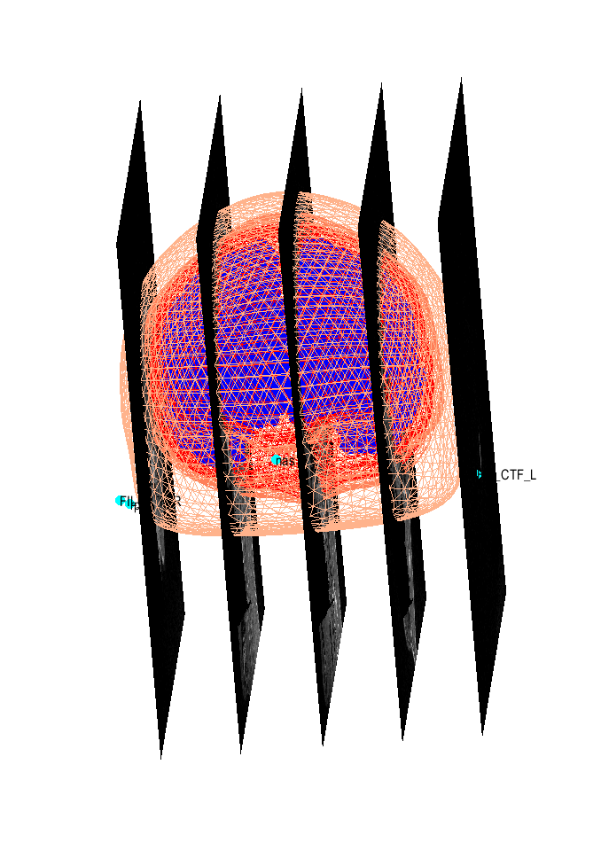
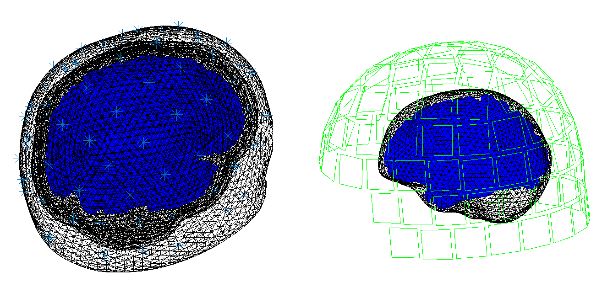
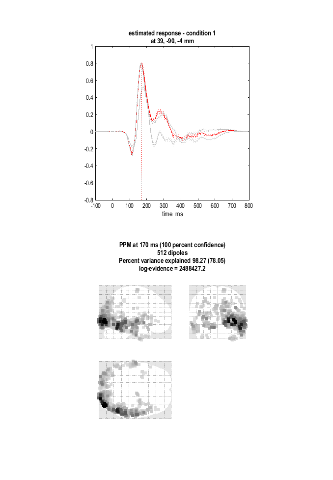
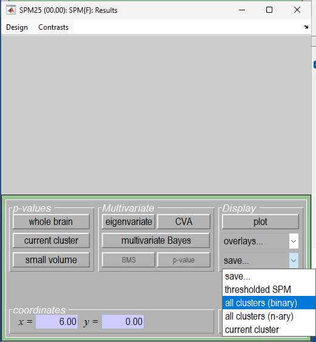

## Source Reconstruction

To estimate the cortical sources that give rise to the EEG and MEG data we will perform source reconstruction (also known as "inverse modelling"). We need to use the structural MRI of the subject to create a "head model" (that defines the cortex, skull and scalp in terms of meshes) and then a "forward model" (that uses a conductor model to simulate the signal at each sensor predicted by a dipolar source at each point in the cortical mesh). This corresponds to an "imaging" or "distributed" solution to the inverse problem.

You can view the structural MRI of your subject by displaying the NIfTI file `sub-XX-T1w.nii` in the `anat` (T1) sub-directory. This image was manually positioned to roughly match Talairach space, with the origin close to the Anterior Commissure. The approximate position of three fiducials within this MRI space—the nasion, and the left and right pre-auricular points—are stored in the file `mri_fids.txt`. These were identified manually (based on anatomy) and are used to define the MRI coordinates relative to the EEG and MEG coordinates, which need to be coregistered (see below).

To estimate total power (evoked and induced) of the cortical sources, we need to have the original data for each individual trial. Therefore our input file will be `apMcbefdspmeeg_run_01_sss.mat` (we could select the trial-averaged file if we just wanted to localise evoked effects). Note that one cannot localise power (or phase) data directly.

### Create Head Model

Select "SPM → M/EEG → Time-frequency → Head model specification". Select the file `apMcbefdspmeeg_run_01_sss.mat` as the "M/EEG datasets", and the inversion index as `1` (this index can track different types of forward models and inverse solutions, for example if you want to compare them). Additional comments relating to each index can be inserted if "comments" is selected.

The next step is to specify the meshes. Highlight "meshes" and select "mesh source". From here select "Individual structural image" and select the `sub-XX-T1w.nii` in the `anat` directory. The mesh resolution can be kept as normal (approximately 4000 vertices per hemisphere). Note that the cortical mesh (and scalp and skull meshes) are created by warping template meshes from a brain in MNI space, based on normalising this subject's MRI image to that MNI brain. This is called the canonical approach. Other software packages use meshes derived directly from the subject's structural MRI. The advantage of SPM's approach is that the cortical meshes for different subjects have the same number of vertices and the same anatomical correspondence across subjects, which makes group analyses easier. The disadvantage is that the meshes may not fit the subject's anatomy as well as those derived directly from the MRI.

To coregister the MRI and M/EEG data, you must select "specify coregistration parameters". First you need to specify fiducials. You will need to select at least three of these, with coordinates in the space of the MRI image selected. Here we will define "Nasion", "LPA", and "RPA". You can do this by loading the MRI and clicking, but here we will use the coordinates provided in the `mri_fids.txt` file described above. For each of the fiducials, specify its label as it appears in the file and the corresponding coordinates (copy and enter the three numbers, via the `Type MNI coordinates` option).

> **Tip** To verify that the fiducials make sense, open the anatomical image via the 'Display/Images' button and paste the fiducial coordinates into the `mm` box of the image viewer. You should see that the crosshairs land on the correct anatomical locations (nasion, left and right pre-auricular points).

As well as the fiducials, a number of head-points across the scalp were digitised. These were read from the FIF file and stored in the SPM M/EEG file. These can help coregistration by fitting them to the scalp surface mesh (though sometimes they can distort coregistration, e.g., if the end of the nose is digitised, since the nose does not appear on the scalp mesh, often because it has poor contrast on T1-weighted MRI images). If you keep "yes" for the "use headshape points" option, these points will be used, but you may notice that alignment of the fiducials is not as good (most likely because nose points are pulling it too far forward). Here we will say "no" to the "use headshape points" option so as to rely on the fiducials alone and trust the anatomical skills of the experimenter. (Alternatively, you could edit the headpoints via the command line or a script to remove inappropriate ones, but we will not go into the details here.)

Finally, for the forward model itself, select "EEG head model" and specify this as "EEG BEM"; select "MEG head model" and specify this as "Single Shell". This can then be run. Note that the model parameters are saved, but the gain matrix itself is not estimated until inversion.

### Model Inversion

We will compare two approaches to inverting the above forward model (both within a Parametric Empirical Bayesian framework). The first one is called "Multiple Sparse Priors" (MSP), which is a novel approach unique to SPM. This corresponds to a sparse prior on the sources, namely that only a few are active. Go back to the batch editor and select "M/EEG → Source reconstruction → Source Inversion". Use the `Dependency` button to specify the input of the module as the output of the previous module and set the inversion index to `1`.

Highlight "what conditions to include" and select "All". Next highlight inversion parameters, choose "custom" and set the inversion type to "MSP (GS)". This is one of several fitting algorithms for optimising the MSP approach: Greedy Search (GS). Then enter the time window of interest as `[-100 800]` and set the frequency window of interest to `[0 256]`. Select "yes" for the "PST Hanning window". Keep all remaining parameters at their defaults, including the Modalities as "All" (which will simultaneously invert, or "fuse", the data from MEG and EEG).

The second type of inversion we will examine corresponds to a L2-minimum norm (MNM), i.e., fitting the data while minimising the total energy of the sources. In SPM, this is called "IID" because it corresponds to assuming that the prior probability of each source being active is independent and identically distributed (i.e., an identity matrix for the prior covariance). Go back to the batch editor, add another "M/EEG → Source reconstruction → Source Inversion" module, and select the input files as before as the output of the previous inversion module but set the inversion index to `2`, so that the new inversion can be added to the MSP solution. Set the inversion parameters to "custom", but the inversion type to be "IID". The remaining parameters should be made to match the MSP (GS) inversion above.

> **Tip** You can slightly speed things up by right-clicking on the `Source Inversion` module in the module list on the left, selecting `Replicate module`, and then just changing the inversion type and index.

### Time-frequency contrasts

Here we are inverting the whole epoch from -100 to +800 ms (and all frequencies), which will produce a time course for every single source. If we want to localise an effect within the cortical mesh, we need to summarise this 4D data by averaging power across a particular time–frequency window. To do this, select "M/EEG → Source reconstruction → Inversion Results". Specify the input as dependent on the output of the source inversion, and set the inversion index to `1`.

Based on the results of the group sensor-level time-frequency analyses, set the time window of interest to `[100 250]` and the frequency window of interest to `[10 20]`. For the contrast type, select "induced" from the current item window. This will project the source activity of each trial on a set of wavelets corresponding to the time and frequency windows specified and average the power across trials. So the localised power will include both evoked and induced activity. This is source localisation corresponding to the "Time-frequency" analysis we did previously. Conversely, if you keep the frequency window as the default `[0 0]` and set the contrast type to "evoked", this will average across trials first and then across time using a Gaussian weighting function centered at the time window of interest, to produce a contrast of evoked power. This contrast corresponds to the "Evoked" analysis we did previously. You can try this option as well and compare the results to the induced contrast.

Set the output space as "MNI". Then replicate this module to produce a second "Inversion Results" module, simply changing the index from `1` to `2` (i.e., to write out the time–frequency contrast for the MNM (IID) as well as the MSP (GS) solution).

Now the source power can be written in one of two ways: (1) as a volumetric NIfTI "Image", or (2) as a surface-based GIfTI "Mesh". The source data are currently represented on the cortical mesh, so writing them to a volumetric image involves interpolation. We will choose the "Image" option so that we can treat the resulting contrast images in the same way that we do MRI images and use 3D Random Field Theory (RFT) for voxel-wise statistics.

### Save batch and review

You can now save this inversion batch file (it should look like `batch_localise_job.m`). Once you have run it, you can explore the forward model by pressing the `3D Source Reconstruction` button within the SPM Menu window. This will open a new GUI window, in which you can select "Load" and choose the `apMcbefdspmeeg_run_01_sss.mat` file. On the left-hand side of the "source localisation" window, select the "display" button below the "MRI" button. This will bring up the scalp (orange), inner and outer skull (red) and cortical (blue) meshes of your subject's brain, as shown in the figure below.

*Figure: Head model meshes compared with slices from the MRI. Note that the fiducials are shown by cyan disks.*

The meshes are plotted together with slices from the structural image. The main thing to check here is that the meshes have a sensible shape and are well aligned with the MRI.

You can also try pressing the "display" button beneath the "Co-register" and "Forward Model" buttons to look at the head models and sensor plots. The things to check there are that the EEG and MEG sensors are in sensible positions with respect to the head.

*Figure: Forward models for EEG (left) and MEG (right).* 

Note that the EEG sensors are on the scalp surface, whereas the MEG head model is located more or less in the centre of the MEG sensor array, as expected.

We can also use the same tool to look at the inversion results. The latest inversion index will be shown (2 in this case), which corresponds to the IID inversion. Press the `mip` button below the "Invert" button, and you should see something like the figure below.

*Figure: IID inversion results.*

The top plot shows the evoked responses for the three conditions from the peak vertex (at +39 -90 -4) at 170 ms, with the red line being the currently selected condition, here "1" for Famous faces (press the "condition" button to toggle through the other conditions). 

The `ms or mm` input box can be used to explore different parts of the solution. If you input a single number in it and press `mip` the number will be treated as a time in milliseconds and the maximum intensity projection (MIP) will be shown for that time point. If you input three numbers separated by commas, e.g. `40, -66, 46`, these will be treated as MNI coordinates and the time course from the vertex closest to those coordinates will be shown in the top plot. If you input two numbers (e.g. `100 250`) and press `mip`, these will be treated as a time window in milliseconds and a movie will be shown of the power changes in this time window.

Finally, you can also try the `render` button that will open another tool to visualise the source activity on a 3D rendering of the cortical mesh and compare it with the corresponding scalp maps.

If you press "display" under the "Window" button, you can see a MIP for the time–frequency contrast limited to the 100–250 ms, 10–20 Hz window specified above. Note that the bottom plot shows the set of wavelets corresponding to this contrast that were used to summarise the source activity. If you press "display" under the "Image" button, you will see the output source image overlaid on the structural MRI.

If you press the `previous` button, you can select the previous inversion (1), which here corresponds to the MSP inversion. Press the `mip` button again, and you should see results that are sparser and deeper inside the brain, in medial and anterior temporal cortex. This solution actually has a higher model evidence (even though it explains a smaller percentage of the data variance) because it corresponds to a less complex model. We will compare these two inverse solutions in a different way when we do group statistics later.

## fMRI priors for source reconstruction

We can also use fMRI results as spatial priors for source reconstruction. The idea is that you make the sources that are likely to be active based on the fMRI results 'easier' to include in the solution.

This is done by specifying a binary image (i.e., thresholded statistical map) that indicates which voxels should be included in the prior. This allows us to focus the source reconstruction on regions that are known to be involved in the task, based on fMRI data. You can derive such an image from your previous single-subject fMRI analysis or from the group fMRI contrast maps (e.g. looking at the mean term in the multiple regression model you used for your presentation assignment).

You can generate a suitable image by presenting your statistical results using the `Results` button in the SPM Menu window, selecting the relevant `SPM.mat` file from your fMRI analysis, and then thresholding the resulting statistical map in a way that will selectively show the relevant areas (in this case primary visual and fusiform cortex). You can then save this thresholded image as a binary NIfTI file by selecting `save -- all clusters (binary)` in the interactive window as shown below.

*Figure: Saving a thresholded image.*

The resulting image can then be entered in the `Priors file` field of the `Source Inversion` module in the batch editor.

 

> # Assessment question
>
> ## Exploring Inverse Solution Priors in Source Reconstruction
>
> The M/EEG inverse problem is ill-posed and depends on prior assumptions. Load the evoked response of your subject into the 3D Source Reconstruction interface or use an SPM batch. Compare the following inverse priors:
> - MSP (GS)
> - COH
> - IID
>
>If fMRI results are available, generate a thresholded activation image and incorporate it as a spatial prior using the fMRI priors option. Evaluate the influence of fMRI constraints on each  solution type. Additionally, explore how varying the time window across the peristimulus interval affects source localisation. Present the reconstructed source images and comment on spatial distribution, peak locations, and temporal dynamics across conditions.

