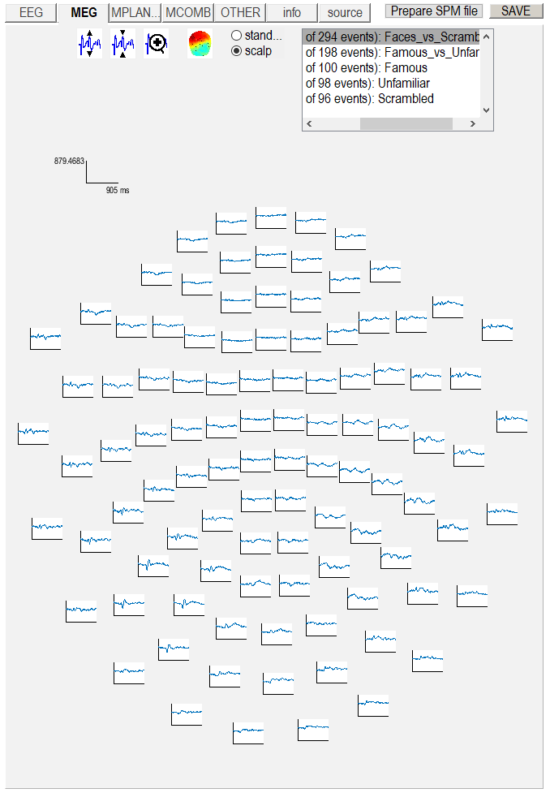
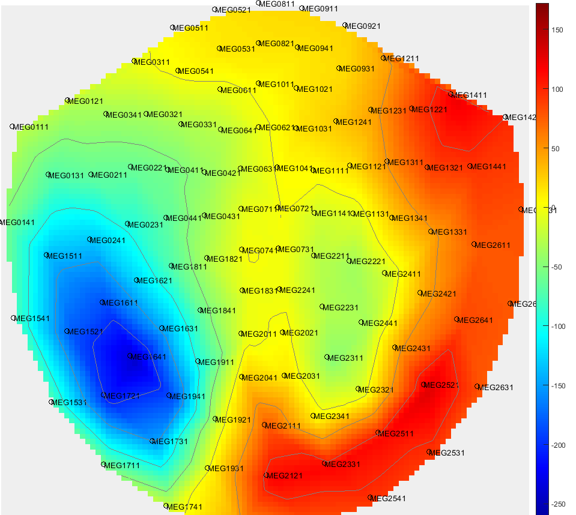
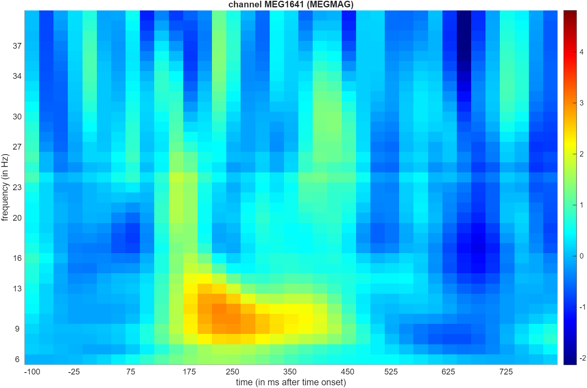
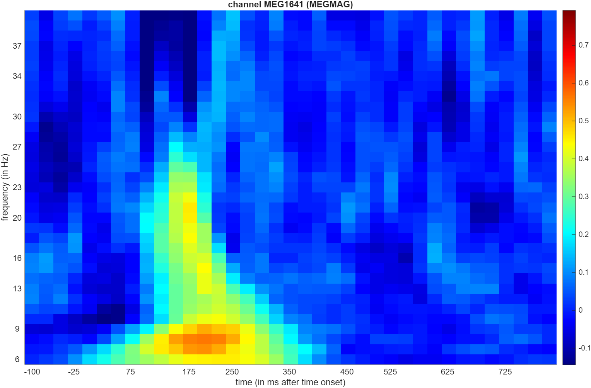
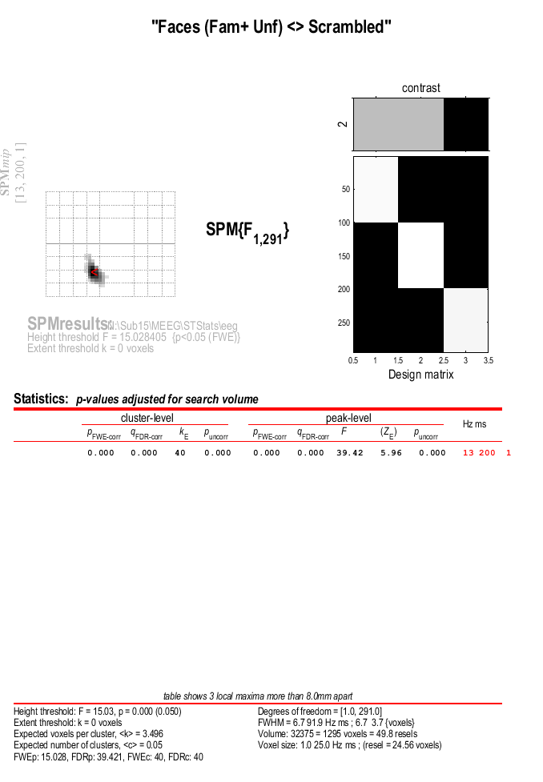
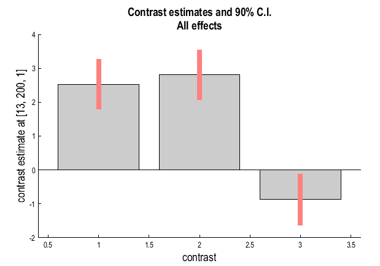
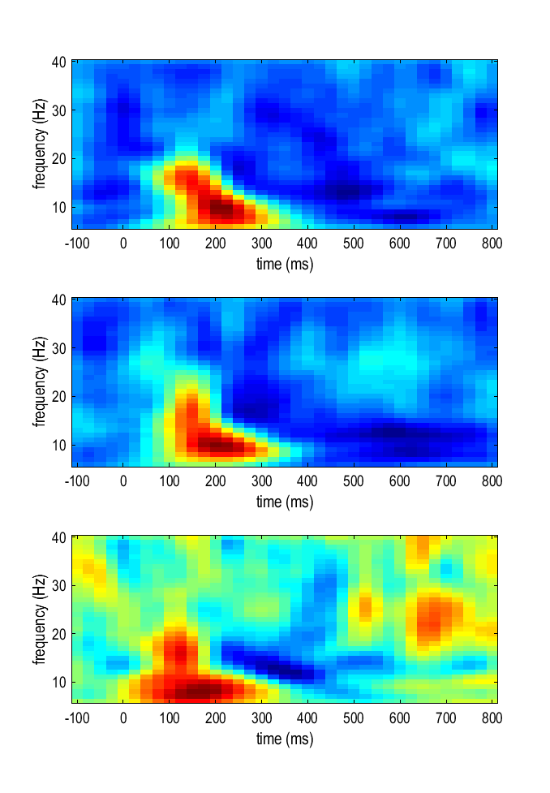

# Multimodal, Multisubject data fusion

## Time-Frequency Analysis (Evoked and Induced power)

The analysis in the previous section only identifies significant evoked effects
(i.e., that are phase-locked across trials) within one individual. We
can also look at combined induced and evoked energy by performing a
time-frequency analysis before averaging over trials. Here we will use
Morlet wavelets to decompose each trial into power and phase across
peristimulus time and frequency. We will then average the power estimate
across trials and across channels, to create a 2D time-frequency image,
which we can then test for reliability.

### Channel selection

For this section, we will look at MEG data and focus on a single channel where we know there is a clear difference between conditions. To find such a channel we'll open the dataset `wmapMcbefdspmeeg_run_01_sss.mat` in the reviewing tool (Display -- M/EEG) and switch to the MEG tab. This tab showes evoked MEG waveforms, which look similar to EEG, just there are more of them since the dataset has 102 magnetometers. Next use the `scalp` toggle button to switch to scalp mode where channels are shown in their approximate scalp locations. In the list of trials on the top right choose 'Faces_vs_Scrambled'. You should see something like the below figure. 

*Figure: Topography of MEG evoked response difference between Faces and Scrambled*

One can see some clear differences at the back of the head corresponding to the bottom of the figure, especially on the left. To look at it in greater detail, press the topograpy button (the coloured button at te top) and scroll to around 170ms with the scrollbar at the bottom of the topography window. Also to inform our channel selection, press the `channel names` button and maximise the figure size to see the channel names more clearly. You should see something similar to the next figure.

*Figure: MEG evoked response difference between Faces and Scrambled.*

Based on this image, it appears that channel `MEG1641` would be a good choice for our time-frequency analysis, as it shows a clear difference between conditions. But in your subject you might get a different result, so feel free to also look at other responses and times and select a different channel you find interesting. Just make sure to note its label and the justification for your choice in your lab book.

### Wavelet estimation

The first module to be added to the pipeline is the "Time-Frequency
Analysis" under "SPM -- M/EEG -- Time-frequency". Highlight "File Name",
choose "Specify" box, and select the file `Mcbefdspmeeg_run_01_sss.mat`.
This file has not yet been cropped because we need the 400ms buffer to
reliably estimate the lower-frequency wavelets (in fact, for a 5-th
order 6Hz wavelet, one needs 2.5 periods = 2.5*133ms<400ms 
to reliably estimate power at the central
timepoint). Note that this file does not have artifacts removed, but most
of these identified for the evoked analysis above are blinks, which
are typically below ~3Hz, i.e., below the lowest frequency
of interest here.

Next, for `Channel selection` delete `all` and add `Custom channels` specifying `MEG1641` or another name you chose based on inspecting your data. Highlight the
"Frequencies of interest", click "Specify" and enter `6:40` (which will
estimate frequencies from 6 to 40Hz in steps of 1Hz). Then highlight
"Spectral estimation" and select "Morlet wavelet transform". Then
highlight "Number of wavelet cycles" and "Specify" this as `5`. The
fixed time window length should be set at `0` as default. To reduce the
size of the file, we will also subsample in time by a factor of 5 (i.e.,
every 25ms, given the additional downsampling to 5ms done earlier in
preprocessing). Do this by selecting "subsample" and "Specify" as `5`.
Finally, select "Yes" for "Save phase". This will produce two files, one
for power (prefixed with `tf`) and one for phase (prefixed with `tph`).

### Crop

Once we have estimated power and phase at every peristimulus timepoint,
we can cut the 400ms buffer. So add the "SPM -- M/EEG -- Preprocessing
-- Crop" module (like for the evoked analysis). This module will have to
be added twice though, once for power and once for phase. For the first
module, select the power file as the dependency, and enter `[-100 800]`
as the timewindow. Then select "replicate module", and change only the
input dependency to the phase file.

### Average

As with cropping, we now need to add two averaging modules, one with
dependency on the power file from the Crop step, and the other with
dependency on the phase file from the Crop step. For the power
averaging, choose straight averaging. For the phase averaging however,
we need to additionally select "Yes" to the "Compute phase-locking
value". This corresponds to "circular" averaging, because phase is an
imaginary number. This produces a quantity called the phase-locking
value (PLV). The prefix will be `m` in both cases.

### Baseline rescaling

To baseline correct time-frequency data, we need to select the
"Time-Frequency Rescale" option from the "Time-Frequency" menu (note:
not the "Baseline Correction" module from the "Preprocessing" menu).
There are several options to baseline-correct time-frequency data. For
the power, it also helps to scale the data with a log transform, because
changes at high-frequency tend to be much smaller than changes at lower
frequencies. We will therefore use the log-ratio ("LogR") option, where
all power values at a given frequency are divided by the mean power from
-100 to 0ms at that frequency, and the log taken (which is equivalent to
subtracting the log of the baseline power). So select the power file
output from the previous phase as the dependency, select the log ratio
option, and enter the baseline time window as `-100 0`. The output file
prefix will be `r`. We won't bother to baseline-correct the phase-data because PLV is already a relative measure (ranging from 0 to 1).

The steps above will produce one result per subject that we can examine visually
but cannot run statistics on (unless we pool our results across the class and treat subjects as replications, which we'll do at a later stage). In case of PLV, it is unavoidable as the measure itself is only defined across trials. Power, however, is defined per trial. So we will add another "Time-Frequency Rescale" module to produce baseline-corrected single trials that we can use for within-subject statistics. This time, select the power file output from the Crop step as the dependency (the first Crop module), select the log ratio option, and set the `Pool baseline across trials` option to `Yes`. The idea here is that using the baseline of each individual trial would introduce additional noise, whereas pooling the baseline across trials gives a more stable estimate of the baseline power. 

### Contrasting conditions

Finally, like with the evoked fork, we can take contrasts of our
trial-averaged data, e.g., to create a time-frequency image of the
difference in power, or in PLV, between faces and scrambled faces.
Create two "SPM -- M/EEG -- Average -- Contrast over epochs" modules,
one with the average power file as input, and one with the averaged
phase (PLV) file as input. You can then select "New Contrast" and enter
contrasts like `[0.5 0.5 -1]` (for faces vs scrambled; see earlier) and
`[1 -1 0]` (for famous vs unfamiliar), as well as contrast to retain the original conditions. It might be a good idea to enter the contrasts first and then replicate the module to apply it to PLV. The resulting output files are prepended with `w`.

As before, if you want to save file-space, you can add further "Delete"
modules, since we will not need many of the intermediate files. The only
files we need to keep are the rescaled epoched file, and the contrasted
versions (for visual inspection of effects within each subject).

### Save batch and review.

You can now save this time-frequency batch file as
`batch_preproc_meeg_tf_job.m`.
Once you have run it, you can then review the contrast files, e.g, for
power (`wrmptf_Mcbefdspmeeg_run_01_sss.mat`) or phase
(`wmptph_Mcbefdspmeeg_run_01_sss.mat`). When displaying the power for the
MEG, you should see something like the following Figure.

*Figure: MEG single channel time-frequency power contrast between Faces and Scrambled.*

The increase in power from 13 to 16Hz between 75 and 200ms is most likely the evoked energy corresponding to the N170, but additional power changes can
be seen that may not be so phase-locked (i.e. induced). This is
supported by looking at the difference in PLV for that channel.

*Figure: MEG single channel time-frequency PLV contrast between Faces and Scrambled.*

Here faces increase phase-locking relative to scrambled faces in a similar time-frequency window (suggesting a change in phase of ongoing alpha oscillations, as well as their power). This kind of phase-locked changes will be reflected in the evoked responses as well.

> # Assessment question
>
> ## Time-Frequency Analysis and Spectral Resolution Trade-offs
>
> Choose one channel with a well-defined response. Set up a batch pipeline with the following steps:
> - Time-Frequency Analysis (choose Multi-taper or Morlet wavelet)
> - Average
> - Time-Frequency Rescale (use the log option, or LogR as in the main analysis)
> - Display
>
> Systematically vary the spectral analysis settings (e.g. time window length, number of cycles, frequency range, frequency smoothing). After each change, rerun the pipeline and save the resulting plots. Comment on
>
> - How changes affect temporal and frequency resolution
> - Which spectral features are enhanced or suppressed
> - The impact on the interpretation of the results

### Creating 2D time-frequency images

We will now create a statistical parametric map of power changes across subjects, in order to localise face-induced power changes in frequency and time. This requires that we create 2D images, one per trial, similarly to the evoked case. Select the "SPM -- M/EEG -- Images -- Convert2images" option and select the baseline-rescaled epoched power file `rptf_Mcbefdspmeeg_run_01_sss.mat`.
Select the mode "time x frequency". You can keep 'All' for "Channel selection" as there is only one channel in the dataset. Define the prefix as `meg_img_pow_`. Specify `Condition`, 'Famous'. Now, replicate the module twice more, changing only the `Condition` to 'Unfamiliar' and 'Scrambled' respectively. Save the batch as `batch_meg_tf_images.m`.

## Time-frequency Stats across Subjects

We can now reuse the ANOVA batch we previously specified for the evoked analysis.To do that, press the `Open` button and select `batch_meg_tf_images.m` followed by `batch_stats_meeg_anova.m`. You should click on the two files one after the other in this order so that they both appear in the selection box and then press `Done`. This will concatenate the module lists from the two batches. Now we need to make some updates to generate the new time-frequency batch.

* Click to the `Smooth` modules and change `Images to smooth` to a dependency from the corresponding `Convert2images` module. 
* Change the smoothing FWHM to fit the time-frequency case. We can now base our choice on the previously discussed matched filter idea. If we look at the above figures showing average power response, perhaps 2Hz and 50 ms would be a good starting point, but you can also try other values and will have a chance to do it later in an extended exercise. At this stage enter `[2 50 1]` as the FWHM (there is no third dimension, but SPM requires a 3D value). Repeat this for all the three `Smooth` modules.
* Next, go to the `Factorial design specification` module. Change the output directory to 'TFStats/meg' (you will have to create these folders first and don't forget to remove the previous selection). 

Save the batch as `batch_stats_meeg_tf_anova.m` and run it.

### Reviewing the results

When the batch has finished, you can review the results by clicking the `Results` button and selecting the file `SPM.mat` in the `TFStats/meg` folder. You can select the second contrast (Faces (Fam+Unf)<>Scrambled), select `none`, `FWE`, 0.05, 0 and `time-frequency` in the interactive menu. You should then see an effect similar to the one below. 

*Figure: MEG time-frequency power ANOVA result for Faces vs Scrambled.*

If you now click on the right side of the top row in the results table to bring the cursor to the peak, you can press the `plot` in the small interactive window of SPM, select `Contrast estimates and 90% CI` and then `All effects`. You should get a plot like the one below showing the average power for each condition separately at the peak.

*Figure: MEG time-frequency power ANOVA contrast estimates.*

> **Tip** You can use the tool "Display -- TF images" to view the time-frequency images generated as part of the GLM estimation. For instance, the figure below shows the images
>
> - beta_0001.nii
> - beta_0002.nii
> - beta_0003.nii
>
> Corresponding to the three conditions (Famous, Unfamiliar, Scrambled). You can also review the other images in the folder to try to understand how they relate to the final result.
> 
> *Figure: MEG time-frequency power images for the three conditions.*

> **Tip** Compare your result to that of your fellow students working on other subjects to get an idea of the variability across the cohort.

