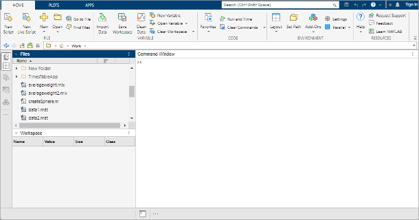

## Desktop Basics

To start Matlab in a UCL terminal go to `UCL Applications Store`
and type `matlab` in the search bar. Select `Matlab 2025a`.
When you start MATLAB®, the desktop appears in its default
layout.



The desktop includes these areas:

* Files panel — Access your files.
* Workspace panel — Explore data that you create or import from
  files.
* Command Window — Enter commands at the command line, indicated by the
  prompt (`>>`).
* Sidebars — Access tools docked in the desktop and additional
  panels.


# Some things to know before doing anything

### How to navigate within a folder:

- `>> pwd` … present working directory
- `>> dir` (or `>> ls`) … what folders (or files) are in this directory
- `>> cd ..` … move up one directory from here
- `>> mkdir Data` … make a new folder named "Data" in the current directory
- `>> cd Data` … change directory into the folder “Data” within this directory
- `>> cd ../Students` … move up one directory then into “Students” within that directory


## Variables
- Their names can be a mix of letters and numbers but they begin with a letter
- Their names are case sensitive
- Their names must be no longer than 31 characters in length
- They can be:

    - A string
    - A scalar
    - A vector
    - A matrix…

- Their ‘index’ starts at 1

Create a string, a scalar, and a vector as follows:

```matlab
MyString = 'I am learning Matlab';`
MyScalar = 6;
MyVector = [1,2,3];
MyMatrix = [1,2;3,4];
```

## Arrays

In Matlab, the variable we referred to as a vector can also be simply a list of numbers, known as an array.

Create an array with ‘elements’ increasing from -4 to +4 in increments of 0.01.

```matlab
MyArray = -4:0.01:4;
```

How many elements do you think there are in this array? Note: Each element can be ‘indexed’. By using indexing, what is the 230th element of MyArray? Use Matlab to find out the dimensions of your three vectors and this new array using the function `size` (type help size if you want to know how).

## Functions

The concept of a function describes how one quantity (the input) determines the value of another (the output) e.g., The quantity y is a function of the quantity x. This concept is used all the time in Matlab. We are going to use a function from the library to create several data sets and plot them on the same graph.

Multiply your array by π to create a new array with numbers running from -4π to 4π.

```matlab
MyInput = pi*MyArray;
```

This array will help us plot two complete periods either side of zero with a period 2π. The first function is simply a sine function:

```matlab
sinY0 = sin(MyInput);
```

The second is a cosine:

```matlab
cosY0 = cos(MyInput);
```

A third is a sine function that is π/6 radians out of phase with the first:

```matlab
sinY0a = sin(MyInput - pi/6);
```

A fourth is a sine function that has twice the frequency of the first – 1st harmonic!

```matlab
sinY1 = sin(2*MyInput);
```

You can recall previous commands by pressing the up- and down-arrow
keys, ↑ and ↓. Press the arrow keys either at an empty
command line or after you type the first few characters of a command.
For example, to recall the command `MyInput = pi*MyArray`, type `M`,
and then press the up-arrow key.

### How to get some help

- `>> help <functionName>` … gives a brief description of a function called functionName
- `>> doc <functionName>` … returns a complete description of functionName

Get help about the function `plot` and document this in your lab-book.

## Plotting
The plot function can be used in quite a sophisticated fashion to plot several data sets on the same axis in different colours and different line-types. Axes can be labelled and the graph can be titled – experiment with this because it can make your thesis or papers look great!

Use the help function to find out more about the plot function and decide on the best way to represent the data you’ve created (e.g., hold on). Create some further data with different frequencies and phase differences and add some together. Comment in your workbook on the relative phase of each of these and how that affects the summation.

## Editor

The Matlab editor is a powerful tool for writing and debugging scripts and functions. You can open the editor by by selecting `New Script` from the `Home` tab in the toolstrip or by switching to the `Editor` tab and clicking on `New` and selecting `Script` from the dropdown menu.

- Create a new script and copy all the commands above into it.
- Save the script with a meaningful name, such as `my_first_script.m`.

### Comments

Any line starting with % is a comment and will not be executed. Comments are useful for explaining what your code does or for leaving notes for yourself or others who may read your code later.

- Add comments to your script to explain what each section of code does.

### Cells

You can divide your script into sections called cells. Each cell can be executed independently, which is useful for debugging and testing parts of your code without running the entire script.  To create a cell, add a line with `%%` at the beginning. For example:

```matlab 
%% Create an array
MyArray = -4:0.01:4;
```

You can run a cell by clicking the `Run Section` button in the editor toolbar or by pressing `Ctrl + Enter`.


### Copilot

Matlab Copilot is a built-in large language model (LLM) that can help you write code and explain bits of code that someone else wrote as well as error messages. It is available in Matlab versions 2025a and later so if you are using an older Matlab, you will not find it there. To open Copilot, click on the Copilot icon in the top right corner of the Matlab window.


 
 A Copilot Chat window will open that works similarly to ChatGPT and other LLMs you might already be using, except it's more knowledgeable about Matlab programming. You can ask Copilot questions about your code, and it will try to help you understand it or suggest improvements.

 You can also select a piece of code in the editor, right-click and select `Explain code` from the `Copilot` submenu. An explanation of the code will appear in the Copilot Chat window.

 As you write your code, Copilot will suggest completions and improvements. You can accept these suggestions by pressing `Tab` or clicking on the suggestion. Make sure to review the suggestions carefully, as they may not always be correct or optimal.

 - Repeat the exercise with plotting, asking Copilot for help.
