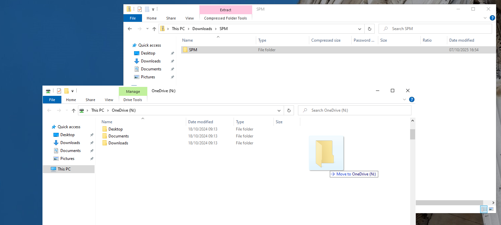
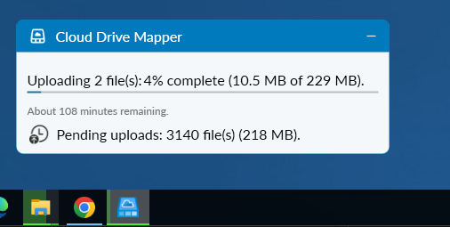

# Introducing SPM

SPM (Statistical Parametric Mapping) is a Matlab toolobox designed for the analysis of brain imaging data such as MRI/fMRI, MEG and EEG. It has been developed by the Imaging Neuroscience methods team at UCL since the early 1990s. SPM provides a set of functions that you can access from the Matlab command line or through a graphical user interface (GUI).

# Installing SPM

To install SPM, you need to download it from the web and let Matlab know where to find it by adding it to the Matlab path.

1. Download SPM.zip file from the link on the course Moodle page (in `Data analysis resources` section).
2. Double-click the downloaded `SPM.zip` file to navigate into it.
3. Drag the `SPM` folder from inside the zip file to your N: drive as shown in the image below.
 


*Figure: Copying the SPM folder to the N: drive*

<!-- 
## Option 2

We will use a program called `Github Desktop` to install SPM in a way that will make it easy to update in the future. 

1. Open `UCL Applications Store` and search for `Github Desktop` in the search bar. 
2. Run `Github Desktop`, when asked to register select `Skip this step`.
3. Provide your UCL email and chosen username at the next screen.
4. Select `Clone a repository from the Internet` and click on `URL` tab.
5. Enter the following URL: `https://github.com/spm/spm.git`
6. For the local path, select your N: drive's root directory (i.e., `N:\spm`).
7. Click `Clone` and wait for installation to complete which may take a few minutes.
-->

# Adding SPM to the Matlab path

* Once the installation is complete, open Matlab and type the following command in the command window:

```matlab
   addpath('N:\spm');
```

* To make this change permanent, you can save the path by typing:

   ```matlab
    fid = fopen('N:\Documents\MATLAB\startup.m','w');
    fprintf(fid, 'addpath(''N:\\spm'');');
    fclose(fid);
   ```
   
   > **Tip:**  
   > If you extracted your SPM folder to a different location, update the path in both code segments. Use double backslashes (`\\`) in the `startup.m` file.  
   >  
   > For example, if your folder is at `N:\Documents\Matlab\spm`, use:
   > 
   > ```matlab
   > addpath('N:\Documents\Matlab\spm');
   > fid = fopen('N:\Documents\MATLAB\startup.m','w');
   > fprintf(fid, 'addpath(''N:\\Documents\\Matlab\\spm'');');
   > fclose(fid);
   > ```


* To check that SPM is installed correctly, restart MATLAB and type the following command in the Matlab command window:

   ```
   spm fmri
   ```
If SPM is installed correctly, this command will open the SPM graphical user interface (GUI) for fMRI analysis.


*Figure: SPM (Statistical Parametric Mapping) software graphical user interface (GUI) for fMRI analysis*


# Important tip: Cloud Drive Mapper issue

There is an issue that could prevent your SPM from working properly if you log out from the system and log back in again. The issue happens because all the files that you put on your N: drive need to be uploaded to the cloud to be available to you in the future and this takes time. Because SPM has over 5,000 files, it may take a long time. 

We are looking for a workaround but what we suggest you do in the meantime if you run into problems is repeat all the above steps when logged in from home or at least when you are not short on time and make sure that the upload has completed before you log out. 

This can be seen by clicking on the Cloud Drive Mapper icon in the system tray. You should see something like the below figure



*Figure: Cloud Drive Mapper still uploading files*

Wait as long as it takes until all files are uploaded before logging out.

>**Important:** The same could be true for data SPM generates when you work on your assignments. To prevent data loss make sure that nothing is being uploaded when you log out.

