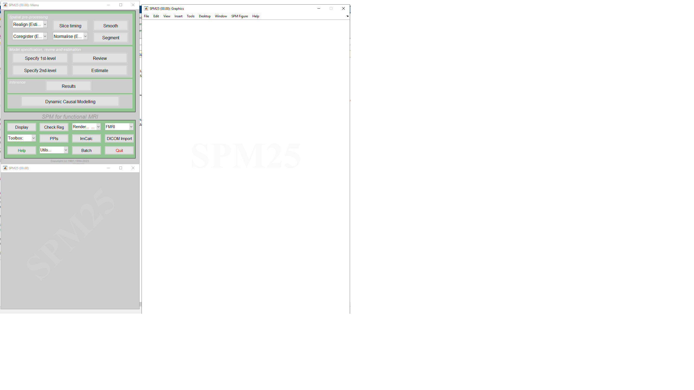

# Introducing SPM

SPM (Statistical Parametric Mapping) is a Matlab toolobox designed for the analysis of brain imaging data such as MRI/fMRI, MEG and EEG. It has been developed by the Imaging Neuroscience methods team at UCL since the early 1990s. SPM provides a set of functions that you can access from the Matlab command line or through a graphical user interface (GUI).

# Installing SPM

To install SPM, you need to download it from the web and let Matlab know where to find it by adding it to the Matlab path. We will use a program called `Github Desktop` to install SPM in a way that will make it easy to update in the future. 

1. Open `UCL Applications Store` and search for `Github Desktop` in the search bar. 
2. Run `Github Desktop`, when asked to register select `Skip this step`.
3. Provide your UCL email and chosen username at the next screen.
4. Select `Clone a repository from the Internet` and click on `URL` tab.
5. Enter the following URL: `https://github.com/spm/spm.git`
4. For the local path, select your N: drive's root directory (i.e., `N:\spm`).
5. Click `Clone` and wait for installation to complete which may take a few minutes.
6. Once the installation is complete, open Matlab and type the following command in the command window:

   ```
   addpath('N:\spm');
   ```
7. To make this change permanent, you can save the path by typing:

   ```
   savepath(fullfile('N:\Documents\MATLAB', 'pathdef.m'));
   ```
8. To check that SPM is installed correctly, type the following command in the Matlab command window:

   ```
   spm fmri
   ```
If SPM is installed correctly, this command will open the SPM graphical user interface (GUI) for fMRI analysis.



*Figure 1: SPM (Statistical Parametric Mapping) software graphical user interface (GUI) for fMRI analysis*