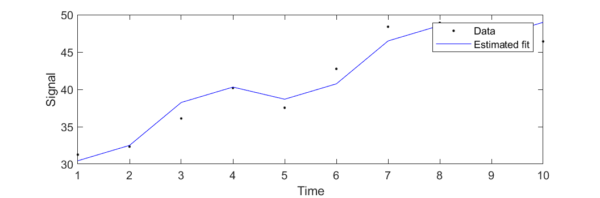
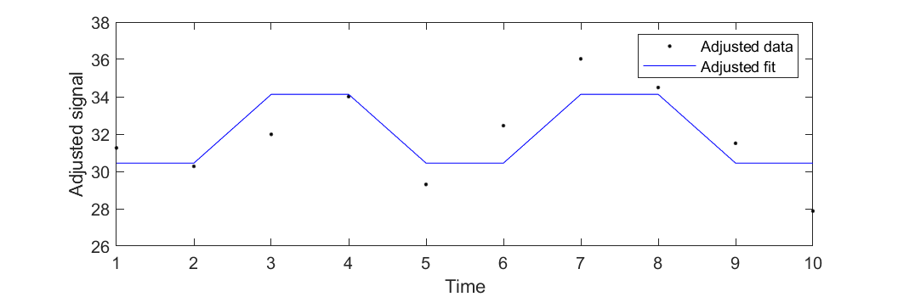

# Linear Modelling and Statistical Tests

## A Simple Simulated Example
Consider a simple linear model with two conditions and a linear effect that varies over (e.g.) time.
In the example below, we let the first column encode the baseline, the second columns encodes the task, and the third column is some linear effect of time.
Any haemodynamic effect is ignored to keep things simple.
Try copy/pasting the following into MATLAB.
```matab
X = [[ones(2,1) zeros(2,1)
      zeros(2,1) ones(2,1)
      ones(2,1) zeros(2,1)
      zeros(2,1) ones(2,1)
      ones(2,1) zeros(2,1)] (0:9)']
```
This will give a matrix that looks like
```
X =

     1     0     0
     1     0     1
     0     1     2
     0     1     3
     1     0     4
     1     0     5
     0     1     6
     0     1     7
     1     0     8
     1     0     9
```

When we fit a linear model, we consider that the model explains how the data were generated.
If we assume independent and identically distributed (i.i.d.) Gaussian noise, then the model of the data ${\bf y}$ is

$$
{\bf y} = {\bf X} {\beta} + {\epsilon} \text{,  where } {\epsilon} \sim \mathcal{N}({\bf 0}, \sigma^2 {\bf I})
$$

In the above, the ${\epsilon} \sim \mathcal{N}({\bf 0}, \sigma^2 {\bf I})$
indicates that ${\epsilon}$ comes from a zero-mean i.i.d. Gaussian (normal) distribution where the variance is $\sigma^2$.
We can generate some simulated data (``y``) according to this model, where we use ${\beta}$ values of 30.0, 35.0 and 2.0
and a variance of 4.0.

In MATLAB, i.i.d. Gaussian random values with a variance of 1 can be created using the ``randn()`` function.
To give the values a variance of 4, we multiply the random numbers by the standard deviation (the square root of the variance).
The following snippet can be copy/pasted into MATLAB to simulate some data according to our model.
```matlab
beta_gt = [30; 35; 2];
v_gt    = 2.3;
y       = X*beta_gt + randn(10,1)*sqrt(v_gt);
```

## Estimating Model Parameters
We can estimate the ``beta`` values from the simulated data as we would for real data.
```matlab
beta = X\y
```
After fitting a model like this in SPM, a set of `beta_0001.nii`, `beta_0002.nii` and `beta_0003.nii` images are created that encode
the estimated ``beta`` values at each voxel.

We can also estimate the variance of the data by computing it from the residuals.
This needs the degrees of freedom, which are computed from the length of ``y`` minus the rank of the design matrix ``X``.
This rank is the number of linearly independent columns (or rows), which in this case is 3.
```matlab
nu = size(X,1) - rank(X); % Degrees of freedom
r  = y - X*beta;          % Residuals
v  = sum(r.^2)/nu
```
If you copy and paste the above snippets into MATLAB, you will see that the estimates (``beta`` and ``v``)
are similar to, but not identical to the ground truth (``beta_gt`` and ``v_gt``).

When a statistical analysis is run in SPM, a file entitled `ResMS.nii` is created, which contains information about the variance estimated at each voxel.

## Plotting
We can plot the (simulated) data, along with the model fit, by
```matlab
plot((1:10)', y, 'k.',  (1:10)', X*beta, 'b-')
xlabel('Time')
ylabel('Signal')
legend('Data','Estimated fit')
figure(gcf)
```



A plot of the data and model fit might be clearer without the linear trend in signal intensity.
We can adjust what is plotted by subtracting the estimated linear trend.
This is similar to what SPM does when plotting adjusted data.
```matlab
y_adj   = y - X(:,3)*beta(3);
fit_adj = X(:,1:2)*beta(1:2);
plot((1:10)', y_adj, 'k.',  (1:10)', fit_adj, 'b-')
xlabel('Time')
ylabel('Adjusted signal')
legend('Adjusted data','Adjusted fit')
figure(gcf)
```



## Contrast Vectors and Statistics
With fMRI, what we are typically interested in is the difference between BOLD signal during the task and BOLD signal during the baseline.
This can be computed from the estimated ``beta``, and is simply ``beta(2)-beta(1)``.
Another way to think about this is as ``-1*beta(1) + 1*beta(2) + 0*beta(3)``.
The weights ``[-1 1 0]`` give us the linear combination of ``beta`` values that are relevant to our question.
We call this a "contrast vector". If this is called ``c``, then the linear combination of ``beta`` values is given by
```matlab
c   = [-1 1 0];
con = c * beta
```
In SPM, the above would generate a `con_???.nii` file that contains the specified linear combination of ``beta`` values.

### T Statistic
p values are based on probabilities of observing the data under the null hypothesis.
With one sided t tests, this would be the probability of obtaining a value of ``con`` as high or higher than
the one actually obtained.
To do this, we need ``c * beta``, as well as the estimated standard deviation of ``c * beta`` (the standard error).
If we divide one by the other, we obtain the t statistic.
```matlab
t = (c * beta) / sqrt(v * c * inv(X'*X) * c')
```
Without any correction for multiple comparisons, we can obtain the p value for this t statistic by
```matlab
p = spm_Tcdf(-t,nu)
% or
p = 1-spm_Tcdf(t,nu)
```

As we will be doing something similar many times, I suggest creating a MATLAB function to do this.
Create a file called ``t_stat.m`` somewhere on MATLAB's search path, which contains the following:
```
function [p, t] = t_stat(y, X, c)
% Compute t statistics
% FORMAT [p, t] = t_stat(y, X, c)
% y - data
% X - design matrix
% c - contrast vector
% p - p value
% t - t statistic

% Error checking
assert(ndims(y)<=2 && ndims(X)<=2 && size(y,1)==size(X,1),...
       'Lengths of data and design matrix do not match.')
assert(ndims(c)<=2 && size(c,1)==1 && size(c,2)==size(X,2),...
       'Length of contrast vector does not match the number of design matrix columns.')
assert(size(X,1)>rank(X),...
       'Over-determined design matrix.')

% Things computed via SPM's Estimate button
nu   = size(X,1) - rank(X); % Degrees of freedom (saved in SPM.mat)
beta = (X'*X)\X'*y;         % Beta values (beta_XXXX.nii files)
r    = y - X*beta;          % Residuals
v    = sum(r.^2)/nu;        % Variance (ResMS.nii)

% Things computed once the contrast vector is specified
con  = c*beta;              % Contrast (con_XXXX.nii)
tmp  = c*inv(X'*X)*c';
t    = con./sqrt(v*tmp);    % T statistic (spmT_XXXX.nii)
p    = spm_Tcdf(-t,nu);     % P value
```

Once the above text has been saved in a file (that MATAB can find), you can run it by typing the following:
```matlab
[p,t] = t_stat(y,X,c)
```

Note that we could use a slightly different formulation of the design matrix (`X1`) and contrast vector (`c1`), and that these give the same t statistics and p values.
Both of these types of approach are routinely used in SPM.
```matlab
X1 = [X(:,1)+X(:,2), X(:,2)-X(:,1), X(:,3)]
c1 = [0 1 0]
[p,t]   = t_stat(y,X,c)
[p1,t1] = t_stat(y,X1,c1)
```


### F Statistic
F tests are a bit harder to explain than t tests.
One concept we need is the idea of a null space.

<details>
<summary>Null space</summary>
First of all, we need to understand orthogonality.
If two row vectors, say ``c`` and ``d``, are orthogonal, then ``c * d' == 0``.
We can try this by copy/pasting the following into MATLAB:
```matlab
d = [1 1 0];
d = d/sqrt(d*d'); % Makes the length of d equal to 1 (Pythagorus)
c*d'

e = [0 0 1];
c*e'
```
We also note that in the above example, ``d * e' == 0``.
Because the vectors contains three elements, they represent directions in 3D and can be visualised by:
```matlab
plot3([-c(1) c(1)],[-c(2) c(2)],[-c(3) c(3)],'k', [-d(1) d(1)],[-d(2) d(2)],[-d(3) d(3)],'c', [-e(1) e(1)],[-e(2) e(2)],[-e(3) e(3)],'m')
axis image
rotate3d on
figure(gcf)
```


If you manually rotate the plot by dragging the cursor around on it, then you should see that there is a right angle between all vectors. 
We can say that ``d`` and ``e`` form the null space of ``c``.
</details>

In MATLAB, we can obtain the null space for ``c`` by ``Cn = null(c)``.
This can be used to remove information related to the contrast of interest from the design matrix by:
```matlab
X0 = X*null(c)
```

An F test is done by comparing the amount of variance in ``y`` that cannot be explained by the full design matrix ``X``,
against how much of it cannot be explained by the reduced matrix ``X0``.
To do this, we need to know the degrees of freedom, which for F tests have two values.
The first is the degrees of freedom in the part of the design matrix of interest (1 in this example).
The second is the same value as for the t test (7 in this example).
```matlab
nu  = [rank(X)-rank(X0), size(X,1)-rank(X)]
```

The residuals and degrees of freedom are used to give two variance estimates:
```matlab
r  = y - X*(X\y);
v  = sum(r.^2)/nu(2)
r0 = y - X0*(X0\y);
v0 = (sum(r0.^2) - sum(r.^2))/nu(1)
```
The first variance estimate (`v`) is computed from the residuals after fitting all columns of the design matrix to the vector of data.
The second variance estimate (`v0`) is effectively computed from the residuals after fitting a restricted subset of columns (using the parts of the design matrix that are unrelated to the question).

The ratio of these two variances gives the F statistic.
```matlab
F = v0/v
```

Similar to the t test, we can compute a p value from this F statistic by
```matlab
p = 1 - spm_Fcdf(F, nu)
```

As we may be running F tests again, I would suggest creating an ``F_stat.m`` file somewhere on MATLAB's search path, which contains the following:
```
function [p, F] = F_stat(y, X, C)
% Compute F statistics
% FORMAT [p, F] = F_stat(y, X, C)
% y - data
% X - design matrix
% C - contrast vector/matrix
% p - p value
% F - F statistic

% Error checking
assert(ndims(y)<=2 && ndims(X)<=2 && size(y,1)==size(X,1),...
       'Lengths of data and design matrix do not match.')
assert(ndims(C)<=2 && size(C,2)==size(X,2),...
       'Width of contrast vector/matrix does not match the number of design matrix columns.')
assert(size(X,1)>rank(X),...
       'Over-determined design matrix.')

% Things computed via SPM's Estimate button
nu2  = size(X,1) - rank(X); % Degrees of freedom (saved in SPM.mat)
beta = (X'*X)\X'*y;         % Beta values (beta_XXXX.nii files)
r    = y - X*beta;          % Residuals
v    = sum(r.^2)/nu2;       % Variance (ResMS.nii)


% Things computed once the contrast vector/matrix is specified
Nc    = null(C);                 % "Null-space" of contrast
X0    = X*Nc;                    % Part of design matrix unrelated to the contrast
nu    = [rank(X)-rank(X0), nu2]; % Degrees of freedom

% Instead of using the following, the variance is computed so that `y` is not involved.
% b0 = inv(X0'*X0)*X0'*y;
% r0 = y - X0*b0;
% v0 = (sum(r0.^2) - sum(r.^2))/nu(1);
v0   = (beta'*(X'*X - X'*X0*inv(X0'*X0)*X0'*X)*beta)/nu(1);

F    = v0/v;                 % F statistic (ratio of two variance estimates)
p    = 1 - spm_Fcdf(F,nu);   % P value
```

Once the above function has been saved in a file, you can run it by typing the following in MATLAB:
```matlab
[p,F] = F_stat(y,X,c)
```

You should notice that the p value given from the F statistic is twice as large as that from the t statistic.
The reason for this is that the t static is based on a one-tailed t test,
whereas the p value from the F statistic is equivalent to that from a two-tailed t test.

More generally though, F contrasts can be defined as matrices.
For example, to assess whether there is a statistically significant amount of variance explained by either the task versus baseline comparison, or the linear drift, then the following contrast matrix can be used:
```matlab
C = [-1 1 0; 0 0 1]
[p,F] = F_stat(y,X,C)
```

