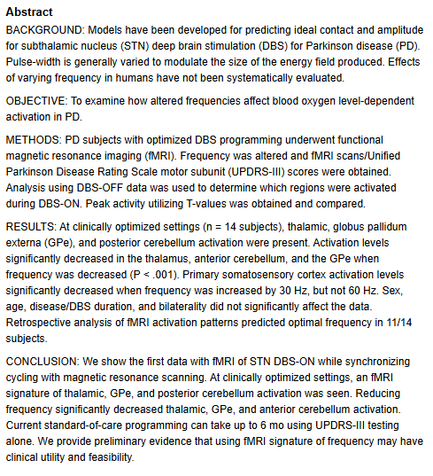
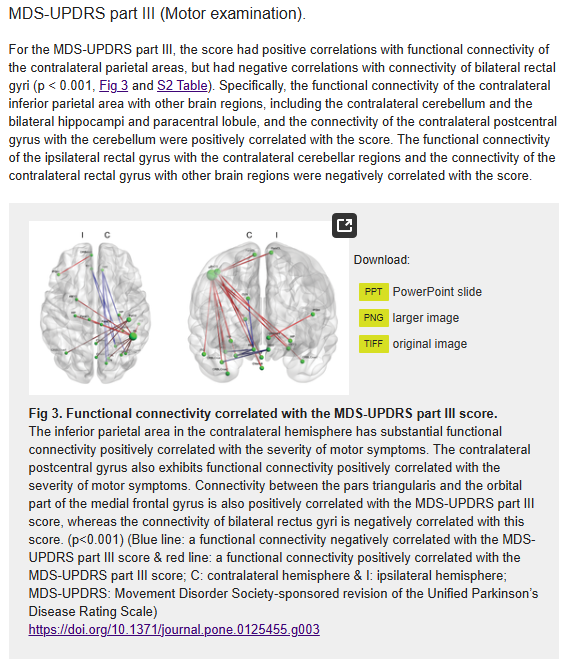
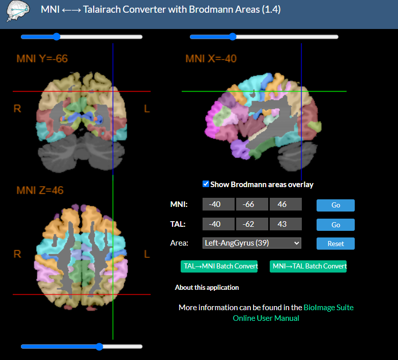

# Preparing the preregistration document

You will be provided with a name of a cognitive or clinical rating scale. Your task is to search the literature to find a few brain areas that are most likely to show BOLD activity correlated with the scores on this scale. You will then write a short preregistration document (max 1 page) describing your hypotheses and listing the region anatomical labels and coordinates.

Let's consider an example where you are given the "Unified Parkinson's Disease Rating Scale (UPDRS) Motor Subscale (part III)". 

You can start with using your favourite AI search tool. Here we will use MS Copilot that you can access via your UCL MS Teams.

I entered the following prompt:

>What brain areas show fMRI correlates of Unified Parkinson's Disease Rating Scale (UPDRS) Motor Subscale (part III)? List the key references. Search the web.

Note that it is important to enable web search in the AI tool you are using. 

Copilot returned a table listing the relevant brain areas and a list of potentially relevant papers.

It is important to not copy from the output directly but rather click on the links and examine the original papers. If the links are not working, you can search for the paper titles in [Google Scholar](https://scholar.google.com/) or [PubMed](https://pubmed.ncbi.nlm.nih.gov/).

In this case the first reference is:

DiMarzio et al. (2021) – Use of Functional MRI to Assess Effects of Deep Brain Stimulation Frequency Changes on Brain Activation in Parkinson Disease.

Its abstract is below. 

From reading the abstract, we see that although UPDRS motor scores were collected, the authors did not report any fMRI correlations with these scores. So this paper is actually not relevant. This is an example of potentially misleading output from AI. You should be very careful and check and cite the original papers.

The second reference is:

Yoo et al. (2015) – Neural Substrates of Motor and Non-Motor Symptoms in Parkinson’s Disease: A Resting fMRI Study.

Looking in the paper, the authors report many findings, including correlations of other UPDRS subscales with fMRI connectivity. This is not relevant and we will look specifically for UPDRS part III correlations. This is reported in Figure 3 and the below section.

We see here that the authors found the inferior parietal lobule to be a key node whose connectivity with other areas correlates with the score. The fact that it's connectivity rather than activation is not a problem as long as this area shows some BOLD activity related to our score so we can add it to our list and cite this Figure and one relevant sentence, e.g.

>The inferior parietal area in the contralateral hemisphere has substantial functional connectivity positively correlated with the severity of motor symptoms (Yoo et al., 2015, Fig. 3).

We will also add the Yoo et al. (2015) paper to our reference list.

The final thing we need to do is include the MNI coordinates of the Inferior Parietal Lobule. 

The authors do not report the coordinates in the paper so we could as MS Copilot again:

>What are the MNI coordinates of the left inferior parietal lobule? Search the web.

The answer is:

>Left Inferior Parietal Lobule (BA 39)  
>MNI Coordinates: −40, −66, 46   
>Region: Angular gyrus (part of IPL)   
>Source: bioRxiv coordinate table

We should again be careful and check this information. One way to do this would be to use the [MNI ←→ Talairach Converter with Brodmann Areas](https://bioimagesuiteweb.github.io/webapp/mni2tal.html).

Entering the coordinates from copilot in the `MNI` box we get the results below:

This looks roughly the same area as in the figure from Yoo et al. (2015).

Note that the paper talks about a parietal area contralateral to the hand, so it could be either in the left or the right hemisphere and we could include both. Symmetric locations on the left and on the right differ in the sign of their first (X) coordinate. So the right inferior parietal lobule coordinates would be `40, -66, 46`.

Note also that in some cases the left hemisphere is shown on the left (so called neurological convention) whereas in others left is on the right (radiological convention). This is a common source of confusion so be careful.

Your goal is to examine several more papers in this way and come up with 3-5 relevant brain areas in total. You could use several different search tools and combine the results. Note that the main aim of this exercise is not to be comprehensive or super-precise location-wise, but rather that each of your choices is well-justified and relevant to the rating scale you were asked about. So if in doubt, it is better to include fewer areas with stronger justification.