# Beamforming MEGIN/Elekta/Neuromag Data


## Background and theory

In this tutorial we will introduce how to use a beamformer to source localise data. Beamformers are typically thought of as 'spatial filters', such that the effect of sensor-level external interference on the source reconstruction is often negligible for most neuroimaging studies. They are useful for low-SNR data. Another advantage of beamformers is that all sources in the brain space don't have to be modelled simultaneously, which is useful for reconstructing a single location in the brain.

### What are we calculating? The beamformer formula

For a given source $\theta$, the vector $w$ which represents the weighted sum of channels which best represent that area is defined as:

$$w^T_{\theta} = [l^T_{\theta}C^{-1}l_{\theta}]^{-1}l^{T}_{\theta}C^{-1},$$

where $C$ is the covariance matrix of the sensor level recordings, and $l$ is a vector representing the modelled dipole field pattern for a unit-source at $\theta$. In DAiSS we need to calculate both the dipole patterns and the covariance matrix before assembling the source reconstruction weights.

??? info "Where beamformers might be bad for your data"
    The mathematical description of beamformers imply there are situations where their use can lead to poor source estimates, the main examples are.

    1. **Correlated sources**: If two spatially separate sources show a high level of correlation (r>0.7), then beamformers will reject these sources entirely.
    2. **Large cortical patches**: Beamformers assume sources are highly focal in space, so a source which covers a large area of the cortex will fail to reconstruct well.

### The challenges of beamforming MEGIN data

Unlike for a CTF MEG system, there are some additional complications when beamforming MEGIN data.

1. MEGIN systems use a mix of magnetometers and gradiometers, which have different dynamic ranges to each other.
2. The use of MaxFilter to denoise MEGIN data means about 230 components of data have been projected out.

If we look at the eigenspectrum of the data covariances $C$ of the two sensor types you can where the problems may start. The magnetometers have a much larger variance (and therefore covariance) than the gradiometers and around approximately the 70th eigenvalue for each sensors the eigenvalues drop to be several orders of magnitude smaller, these are the spatial components projected out by MaxFilter.


 <figure>
        <div class="center">
        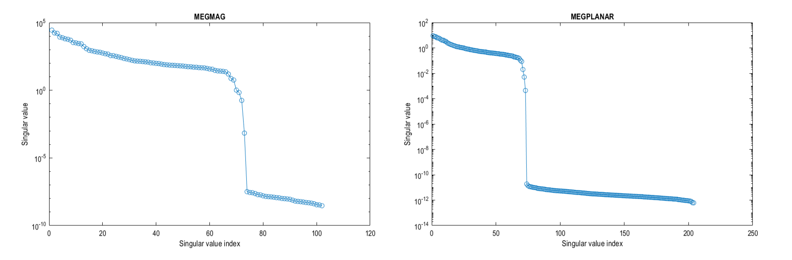
        </div>
        <figcaption>Eigenspectrum of the data covariance of our raw MEGIN data, split by channel type</figcaption>
</figure>

If we do not try to account for either of these problems, we will (at best) bias to the recordings of one set of sensors and (due to the rank deficient data MaxFilter generates) the spatial components those tiny eigenvalues represent will dominate when we invert the data covariance matrix (remember we use $C^{-1}$ in the original beamformer formula). So we shall account for these difficulties in the tutorial below.

??? question "What do you mean by "dominate"?"
    Covariance matrices (of real valued data) are symmetric and so we can decompose the matrix into its eigenvalues and eigenvectors such that $C = \sum_{i=1}^{n} u_{i} s_{i} u_{i}^{T}$, where $u_{i}$ is a column vector representing the $i^{th}$ eigenvector and each diagonal element of $s_i$ is the associated $i^{th}$ eigenvalue (which we plotted in the figure above). The components projected out using MaxFilter are represented with an eigenvector as one of the tiny eigenvalues (which are several orders of magnitude lower than the remnant data) with the spatial topographies encoded in the eigenvectors. If we invert the matrix (which is what we need to beamform) the summation above is written as $C^{-1} = \sum_{i=1}^{n} u_{i} s_{i}^{-1} u_{i}^{T}$. This means the eigenvectors associated with MaxFilter, which were originally down-weighted are now the dominant components. We'd be trying to beamform noise back into the data if we don't control for this.


## Importing the demo dataset

For this tutorial we are using the a subject from the [Wakeman and Henson dataset](https://doi.org/10.1038/sdata.2015.1), where subjects were presented with pictures of faces (famous and unfamilliar people) and phase scrambled images. We will be using a single subject who has already been preprocessed. The data is available on the [SPM M/EEG Course data page](https://www.fil.ion.ucl.ac.uk/spm/course/material/) (select the _Processed single-subject data_; [direct download](https://www.fil.ion.ucl.ac.uk/spm/data/fusion/Processed_single_subject.zip)). Extract the directory labelled `Sub15` and set up some initial variables for later.

```matlab
path_root = '\path\to\Sub15';   % Update with real location
path_data = fullfile(path_root,'apMcbdspmeeg_run_01_sss.mat');  % MEEG Dataset
path_mri = fullfile(path_root,'sMRI','mprage.nii');             % Anatomical Image
path_BF = fullfile(path_root,'BF.mat');                         % DAiSS file path
```

## Preparing MEGIN data for beamforming

### Whitening the data

As mentioned [above](#the-challenges-of-beamforming-megin-data), the two sensor types the MEGIN system uses have different levels of variance, which means one set of sensors will dominate the beamformer over the other. To give both sets of sensors a relatively equal level of contribution, we shall spatially whiten the data. Whitening transforms the data such that all sensors are uncorrelated to each other, and by whitening each class of sensor individually we also bring the relative difference in variance between the sensors down to unity.

We are going to calculate the whitening transform on the pre-stimulus period data, and apply to the entire dataset. To do this in SPM you can do this either with code or in the batch.

=== "GUI"

    ???+ bug "Bug alert with data reduction batch options!"
        If you have a version of SPM with a release date prior to **30/04/24** then there is a bug which means the `Time window` option is not passed to the whitening code. This means all the data is whitened rather than the baseline alone. You can get around this problem by clicking on the **Script** tab above to see code which correctly passes on the time information.

    Start the batch editor (`Batch` button) on main panel. Then from the dropdown menu `SPM` select `M/EEG -> Preprocessing -> Data Reduction`. You will see the following menu:

    <figure>
        <div class="center">
        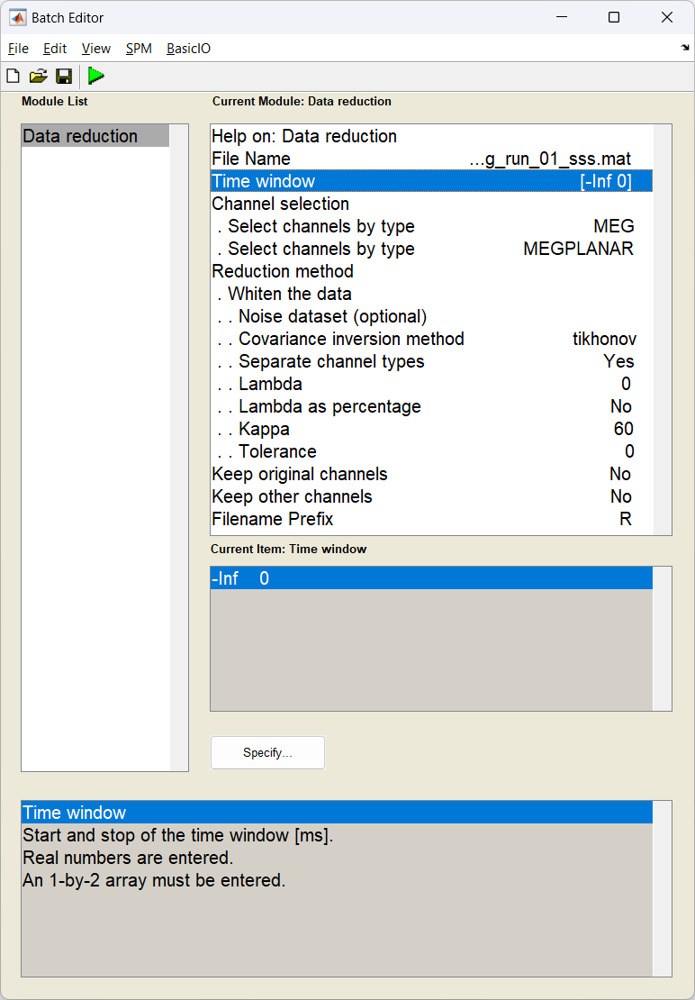
        </div>
        <figcaption>The data whitening options</figcaption>
    </figure>

=== "Script"

    ```matlab
    D = spm_eeg_load(path_data); % load in dataset

    S = [];
    S.D = D;
    S.timewin = [-inf 0]; % Use just the baseline
    S.channels = {'MEG', 'MEGPLANAR'}; % Specify the two sensor types
    S.method = 'whiten';
    S.settings.Dnoise = {''};
    S.settings.method = 'tikhonov';
    S.settings.separate = true;     % whiten each sensor type individually
    S.settings.lambda = 0;
    S.settings.lambda_percent = false;
    S.settings.kappa = 60;          % truncate the operator at 60 components (because of MaxFilter)
    S.settings.tolerance = 0;
    S.keeporig = false;
    S.keepothers = false;

    D = spm_eeg_reduce(S);

    path_white_data = D.fullfile; % update the name for the next step

    ```


### Preparing the head model

Now we coregister the anatomical of the subject with the MEG data. You can use these instructions on [how to prepare the head model](), or alternatively the `bf_wizard_headmodel` script below. The fiducial locations can be found in the `sMRI` folder in the dataset but are provided below.


```matlab

S = [];
S.D = path_white data;
S.mri = path_mri;
S.fiducials(1).name = 'Nasion';
S.fiducials(1).location = [4.1 111.6 0.9];
S.fiducials(2).name = 'LPA';
S.fiducials(2).location = [-80.4 20.9 -12.3];
S.fiducials(3).name = 'RPA';
S.fiducials(3).location = [78.6 9.1 -31.0];
S.useheadshape = true;

bf_wizard_headmodel(S);

```

## Generating beamformer weights

### Importing Data into DAiSS

We import the registered, whitened data into the DAiSS toolbox.

=== "GUI"

    Start the batch editor (`Batch` button) on main panel. Then from the dropdown menu `SPM` select `Tools -> DAiSS (beamforming) -> Prepare data`. You will see the following menu:

    Most of the options can be left on their defaults for this example. 

    <figure>
        <div class="center">
        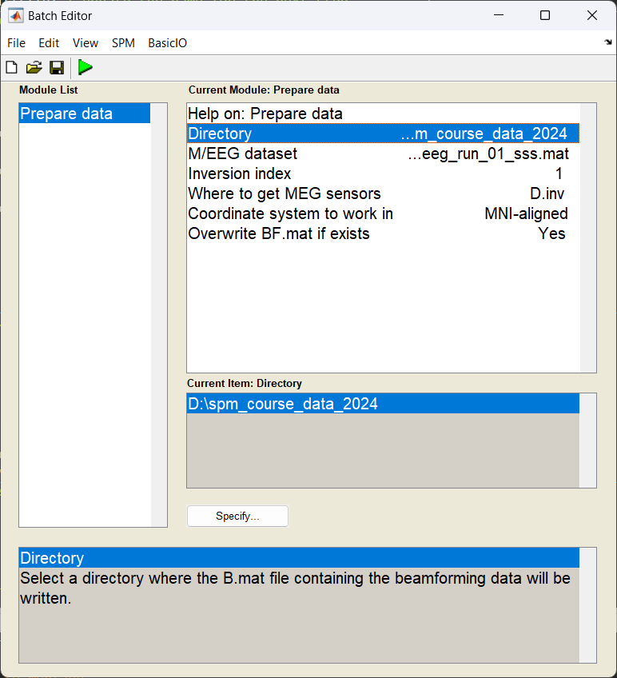
        </div>
        <figcaption>The DAiSS data module</figcaption>
    </figure>

=== "Script"

    ```matlab

    S = [];
    S.D = path_data_white;
    S.dir = path_root;

    bf_wizard_data(S);

    ```

### Calculating the lead fields

We have to elements of the beamforming equation to calculate the first is the lead field $l_{\theta}$ for a given source $\theta$. We could opt to use the same source space as in the main SPM source reconstruction toolbox, but here we are going to localise sources in across the whole brain volume spaced 5 mm apart (in MNI space). We are also going calculate lead fields in all three axes of orientation.

=== "GUI"

    Start the batch editor (`Batch` button) on main panel. Then from the dropdown menu `SPM` select `Tools -> DAiSS (beamforming) -> Define Sources`. You will see the following menu:

    Only edit the section about using the `grid` method.

    <figure>
        <div class="center">
        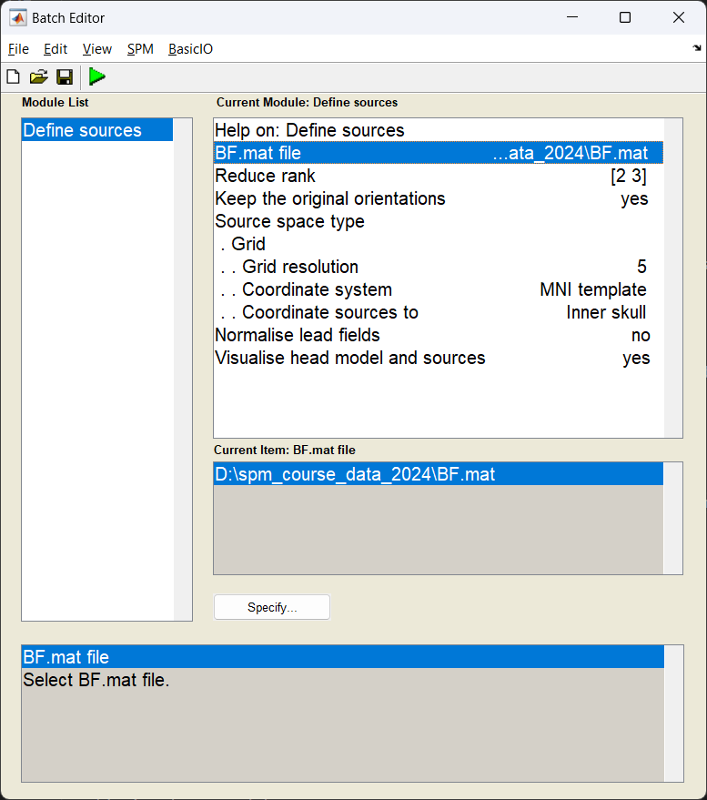
        </div>
        <figcaption>The DAiSS source specification module</figcaption>
    </figure>

=== "Script"

    ```matlab

    S = [];
    S.BF = path_BF;
    S.method = 'grid';
    S.grid.resolution = 5;  # in mm

    bf_wizard_sources(S);

    ```

### Generating the covariance matrix

In keeping with the [group analysis tutorial](../../../MEEG/multi/source/#group-statistics-on-source-reconstructions), we are going to localise 10-20 Hz power, and so we generate a covariance matrix $C$ from that frequency band alone. We also add in a couple of steps ensure that the magnetometer and gradiometer channels are fused together to create one covariance matrix for all channels. We shall also truncate our covariance matrix prior to inversion to stop the noise elements dominating and then invert to make $C^{-1}$

=== "GUI"

    Start the batch editor (`Batch` button) on main panel. Then from the dropdown menu `SPM` select `Tools -> DAiSS (beamforming) -> Covariance Features`. You will see the following menu:

    Only edit the section about using the `grid` method.

    <figure>
        <div class="center">
        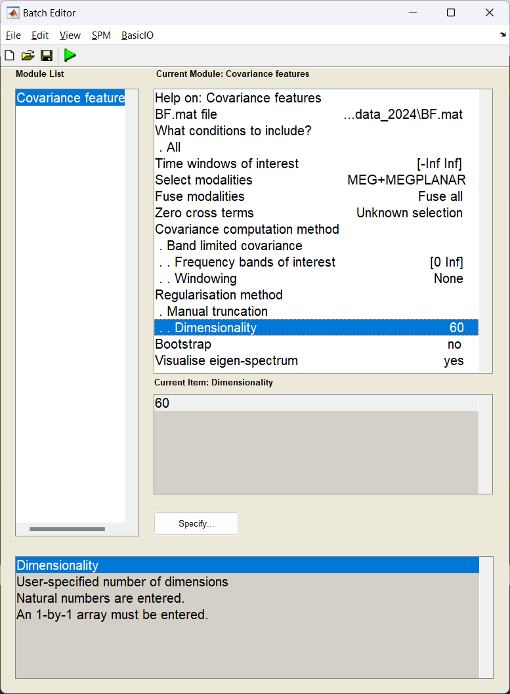
        </div>
        <figcaption>The DAiSS feature specification module</figcaption>
    </figure>

=== "Script"

    ```matlab

    S = [];
    S.BF = path_BF;
    S.woi = [-inf inf];
    S.conditions = 'all';

    % Generate covariance matrix
    S.method = 'cov';
    S.cov.taper = 'none';
    S.cov.foi = [0 100]; % wide band matrix

    % Fuse results from the different sensors - but set cross terms to 0
    S.modality = {'MEG', 'MEGPLANAR'};
    S.cross_terms = 'all';
    S.fuse = 'meg';

    % Regularise by truncating the matrix to after the 60th eigenvector
    S.reg = 'mantrunc';
    S.(S.reg).pcadim = 60;
    S.visualise = 1;

    bf_wizard_features(S);

    ```

With the visualisation option turned on, we can look at the eigenspectrum of the untruncated covariance matrix and look at where we decided to truncate from (black dashed line). We can see that 60 is probably a conservative estimate with the last sensible eigenvector being the 120th (after that the eigenvectors are about 15 orders of magnitude smaller).

<figure>
    <div class="center">
    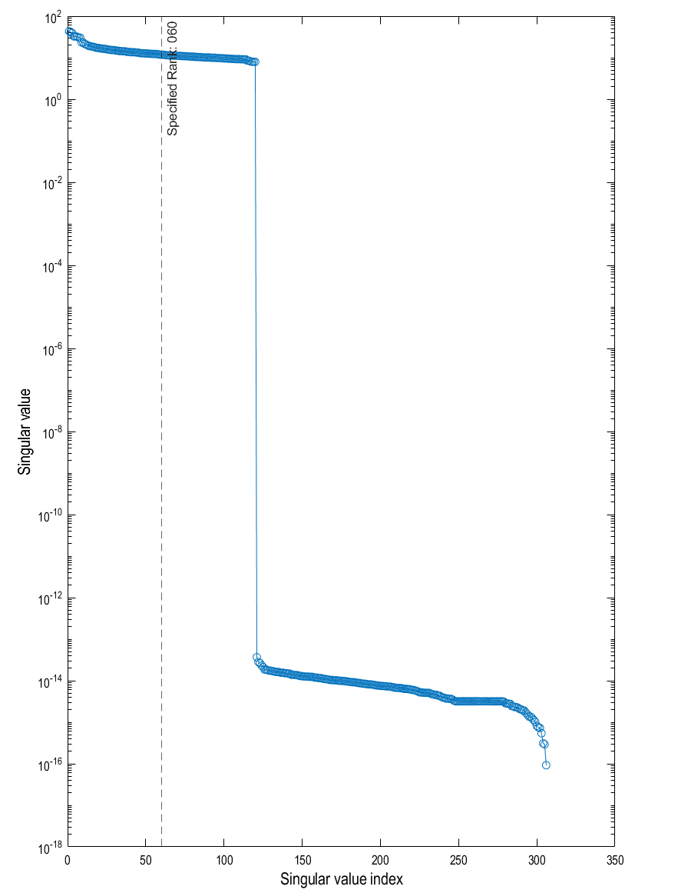
    </div>
    <figcaption>The eigenspectrum of the 10-20 Hz covariance matrix (blue) with the truncation line overlaid (black)</figcaption>
</figure>

### Making the beamformer weights

With the lead fields and covariance matrix calculated, we finally put it all together to make our weights $w_{\theta}$ for a given source $\theta$. Earlier we generated three lead fields for each source (each oriented in one of the three cardinal directions). Here we will linearly combine them in such a way they give us maximal power in that area.

=== "GUI"

    Start the batch editor (`Batch` button) on main panel. Then from the dropdown menu `SPM` select `Tools -> DAiSS (beamforming) -> Inverse Solution`. You will see the following menu:

    Only edit the section about using the `grid` method.

    <figure>
        <div class="center">
        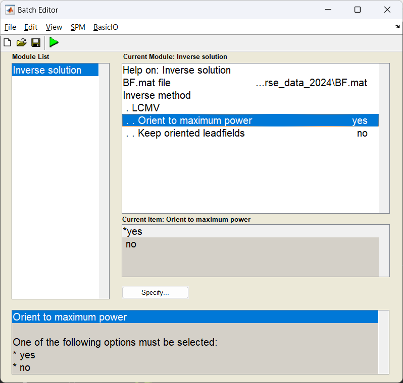
        </div>
        <figcaption>The DAiSS inverse solution module</figcaption>
    </figure>

=== "Script"

    ```matlab

    S = [];
    S.BF = path_BF;
    S.method = 'lcmv';

    bf_wizard_inverse(S);

    ```

## Generating activation images

Normally we beamform for one of two reasons, either to estimate power across the whole brain in a given time-frequency window, or to localise activity in a specific region of the brain. Here, we shall do the former as if we were going to pass this onto a second-level analysis [to find a group effect](../../../MEEG/multi/source/#group-statistics-on-source-reconstructions). 

### Estimating beamformer power

We shall use the same time-frequency window as the [multi-modal tutorial](../../../MEEG/multi/source/) (10-20 Hz, 100-250 ms after stimulus onset), and generate a single power image per condition. We shall also log-transform the power results after they are calculated (which helps with the second-level analysis).

??? info "How beamformer power is calculated"
    For a given source $\theta$, the power $P_{\theta}$ is calculated using $P_{\theta} = w_{\theta}^TCw_{\theta}$

??? question "Why do we log-transform the power results?"
    **Gaussianity**: The GLM method for determining our group effect assumes the data across subjects follows a Gaussian distribution, performing a [power transform](https://en.wikipedia.org/wiki/Power_transform) of the data is a method to make more likely follow this assumption. Log transforming the data is one such power transform.

=== "GUI"

    Start the batch editor (`Batch` button) on main panel. Then from the dropdown menu `SPM` select `Tools -> DAiSS (beamforming) -> Output`. You will see the following menu:

    <figure>
        <div class="center">
        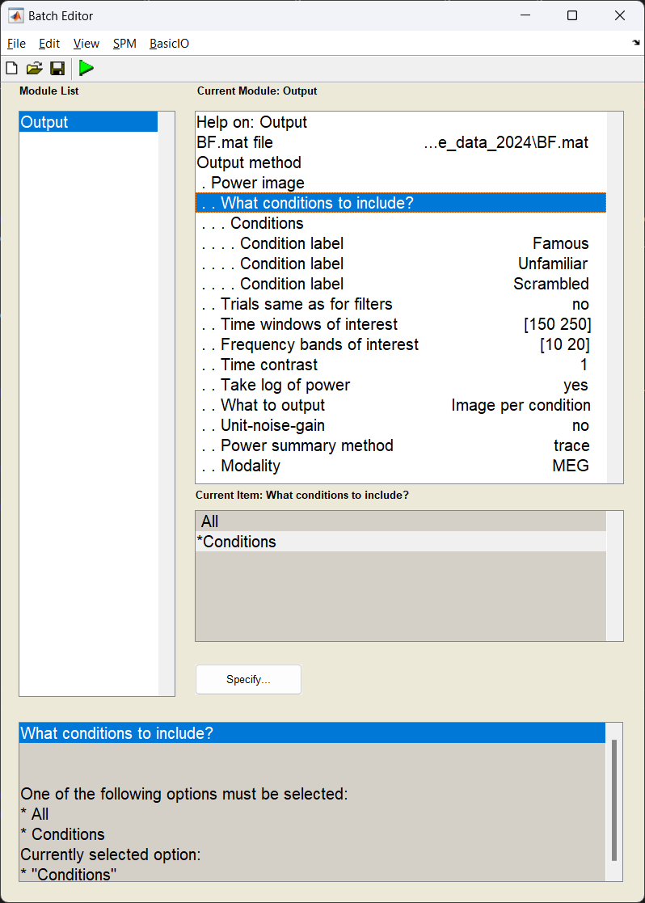
        </div>
        <figcaption>The DAiSS output module</figcaption>
    </figure>

=== "Script"

    ```matlab

    S = [];
    S.BF = path_BF;
    S.conditions = {'Famous','Unfamiliar','Scrambled'};
    S.woi = [150 250];
    S.foi = [10 20];
    S.contrast = 1;
    S.method = 'image_power';
    % Set output options
    S.image_power.scale = 0; % don't use unit-gain scaling
    S.image_power.logpower = 1; % log transform the power
    S.image_power.result = 'bycondition';

    bf_wizard_output(S);


    ```

### Exporting the images

With the power images calculated we need to export the NIFTI files for the group analysis. We use the `Write` module to export the files into the current working directory.

=== "GUI"

    Start the batch editor (`Batch` button) on main panel. Then from the dropdown menu `SPM` select `Tools -> DAiSS (beamforming) -> Output`. You will see the following menu:

    <figure>
        <div class="center">
        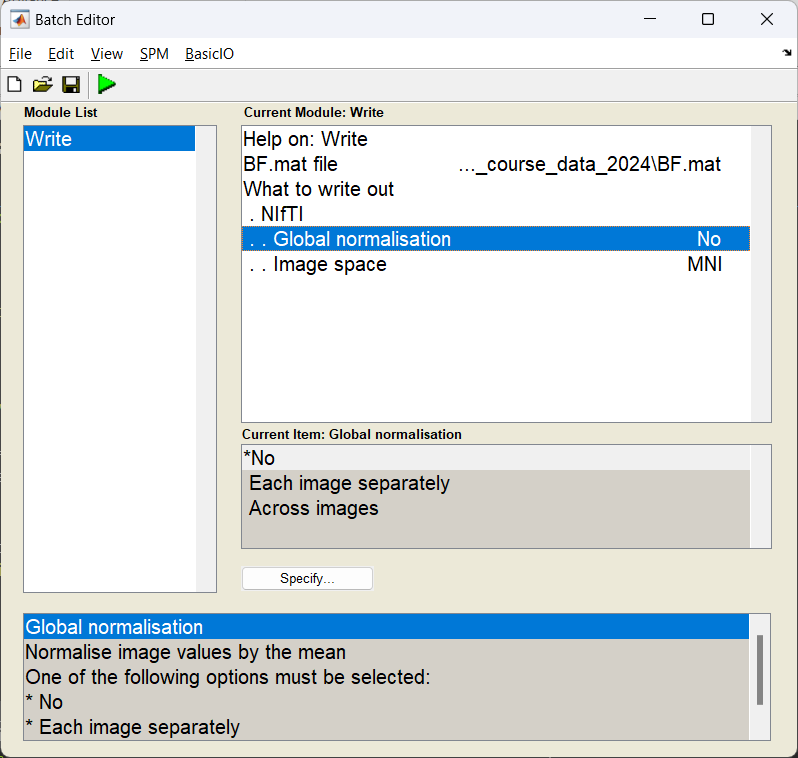
        </div>
        <figcaption>The DAiSS write module</figcaption>
    </figure>

=== "Script"

    ```matlab

    S = [];
    S.BF = path_BF;
    S.method = 'nifti';

    bf_wizard_write(S);

    ```

If this has worked you should see three NIFTI format images beginning with `uv_pow_cond_` which you can put into your second level analysis (along with the other subjects).


??? question "Can I look at what the effect of faces v houses in a single subject?"
    This is not entirely recommended, but if you wanted to quickly assess where largest contrasts occur in these images we can manually contrast them and plot the results. Here we are going to mimic the contrast found [here]('../../../../../MEEG/multi/source/#group-statistics-on-source-reconstructions). **Warning:** This will overwrite the results above so only do this after exporting your NIFTI images!
    ```matlab
        BF = bf_load(path_BF);

        output_old = BF.output;

        % Order was based on input, so Famous, Unfamiliar, Scambled
        output_new.image.label = 'Famous_Unfamiliar_v_Scrambled';
        output_new.image.val = (output_old.image(1).val +...
            output_old.image(2).val) - 2 * output_old.image(3).val;

        BF.output = output_new;

        bf_save_path(BF,path_BF);

        S = [];
        S.BF = path_BF;
        S.method = 'glass';
        S.glass.classic = 0;
        S.glass.threshold = 0.8;
        bf_wizard_view(S);
    ```
    This should result in a cluster located approximately in the right fusiform face area!
    <figure>
        <div class="center">
        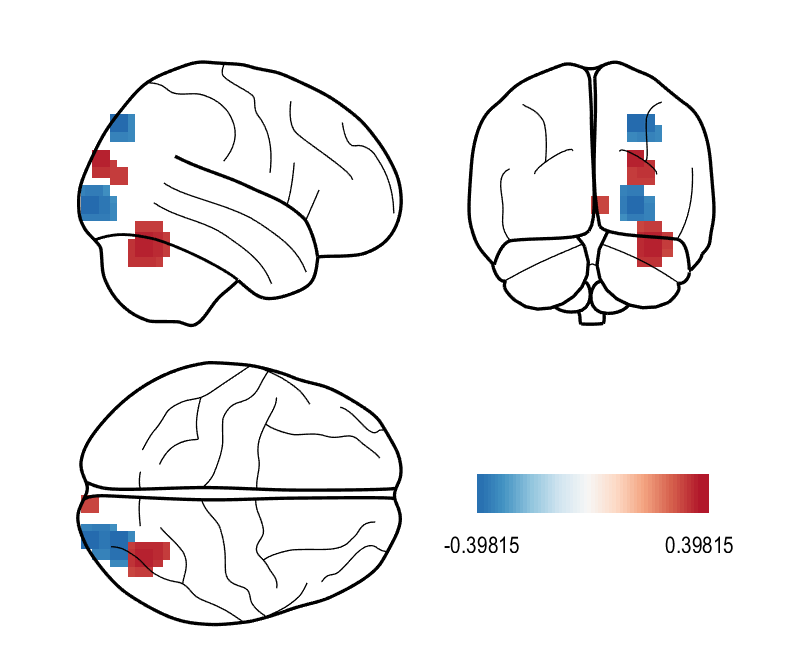
        </div>
    </figure>


## Generating virtual electrodes

When we created the above images, we had a hypothesis that the effect we were looking for existed in the 10-20 Hz frequency band and a 150-250 ms time window, but made no assumption about where in the brain we would see an effect. This is not the only way we can approach this. Alternatively, we could say we have a clear idea _where_ we see an effect but not _when_ (in time and/or frequency). Here we will extract the timeseries data from a given region of interest (right Fusiform Face Area) which then could be passed onto a time-frequency analysis of your choosing.

??? warning "A reminder about double dipping"
    When writing up a study, one thing you should _never_ do is the following:

    1. For a significant effect across the brain in a given time frequency window, find the peak location of the of the effect.
    2. Extract a virtual electrode from there
    3. Perform stats on time-frequency representation to _also_ show a significant effect. 
    
    You have shown the effect in the first analysis, so the second is, at best, redundant. However, it may be useful to look at time-frequency response to help illustrate the context around the effect you found in space, just do not perform stats on it.

### Specifying the virtual electrode

In this example, we are going to pool all the sources we reconstructed within a 10 mm radius of the right fusiform face area and take the first principle component (which should in theory improve the SNR of the timeseries we generate).

=== "GUI"

    Start the batch editor (`Batch` button) on main panel. Then from the dropdown menu `SPM` select `Tools -> DAiSS (beamforming) -> Output`. You will see the following menu:

    <figure>
        <div class="center">
        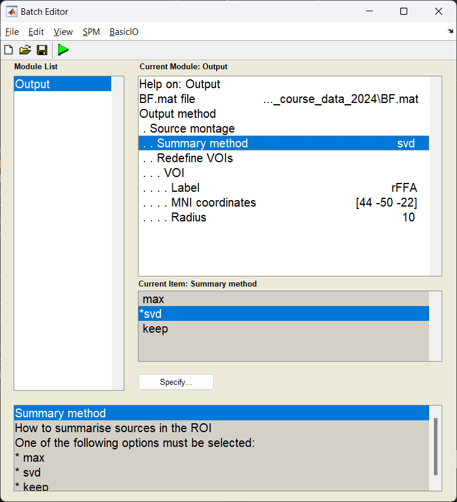
        </div>
        <figcaption>The DAiSS output module</figcaption>
    </figure>

=== "Script"

    ```matlab

    S = [];
    S.BF = path_BF;
    S.method = 'montage';
    S.montage.method = 'svd';
    S.montage.vois{1}.voidef.label = 'rFFA';
    S.montage.vois{1}.voidef.pos = [44 -50 -22];
    S.montage.vois{1}.voidef.radius = 10;

    bf_wizard_output(S);

    ```

### Exporting as an SPM dataset

Now we export the results back into an SPM dataset, where each location specified is represented as an LFP channel for later use.

=== "GUI"

    Start the batch editor (`Batch` button) on main panel. Then from the dropdown menu `SPM` select `Tools -> DAiSS (beamforming) -> Output`. You will see the following menu:

    <figure>
        <div class="center">
        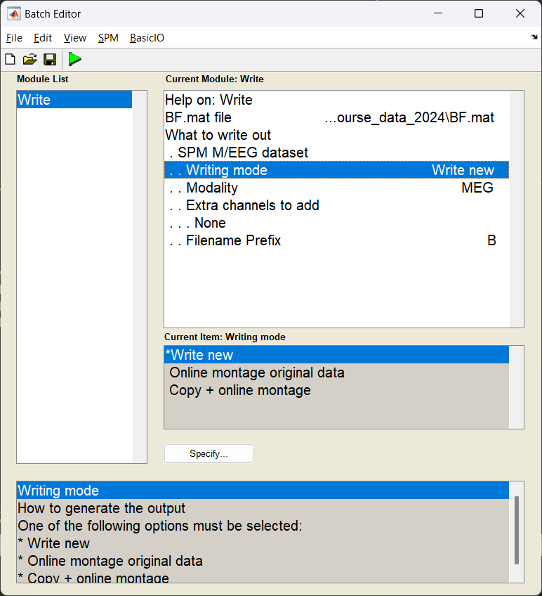
        </div>
        <figcaption>The DAiSS write module</figcaption>
    </figure>

=== "Script"

    ```matlab

    S = [];
    S.BF = path_BF;
    S.method = 'meeg';
    S.meeg.prefix = 'M';

    bf_wizard_write(S);

    ```

The result of this should be a dataset written out labelled `MRapMcbdspmeeg_run_01_sss.mat`;

### Visualising conditional differences

How you process the end reults after this is down to you, but to quickly visualise the time-series differences between the three conditions, you can load in the dataset and take a subject average.

```matlab

% Get the path of the exported dataset
d = spm_select('fplist', path_root, '^MR.*.mat');

D = spm_eeg_load(d);

% perform a low-pass filter (for visualisation)
S = [];
S.D = D;
S.band = 'low';
S.freq = [32];
fD = spm_eeg_filter(S);

% find the trial-averaged effect
S = [];
S.D = fD;
aD = spm_eeg_average(S);

% plot the results
figure;
hold on
for ii = 1:3
    plot(aD.time,aD(1,:,ii),'linewidth',2)
end
grid on
xlabel('time / s')
ylabel('amplitude / arb.')
set(gcf,'color','w')
legend(cellstr(aD.conditions),'location','se')

```

Below is a resultant plot from the above code, showing the differing responses to faces and houses.

<figure>
    <div class="center">
    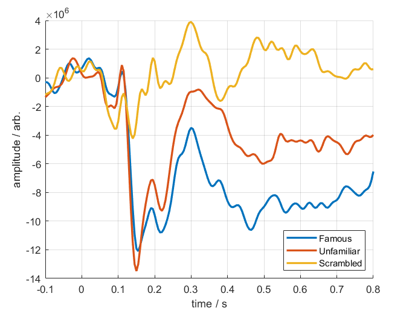
    </div>
    <figcaption>Trial-averaged conditional responses from the rFFA</figcaption>
</figure>