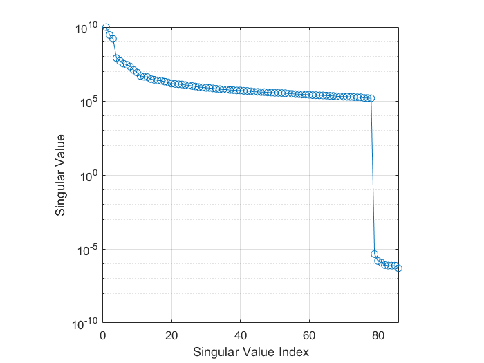
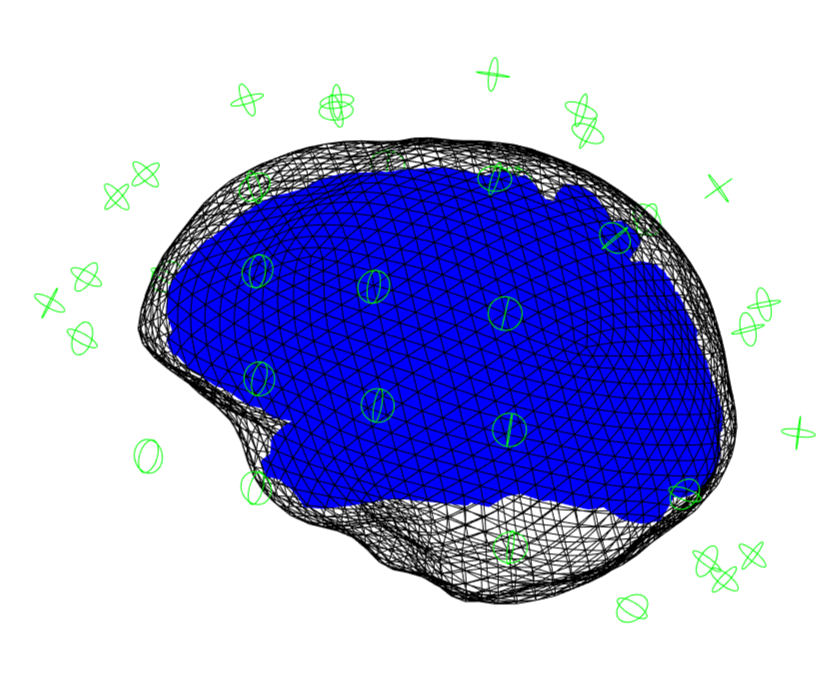
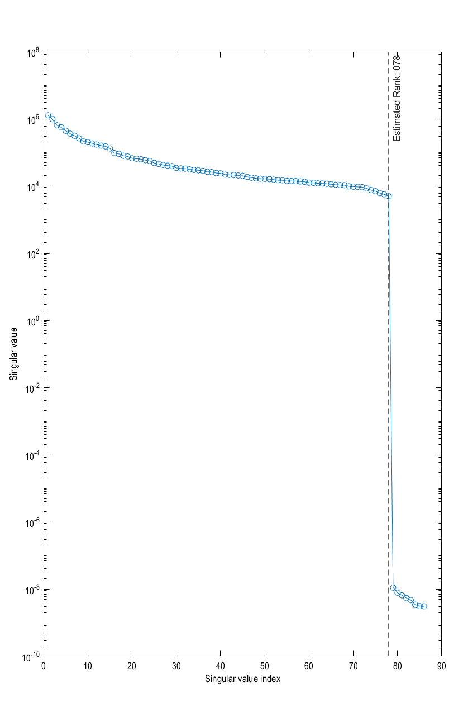

# Beamforming OPM Data

## Background and theory

In this tutorial we will introduce how to use a beamformer to source localise data. Beamformers are typically thought of as 'spatial filters', such that the effect of sensor-level external interference on the source reconstruction is often negligible for most neuroimaging studies. They are useful for low-SNR data. Another advantage of beamformers is that all sources in the brain space don't have to be modelled simultaneously, which is useful for reconstructing a single location in the brain.

### What are we calculating? The beamformer formula

For a given source $\theta$, the vector $w$ which represents the weighted sum of channels which best represent that area is defined as:

$$w^T_{\theta} = [l^T_{\theta}C^{-1}l_{\theta}]^{-1}l^{T}_{\theta}C^{-1},$$

where $C$ is the covariance matrix of the sensor level recordings, and $l$ is a vector representing the modelled dipole field pattern for a unit-source at $\theta$. In DAiSS we need to calculate both the dipole patterns and the covariance matrix before assembling the source reconstruction weights.

??? info "Where beamformers might be bad for your data"
    The mathematical description of beamformers imply there are situations where their use can lead to poor source estimates, the main examples are.

    1. **Correlated sources**: If two spatially separate sources show a high level of correlation (r>0.7), then beamformers will reject these sources entirely.
    2. **Large cortical patches**: Beamformers assume sources are highly focal in space, so a source which covers a large area of the cortex will fail to reconstruct well.

### The challenges of beamforming OPM data

The M in OPM stands magnetometer, meaning that unlike the gradiometers seen in CTF and Elekta systems more environmental interference is not rejected on acquisition. A lot more pre-processing than (for example) CTF-MEG data will be applied to remove this interference prior to analysis. Denoising methods designed for OPMs such as [Homogenous Field Correction (HFC)](https://doi.org/10.1016/j.neuroimage.2021.118484) and [Adaptive Multipole Modelling (AMM)](https://doi.org/10.1002/hbm.26596) leave the data rank deficient (i.e. there are fewer components in the data than number of recordings). 

If we look at the data covariance $C$ for an OPM recording which has had the homogenous fields and linear gradients projected out with HFC, we can see the rank deficiency in the eigenspectrum below. We see the final 8 singular values are several orders of magnitude smaller than the rest the values. In this case it represents the 3 homogenous field components and 5 linear gradients projected out of the data.

 <figure>
        <div class="center">
        
        </div>
        <figcaption>Eigenspectrum of the data covariance of denoised OPM data.</figcaption>
</figure>

If we do not try to account for this, the spatial components those tiny eigenvalues represent will dominate when we invert the data covariance matrix (remember we use $C^{-1}$ in the original beamformer formula). So we shall account for these difficulties in the tutorial below.

??? question "What do you mean by "dominate"?"
    Covariance matrices (of real valued data) are symmetric and so we can decompose the matrix into its eigenvalues and eigenvectors such that $C = \sum_{i=1}^{n} u_{i} s_{i} u_{i}^{T}$, where $u_{i}$ is a column vector representing the $i^{th}$ eigenvector and each diagonal element of $s_i$ is the associated $i^{th}$ eigenvalue (which we plotted in the figure above). The components projected out using MaxFilter are represented with an eigenvector as one of the tiny eigenvalues (which are several orders of magnitude lower than the remnant data) with the spatial topographies encoded in the eigenvectors. If we invert the matrix (which is what we need to beamform) the summation above is written as $C^{-1} = \sum_{i=1}^{n} u_{i} s_{i}^{-1} u_{i}^{T}$. This means the eigenvectors associated with MaxFilter, which were originally down-weighted are now the dominant components. We'd be trying to beamform noise back into the data if we don't control for this.


## Importing the demo dataset

We are using one of the datasets from [Seymour _et al._ (2021)](https://doi.org/10.1016/j.neuroimage.2021.118604) which can be downloaded from [here](https://osf.io/download/tp324/?version=1). Once extracted, we will use `spm_opm_create` to import the data into SPM and perform the registration between the sensors and anatomy.

```matlab

path_root = '\path\to\dataset\sub-002\ses-001';     % Update with real location of the ses-001 directory
path_data = fullfile(path_root,'meg','sub-002_ses-001_task-aef_run-001_meg.bin');  % MEEG Dataset
path_mri = fullfile(path_root,'anat','002.nii');             % Anatomical Image
path_results = '\path\to\results\dir';              % Update with real location of results

S = [];
S.data = path_data;
S.sMRI = path_mri;
S.path = path_results;

D = spm_opm_create(S);

```

If this has successfully run then a 3D plot of the sensor/anatomy registration should pop up.

 <figure>
        <p align="center">
        
        </p>
        <figcaption>The registration of the OPM sensors and the anatomy after a successful import.</figcaption>
</figure>


## Preprocessing

### Denoising with HFC

We employ [Homogenous Field Correction (HFC)](https://doi.org/10.1016/j.neuroimage.2021.118484) to project out any data which which has the spatial topography of a homogenous field or a linear gradient across the sensors, as these topographies are assumed to originate from sources far away from the brain.

```matlab

S = [];
S.D = D;
S.L = 2; % 2nd order spherical harmonics for gradients

hD = spm_opm_hfc(S);

```

### Epoching

To keep convention with the results in the paper, we will epoch the data -100 and 400 ms either side of the tone onset.

```matlab

S = [];
S.D = hD;
S.timewin = [-100 400];
S.condlabel = {'tone'};
S.bc = 1;
S.triggerChannels = {'NI-TRIG'};

eD = spm_opm_epoch_trigger(S);

```

## Generating beamformer weights

### Importing Data into DAiSS

After preprocessing the data, it is ready to enter the DAiSS pipeline. We want the data's coordinate system to be `MNI-aligned` (default). This is useful for group analyses as this will mean that exported results will be in or based on MNI coordinates, so no post-registration is required to get all subjects in the same space.


```matlab

S = [];
S.D = fullfile(eD);
S.dir = path_root;

bf_wizard_data(S);

```

### Calculating the lead fields

We have two elements of the beamforming equation to calculate. The first is the lead field $l_{\theta}$ for a given source $\theta$. We could opt to use the same source space as in the main SPM source reconstruction toolbox, but here we are going to localise sources in across the whole brain volume spaced 5 mm apart (in MNI space). We are also going calculate lead fields in all three axes of orientation.

```matlab

S = [];
S.BF = path_BF;
S.method = 'grid';
S.grid.resolution = 5; # in mm

bf_wizard_sources(S);

```

### Generating the covariance matrix

In keeping with the original paper, we are going to localise power from signals up to 40 Hz, and so we generate a covariance matrix $C$ from that frequency band. We shall also truncate our covariance matrix prior to inversion to stop the noise elements dominating and then invert to make $C^{-1}$. As we have used HFC, we can use the `clifftrunc` method which automatically detects the largest jump in logarithmic space between singular values in the covariance.

```matlab

S = [];
S.BF = path_BF;
S.conditions = 'all';
S.method = 'cov';
S.cov.foi = [0 40];
S.cov.woi = [-inf inf];
S.reg = 'clifftrunc';
S.visualise = 1;

bf_wizard_features(S);

```
If the `visualise` option is set to 1 then you should see the eigenspectrum of the data covariance matrix, with the estimated rank of the data overlaid (everything to the right of the dashed line has been truncated).

 <figure>
        <p align="center">
        
        </p>
        <figcaption>Eigenspectrum of the generated data covariance matrix, with the dashed line representing the number of singular values retained.</figcaption>
</figure>

??? failure "Help! The rank has not be estimated correctly!"
    This can occasionally happen if extra denoising steps (such as ICA) have been applied to the data, as the projection out of those components may not make its respective singular value drop to the same extent as HFC or AMM. 

    However we can manually specifiy the rank of the data. Instead of `clifftrunc` use the `mantrunc` option

    ```matlab
    S.reg = 'mantrunc';
    S.mantrunc.pcadim = NUM_COMPONENTS;
    ```

### Making the beamformer weights

With the lead fields and covariance matrix calculated, we finally put it all together to make our weights $w_{\theta}$ for a given source $\theta$. Earlier we generated three lead fields for each source (each oriented in one of the three cardinal directions). Here we will linearly combine them in such a way they give us maximal power in that area.


```matlab

S = [];
S.BF = path_BF;
S.method = 'lcmv';

bf_wizard_inverse(S);

```