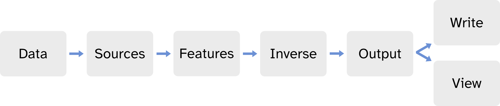

# DAiSS
## Introduction
DAiSS (**D**ata **A**nalysis **i**n **S**ource **S**pace) is an SPM M/EEG toolbox which allows users perform source analyses using "classical" source methods (such as Minimum Norm Estimation, Beamforming etc). DAiSS supplements the [variational Bayesian source methods](../MEEG/meg_sloc.md) found in the core of SPM and might be useful for users who have a specific methodology they want to apply to their data, rather than use a prescribed generative model.

### DAiSS Workflow

DAiSS is composed of a series of blocks which allow the users to import their data, generate and invert source models and then summarise our source data. A flow chart and summary of each block is found below.

<figure id="Fig:daissworkflow" markdown>
{width=100%}
<figcaption>A typical DAiSS workflow.</figcaption>
</figure>

1. **Data:** imports preprocessed data from SPM into the DAiSS pipeline, and sets whether we want to work in MNI space or the subjects native space. 
2. **Sources:** Sets how the source space will be defined, either by using the canonical/individual mesh, a volumetric grid or some other cases. This module also calculates the dipole models for each source.
3. **Features:** Generates and regularises feature matricies (such as a data covariance matrix) in preparation for source inversion.
4. **Inverse:** performs the source inversion (whether that is beamformer or MNE etc) and generates the weights vectors for virtual electrode calculation.
5. **Output:** generates summary images about features in the data (e.g. power or coherence between brain and EMG recording) or allows the user to specify which regions of interest to export as virtual electrodes.
6. **Write:** write out NIFTIs/GIFTIs/SPM MEEG datasets.
7. **View:** make some pretty plots. 

### Command list 
Within each of the 7 modules, there are many different functions/routines you could use. A glossary of commands for each can currently be found on the [SPM/DAiSS GitHub](https://github.com/spm/spm/tree/main/toolbox/DAiSS/doc). 