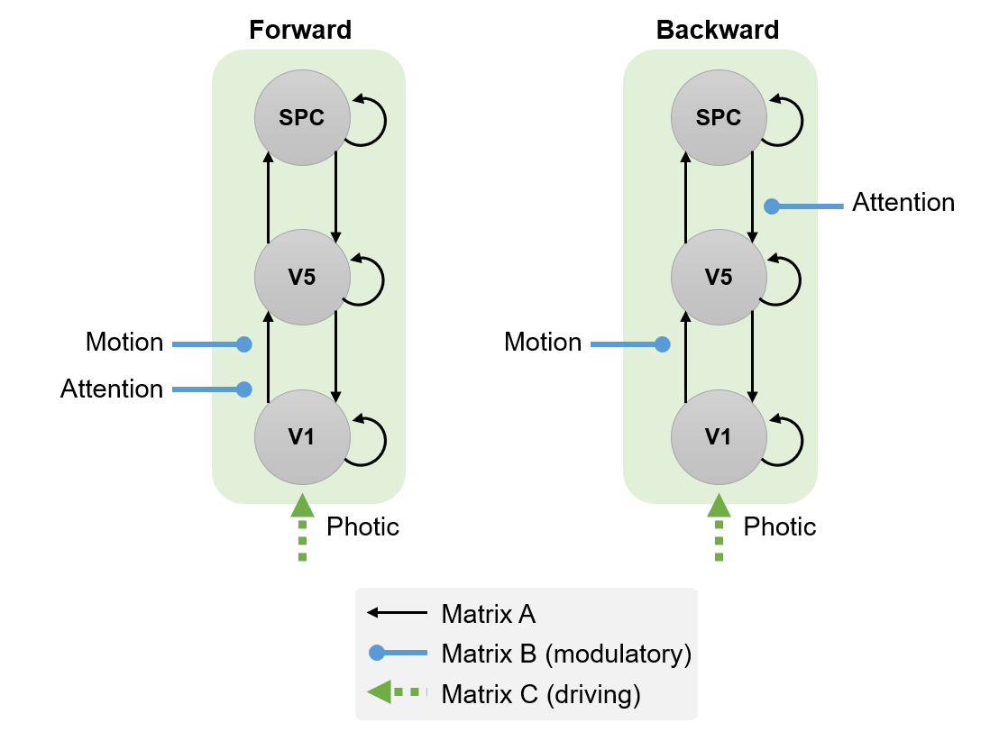
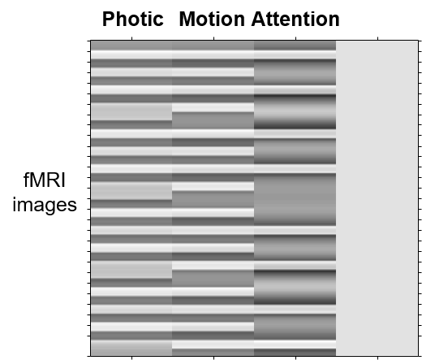
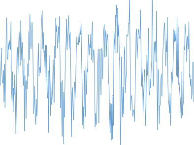
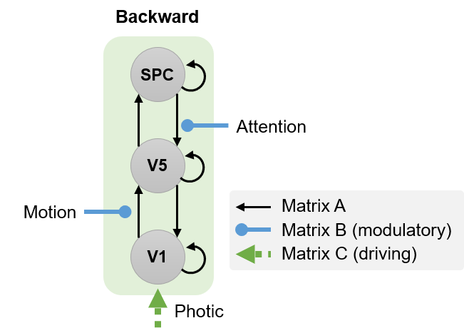
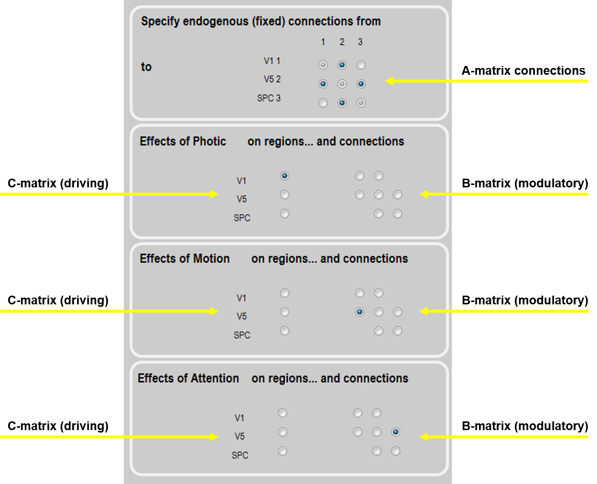
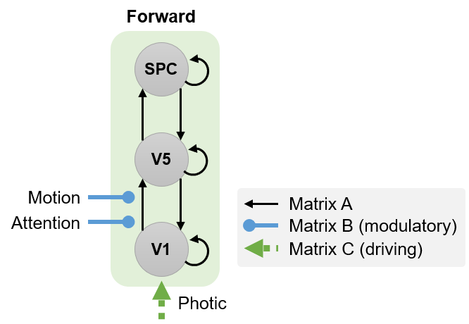
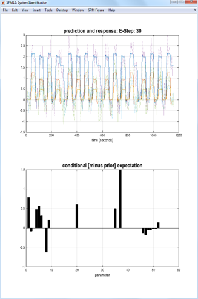
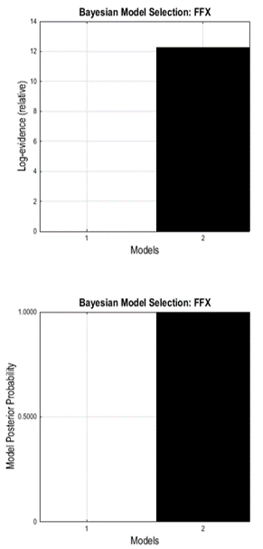

# DCM for fMRI - 1st level (Attention)

Dynamic Causal Modelling (DCM) involves specifying a model for each participant (first-level analysis) and then specifying a model of between-subjects effects (second-level analysis). 
This tutorial works through first level analysis using data from the classic study of [Buchel et al. (1998)](https://doi.org/10.1093/brain/121.7.1281) using the Graphical User Interface (GUI). 

We will first review the [experimental design](dcm_fmri_first_level_gui.md#experimental-design) and [hypotheses](dcm_fmri_first_level_gui.md#hypotheses), and then work through the following steps:

1. [Download the data](dcm_fmri_first_level_gui.md#download-the-data)
2. [Specify the GLM](dcm_fmri_first_level_gui.md#specify-the-glm)
3. [Add contrasts](dcm_fmri_first_level_gui.md#add-contrasts)
4. [Extract time series](dcm_fmri_first_level_gui.md#extract-time-series)
5. [Specify models](dcm_fmri_first_level_gui.md#specify-the-dcms)
6. [Estimate models](dcm_fmri_first_level_gui.md#estimate-the-dcms)
7. [Compare models (Bayesian model comparison)](dcm_fmri_first_level_gui.md#compare-models)
8. [Review estimated parameters](dcm_fmri_first_level_gui.md#review-the-parameters-of-the-winning-model)

## Experimental design
This fMRI study investigated why paying attention to visual motion alters brain activity throughout the visual system.

During the experiment, participants saw pictures of dots on a computer screen in the scanner. Depending on the trial, the dots either moved radially outwards from the middle of the screen or remained stationary. There were four experimental conditions. which we will refer to as A,N,S and F:

- **A**ttention. Participants were cued to silently detect changes in the speed of the moving dots. 
- **N**o attention. The dots were moving and the participants were instructed to "just look".
- **S**tationary. The dots did not move and the participants were instructed to "just look".
- **F**ixation. Only the central fixation point was visible.

<figure id="Fig:radialdots" markdown>
{align=center}
<figcaption>During the experiment in the MRI scanner, 250 white dots moved radially from the central fixation point towards the edges of the screen (as indicated by the yellow arrows, which were not visible to the participants). Not drawn to scale.</figcaption>
</figure>

## Hypotheses

We will focus on three brain regions: early visual cortex (V1) and higher regions known to be sensitive to visual motion (V5) and attention (Superior Parietal Cortex, SPC). We will use DCM to arbitrate between two hypotheses:

- H1. Attention modulates forward (i.e., bottom-up) connectivity from V1 to V5.
- H2. Attention modulates backward (i.e., top-down) connectivity from SPC to V5.

<figure id="Fig:modelspace" markdown>

<figcaption>Two hypotheses, formalized as Dynamic Causal Models (DCMs), that we will compare. The models differ only in where Attention has an effect: on the forward connection from V1 to V5 (left panel) or on the backward connection from SPC to V5 (right panel).</figcaption>
</figure>

## Analysis

### Download the data
First, get a a zip file containing the dataset from the [SPM website](https://www.fil.ion.ucl.ac.uk/spm/data/attention/). Unzip the files to a safe location on your computer and navigate to that directory using MATLAB. (The same link provides analysis scripts that reproduce the steps we are about to follow using the GUI.)

The directory you have downloaded should include:

1. A directory named `functional`, which includes the preprocessed fMRI volumes. The TR is 3.22 seconds and there are 360 scans.
2. A directory named `structural`, which includes a normalised T1 structural volume.
3. File `factors.mat`, which contains the onsets for the conditions. They are named `stat` (stationary), `natt` (no attention) and `att` (attention) and are defined in scans (not seconds). They are blocks of 10 TRs each. 

### Specify the GLM
Before performing a DCM for fMRI analysis, one must first perform a General Linear Model (GLM) analysis to identify where in the brain experimental effects occurred. For convenience, we will re-arrange the four conditions in the experiment into the following three conditions:

- Photic. Comprises all trials with dot stimuli (A,N,S).
- Motion. Subset of trials in which the dot stimuli were in motion (A,N).
- Attention. Subset of trials in which the participants were cued to pay attention (A).

These will form the three regressors in our GLM. Specify the GLM as follows:

1. **Make a new directory** called `GLM`  that will contain the analysis (alongside the existing functional and structural directories).

2. In MATLAB **type**

        >> cd GLM
        >> spm fmri

3.  From the main SPM window, **click on the Batch button**.

4.  From the **SPM menu** at the top of the Batch Editor, **select "Stats > fMRI model specification"**.

5.  **Click Directory** and choose the `GLM` directory that you made above.

6.  Units for design: **scans**

7.  Interscan interval: **3.22**

8.  **Click Data & Design**, choose **New Subject/Session**.

9.  Click **Scans** and choose all the functional scans `snffM00587_00xx.img`. There should be 360 `*.img` files.

10. Go back to the main MATLAB workspace and **load the MAT-file** containing the experimental conditions:

        >> load ../factors.mat

    You can look at the loaded variables by typing the variable names (`stat` = stationary, `natt` = no attention, `att` = attention)

        >> stat
        >> natt
        >> att

11. Return to the batch editor. Click **Conditions** then double click **New: Condition** three times. Enter the following details for each:

    - Condition 1: Name = `Photic`, Onsets = `[att natt stat]` and Durations = `10`.
    - Condition 2: Name = `Motion`, Onsets = `[att natt]` and Durations = `10`.
    - Condition 3: Name = `Attention`, Onsets = `att` and Durations = `10`.

12. From the SPM menu at the top of the Batch Editor, select **Stats > model estimation**.

13. For "Select SPM.mat", **click on the Dependency button** and choose the proposed item (the output from the previous module).

14. You should now be able to **press the Run green arrow** at the top of the Batch Editor window. This will specify and estimate the GLM.

The design matrix that has been created (and saved in the file `SPM.mat`) is shown below.

<figure id="Fig:modelspace" markdown>

<figcaption>The SPM design matrix for this experiment. Each column is a hypothesis about we think the data were generated. This figure can be generated by clicking the Review button in SPM and selecting the SPM.mat.</figcaption>
</figure>

### Add contrasts

We need contrasts to identify where in the brain experimental effects occurred. We will define t-contrasts that test for photic, motion, and attention, respectively. We will also need to add an "effects of interest" F-contrast, which is required for mean-correcting the extracted time series. Any experimental effects not covered by this contrast will be regressed out of the signal.

1.  From the main SPM window, **click on the Batch button**.

2.  From the menu at the top, click **"SPM > Stats > Contrast manager"**.

3.  For **Select SPM.mat**, select the one that has been created in the previous step.

4.  Under Contrast Sessions, choose one **New: F-contrast** and three **New: T-contrast**. For each one, enter:

    - F-contrast: Name = `Effects of interest`, F contrast vector = `eye(3)`.
    - T-contrast: Name = `Photic`, T contrast vector = `[1 0 0]`.
    - T-contrast: Name = `Motion`, T contrast vector = `[0 1 0]`.
    - T-contrast: Name = `Attention`, T contrast vector = `[0 0 1]`.

5.  **Press the green arrow** at the top of the Batch Editor window. This will specify and estimate these contrasts.

### Extract time series

The next step is to extract one representative fMRI time series from
each brain region of interest: V5, V1 and SPC.

#### Extract time series from V5

To locate visual area V5, we will identify voxels that respond to both visual motion AND attention to motion. This is referred to as "masking" one contrast by another. We will then extract time series from voxels
identified by this contrast, restricted to a sphere positioned in the V5 region:

1.  Press **Results**.

2.  Select the `SPM.mat` file.

3.  Choose the t-contrast for the `Motion` condition.

4.  Apply masking: **contrast**

5.  Choose the t-contrast for the `Attention` condition.

6.  Uncorrected mask p-value **p < 0.05** and **nature of mask: inclusive**.

7.  p value adjustment to control: **none** with a threshold of **0.001** and extent **0**.

8.  To overlay these results on a structural scan, click **overlays\...** in the SPM Results window, then click **sections**. Navigate to the structural folder and select the file named "nsM00587_0002.img".

9.  At the bottom of the results window, **enter the following coordinates**, which are V5-ish: `[-36 -87 -3]`.

10. Press the **eigenvariate** button.

11. Name of region: `V5`

12. Adjust data for: `Effects of interest` (this effectively mean-corrects the time series)

13. VOI definition: `sphere`

14. VOI radius(mm): e.g. `8` mm

SPM now computes the first principal component of the time series from all super-threshold voxels included in the sphere. The result is stored together with the original time series) in a file named `VOI_V5_1.mat` in the working directory (the "1" refers to session 1).

<figure id="Fig:v5timeseries" markdown>

<figcaption>Representative time series of brain region V5 that will be used in the DCM analysis. This can be found in the file VOI_V5_1.mat in a variable called `Y`.</figcaption>
</figure>

#### Extract time series from V1

We will next identify visual area V1 (primary visual cortex) using the Photic contrast. This is the same procedure as for V5 above, except we will only be using one contrast (not masking one contrast by another):

1.  Press **Results**.

2.  Select the `SPM.mat` file.

3.  Choose the t-contrast for the `Photic` condition.

4.  Apply masking: **none**

5.  p value adjustment to control: **none** with a threshold of **0.001** and extent **0**

6.  To overlay these results on a structural scan, click "overlays\..." in the SPM Results window, then click **previous sections**.

7.  Set the coordinates at the bottom of the Results window to `[0 -93 18]`.

8.  Press the **eigenvariate** button.

9.  Name of region: `V1`

10. Adjust data for: `Effects of interest` (this effectively mean-corrects the time series)

11. VOI definition: `sphere`

12. VOI radius(mm): e.g. `8` mm

This will create the file `VOI_V1_1.mat`.

#### Extract time series from SPC

Finally, we will extract time series from superior parietal cortex (SPC). We will identify voxels in this region using the Attention contrast:

1.  Press **Results**.

2.  Select the `SPM.mat` file.

3.  Choose the t-contrast for the `Attention` condition.

4.  Apply masking: **none**.

5.  p value adjustment to control: **none** with a threshold of **0.001** and extent **0**.

6.  To overlay these results on a structural scan, click "overlays\..." in the SPM Results window, then click **previous sections**.

7.  Set the coordinates at the bottom of the Results window to `[-27 -84 36]`.

8.  Press the **eigenvariate** button.

9.  Name of region: `SPC`

10. Adjust data for: `Effects of interest` (this effectively mean-corrects the time series)

11. VOI definition: `sphere`

12. VOI radius(mm): e.g. `8` mm

### Specify the DCMs

#### Backward (top-down) model

The first of two models we'll specify is the backward model, in which attention modulates the connection from SPC to V5:

<figure id="Fig:bwd_model" markdown>

<figcaption>Structure of the backward (top-down) model, in which Attention modulates the top-down connection from SPC to V5.</figcaption>
</figure>

Specify this model by following these steps:

1.  Press the large `Dynamic Causal Modelling` button.

2.  Choose specify.

3.  Select the `SPM.mat` file you just created when specifying the GLM.

4.  Name for `DCM_???.mat`: e.g. `mod_bwd` (for "attentional modulation of backward connection").

5.  Select all VOIs in order `VOI_V1_1`, `VOI_V5_1`, `VOI_SPC_1`.

6.  Include `Photic`: Yes

7.  Include `Motion`: Yes

8.  Include `Attention`: Yes

9.  Specify slice timings for each area. The default values are set to the last slice of the data, which was the default in the original DCM version. For sequential (as opposed to interleaved) data, this modelling option allows to use DCM in combination with any TR (slice timing differences) (Kiebel et al. 2007). Here, we proceed with the default values.

10. Enter `0.04` for "Echo Time, TE".

11. Modulatory effects: `bilinear`

12. States per region: `one`

13. Stochastic effects: `no`

14. Centre input: `no`

15. Fit timeseries or CSD: `timeseries`

16. Define the following extrinsic connections: V1 to V5, V5 to V1, V5 to SPC, SPC to V5, i.e. a hierarchy with reciprocal connections between neighbouring areas. Note that the columns specify the source of the connection and    the rows specify its target. This should match the figure below (first panel).

17. Specify Photic as a driving input into V1. This should match the second panel, below.

18. Specify Motion to modulate the connection from V1 to V5. This should match the third panel, below.

19. Specify Attention to modulate the connection from SPC to V5. This should match the fourth panel, below.

A polite "Thank you" completes the model specification process. A file called `DCM_mod_bwd.mat` will have been generated.

<figure id="Fig:connections" markdown>

<figcaption>On/off switches to select the priors on connections. "Switched on" means a parameter can be informed by the data. "Switched off" means a parameter is fixed at zero.</figcaption>
</figure>

#### Forward (bottom-up) model

We will now specify the second DCM model, in which attention modulates the forward connection from V1 to V5:

<figure id="Fig:fwd_model" markdown>

<figcaption>Structure of the forward (botton-up) model, in which Attention modulates the bottom-up connection from V1 to V5.</figcaption>
</figure>

To specify this model we will follow exactly the same procedure as above, but this time in step 4 we will name the model `mod_fwd`, and in step 19, we will have Attention modulate the connection from V1 to V5:

1.  Press the large `Dynamic Causal Modelling` button.

2.  Choose specify.

3.  Select the `SPM.mat` file you just created when specifying the GLM.

4.  Name for `DCM_???.mat`: e.g. `mod_fwd` (for "attentional modulation of forward connection").

5.  Select all VOIs in order `VOI_V1_1`, `VOI_V5_1`, `VOI_SPC_1`.

6.  Include `Photic`: Yes

7.  Include `Motion`: Yes

8.  Include `Attention`: Yes

9.  Specify slice timings for each area. The default values are set to the last slice of the data, which was the default in the original DCM version. For sequential (as opposed to interleaved) data, this modelling option allows to use DCM in combination with any TR (slice timing differences) (Kiebel et al. 2007). Here, we proceed with the default values.

10. Enter `0.04` for "Echo Time, TE".

11. Modulatory effects: `bilinear`

12. States per region: `one`

13. Stochastic effects: `no`

14. Centre input: `no`

15. Fit timeseries or CSD: `timeseries`

16. Define the following extrinsic connections: V1 to V5, V5 to V1, V5 to SPC, SPC to V5, i.e. a hierarchy with reciprocal connections between neighbouring areas. Note that the columns specify the source of the connection and    the rows specify its target.

17. Specify Photic as a driving input into V1.

18. Specify Motion to modulate the connection from V1 to V5.

19. Specify Attention to modulate the connection from **V1 to V5**. Note that this differs from the connection selected in the previous model.

A polite "Thank you" completes the model specification process. A file called `DCM_mod_fwd.mat` will be generated.

### Estimate the DCMs

Estimating (or inverting) a DCM provides two outputs: the log-evidence for the model (approximated by a quantity called the free energy) and estimated model parameters (e.g., connection strengths).

**Press the large DCM button**, select both the models created above (`DCM_mod_bwd.mat` and `DCM_mod_fwd.mat`), then press Done. The screen shown below will be updated as the algorithm searches for a setting of the parameters that maximizes the quality of the model (as scored by the free energy).

<figure id="Fig:model_estimation" markdown>

<figcaption>Model estimation screen. Top: fitted data (solid lines) and residuals (dotted lines). The colours indicate the brain regions (V1,V5,SPC). Bottom: Estimated model parameters, ordered according to matrix A, matrix B, matrix C, then haemodynamic parameters. Note that exact values may be different in different SPM versions; the conclusions one draws should be the same.</figcaption>
</figure>

### Compare models

We will now perform Bayesian model comparison to assess which of the two models was the best.

1.  Press the **DCM** button.

2.  Choose **Compare**.

3.  In the Batch Editor window that opened, fill in the boxes as follows:

    1.  `Directory` - choose current directory by clicking the small dot
        on the right hand side of the file selector then click Done.

    2.  `Data` - add a New Subject with a New Session and select the two models, e.g. in the order `DCM_mod_bwd.mat` and `DCM_mod_fwd.mat`.

    3.  `Inference method` - choose "Fixed effects (FFX)".

4.  Press **Run** (the green triangle in the Batch Editor).

The Graphics window now shows a bar plot of the model evidence. You can see that our second model is better than the first one.

<figure id="Fig:model_estimation" markdown>

<figcaption>Model comparison results. In both plots, model 1 is the backward model and model 2 is the forward model (because that is the order in which they were selected in the batch). Top: the difference between each model's log-evidence (approximated by the free energy) and the log-evidence of the worst model, which in this case was model 1. These are referred to as log Bayes factors. The forward model was the winner with a log Bayes factor of more than 12. Bottom: the posterior probability of each model (under equal priors for each model). This was computed by normalizing the log-evidences shown in the top panel. The posterior probability for the forward model was 1.00 (i.e., 100%).</figcaption>

</figure>
### Review the parameters of the winning model

Once this is completed, you can review the results as follows:

1.  Press the **DCM** button.

2.  Choose **review**.

3.  Select `DCM_mod_bwd.mat`

By clicking "review..." you can now select from multiple options, e.g. you can revisit the fit of the model ("Outputs") or look at the parameter estimates for the endogenous coupling ("Intrinsic connections") or for the parameters associated with the driving or modulatory inputs ("Effects of Photic", "Effects of Motion", "Effects of Attention").

Of course, you can also explore the model results using the MATLAB command line by loading the model and inspecting the parameter estimates directly. These can be found in `DCM.Ep.A` (endogenous coupling), `DCM.Ep.B` (modulatory inputs) and `DCM.Ep.C` (driving inputs).