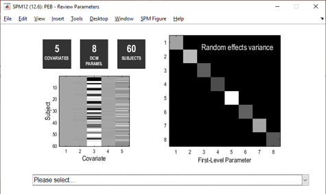
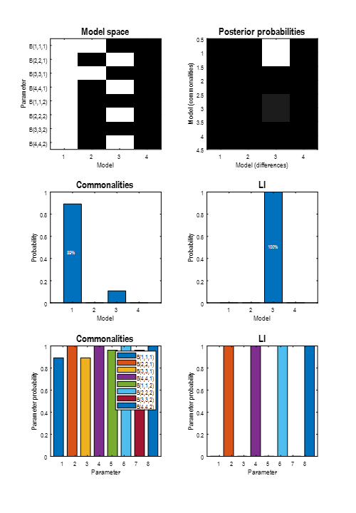
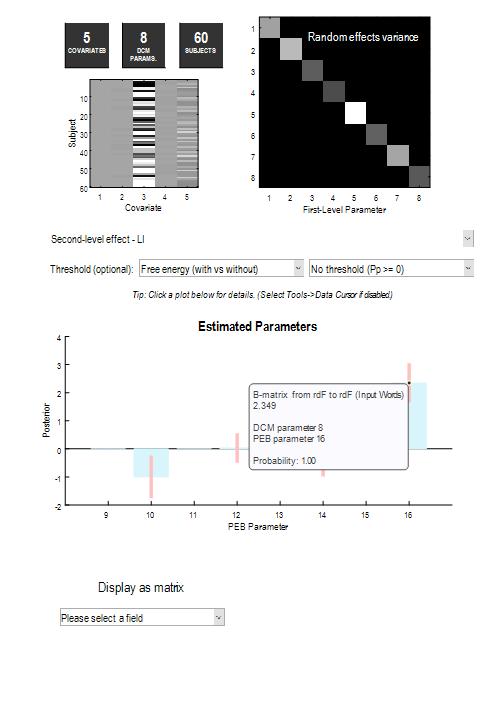

# DCM for fMRI - 2nd level

This tutorial works through second level DCM for fMRI analysis using data from a previously published study by [Seghier et al. (2011)](https://doi.org/10.1093/cercor/bhq203). 
Before starting, we recommend going through the previous tutorial, which introduced the dataset and covered first level (within-subject) analysis for these data.

## Background

In the previous tutorial, we specified, estimated and compared four DCMs for one participant, as illustrated below. Here, we're going to ask: 

- Which set of connections (all, ventral, dorsal or none) best explain the commonalities across participants? 
- Which connections best explain individual differences in brain laterality, as quantified by Laterality Index (LI)? A positive LI (towards +1) indicates left hemisphere dominance, whereas a negative LI (towards −1) indicates right hemisphere dominance. 

<figure id="Fig:pyramidspalmtrees" markdown>
{width=100%}
<figcaption>Four DCMs that we will compare. They differ in where the modulatory effects of making semantic judgements (pictures and words) had effects.</figcaption>
</figure>

## Analysis

### Preparing the dataset
1.	[Download the dataset by clicking here](http://www.fil.ion.ucl.ac.uk/~pzeidman/second_level.zip). Unzip it to a location of your choosing on your computer. 
2. In MATLAB, use the panel on the left and the address bar at the top to change directory to the location where you have unzipped the data.

### Specify a PEB model
We will take the estimated connectivity parameters from every subject's "full model" (m1) to the group level. We will fit a general linear model (GLM) to these estimated connection strengths with covariates: Mean, Laterality Index (LI), Handedness, Sex, Age.

1. Double click on **design_matrix.mat** in the left hand pane. This will load the covariates you need (variable named X) and the names of these covariates (variable named labels).
2. Start SPM by typing **spm fmri** into MATLAB and press enter.
3. Press **Batch** in the main SPM window.
4. From the menu at the top, click **SPM** then **DCM** then **Specify / Estimate PEB**.

Fill out the options in the Batch as follows:

1. Name: **m1**
2. DCMs: Select **GCM_m1_pre_estimated.mat**.
3. Covariates: Select the covariates to go into the between-subjects design matrix:
    - Click **Covariates** then click **Specify design matrix** below. 
	- Double click **Design matrix** then type the upper case letter **X** and press OK. This corresponds to the variable we loaded earlier from design_matrix.mat.
	- Click **Covariate names** then click **New: Name** below **five times**. You should see five "name" entries underneath "Covariate Names".
	- Double click on each Name entry to set the name for that covariate. These should be, in order: **Mean**, **LI**, **Handedness**, **Sex**, **Age**.
4. Fields: We just want to take the B-parameters (modulatory inputs) to the group level. To do this:
	- Click **Fields** then click **Enter manually** below.
	- Double click **Enter manually**, which now appears directly below "Fields".
	- Type **{'B'}** and press **OK**.
5. Review PEB parameters: **Yes**.
6. Press the green play button at the top of the window.

The top part of the resulting window displays key information about the model, including the design matrix. Clicking **Please select...** will review the effect of each covariate on each connection. Positive values show a positive association and negative values show a negative association.

<figure id="Fig:pebreview" markdown>
{width=100%}
<figcaption>Review screen after specifying a PEB model.</figcaption>
</figure>

Note that we have not yet performed a statistical test. To do this, we need to compare the PEB model we just created against reduced PEB models with particular mixtures of covariates switched off.

### Bayesian model comparison

To recap, the "full" PEB model created above is a General Linear Model (GLM), with one regression parameter per covariate per connection. For example, there is a parameter encoding the effect of Pictures on brain region ldF.

To test which parameters are needed to explain the data, we will compare the evidence for the full PEB model against reduced models with particular mixtures parameters switched off. The file GCM_templates.mat contains four exemplar DCMs, which will indicate to the PEB system which connections we want switched on or off in each candidate PEB model.

1. Open the main SPM window. If you cannot find it, return to MATLAB and type: spm fmri and press enter.
2. Press **Batch**, then **DCM**, then **Second level**, then **Compare / Average PEB models**.
3. Double click **Select PEB file**. Choose **PEB_m1.mat** and press **Done**.
4. Double click **DCMs**. Choose **GCM_templates.mat**.
5. Press the green play button.

Two windows will be displayed (you may need to drag one window out the way to see both). One, titled "BMC", shows the results of the Bayesian model comparison. We can conclude that LI influenced dorsal, rather than ventral regions:

<figure id="Fig:secondlevelbmc" markdown>
{width=100%}
<figcaption>Bayesian model comparison results. 
			Top left: which connections were switched on (white) or switched off (black) in each of the four candidate PEB models. 
			Top right: joint probability distribution over models as explanations for the commonalities a
			Middle row: marginal probabilities, i.e., the sum of the rows and columns in the top right plot.
			Bottom row: family-wise Bayesian model comparison for each connection, i.e., the probability that each connection is present vs absent.			
</figcaption>
</figure>

The second plot shows the average parameters over the four PEB models. This is called a Bayesian Model Average (BMA), meaning that the average is weighted by the model probabilities, i.e., better models contribute more to the average than worse models. Use the **drop-down menu to select LI**, then click the right-most bar. This reveals that the probability that LI had an effect on the modulatory effect of Words on region rdF was 100%. 

<figure id="Fig:secondlevelbmc" markdown>
{width=100%}
<figcaption>Bayesian model averaging results, after selecting "LI" and then clicking the left-most bar of the bar plot.</figcaption>
</figure>

We could report this analysis and result in a paper as follows:

>We investigated which connections among four frontal brain regions determine someone's brain laterality, when making semantic decisions about words. We specified and estimated a DCM for each subject, in which Words and Pictures modulated the self-connections of four connected regions. We then took the modulatory parameters to the group level and fitted a PEB model (i.e., Bayesian linear regression) , with covariates: mean, Laterality Index (LI), Handedness, Sex and Age. We then compared the evidence for this "full" group-level model against reduced models that only had effects of Words and Pictures on dorsal regions, or ventral regions, or neither. A Bayesian model comparison showed that LI was specifically related to the dorsal regions, with probability 100%. Examining the parameters of these models showed that LI was positively related to the effect of Words on the inhibitory self-connection of region rdF. In other words, a more positive LI (more left hemisphere dominance) could be explained by greater inhibition within right hemisphere region rdF.