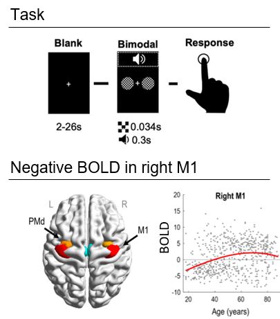
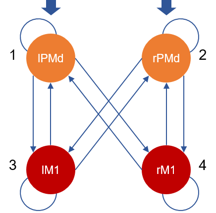
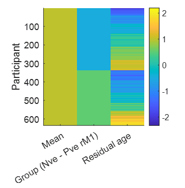
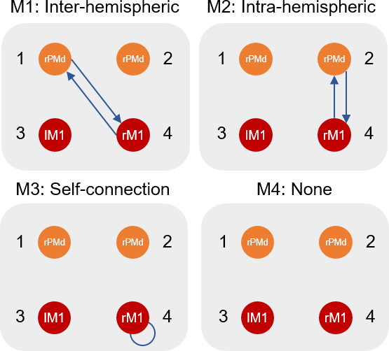
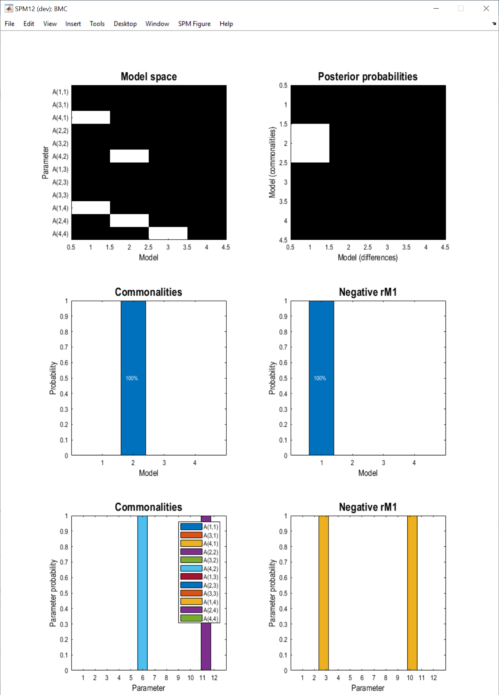
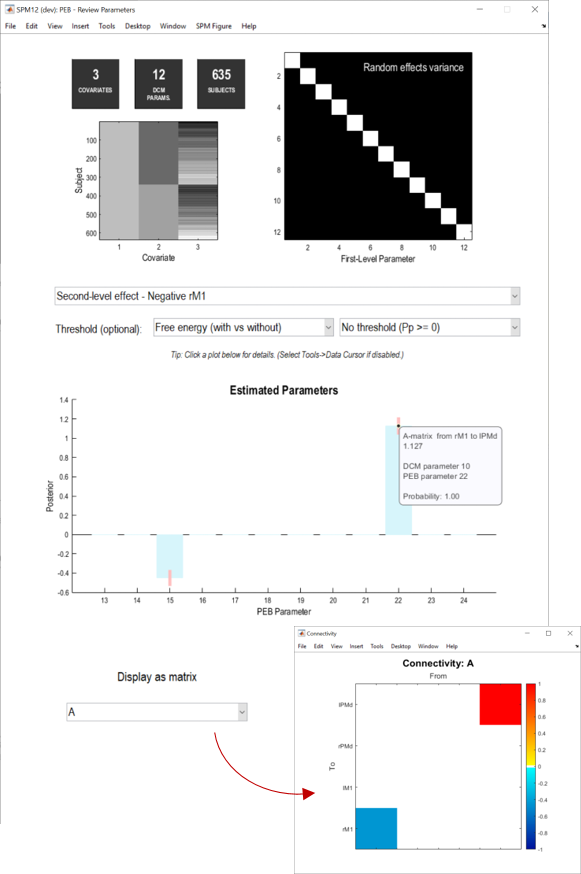
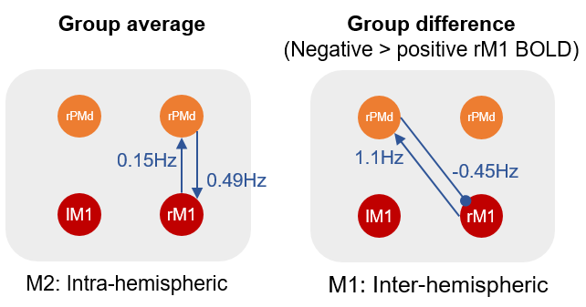

# DCM for fMRI - 2nd level (Motor)

In the [first level DCM tutorial](dcm_fmri_first_level_gui.md), we saw how to specify and compare Dynamic Causal Models (DCMs) for a single participant's data. In this tutorial we will test for similarities and differences in connectivity between participants, using the Parametric Empirical Bayes (PEB) framework in SPM.

We will first review the [experimental design](dcm_fmri_second_level_motor.md#experimental-design) and [hypotheses](dcm_fmri_second_level_motor.md#hypotheses), and then work through the following steps:

1. [Download the data](dcm_fmri_second_level_motor.md#download-the-data)
2. [Review the downloaded files](dcm_fmri_second_level_motor.md#review-the-downloaded-files)
3. [Specify the PEB model](dcm_fmri_second_level_motor.md#specify-the-peb-model)
4. [Perform Bayesian model comparison](dcm_fmri_second_level_motor.md#perform-bayesian-model-comparison)
5. [Inspect the parameters](dcm_fmri_second_level_motor.md#inspect-the-parameters)

## Introduction

### Experimental design
We will perform a simplified version of the DCM analysis in [Tak et al. (2021)](https://doi.org/10.3390/brainsci11091130), which used fMRI data from the [Cam-CAN project](https://cam-can.mrc-cbu.cam.ac.uk/). 635 participants aged 18-88 underwent fMRI. They pressed a button with their right hand in response to auditory and visual stimuli (see the figure, top panel). 

<figure id="Fig:tak_design" markdown="span">

<figcaption>Top: design of the fMRI experiment.  Bottom-left: Regions of interest in dorsal premotor cortex (PMd) and primary motor cortex (M1) identified in a preliminary SPM analysis. Bottom-right: Age versus right M1 (rM1) response to pressing a button with the right hand. Each dot is one participant. Top panel adapted from Knights et al. (2021). Bottom panel adapted from Tak et al. (2021).</figcaption>
</figure>

We will focus on dorsal premotor cortex (PMd) and primary motor cortex (M1), illustrated in the figure above. An initial SPM analysis showed that most young people had a negative BOLD response in rM1 relative to baseline, whereas most older participants had a positive BOLD response. Here, we will ask why.

### Hypotheses
We will ask the question: **what mixture of neural connections can explain the age-related shift from negative to positive BOLD responses in right M1?**

We will evaluate the evidence for four hypotheses, stating that rM1 negative BOLD can be explained by:

- **H1**: Inter-hemispheric connections between left premotor cortex and rM1
- **H2**: Intra-hemispheric connections between right premotor cortex and rM1
- **H3**: Local connectivity within rM1 (its self-connection)
- **H4**: None of the above

## Analyses

### Download the data
Download the dataset from [the SPM website](https://www.fil.ion.ucl.ac.uk/spm/data/peb_motor/peb_motor.zip). Unzip the files to a safe location on your computer and navigate to that directory using MATLAB. 

### Review the downloaded files
After unzipping the downloaded file, you should see the following files:

#### GCM_tak.mat
This is a group DCM, or GCM, file. It contains an estimated DCM for each participant, in a MATLAB cell array of dimension [N x M], where N=635 is the number of participants and M=1 is the number of DCMs per participant. The connectivity of each participant's DCM is as follows:

<figure id="Fig:tak_dcm_structure" markdown="span">

<figcaption>DCM design. Driving input enters dorsal premotor regions (lPMd and rPMd). All connections are switched on (informed by the data) among the four brain regions, with the exception of homotopic connections between lPMd and rPMd, which are switched off to simplify the analyses that follow. The numbers correspond to the order of the regions in the DCM files.</figcaption>
</figure>

#### Participants.mat
This file contains a between-subjects design matrix `X`, with one row per participant, and three columns containing covariates: the group mean (all ones), the group difference (participants with negative rM1 BOLD responses versus participants with positive responses) and the residual effect of age after accounting for the group difference.

<figure id="Fig:design_matrix" markdown="span">

<figcaption>Between-subjects design matrix. The matrix was initially specified as: a column of ones, the effect of group (1=negative rM1 responders, -1=positive rM1 responders) and age in years. There was very strong colinearity between the second and third columns, and we wanted any shared variance to be explained by the second column (group difference). We therefore orthogonalised the columns of the design matrix left-to-right using the MATLAB command spm_orth.</figcaption>
</figure>

#### GCM_templates.mat
This file contains a template DCM for each of our four hypotheses above. These DCMs don't need to be fitted to data - their only role is to tell the PEB system which connections should be switched on or off for each of our hypotheses. It is a MATLAB cell array with dimension [1 x M] where M=4 is the number of models. 

<figure id="Fig:model_space" markdown="span">

<figcaption>Model space. Candidate model architectures that differ in terms of which connections (blue arrows) are hypothesised to  explain effects of age.</figcaption>
</figure>

### Specify the PEB model
We will now take the parameters (e.g. connection strengths) from all participants' DCMs to the group level, and we will seek to explain commonalities and differences across participants using a linear regression model (a GLM). 

Together, the DCMs at the first level and the GLM at the group level can be regarded as a two-level hierarchical model, also known as a PEB model.

 1. Ensure that MATLAB is set to the directory where you unzipped the data (you should see the files on the left hand side).
 2. Load the between-subjects design matrix into the MATLAB workspace by double clicking **participants.mat** in the list of files.
 3. Launch SPM by typing `spm fmri` in MATLAB and press enter  
 4. Click **Batch** in the main SPM window  
 5. From the menu at the top, click **SPM**, then **DCM**, **Second level**, **Specify / estimate PEB**.
 6. Name: **Motor**
 7. DCMs: Click **Specify...** and select **GCM_tak.mat**
 8. Covariates: click **Specify design matrix**.
 9. Design matrix: type `X` , which is the name of the MATLAB variable we loaded earlier containing our 3 covariates, and click OK.
 10. Covariate names: Click **New: Name** three times. Enter the following three names: **Mean**, **Negative rM1** and **Residual age**.
 11. Precision components: Change this from All to **Single**. This will make the assumption that all connections have the same residual variance, greatly speeding up estimation.
 12. Save the batch in case anything goes wrong, then press the **green play button**.
 
  The PEB model is fitted to the data and a file is created called `PEB_Motor.mat`. If we look inside it, we can see it contains the estimated effect of each of the 3 covariates on each of the 12 connections, arranged in a [12 x 3] matrix:

``` MATLAB
>> load('PEB_Motor.mat');
>> full(PEB.Ep)

ans =

   -0.1350    0.1374    0.1930
    0.8514    0.0717   -0.0787
    0.1115   -0.4654    0.0357
   -0.0995    0.0898    0.0687
    0.2949   -0.0938    0.0317
    0.4885   -0.0425   -0.0332
   -0.8597    0.5709    0.1074
   -0.5294    0.5870    0.0506
    0.5184   -0.0272    0.0346
    0.5366    0.9582   -0.2706
    0.1901    0.2195   -0.1110
    0.2467   -0.4860    0.0604
```

PEB also provides the log-evidence (free energy), which scores how well the overall hierarchical model explains the data (incorporating both the individual participants' DCMs and the group-level GLM). This is a relative value, where a more positive number is better (achieving a better trade-off between accuracy and complexity):

``` MATLAB
>> PEB.F

ans =

  -2.3359e+06
```

To make use of these values, we next need to compare the free energy (log-evidence) for PEB models with different mixtures of connections or covariates switched on or off. This is called Bayesian model comparison.

### Perform Bayesian model comparison

1. Return to the main SPM window and click **Batch**.
2. From the menu at the top, click **SPM**, then **DCM**, **Second level**, **Specify / estimate PEB**.
3. Select PEB file: double click and select the PEB model generated in the previous step, **PEB_Motor.mat**.
4. DCMs:  double click and select **GCM_templates.mat**. These templates tell PEB which connections to switch on or off in each model.
5. Click the green play button

Two windows are produced. The first, titled "BMC", shows the results of the Bayesian model comparison (it may be concealed behind another window). There are six panels:

- Top-left: Identifies which connections were on (white) or off (black) in each of the four models we specified in `GCM_templates.mat`. For instance, A(1,4) means the connection to region 1 (lPMd) from region 4 (rM1).
- Top-right: The probability of each of the models we specified, as explanations for the commonalities (group average connectivity), and the difference in connectivity between groups of participants. Here we see that the best model for the commonalities is model 2, and the best explanation for the group difference was model 1.
- Middle panels: This is the same information as in the top-right plot, summed over the rows and columns, which may make it easier to read.
- Bottom panels: Probability for each connectivity parameter. This was computed by pooling the probability for all models that had that connection switched on, versus the probability for all models that had that connection switched off. This was done separately for the group average connectivity and the group difference.

<figure id="Fig:bmc" markdown>

<figcaption>Bayesian model comparison results.</figcaption>
</figure>

We could summarise these results in a paper:

"Our results show that, in a network of primary motor and premotor brain regions, the sign of participants' BOLD response in rM1 could best be explained by inter-hemispheric connections between rM1 and lPMd (model 1). This provided a better explanation (with 100% probability) than intra-hemispheric connections, self-connections in rM1 or the null hypothesis of no connections."

### Inspect the parameters
The steps performed above also generates a Bayesian Model Average (BMA). This is a weighted average of the parameters across the four PEB models we specified (where more probable models contribute more to the average). The PEB "Review Parameters" window enables you to explore these averaged parameters.

1. From the drop-down menu, select **Second-level effect - Negative rM1**.
2. The bar chart shows the estimated change in connection strength due to the group difference (people with negative rM1 responses minus people with positive rM1 responses). **Click the bars** to see the probability for each parameter being present versus absent (ensure that "Threshold" is set to "Free energy").
3. Select **A** from the **display as matrix** dropdown to see the same information displayed as a connectivity matrix, where the columns are the outgoing connections and the rows are incoming connections. Click the coloured squares for further information.

<figure id="Fig:bma" markdown>

<figcaption>Bayesian model averaging.</figcaption>
</figure>

We could now write in our paper:

"...Having found the inter-hemispheric model (model 1) to be the best explanation for the group difference, we next unpacked this result by inspecting the estimated parameters. We found that people with a negative BOLD response in rM1 had a more negative inter-hemispheric connection from region lPMd to rM1 (a difference of 0.45Hz). They also had a more positive connection from rM1 to lPMd (an increase of 1.13Hz), which we expect would further boost the inhibition that lPMd could exert. In conclusion, we found that age-related negative BOLD in rM1 was best explained through inter-hemispheric connectivity with lPMd."

And it's usually helpful to make a diagram to summarise the results, using any graphics editor:

<figure id="Fig:summary" markdown>

<figcaption>Results summary. The left panel shows the best model for explaining the average connectivity across all participants, and the right panel shows the best model for explaining the difference between groups (people who had a negative BOLD response in rM1 versus people who had a positive BOLD response).</figcaption>
</figure>

## Suggestions for next steps

If you would like to take this example further, here are some suggestions for other features to try:

- **Automatic search**. Here we compared the evidence for four candidate model structures defined a priori in `GCM_templates.mat`. For situations where all possible models are equally likely, an automatic search over reduced PEB models can be applied. This can be found in the Batch editor by clicking **SPM**, then **DCM**, **Second level**, **Search nested PEB models**.

- **Prediction**. A complimentary kind of analysis asks: are the effect sizes I detected large enough to predict a new participant's group allocation based on their connectivity? This can be tested using Leave-One-Out (LOO) Cross-Validation. This can be found in the Batch editor by clicking **SPM**, then **DCM**, **Second level**, **Predict (cross-validation)**.