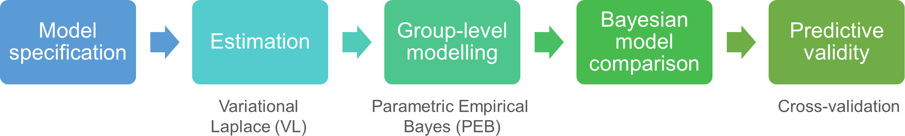

# Dynamic causal modelling (DCM)
## Introduction

In neuroimaging, DCM is used for investigating **effective connectivity** - the directed effects of neural populations on one another. 

Typically, effective connectivity cannot be directly observed. Rather, it needs to be *inferred* from downstream consequences, such as fMRI, EEG or MEG recordings. DCM provides the necessary tools to infer the underlying neural connectivity which gave rise to the observed data. 

### DCM workflow
<figure id="Fig:dcmworkflow" markdown>
{width=100%}
<figcaption>Typical DCM analysis workflow, with the names of specific analysis technologies underneath</figcaption>
</figure>

1. **Model specification**. For each participant, specify a model that describes how experimental stimuli (or the resting state) generated their neural activity and connectivity, and in turn, their neuroimaging data. These models contain **parameters** - unknown quantities such as neural connection strengths, which we wish to estimate from the data.

2. **Model estimation** (or model inversion). The software will find a setting of the parameters that makes the model as *good* as possible. Here, the measure of goodness is a statistic called the **free energy** or **evidence lower bound (ELBO)**, which quantifies the trade-off between the model's accuracy and complexity. 

3. **Group level modelling**. Take all participants' estimated parameters to the group level and fit a second level model, using an approach called Parametric Empirical Bayes (PEB). This captures the commonalities and differences between participants, and returns a score for the quality of the entire group-level model (free energy).

4. **Bayesian model comparison**. Compare the free energy of different candidate group-level (PEB) models, which differ in terms of which connectivity parameters or covariates are included. 

5. **Predictive validity**. Optionally, assess the predictive accuracy of the model parameters using cross-validation, to evaluate whether the detected effects were large enough to be useful.

??? info "What's the technical definition of DCM?"
	DCM can refer to:  
		1. Dynamic Causal Modelling, which is a set of mathematical methods for modelling data.  
		2. Dynamic Causal Model, which is a specific model created using this framework.  
		3. The software implementation in SPM and other packages.
	
	From a technical perspective, Dynamic Causal Modelling has two key ingredients:  
	- *State space models*, which define the dynamics of latent variables (such as neural voltages, conductances), as well as how these latent variables give rise to data.  
	- *Variational Bayes* methods, which rapidly score the evidence for candidate models, enabling Bayesian model comparison. 