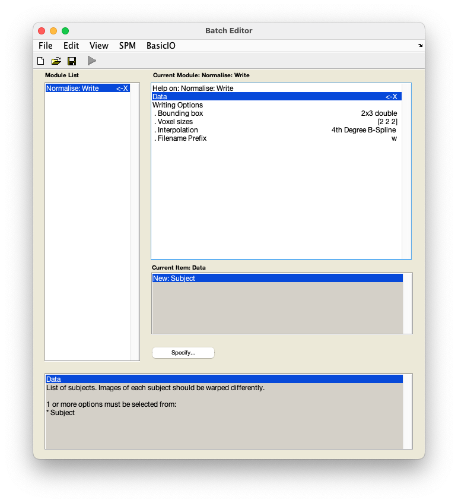

# fMRI data preprocessing

## Normalisation

Normalisation refers to bringing your data into a standard template space to allow group-level statistics. 

??? info "Why normalise my data?" 
    Normalisation is an essential step in neuroimaging analysis that allows group-level analyses. When neuroimaging data is normalised it means it has been transformed to fit into a standard template space. While many different templates exist, the most commonly used one is [MNI152](https://mcin.ca/research/neuroimaging-methods/atlases/). 

    For a thorough overview of issues related to normalisation, see the SPM book:

    [Penny, W., Friston, K., Ashburner, J., Kiebel, S., & Nichols, T. (2006). *Statistical parametric mapping: The analysis of functional brain images*.](https://www.fil.ion.ucl.ac.uk/spm/doc/#books)

    And other readings:

    [Ashburner, J. and Firston, K.J. (2005) *Unified segmentation*.](https://doi.org/10.1016/j.neuroimage.2005.02.018)

1. From the SPM menu panel, select `Normalise (Write)`. You will see a pop-up window appear looking like this:

    

2. Select `Data` :material-arrow-right-bold: `New: Subject`.
3. Select `Deformation field`.
4. In the pop-up window, use the left-hand panel to navigate to `sub-01/anat/`. 
5. From the right-hand panel, select the deformation field generated during [coregistration](./coregistration.md) - `y_sub-01_T1w.nii` and press `Done`.
6. Select `Images to write`.
7. In the pop-up window, navigate to `sub-01/func/`. 
8. From the right-hand panel, use the box underneath the `Filter` button to show a 4D file by typing in `NaN` and pressing ++return++. You can do this in combination with filtering for file names starting with `ar` by typing in `^ar.*` in the `Filter` box and pressing ++return++. Select the realigned and slice time corrected data - `arsub-01_task-auditory.nii`.
9. *Optional*: Under `Writing options`, change `Voxel sizes` form `[2 2 2]` to `[3 3 3]`. This will write images at a resolution closer to that at which they were acquired.
10. Save this batch for future reference - `File` :material-arrow-right-bold: `Save batch` and name it, e.g. `normalisation_batch.mat.`
11. Run your batch by pressing :material-play:.

SPM will now write spatially normalised versions of the images to the folder that contains the functional data, i.e. `sub-01/func/`. These files have the prefix `w`.

### Video walk-through

--8<-- "addons/abbreviations.md"
