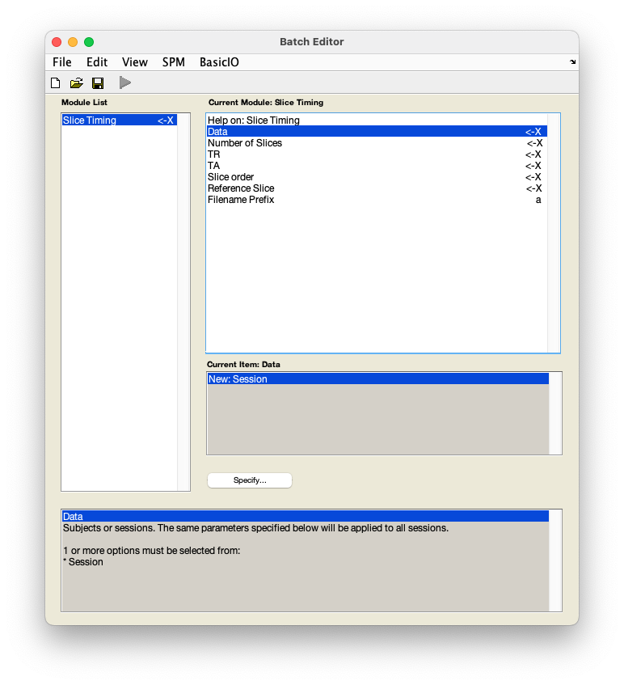

# fMRI data preprocessing

## Slice timing correction

Slice timing correction aims to account for the differences in timing of data acquisition from different slices. 

??? info "Why use slice timing correction?"
    fMRI data is often collected in slices, with one or several slices acquired at a time. Slices can be acquired top-to-bottom (descending) or bottom-to-top (ascending) and be either contiguous/sequential or interleaved:

    { width="500" }
    
    This means that depending on the TR, there is a delay between the acquisition of the first and the last slice/group of slices. To fix this issue, information about the time of acquitision of each slice can be used to interpolate the signal of each slice in a volume to the same timepoint (referred to as the *reference slice*). It is thus important to know your data's TR and slice order acquisition or slice timings. 
    
    Slice timing has been shown to reliably increase sensitivity and statistical power without adverse effects, particularly for studies with longer TRs (>2s; [Sladky et al., 2011](https://doi.org/10.1016/j.neuroimage.2011.06.078)). However, it is important to remember that slice timing is an interpolation method, which means it modifies the original data. As a general rule in imaging analysis, interpolation should be avoided unless necessary. In the case of slice timing, there is a risk of artifacts from one volume being propagated to other volumes in the time series,  which can be particularly problematic for data with large amounts of motion. 
    
    An alternative to slice timing for task fMRI is the use of a *temporal derivative*, i.e. additional regressors in the first-level model which can shift the model in time to get the best fit. This avoids modifying the original data and has an additional benefit of accounting for variations in the HRF. Temporal derivatives can be particularly useful for studies with shorter TRs (≤2s), where slice timining issues are not as problematic. 

    For a thorough overview of issues related to slice timing in fMRI, see the SPM book:

    [Penny, W., Friston, K., Ashburner, J., Kiebel, S., & Nichols, T. (2006). *Statistical parametric mapping: The analysis of functional brain images*.](https://www.fil.ion.ucl.ac.uk/spm/doc/#books)

    And other readings:

    [Sladky, R., Friston, K.j., Trostl J., Cunnington, R., Moser, E, Windischberger, C. (2011). *Slice-timing effects and their correction in functional MRI*.](https://doi.org/10.1016/j.neuroimage.2011.06.078)

??? info "When to use slice timing correction?"
    * Slice timing can be done on any fMRI data but it is particularly beneficial for studies with **longer TRs** (i.e. >2s). For studies with shorter TRs (≤2s), temporal derivatives may be a better option.

    * Slice timing can be performed on **multiband acquisition data**, however, with multiband data and a short TR, slice timing correction can usually be skipped without much impact. If you decide to run slice timing correction on multiband data, it is necessary to use slice timings instead of slice order, since a slice order cannot represent multiple slices acquired at the same time in a vector. If you don't know your slice timings, you can artificially create a slice timing values manually. Generate artificial values from the slice order with equal temporal spacing and then scale the numbers to the TR, so that the last temporal slice's timing = `TR - TR/(nslices/multiband_channels)`.

    * If you plan to use **DCM**, slice timing correction is advised.

1. From the SPM menu panel, select `Slice timing`. A pop-up window will open:

    

2. Select `Data` :material-arrow-right-bold: `New Session` :material-arrow-right-bold: `Session`.
3. In the pop-up window, use the left-hand panel to navigate to `sub-01/func/`. 
4. Identify the realigned time series - this will be the file with an `r` prefix, i.e. `rsub-01_task-auditory_bold.nii`. Use the box underneath the `Filter` button to show a 4D file by replacing `1` with `NaN` and pressing ++return++. You can do this in combination with filtering for files starting with `r` by typing in `^r.*` in the `Filter` box and pressing ++return++. 

    !!! tip "Top tip"
        The `Filter` box allows you to filter files based on a specific combination of characters. The syntax used in filtering file is based on regular expressions. Below are some useful expressions for selecting files:

        * `.` a period indicates any character. Filtering for `...` would show all files containing at least 3 characters. To filter for files containing a period in their name, use `\.`

        * `*` an asterisk indicates 0 or more instances of the preceding character. SPM's default filter is `.*`, meaning filter for any number of any characters, i.e. show all files present in a directory.

        * `^` a caret indicates a string that begins with the indicated characters. Filtering for `^r` would show all files starting with `r`. 

        * `$` a dollar sign indicates that the preceding characters end the file name. Filering for `\.nii$` will show all files with the extension `.nii`.

        These expressions can be combined to create more powerful filters. For example, using `^r.*\.nii$` will filter for all files starting with `r`, having any number of characters, and ending in `.nii`.   

5. Select `rsub-01_task-auditory_bold.nii` from the right-hand panel and press `Done`. 
6. In the batch window, select `Number of slices` :material-arrow-right-bold: `64`.

7. Select `TR` :material-arrow-right-bold: `7`.
8. Select `TA` :material-arrow-right-bold: `6.8906` or `7-(7/64)`.

    !!! tip "Top tip"
        SPM batch window can do simple calculations for you. The equation to calculate TA (the time between the start of acquisition of the first and the last slice) is `TR-(TR/nslices)`. Simply plug in the numbers in the equation and press `Okay`.

9. Select `Slice order` :material-arrow-right-bold: `[64:-1:1]`.

    !!! tip "Top tip"

        * Contiguous
            * Bottom-to-top: `[1:1:nslices]`
            * Top-to-bottom: `[nslices:-1:1]`
        * Interleaved
            * Bottom-to-top: `[1:2:nslices 2:2:nslices]`
            * Top-to-bottom: `[nslices:-2:1 nslices-1:-2:1]`
            * Middle-to-top: 
                ```
                for k = 1:nslices
                  round((nslices-k)/2+(rem((nslices-k),2)*(nslices-1)/2))+1
                end
                ```


11. Select `Reference slice` :material-arrow-right-bold: `32` or `64/2`.

    ??? info "Which slice to choose as reference slice?"
        When you do slice timing correction, all slices of one volume are interpolated in time to one reference slice. This reference slice becomes the most accurate slice since it gets no interpolation, only other slices are interpolated.

        In SPM, you can change this parameter in `Reference slice`/`refslice`. If you want to choose the first acquired slice as a reference slice, you need to use the slice spatial number as reference slice. For example, with a slice order sequential descending `4 3 2 1`, to set the first temporal slice as the reference slice, you need to set the reference slice to 4. If instead of slice order you use slice timing in seconds (e.g. `2.0 1.0 0.0 1.5 0.5`), then you need to also specify the reference slice in seconds (e.g. to set the first slice as the reference, use `0`).

        You can also choose to use another reference slice. Although setting the reference slice to the first is the easiest and the most common, another common reference is to use the middle slice. This allows for more precision with sequential slice orders. Using the middle slice theoretically guarantees that we minimise the amount of temporal interpolation error because the maximum interpolation will be of TR/2 (in negative and positive shifts). Also, since we assume we are in a sequential slice order, the middle slice in time is also the middle slice in space, thus we also minimise the spatial interpolation error and push the accumulating errors to the top and bottom slices, where there is usually less tissues of interest.

        It is important to note that whatever reference slice you use, you should check that the `Microtime onset`/`fMRI_T0` in the first-level model specification corresponds to your `Reference slice`/`refslice` of the slice timing module to ensure that your onsets during the statistical test are shifted appropriately. Note that by default, the microtime onset is set to `8` over `16` in SPM12, which corresponds to a middle reference slice, thus if you use the first temporal slice as the reference slice, you should change the `Microtime onset` to `1`.

        In any case, it's important to ensure that the slice timing correction reference slice is the same as the first-level model `Microtime onset`. To make it easier, you can change the `Microtime resolution` to the number of slices there are in each volume, so that the number of bins in the statistical model will be the same as the number of slices used for slice timing correction, hence the microtime onset will correspond to the slice position in time.

        Note that the `Microtime onset` should be set in the temporal convention (the number is the slice position in time) and scaled to the microtime resolution, whereas the `Reference slice` is in the spatial convention (the number is the slice position in space). 

12. Save this batch for future reference - `File` :material-arrow-right-bold: `Save batch`. Give the file a meaningful name, such as `slice_timing_batch.mat`. 
13. Run your batch by pressing :material-play: in the top left corner. 

??? info "Slice timing correction - before or after realignment?"
    There is some debate about whether slice timing correction should be used before or after realignment (i.e. motion correction). Performing motion correction first, might mean that data acquired at one time point may be moved to another slice. On the other hand, performing slice timing correction first may result in propagation of motion-induced intensity changes from one volume to the rest of the time series. 
    
    It is advised to use slice timing correction first if:

    * you use a complex slice order sequence (i.e. anything that is not contiguous),

    * you use a contiguous slice order but expect significant head movement.
    
    On the other hand, realignment can be done first if you use a contiguous slice order and expect only slight head movement. 
    
    To avoid the interactions between realignment and slice timing correction and propagation of errors from one step to the next step, methods performing simultaneous realignment and slice timing correction have been developed. To learn more about them, visit the [SpaceTimeRealigner section of the nipype documentation](https://nipype.readthedocs.io/en/0.13.1/interfaces/generated/interfaces.nipy/preprocess.html) and the companion paper [Roche (2011)](https://doi.org/10.1109/TMI.2011.2131152). 

### Video walk-through

--8<-- "addons/abbreviations.md"