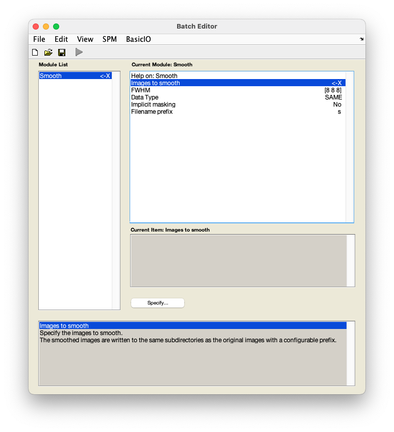

# fMRI data preprocessing

## Smoothing

Smoothing is the process of averaging the signal in each voxel with a weighted average of the signal of neighbouring voxels. 

??? info "Why smooth my data?" 
    Smoothing is a common step performed as part of fMRI data preprocessing. Although it might seem counter-intuitive since it decreases the spatial resolution of the data, it has several benefits. Smoothing increases the signal-to-noise ratio (i.e. enhances the signal), compensates for minor differences in neuroanatomy across individuals, and can further help with [normalisation](./normalisation.md) by improving the mapping of small structures to the template space. 

    For a thorough overview of issues related to smoothing, see the SPM book:

    [Penny, W., Friston, K., Ashburner, J., Kiebel, S., & Nichols, T. (2006). *Statistical parametric mapping: The analysis of functional brain images*.](https://www.fil.ion.ucl.ac.uk/spm/doc/#books)

1. From the SPM menu panel, select `Smooth`. You will see a pop-up window appear looking like this:

    

2. Select `Images to smooth`.
3. In the pop-up window, navigate to `sub-01/func/`.
4. From the right-hand panel, select the normalised, realigned, and slice time corrected data - `warsub-01_task-auditory.nii`. Use the box underneath the `Filter` button to show a 4D file by typing in `NaN` and pressing ++return++. You can do this in combination with filtering for files starting with `war` by typing in `^war.*` in the `Filter` box and pressing ++return++. 
5. Select `FWHM` and change `[8 8 8]` to `[6 6 6]`. 

    ??? info "How to select a smoothing kernel?"
        SPM's default smoothing kernel is 8mm. While this may work well for larger cortical regions, it can make it difficult to detect signal from smaller regions. The smoothing kernel should thus be informed by the size of the regions you are interested in testing. Additionally, the size of the smoothing kernel should account for the voxel size of your functional data. The rule of thumb for choosing a smoothing kernel is to use approximately double the voxel size (e.g. if your voxel size is 3x3x3mm, your smoothing kernel will be 6mm). 

6. Save this batch for future reference - `File` :material-arrow-right-bold: `Save batch` and name it, e.g. `smoothing_batch.mat`.
7. Run your batch by pressing :material-play:.

SPM will now smooth your data by 6mm in each direction (i.e. `x`, `y`, `z`). The files will have the prefix `s`.

### Video walk-through

--8<-- "addons/abbreviations.md"