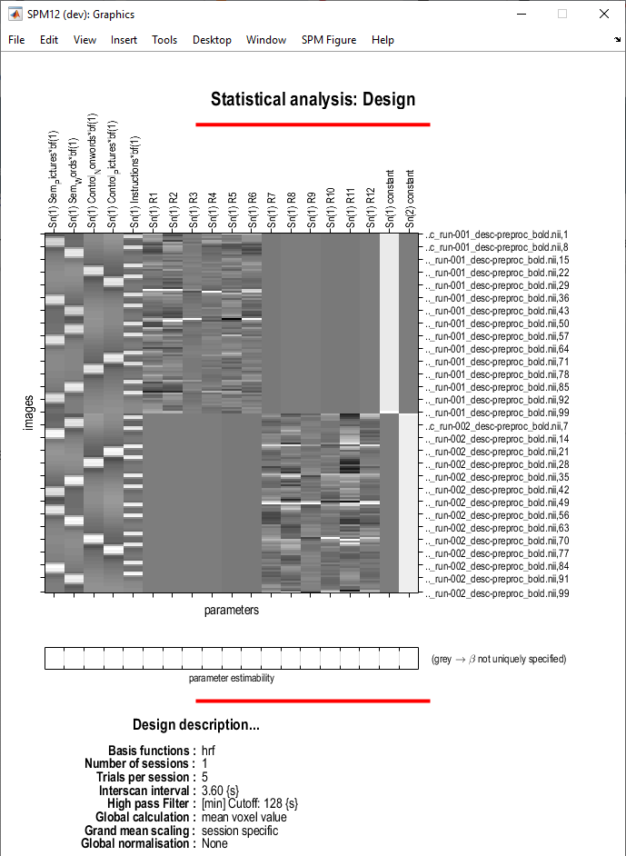

# Semantic matching fMRI task

## What is second-level/group-level analysis?

Second-level fMRI analysis (also known as group-level analysis) is a critical step in neuroimaging research that aggregates data from multiple participants to draw broader conclusions about brain function. Unlike first-level analysis, which focuses on each participant's brain activity in isolation, group-level analysis examines patterns of brain activity that are consistent across a group of participants. By pooling data from multiple individuals, researchers can identify common neural responses associated with specific tasks, conditions, or populations. 

In this section, we will go through different second-level models:

- [**One-sample t-test**](./one_sample_ttest.md): what is the average brain response across all participants?
- [**Two-sample t-test**](./two_sample_ttest.md): are there differences between two groups of participants? 
- [**Factorial**](factorial.md): do multiple factors and their interaction(s) explain differences between participants? 

## About the data

To demonstrate these analyses, we will use a semantic matching task from [Seghier et al. (2010)](https://doi.org/10.1523/JNEUROSCI.3377-10.2010) where both left and right handed participants were instructed to respond either with their left or right hand. Consequently, the dataset consists of the following groups: (1) right handed responding with their right hand, (2) right handed responding with their left hand, (3) left handed responding with their right hand, and (4) left handed responding with their left hand. In the examples described here we will only focus on the effects of response hand and handedness, but if you are interested in other analyses that can be performed with these data, please refer to [the accompanying publication](https://doi.org/10.1523/JNEUROSCI.3377-10.2010). 

The data archive for this tutorial can be [downloaded from here](https://www.fil.ion.ucl.ac.uk/spm/data/fmri_group_semantic/fmri_group_analysis_semantic.zip). The data has already been preprocessed and first-level models have been specified. The data structure of the archive is as follows:

```
derivatives
    first_level         <- first-level models
    second_level        <- space for your second-level models
```

Within the first-level directory, you will find estimated first-level model for the first particpant (sub-001). For the remaining participants we have included only the contrast images, which are required for group analysis, to reduce the size of the download. Below you can see the design matrix that was specified for each of the participants. 



This design matrix includes two sessions (runs) of the task that have been concatenated into a single session, with the following regressors defined:

    1.      Semantic matching trials (picture stimuli)
    2.      Semantic matching trials (word stimuli)
    3.      Control trials (pseudo-word stimuli)
    4.      Control trials (pictures stimuli)
    5.      Instructions
    6-11.   Motion regressors - Run 1
    12-17.  Motion regressors - Run 2
    18-19.  Intercept (Runs 1 and 2)

Based on these regressors the following contrasts have been specified:

1. Effects of interest (F-test)

    ```
    1 0 0 0
    0 1 0 0
    0 0 1 0
    0 0 0 1
    ```

2. Main effect of Pictures-Words

    ```
    1 -1 -1 1
    ```

3. Main effect of Semantic-Control

    ```
    1 1 -1 -1
    ```

4. Interaction

    ```
    1 -1 1 -1
    ```

5. Semantic pictures 

    ```
    1 0 0 0
    ```

6. Semantic words

    ```
    0 1 0 0
    ```

7. Control words

    ```
    0 0 1 0
    ```

8. Control pictures

    ```
    0 0 0 1
    ```

9. Task 

    ```
    1 1 1 1
    ```

In the following sections of this tutorial, we will explore different second-level models that we can apply to this dataset. 

!!! info "Reference"
    [Seghier, M. L., Fagan, E., & Price, C. J. (2010). Functional subdivisions in the left angular gyrus where the semantic system meets and diverges from the default network. Journal of Neuroscience, 30(50), 16809-16817.](https://doi.org/10.1523/JNEUROSCI.3377-10.2010)

--8<-- "addons/abbreviations.md"