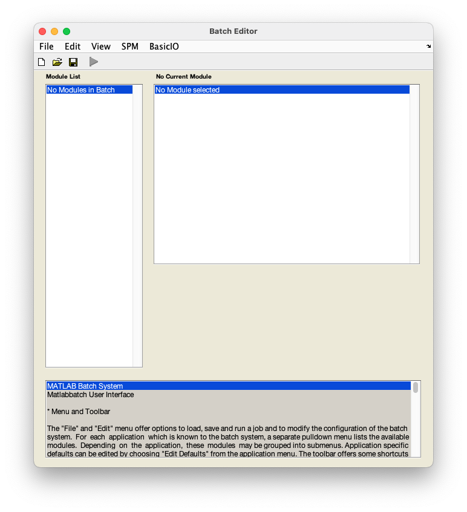

# fMRI data preprocessing

## Bringing it all together - the batch interface

The SPM batch interface allows you to create workflows for executing multiple processing steps sequentially. This means that you can set up one batch file that contains all preprocessing steps that you want to perform. 

1. From the SPM menu panel, select `Batch`. You will see a pop-up window of an empty batch interface looking like this:

    

2. Now we will start adding each of our preprocessing steps in the order we want them to be executed, starting with **realignment**. 
3. From to top panel of the batch window, select `SPM` :material-arrow-right-bold: `Spatial` :material-arrow-right-bold: `Realign` :material-arrow-right-bold: `Realign: estimate & reslice)`. 
4. Now complete the realignment tab of the batch with relevant parameters as in [realignment](./realignment.md):
    1. Select `Data` :material-arrow-right-bold: `Session`. 
    2. In the pop-up window, use the left-hand panel to navigate to `sub-01/func/`. 
    3. Use the filter box to load the full time series - type `NaN` underneath `Filter` button and press ++return++.
    4. In the right-hand panel, select `sub-01_task-auditory_bold.nii` and press `Done`.
    5. Back in the batch window, navigate to `Resliced images` under `Reslice options` and select `Mean image only`. 
    6. Save this batch for future reference - `File` :material-arrow-right-bold: `Save batch`. Give the file a meaningful name, such as `realignment_batch.mat`.
5. Next, add the **slice timing correction** module to your batch file -  `SPM` :material-arrow-right-bold: `Temporal` :material-arrow-right-bold: `Slice timing`.
6. Complete the slice timing module:
    1. Select `Data` :material-arrow-right-bold: `Session`.
    2. Click `Dependency` in the bottom right corner.
    3. In the pop-up window, select the realigned time series that will be generated during realignment - `Realign: estimate & reslice: realigned images (sess 1)` and press `OK`.
    4. Select `Number of slices` :material-arrow-right-bold: `64`.
    5. Select `TR` :material-arrow-right-bold: `7`.
    6. Select `TA` :material-arrow-right-bold: `6.8906` or `7-(7/64)`.
    7. Select `Slice order` :material-arrow-right-bold: `[64:-1:1]`.
    8. Select `Reference slice` :material-arrow-right-bold: `32` or `64/2`.
7. Next, add the **coregistration** module to your batch file - `SPM` :material-arrow-right-bold: `Spatial` :material-arrow-right-bold: `Coregister` :material-arrow-right-bold: `Coregister: estimate`. 
8. Complete the coregistration module:
    1. Select `Reference image` :material-arrow-right-bold: `Dependency`.
    2. In the pop-up window, select the mean image that will be generated during realignment - `Realign: estimate & reslice: mean image` and press `OK`.
    3. Select `Source image`.
    4. In the pop-up window, navigate to `sub-01/anat/`. 
    5. Select the anatomical image - `sub-01_T1w.nii` and press `Done`.
9. Now add the **segmentation** module - `SPM` :material-arrow-right-bold: `Spatial` :material-arrow-right-bold: `Segment`.
10. Complete the segmentation module:
    1. Select `Data` :material-arrow-right-bold: `Volumes` :material-arrow-right-bold: `Dependency`. 
    2. In the pop-up window, select the coregistered anatomical image `Coregister: estimate: coregistered images` and press `OK`.
    3. Select `Save bias corrected` :material-arrow-right-bold: `Save bias corrected`.
    4. Select `Deformation fields` :material-arrow-right-bold: `Forward`.
11. Add the **normalisation** module - `SPM` :material-arrow-right-bold: `Spatial` :material-arrow-right-bold: `Normalise` :material-arrow-right-bold: `Normalise: write`.
12. Complete the normalisation module:
    1. Select `Data` :material-arrow-right-bold: `New: Subject`.
    2. Select `Deformation field` :material-arrow-right-bold: `Dependency`.
    3. In the pop-up window, select the deformation field that will be generated during segmentation - `Segment: forward deformations` and press `OK`.
    4. Select `Images to write`.
    5. Click `Dependency`.
    6. In the pop-up window, select the realigned and slice time corrected data - `Slice timing: slice timing corr. images (sess 1)`.
    7. *Optional*: Under `Writing options`, change `Voxel sizes` form `[2 2 2]` to `[3 3 3]`. This will write images at a resolution closer to that at which they were acquired.
13. Add the **smoothing** module - `SPM` :material-arrow-right-bold: `Spatial` :material-arrow-right-bold: `Smooth`.
14. Complete the smoothing module:
    1. Select `Images to smooth` :material-arrow-right-bold: `Dependency`.
    2. In the pop-up window, select the realigned, slice time corrected, and normalised time series - `Normalise: write: normalised images (subj 1)` and press `OK`.
    3. Select `FWHM` and change `[8 8 8]` to `[6 6 6]`.
15. Now that all your preprocessing steps have been specified, save this batch - `File` :material-arrow-right-bold: `Save batch and script` and name it, e.g. `preprocessing_batch.mat`.

You can now run this batch to execute all selected preprocessing steps for this subject by clicking :material-play: or use it to create a matlab script to process data from multiple subjects. 