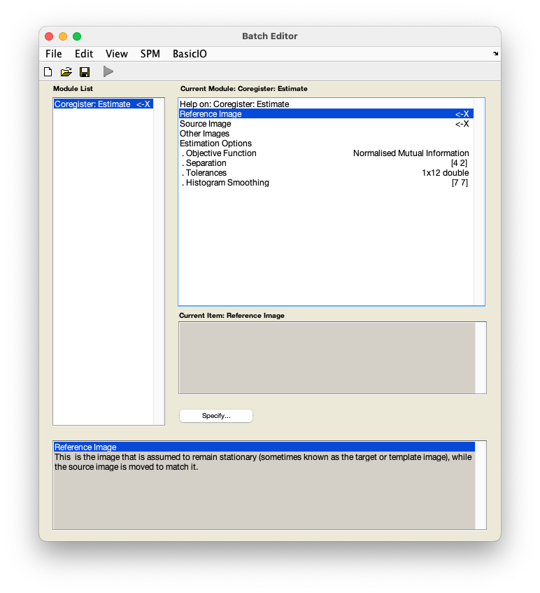
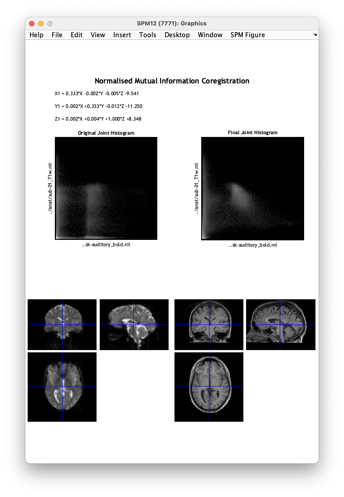

# fMRI data preprocessing

## Coregistration

Coregistration brings two images into alignment. In this case this we will be working with the subject-specific structural and functional data. 

??? info "Why coregister my data?" 
    The goal of coregistration is to put the structural and functional data in alignment and ultimately improve bringing functional data into standard space, i.e. [normalisation](./normalisation.md). 

    For a thorough overview of issues related to coregistration, see the SPM book:

    [Penny, W., Friston, K., Ashburner, J., Kiebel, S., & Nichols, T. (2006). *Statistical parametric mapping: The analysis of functional brain images* (1st ed.).](http://www.elsevierdirect.com/product.jsp?isbn=9780123725608&srccode=89660)

1. From the SPM menu panel, select `Coregister (Estimate)`. You will see a pop-up window appear looking like this:

    

2. Select `Reference image`. 
3. In the pop-up window, use the left-hand panel to navigate to `sub-01/func/`. 
4. From the right-hand panel, select the mean image generated during [realignment](./realignment.md) - `meansub-01_task-auditory_bold.nii` and press `Done`.
5. Select `Source image`.
6. In the pop-up window, navigate to `sub-01/anat/`. 
7. Select the anatomical image - `sub-01_T1w.nii` and press `Done`.
8. Save this batch for future reference - `File` :material-arrow-right-bold: `Save batch` and name it, e.g. `coregistration_batch.mat.`
9. Run your batch by pressing :material-play:.

SPM will now implement a coregistration between the structural and functional data that maximises the mutual information. In the process, the header of the source file (in this case the structural image) will be changed. Once finished, SPM will display the results of coregistration shown below. You can use the crosshair to navigate the image and check the quality of coregistration. Pay particular attention to the outline of the brain and ventricles.

### Video walk-through

--8<-- "addons/abbreviations.md"