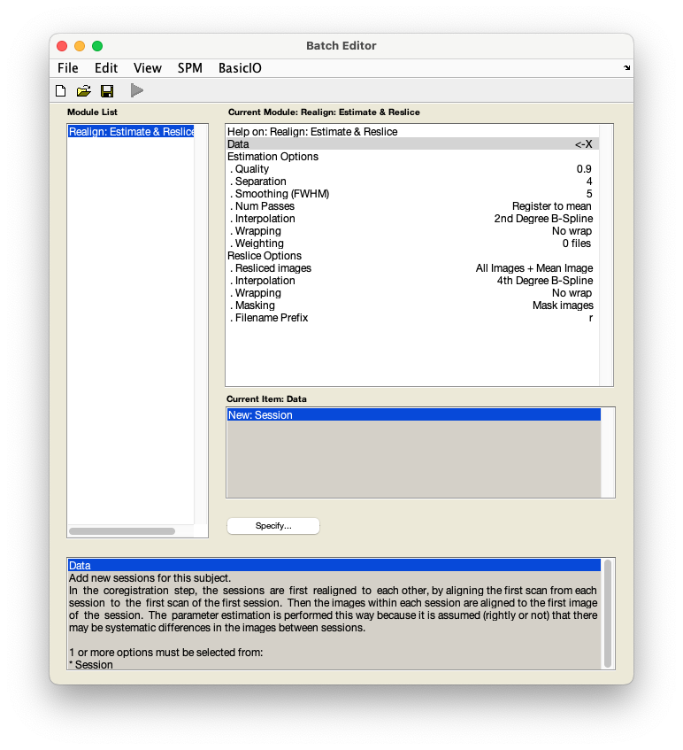
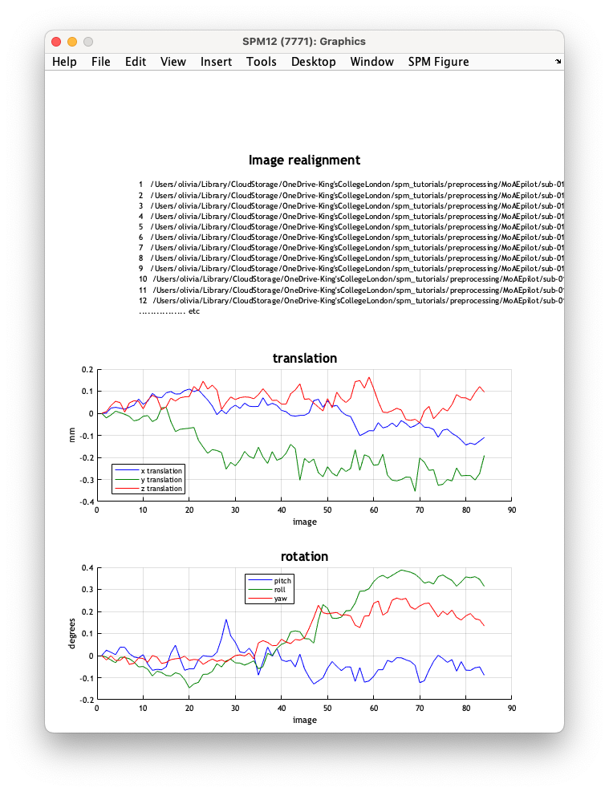

# fMRI data preprocessing

## Realignment

Realignment refers to correcting the functional data for movement that has occurred during scanning. 

??? info "Why is correcting for motion important?" 
    Motion is one of the biggest confounds in fMRI. Movement in the scanner is problematic because it can change the mapping between specific voxels and brain regions, meaning that over the course of a scan signal from one specific location in the brain may be acquired across several different voxels. Movement is also known to induce large signal changes in the data which can introduce structured spatio-temporal noise into the data and cause spurious results.

    For a thorough overview of issues related to motion in fMRI, see the SPM book:

    [Penny, W., Friston, K., Ashburner, J., Kiebel, S., & Nichols, T. (2006). *Statistical parametric mapping: The analysis of functional brain images* (1st ed.).](http://www.elsevierdirect.com/product.jsp?isbn=9780123725608&srccode=89660)

    And other readings:

    [Jenkinson, M. & Chappell, M. (2018). *Introduction to neuroimaging analysis*. Oxford University Press.](http://www.neuroimagingprimers.org/examples/introduction-primer-example-boxes/)

    [Poldrack, R. A., Mumford, J. A., & Nichols, T. E. (2011). *Handbook of functional MRI data analysis*. Cambridge University Press.](https://www.cambridge.org/core/books/handbook-of-functional-mri-data-analysis/8EDF966C65811FCCC306F7C916228529)

1. From the SPM menu panel, select `Realign (Estimate & Reslice)`. You will see a pop-up window appear looking like this:

    

2. Select `Data` :material-arrow-right-bold: `Session`. 
3. In the pop-up window, use the left-hand panel to navigate to `sub-01/func/`. 
4. Use the filter box to load the full timeseries - type `NaN` underneath `Filter` button and press ++return++.
5. In the right-hand panel, select `sub-01_task-auditory_bold.nii` - this is a 4D file containing the fMRI timeseries - and press `Done`.
6. Back in the batch window, navigate to `Resliced images` under `Reslice options` and select `Mean image only`. 
7. Save this batch for future reference - `File` :material-arrow-right-bold: `Save batch`. Give the file a meaningful name, such as `realignment_batch.mat`. 
8. Now run your batch by pressing :material-play: in the top left corner. The button will be green if all required fields have specified inputs.

    !!! tip "Top tip"
        In the SPM batch window, all fields marked with `X` require user input. Before running any SPM job make sure that you have specified inputs/parameters for all `X`'s. 

Your job is now estimating the 6-parameter (rigid body) spatial transformation that will realign the timeseries. SPM will also plot the estimated timeseries of translations and rotations shown below:

The data used to generate these plots are also saved to a text file `rp_sub-01_task-auditory_bold.txt`, so that these variables can be later used as regressors when fitting GLMs. This allows movement effects to be accounted for when estimating brain function.

!!! info "Understanding `rp_*.txt` files"
    In `rp_sub-01_task-auditory_bold.txt`, columns 1-3 represent `x`, `y` and `z` translations, while columns 4-6 correspond to `pitch`, `roll` and `yaw` rotations. 

SPM will also create a mean image `meansub-01_task-auditory_bold.nii` which will be used in [coregistration](./coregistration.md). 

## Video walkthrough

--8<-- "addons/abbreviations.md"
