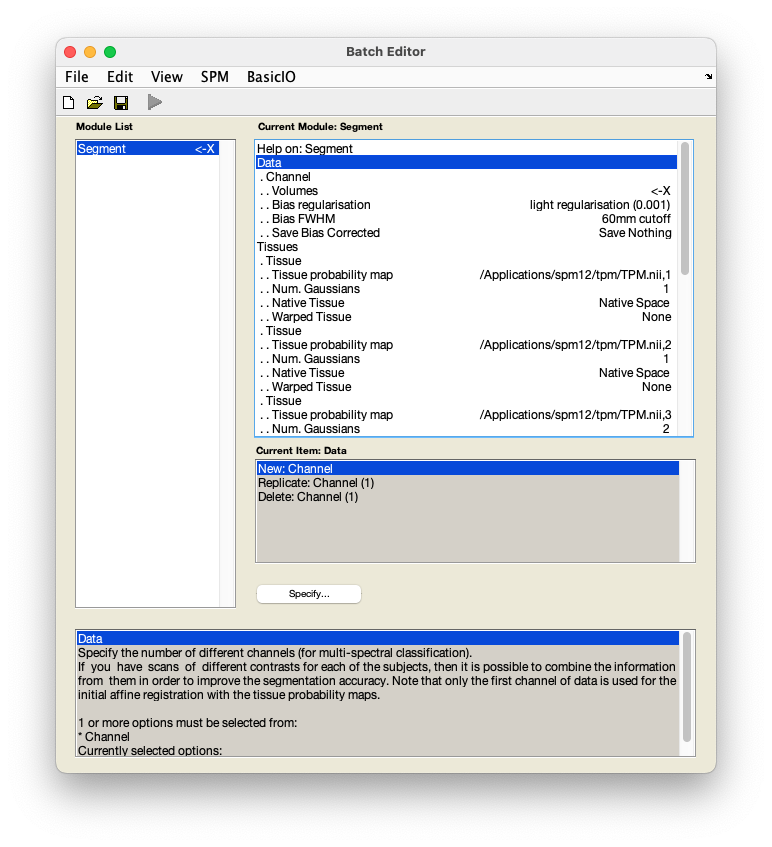

# fMRI data preprocessing

## Segmentation

Segmentation splits an image into individual tissue types. 

??? info "Why segment my data?" 
    Segmentation refers to separating your data into different tissue types. Segmentation in SPM is done based on probability maps of six tissues: grey matter, white matter, cerebrospinal fluid, non-brain soft tissues, skull, and other (representing anything not captured by the previous maps). Knowing which voxels in your image belong to which tissue type can improve [normalisation](./normalisation.md). 

    For a thorough overview of issues related to segmentation, see the SPM book:

    [Penny, W., Friston, K., Ashburner, J., Kiebel, S., & Nichols, T. (2006). *Statistical parametric mapping: The analysis of functional brain images* (1st ed.).](http://www.elsevierdirect.com/product.jsp?isbn=9780123725608&srccode=89660)

1. From the SPM menu panel, select `Segment`. You will see a pop-up window appear looking like this:

    

2. Select `Data` :material-arrow-right-bold: `Volumes`. 
3. In the pop-up window, use the left-hand panel to navigate to `sub-01/anat/`. 
4. From the right-hand panel, select the anatomical image `sub-01_T1w.nii` and press `Done`.
5. Select `Save bias corrected` :material-arrow-right-bold: `Save bias corrected`.
6. Select `Deformation fields` :material-arrow-right-bold: `Forward`.
7. Save this batch for future reference - `File` :material-arrow-right-bold: `Save batch` and name it, e.g. `segmentation_batch.mat.`
8. Run your batch by pressing :material-play:.

SPM will now create tissue-specific images (prefixed `c`) and a bias-field corrected structural image (prefixed `m`). Additionally, a deformation field (prefixed `y`) will be generated, which contains three volumes to encode the `x`, `y`, and `z` coordinates. Given that the structural and functional data have been [coregistered](./coregistration.md), this deformation field can be used in normalising the functional data. 

### Video walk-through 

--8<-- "addons/abbreviations.md"