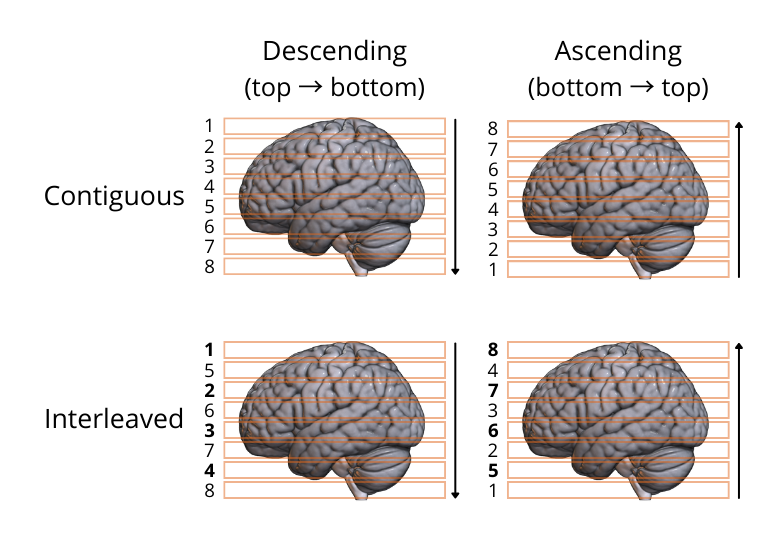

# fMRI data preprocessing

## Slice timing correction

Slice timing correction aims to account for the differences in timing of data acquisition from different slices. 

??? info "Why use slice timing correction?"
    fMRI data is often collected in slices, with one or several slices acquired at a time. This means that depending on the TR, there is a delay between the acquisition of the first and the last slice/group of slices. To fix this issue, information about the time of acquitision of each slice can be used to interpolate the signal of each slice in a volume to the same timepoint (referred to as the *reference slice*). It is thus important to know the TR and slice order acquisition of your data. 
    
    Slices can be acquired top-to-bottom (descending) or bottom-to-top (ascending) and be either contiguous or interleaved:

    [add info from SPM wiki]

    { width="550" }

    For a thorough overview of issues related to slice timing in fMRI, see the SPM book:

    [Penny, W., Friston, K., Ashburner, J., Kiebel, S., & Nichols, T. (2006). *Statistical parametric mapping: The analysis of functional brain images* (1st ed.).](http://www.elsevierdirect.com/product.jsp?isbn=9780123725608&srccode=89660)

    And other readings:

    [Jenkinson, M. & Chappell, M. (2018). *Introduction to neuroimaging analysis*. Oxford University Press.](http://www.neuroimagingprimers.org/examples/introduction-primer-example-boxes/)

    [Poldrack, R. A., Mumford, J. A., & Nichols, T. E. (2011). *Handbook of functional MRI data analysis*. Cambridge University Press.](https://www.cambridge.org/core/books/handbook-of-functional-mri-data-analysis/8EDF966C65811FCCC306F7C916228529)

### Video walkthrough

--8<-- "addons/abbreviations.md"