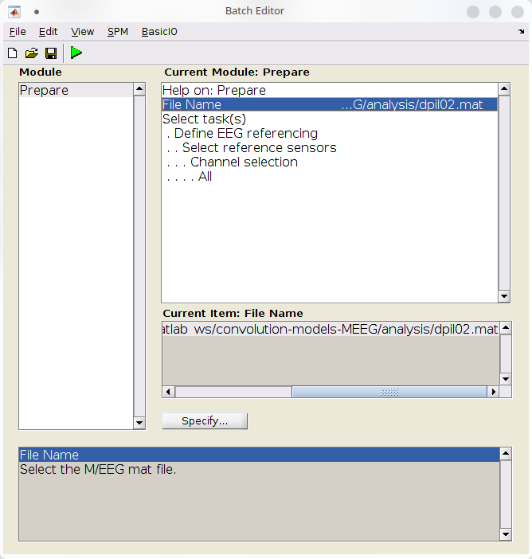
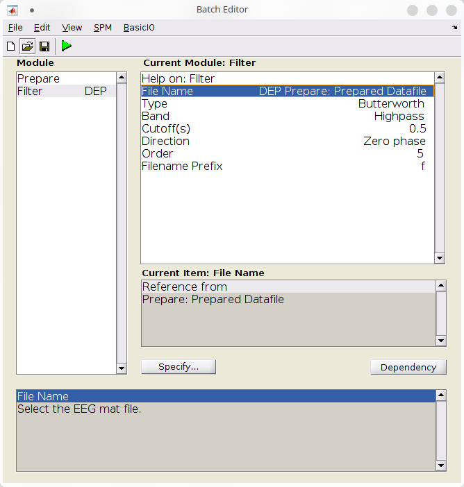
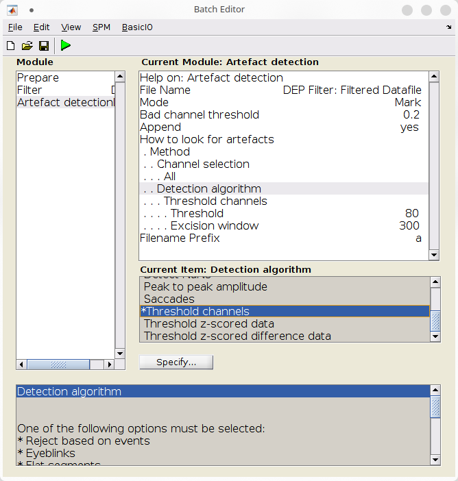
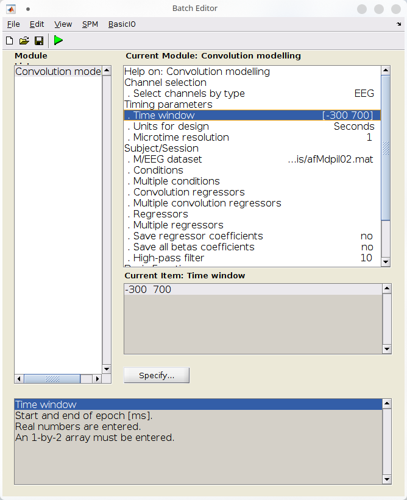
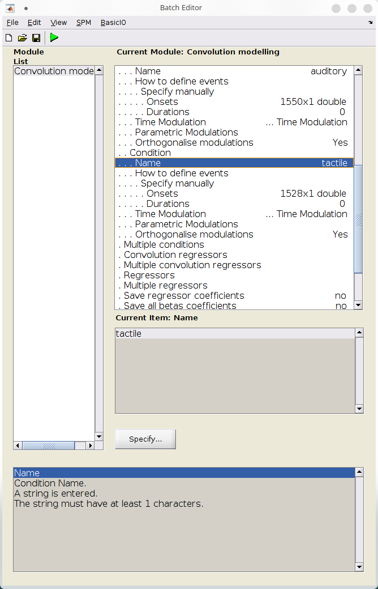
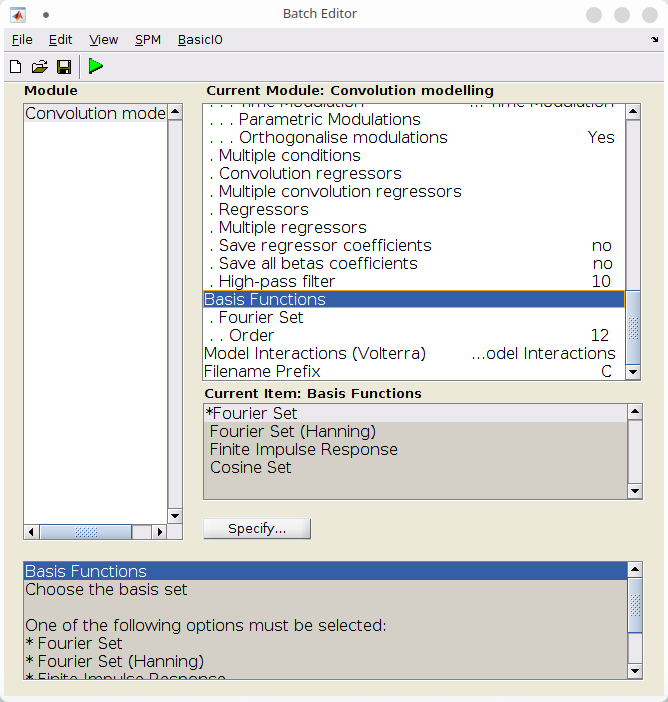
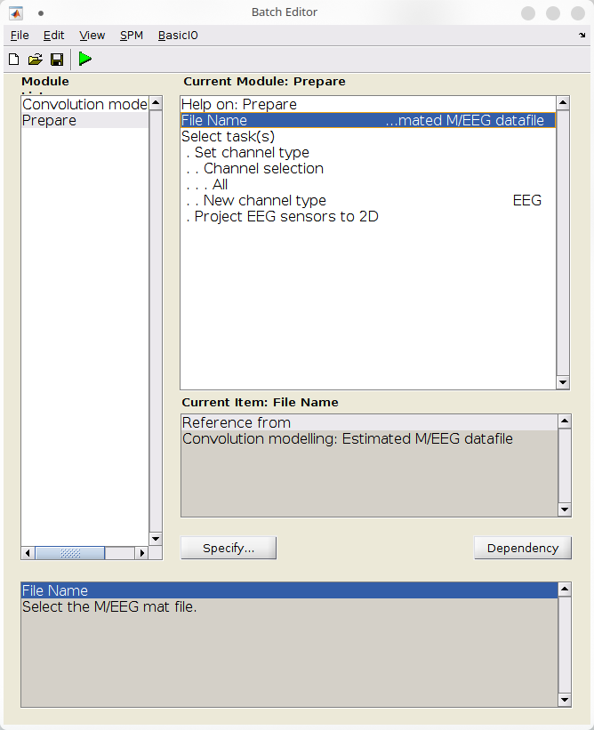
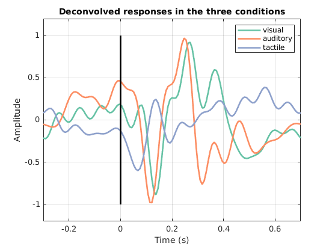

# Convolution modelling of M/EEG data


This chapter demonstrates an example of first-level modelling of M/EEG data using the convolution GLM introduced in *(V. Litvak et al., 2013)*[@Litvak_ConvModel_2013]. The example is based on a workshop held by B. Spitzer in 2015 ([see on GitHub](https://github.com/bernspitz/convolution-models-MEEG)) and reproduces the results presented in *(B. Spitzer et al., 2016)*[@spitzer2016rhythmic] for a single subject.

## Overview

The experimental setup involved presenting visual, auditory, and somatosensory stimuli to subjects in a supramodal integration task. In this example, we aim to investigate the EEG response to different modalities of sensory stimuli, specifically visual, auditory, and tactile pulses. To compare the responses, we want to capture the average event-related response for each modality across trials. However, conventional methods of averaging across trials to generate an event-related potential are not suitable for this experiment because the delay between consecutive pulses can be as short as 100 ms, resulting in overlap of the responses over time. Therefore, we need to employ more elaborate techniques to disentangle -- more precisely, to deconvolve -- the responses over time.

The convolution GLM provides a way to deconvolve the responses using a standard GLM with some particular regressors in its design matrix. In convolution GLM, the rows of the design matrix represent time, and the response regressors are obtained by convolving event indicators with a basis set. This allows us to model the possible overlap between responses to consecutive stimulis. Here, we will see how to parameterize the basis set and its duration, as well as the events, to perform convolution modelling in SPM.

??? note "More on the experimental design"
    In the following, we will be analysing single subject data. Visual stimuli were white light-emitting diodes, auditory stimuli were 1 kHz sine tones, and somatosensory stimuli were square-wave electric median nerve stimulation. Subjects were presented with a standard sequence (N1) followed by a delay and then a comparison sequence (N2) which contained the same number of pulses as N1 ± 1 pulse. Subjects were instructed to respond by pressing a foot pedal after the N2 interval offset, to identify which of the two sequences contained the more pulses. EEG was recorded from 64 active electrodes and ocular activity was registered via two pairs of additional electrodes.

---

## Preliminary steps

=== "GUI"
    
    The data provided ([here](https://www.fil.ion.ucl.ac.uk/spm/data/eeg_supramodal/)) for this tutorial have already been preprocessed. However, there are still a few preparation steps required: we need to re-reference, filter, and mark artefacts. 

=== "Script"

    1. Setup the workspace
        
        In this tutorial, we will have a standard folder layout for SPM
        analysis:
            +   the original data will be in a `data/` folder
            +   the intermediate and final datasets will be in an `analysis/`
                folder
        
        ```matlab
        clear;
        scriptpath = fileparts(matlab.desktop.editor.getActiveFilename);
        root       = spm_file(scriptpath, 'path');
        workpath   = [root filesep 'analysis'];
        datapath   = [root filesep 'data'];
        if ~exist(workpath, 'dir')
            mkdir(workpath);
        end
        ```
        Then, warm up SPM: 
        ```matlab 
        spm('defaults', 'eeg');
        ```

    2. Prepare the data
        
        The data has already been converted to SPM and downsampled to 128Hz. This is single subject data with the following tag and prefix ("d" for downsampled). Download the files and put them in the data folder. We then move them programmatically to the analysis folder (this makes sure that the original data files are kept intact). 
        ```matlab 
        tag    = 'pil02';
        prefix = 'd';
        copyfile([datapath filesep prefix tag '.\*'], workpath);
        ```

### Rereferencing

Lets reference the EEG channels against the common average. 
=== "GUI"

    *   Start SPM in EEG mode.
    *   Click on "Prepare (batch)" in the upper panel of the main SPM window,
    *   Configure the "Prepare" batch:
        -   Under file name, select "dpil02.mat",
        -   Under "Select task(s)", select "EEG referencing" and leave defaults settings to reference against the average.

    <figure markdown>
      {#fig:meeg-firstlevel:prepare width:"75%"}
      <figcaption>Options for the Prepare batch</figcaption>
    </figure>
        
=== "Script"
    
    First, load the data:
    ```matlab
    D = spm_eeg_load([workpath filesep prefix tag '.mat']);
    ```
    Then, define the transform to apply to make the new (rereferenced) montage: 
    ```matlab
    tra             = zeros(66, D.nchannels);
    tra(1:64, 1:64) = eye(64) - 1/64;
    tra(65, 67:68)  = [1 -1];
    tra(66, 65:66)  = [1 -1];
    ```
    In addition we need to specify that EOG channels are bipolar, thus only the difference is of interest.
    Finally, use spm_eeg_montage to transform the data:

    ```matlab
    S = []; 
    
    S.D                = [workpath filesep D.fname];
    S.montage.tra      = tra;
    S.montage.labelnew = [D.chanlabels(1:64) 'VEOG' 'HEOG'];
    S.montage.labelorg = D.chanlabels;
    S.keepothers       = 0;
    
    [D, montage] = spm_eeg_montage(S);
    
    prefix = ['M' prefix];
    ```

### Filtering

We high-pass filter the data at 0.5Hz:

=== "GUI" 

    *   Add a "filter" batch (SPM &gt;M/EEG &gt;Preprocessing &gt;Filter),
    *   Configure a 5th-order Butterworth highpass filter at $0.5Hz$:
        -   Under file name, use the dependency button to refer to the file produced by the previous batch,
        -   Under "Band", select "Highpass",
        -   Under "Cutoff(s)", specify "0.5",

    <figure markdown>
      {#fig:meeg-firstlevel:filter width:"75%"}
      <figcaption>Options for the Filter batch</figcaption>
    </figure>

=== "Script"
    
    ```matlab
    S = [];
     
    S.D    = [workpath filesep D.fname];
    S.type = 'butterworth';
    S.band = 'high';
    S.freq = 0.5;
    
    D = spm_eeg_filter(S);
    
    prefix = ['f' prefix];
    ```


### Marking artefacts

We will now mark the artefacts. Note that we are working with continuous data so there is no trivial way of rejecting the artefacts. However, segments marked as artefacts will be omitted by the convolution GLM. Here, we will mark artefacts based on threshold crossing for a certain time (quick and dirty).

=== "GUI" 

    *   Add an "Artefact detection" batch (SPM &gt;M/EEG &gt;Preprocessing &gt;Artefact detection),
    *   Configure the batch to mark artefactual samples:
        -   Under file name, use the dependency button to refer to the file produced by the previous batch,
        -   Under "Mode", select "Mark",
        -   Under "Detection algorithm", select "Threshold channels",
        -   Under "Threshold", specify "0.8",
        -   Under "Excision window", specify "300",

    <figure markdown>
      {#fig:meeg-firstlevel:artefacts-options width:"75%"}
      <figcaption>Options for the Artefacts batch</figcaption>
    </figure>

    Now that we have configured all the preprocessing steps, we can run the batch with the "Play" button.This batch should populate several files, the last being "afMdpil02.mat", containing the data that we will model with convolution GLM.

=== "Script"

    
    ```matlab
    S = [];
    
    S.D                          = [workpath filesep D.fname];
    S.mode                       = 'mark';
    S.badchanthresh              = 0.2;
    S.methods.channels           = {'all'};
    S.methods.fun                = 'threshchan';
    S.methods.settings.threshold = 80;
    S.methods.settings.excwin    = 300;
    S.append                     = 0;
    
    D = spm_eeg_artefact(S);
    
    prefix = ['a' prefix];
    ```
    
    Finally, mark the channel 'T8' as bad:
    
    ```matlab
    D = spm_eeg_load([workpath filesep prefix tag '.mat']);
    D = D.badchannels(D.indchannel('T8'), 1);
    save(D);
    ```


## Constructing the convolution GLM model

### Preliminary steps

We shall first load the file called "events.mat". It contains the events onset times are stored in 3 cells corresponding to visual, auditory, and tactile events. Each cell contains the time in seconds (aligned to EEG data) at which the event occurs. 

=== "GUI" 

    After loading the file in Matlab, go to the main SPM window and click on "Specify 1st-level" to start convolution modelling. 

=== "Script"

    ```matlab
    load([datapath filesep 'events.mat'], 'events');
    condnames = {'visual'; 'auditory'; 'tactile'};
    ```

We can then configure our convolution model.

### Data, channels, timing


The first step is to tell SPM that we want to model the response on our EEG channels, in a peristimulus time window between 300ms before and 700ms after event onset.

=== "GUI" 

    -   Specify the channels to model under "Channel selection":
        +   Remove the default entry ("Delete: All")
        +   Click "Select channel by type" &gt; "EEG"
    -   Specify the timing parameters
        +   Under "Time window", set $[-300 \;\; 700]$. 
        +   Under "Unit for design", set "seconds"
    -   Under "M/EEG dataset", select the last file produced at the previous section ("afMdpil02.mat"). 

    <figure markdown>
      {#fig:meeg-firstlevel:conv-top width:"75%"}
      <figcaption>Setting the channels and timing parameters of the convolution model</figcaption>
    </figure>

=== "Script"

    ```matlab
    convmodel = [];
    
    convmodel.sess.D           = {[workpath filesep D.fname]};
    convmodel.channels{1}.type = 'EEG';
    convmodel.timing.timewin   = [-300 700];
    ```


### Model structure

We can now specify the structure of the model, in particular, the timing of the events that we want to model.  

For each condition (here, the sensory modalities), we need to specify the event times and duration, as well as other parameters such time or parametric modulation (SPM documentation on fMRI can be helpful in grasping these concepts). We use no parametric nor time modulation, and do not orthogonalize the basis set, which is already orthogonal.

Note that we want to model the response to instantaneous events (i.e. stick functions), whence we set the event duration to zero. However, under certain conditions one may want to use a specific duration, in which case the basis set will be convolved with a boxcar function.

=== "GUI"

    *   We will now specify the events for each condition. To do so:
        -   Click "Conditions" &gt; "New: Condition",
        -   Under name, set "visual",
        -   We will set the event times manually. Under "How to define events", select "Manually"
        -   Under "Onset", type "events{1}". This corresponds to the event onsets times from the "events.mat" file for event 1
        -   Under "Duration", set 0. This will cause SPM to create stick functions at event onset.
        -   Leave over parameters of that section to their defaults
    *   Repeat the previous steps for "auditory" and "tactile" events, whose onsets are stored in "events{2}" and "events{3}".

    <figure markdown>
      {#fig:meeg-firstlevel:conv-other width:"75%"}
      <figcaption>Specifying the conditions of the convolution model</figcaption>
    </figure>

=== "Script"
    
    ```matlab
    for c = 1:numel(condnames)
        % Condition name
        convmodel.sess.cond(c).name = condnames{c};
    
        % Event onset times in seconds, aligned to data
        convmodel.sess.cond(c).define.manual.onset = events{c};
    
        % Event duration in seconds, 0 for stick functions
        convmodel.sess.cond(c).define.manual.duration = 0;
    
        % Additional model parameters
        convmodel.sess.cond(c).tmod = 0;
        convmodel.sess.cond(c).pmod = struct('name', {}, 'param', {}, 'poly', {});
        convmodel.sess.cond(c).orth = 0;
    end
    ```

### Basis set

The last important step is to specify the basis set and its order. 

Here, we use a Fourier basis set of order 12, which will consist of 12 pairs of sine and cosine at different frequencies, plus an intercept, for a total of 25 basis functions.

!!! info "Basis set order and frequency resolution"
    Note that the order of the Fourier set interplays with the size of the time window: for a window of duration $T$, the pairs of sine and cosine have frequencies $1/T, 2/T, \dots, n/T$, where $n$ is the order of the basis set. Thus, increasing the basis order will allow to capture faster and faster variations of the response (up to Nyquist frequency), at the expense of computational power.  Here, we have a window of 1s and wlil be capturing changes in the response between 1 to 12Hz with a resolution of 1Hz.  

=== "GUI"

    *   Under "Basis Functions":
        -   Make sure that the selected basis set is "Fourier Set".
        -   Make sure that the "Order" is 12.

    <figure markdown>
      {#fig:meeg-firstlevel:conv-basis width:"75%"}
      <figcaption>Specifying the conditions of the convolution model</figcaption>
    </figure>

=== "Script"
    ```matlab
    convmodel.bases.fourier.order = 12;
    ```

??? tips "Visualizing sample responses captured by a 12th order basis set"

    Let's visualize the basis set and sample possible responses.

    ```matlab
    timevec = convmodel.timing.timewin(1):1000/D.fsample:convmodel.timing.timewin(2);

    xBF        = struct;
    xBF.dt     = 1/D.fsample;
    xBF.name   = 'Fourier set';
    xBF.length = diff(convmodel.timing.timewin)/1000;
    xBF.order  = 12;

    xBF = spm_get_bf(xBF);

    weights   = normrnd(0,1,[25, 4]);
    bfs       = xBF.bf;
    responses = bfs * weights;

    figure;
    subplot(1, 2, 1);
    plot(timevec, xBF.bf(:, 1:6), [0 0], [-1.5, 1.5], 'black');
    xlim(convmodel.timing.timewin); ylim([-1.5, 1.5]);
    subplot(1, 2, 2);
    bounds = [min(responses, [], 'all')-1, max(responses, [], 'all')+1];
    plot(timevec, responses, [0 0], bounds, 'black');
    xlim(convmodel.timing.timewin); ylim(bounds);
    ``` 


### Finals steps

=== "GUI"

    A final step is to restablish the sensors type and locations using a Prepare batch (SPM &gt; M/EEG &gt; Preprocessing &gt; Prepare).

    *   Under "File name", click "Dependency" and select the output from the Convolution modelling batch,
    *   Under "Select task(s)":
        -   Click "Set channel type", and set "New channel type" to "EEG"
        -   Click "Project EEG sensors to 2D".

    <figure markdown>
      {#fig:meeg-firstlevel:prepare-post-conv width:"75%"}
      <figcaption>Final prepare batch to fix sensors types and locations.</figcaption>
    </figure>
        
    Finally, run the batch with the "Play" button. 

=== "Script"

    1.  Set unused arguments to default
    
        There are other more advanced parameters for this batch. We let them to default as we are not using them here. Interested users can look at the help for the "Convolution Modelling" batch in the GUI, and to that of the "fMRI Model Specification" batch (which is used under the hood).

        ```matlab
        convmodel.sess.hpf       = 10;
        convmodel.sess.multi     = {''};
        convmodel.timing.units   = 'secs';
        convmodel.timing.utime   = 1;
        convmodel.sess.multi_reg = {''};
        convmodel.volt           = 1;
        convmodel.sess.savereg   = 0;
        convmodel.prefix         = 'C';
        ```
    
    2.  Put everything in a matlabbatch and run it
        ```matlab 
        matlabbatch = {};
        matlabbatch{1}.spm.meeg.modelling.convmodel = convmodel;

        spm_jobman('serial', matlabbatch);
        
        prefix = ['C' prefix];
        ```
        
    4.  Restablish the 2D coordinates

        ```matlab
        coords = D.coor2D;
        D      = spm_eeg_load([workpath filesep prefix tag '.mat']);
        D      = coor2D(D, 1:64, coords);
        D      = chantype(D, ':', 'EEG');
        save(D);
        ```

This produces a MEEG dataset with the deconvolved evoked responses for each of the three conditions.

---

### Summary

To summarize, we have generated a Convolution GLM batch for our model to capture the response to each condition within a specific timeframe. Specifically, the design matrix created for this purpose has captured responses between 300ms before and 700ms after event onset, by expanding it on a 12th-order Fourier basis. This enables us to express the response as the weighted sum of 12 cosines and 12 sines, along with an intercept that captures the mean value. Note that the window of 1 second and the 12th-order Fourier basis allows us to capture oscillations between 1 and 12Hz, with a frequency resolution of 1Hz.

Using SPM, the convolution GLM generates a new M/EEG dataset that contains the deconvolved responses as evoked data. 

!!! tip "Under the hood, SPM performs several operations..."
    1.   It creates a design matrix $X$ for our problem $Y = X \beta + \varepsilon$, with time as rows and basis functions for each condition as columns.
    2.   It then inverts the model to obtain an estimate of the parameters that weight the basis set, represented by $\beta = (X^TX)^{-1} X^T Y$. The rows of $\beta$ correspond to the weight of each basis function, stacked for each condition $c$.
    3.   It uses the basis function weights for condition $c$ to construct the deconvolved responses, represented by $y_c = x_{BF} \beta_c$.

Thus, the batch in this tutorial results in a M/EEG dataset of evoked responses, which contains three trials for each of our three conditions.

## Results

### Scalp maps

The results can be visualized in the SPM's M/EEG viewer. 
=== "GUI"

    Click on the "Display..." menu in the main SPM window and select the data file "CafMdpil02.mat".  

=== "Script"

    ```matlab
    spm_eeg_review(D);
    ```


Selecting EEG and then clicking on the scalp image shows the deconvolved response over the scalp. By positioning the peristimulus time cursor tenth to hundreds of milliseconds after stimulus onset, we can observe the stereo-typical scalp maps of visual, auditory, and tactile stimuli (Figure [1.8](#fig:meeg-firstlevel:scalp){reference-type="ref" reference="fig:meeg-firstlevel:scalp"}). 

<figure markdown>
  [Scalp maps of deconvolved responses to the different stimuli at particular time of interest](../../assets/figures/tutorials/meeg/meeg_firstlevel/scalp.png){#fig:meeg-firstlevel:scalp width:"75%"}
  <figcaption>Scalp maps of deconvolved responses to the different stimuli at particular time of interest.</figcaption>
</figure>


### Average response over frontocentral channels.

We look at the average response on the fronto-central channels in the 3 different conditions, to see how different are the deconvolved responses.

=== "GUI"    
    Copy and past the following code in Matlab command window, or in a new script. Make sure that you are in the same directory as the file "CafMdpil02.mat". 


    ```matlab
    D  = spm_eeg_load('CafMdpil02.mat'); 
    Ic = D.indchannel({ ...
        'Fz', 'F1', 'F2', 'F3', 'F4'...
        'FCz', 'FC1', 'FC2', 'FC3', 'FC4'...
        'Cz', 'C1', 'C2', 'C3', 'C4'...
    });
    y = squeeze(mean(D(Ic, :, :), 1));
    t = D.time();
    
    figure; hold on;
    plot(t, y, 'LineWidth', 2);
    plot([0 0], [-1 1], 'k', 'LineWidth',2);
    legend(D.condlist); box on; grid on;
    xlim([min(t), max(t)]); ylim([-1.2 1.2]);
    xlabel('Time (s)'); ylabel('Amplitude');
    title('Deconvolved responses in the three conditions');
    hold off;
    ```

=== "Script"

    ```matlab
    Ic = D.indchannel({ ...
        'Fz', 'F1', 'F2', 'F3', 'F4'...
        'FCz', 'FC1', 'FC2', 'FC3', 'FC4'...
        'Cz', 'C1', 'C2', 'C3', 'C4'...
    });
    y = squeeze(mean(D(Ic, :, :), 1));
    t = D.time();
    
    figure; hold on;
    plot(t, y, 'LineWidth', 2);
    plot([0 0], [-1 1], 'k', 'LineWidth',2);
    legend(D.condlist); box on; grid on;
    xlim([min(t), max(t)]); ylim([-1.2 1.2]);
    xlabel('Time (s)'); ylabel('Amplitude');
    title('Deconvolved responses in the three conditions');
    hold off;
    ```


<figure markdown>
  {#fig:meeg-firstlevel:responses width:"75%"}
  <figcaption>Average responses over fronto-central channels for the different stimuli.</figcaption>
</figure>

### Concluding remarks

In summary, convolution modelling proves to be a powerful tool to disentangle responses that overlap over time (Figure [1.9](#fig:meeg-firstlevel:responses){reference-type="ref" reference="fig:meeg-firstlevel:responses"}), and can be used as a preliminary step to extract event related responses for subsequent statistical analysis.

In practice, convolution modelling can replace the classical "epoching and averaging" steps of an evoked response pipeline. As such, it produces an evoked response dataset that can be used in second-level analysis. 

## Acknowledgments

We thank Bernhard Spitzer for putting up the code from which this tutorial derives and for kindly allowing us to share the data analysed in this chapter.
