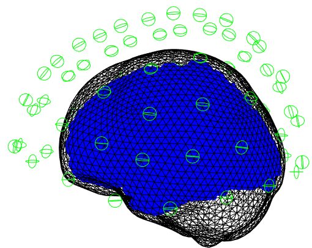

# Optical Co-registration 
When we do not have an MRI for a participant we can register the MNI template scalp to the participant's head shape. We will then register the  head shape to the helmet and subsequently to the sensor positions.

## Reading the data 
We first start by reading the data as we normally would.

```matlab

%- read data 
%--------------------------------------------------------------------------
S = [];
S.data ='OPM_meg_001.cMEG';
S.positions= 'OPM_HelmConfig.tsv';
D = spm_opm_create(S);
```

## Reading and marking the meshes 
We now must mark a number of fiducial points on our meshes. We will need to mark 

1. 3 points on the helmet file (which contains sensor positions) 
2. 3 corresponding points on the mesh with the head and helmet present 
3. 3 points on the head shape mesh 
4. 3 point on the corresponding mesh file with the head and helmet present


##  Optical Co-registration to a template
The optical co-registration requires that the head shape file `S.headfile` be provided in any format that the `gifti` function supports as well as the 4 sets of fiducial points. Note that the fiducial points are provided to the functions in row order.
 
```matlab
S=[];
S.D = D;
S.headfile  ='head.obj';

 S.helmetref= ...
[0,133.9,-24;...     %point 1 
-114,30.5,-61;...    %point 2
116,29,-59];         %point 3

S.headhelmetref = ...
[77,-23,608;...    %point 1
31,90,715;...      %point 2
26,-141,692];      %point 3

S.headfid = ...
[111.626,-9,504;... % nas
97, 54, 551;...     % lpa
84, -67, 548];      % rpa 

S.headhelmetfid  = ... 
[33,-22.6,654;...   % nas
14.7, 38.9, 699;... % lpa
5,-82,693];         %rpa

cD = spm_opm_opreg(S);
```

If the co-registration works we should get an image of a brain within the sensor array like the one below

<figure markdown>
  <div class="center">
    
  </div>
  <figcaption>Template Coregistration</figcaption>
</figure>


--8<-- "addons/abbreviations.md"
