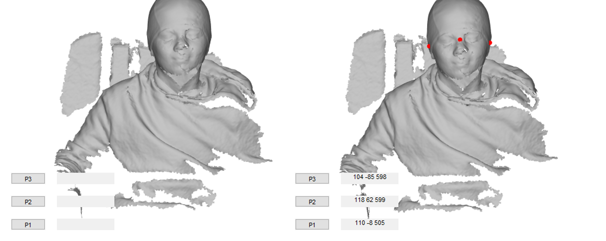

# Co-registration 
Co-registration refers to the process of working out the position of the OPM sensors relative to the brain. There are many factors that influence this process. For instance, are you using a generic helmet or a subject specific helmet? Do you have an MRI of the participant or do you wish to use a template MRI? Do you have fiducial points or do have head-shape points from an optical scan?  

## Co-registration to a template with an optical scanner 
When we do not have an MRI for a participant we can register the MNI template scalp to the participant's head shape. We will then register the  head shape to the helmet and subsequently to the sensor positions. The figure below graphically shows the order of registration.

<figure markdown>
  <div class="center">
    
  </div>
</figure>


We first start by reading the data as we normally would.

```matlab

%- read data 
%--------------------------------------------------------------------------
S = [];
S.data ='OPM_meg_001.cMEG';
S.positions= 'OPM_HelmConfig.tsv';
D = spm_opm_create(S);
```
We now must mark a number of fiducial points on our meshes. We will need to mark 

1. 3 points on the helmet file (which contains sensor positions) 
2. 3 corresponding points on the mesh with the head and helmet present 
3. 3 points on the head shape mesh 
4. 3 point on the corresponding mesh file with the head and helmet present

Once the points are marked we can do the registration. The  co-registration requires that the head shape file `S.headfile` be provided in any format that the `gifti` function supports as well as the 4 sets of fiducial points we have marked. Note that the fiducial points are provided to the functions in row order.
 
```matlab
S=[];
S.D = D;
S.headfile  ='head.obj';

 S.helmetref= ...
[0,133.9,-24;...     %point 1 
-114,30.5,-61;...    %point 2
116,29,-59];         %point 3

S.headhelmetref = ...
[77,-23,608;...    %point 1
31,90,715;...      %point 2
26,-141,692];      %point 3

S.headfid = ...
[111.626,-9,504;... % nas
97, 54, 551;...     % lpa
84, -67, 548];      % rpa 

S.headhelmetfid  = ... 
[33,-22.6,654;...   % nas
14.7, 38.9, 699;... % lpa
5,-82,693];         %rpa

cD = spm_opm_opreg(S);
```

If the co-registration works we should get an image of a brain within the sensor array like the one below

<figure markdown>
  <div class="center">
    
  </div>
  <figcaption>Template Coregistration</figcaption>
</figure>

## Manually Marking fiducials on meshes

To mark the fiducials we use the function `spm_mesh_select`. The function supports any file format supported by gifti method used to read meshes ('.vtk', '.obj', '.ply', '.off', '.stl', '.mz3'). 

```matlab
g = gifti('headshape.obj');
spm_mesh_select(g);
```
This code will create an interactive figure of the mesh. When you have rotated the mesh so that a fiducial of interest is in view you can press the P1, P2 or P3 button. This will lock the mesh in place. Now when you single click on the figure a red sphere will be placed at the location, an associated text box will appear with the coordinate. After you have selected the fiducial point you will once again be able to rotate the mesh. If you wish to change a selected point just click the associated  button again. 

<figure markdown>
  <div class="center">
    
  </div>
  <figcaption>Selecting fiducials</figcaption>
</figure>

## Co-registration to an MRI with an optical scanner 

## Co-registration using subject specific helmets


--8<-- "addons/abbreviations.md"
