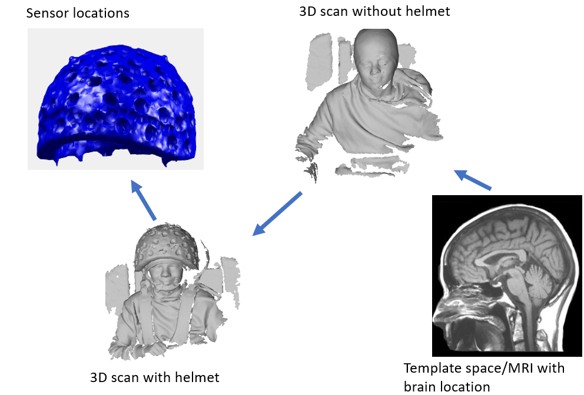
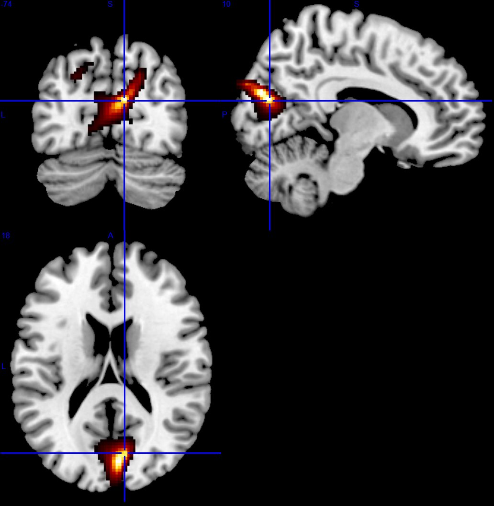

# Source Level: Evoked response pipeline

## Introduction

This page goes through an example pipeline for a source-level evoked response analysis. Some of the steps will be similar to the [Sensor Level: evoked response tutorial](../evoked/) and will not be covered here. We will therefore not xver these steps in depth.

```matlab
%- read data 
%--------------------------------------------------------------------------
S = [];
S.data ='OPM_meg_001.cMEG';
S.positions= 'OPM_HelmConfig.tsv';
D = spm_opm_create(S);

%- highpass
%--------------------------------------------------------------------------
S=[];
S.D=D;
S.freq=[10];
S.band = 'high';
fD = spm_eeg_ffilter(S);
fr =S.freq;

%- lowpass
%--------------------------------------------------------------------------
S=[];
S.D=fD;
S.freq=[70];
S.band = 'low';
fD = spm_eeg_ffilter(S);

%- adaptive multipole models
%--------------------------------------------------------------------------
S=[];
S.D= fD;
S.corrLim=.98;
mD = spm_opm_amm(S);

%- epoch 
%--------------------------------------------------------------------------
S =[];
S.D=mD;
S.timewin=[-50 200];
S.triggerChannels ={'Trigger 6 Z'};
eD= spm_opm_epoch_trigger(S);

%- baseline correction 
%--------------------------------------------------------------------------
S=[];
S.D = eD;
S.timewin = [-50 0];
eD = spm_eeg_bc(S);

```


## Coregistration
When we do not have an MRI for a participant we can register the MNI template scalp to the participant's head shape. We will then register the  head shape to the helmet and subsequently to the sensor positions. The figure below graphically shows the order of registration.

<figure markdown>
  <div class="center">
    
  </div>
</figure>

Before we run the coregistration code we need to mark a number of fiducial points on our meshes. We will need to mark 

1. 3 points on the helmet file (`S.helmetref`). 
2. 3 corresponding points on the mesh with the head and helmet present (`S.headhelmetref`).
3. 3 points on the head shape mesh (`S.headfid`).
4. 3 point on the corresponding mesh file with the head and helmet present (`S.headhelmetfid`).


To mark these points we can use [`spm_mesh_selct`](https://www.fil.ion.ucl.ac.uk/spm/docs/tutorials/opm/coreg/#manually-marking-fiducials-on-meshes).
Once the points are marked we can do the registration. The  co-registration requires that the head shape file `S.headfile` be provided in any format that the `gifti` function supports as well as the 4 sets of fiducial points we have marked. Note that the fiducial points are provided to the functions in row order. 

```matlab
S=[];
S.D = eD;
S.headfile  ='head.obj';

 S.helmetref= ...
[0,133.9,-24;...     %point 1 
-114,30.5,-61;...    %point 2
116,29,-59];         %point 3

S.headhelmetref = ...
[77,-23,608;...    %point 1
31,90,715;...      %point 2
26,-141,692];      %point 3

S.headfid = ...
[111.626,-9,504;... % nas
97, 54, 551;...     % lpa
84, -67, 548];      % rpa 

S.headhelmetfid  = ... 
[33,-22.6,654;...   % nas
14.7, 38.9, 699;... % lpa
5,-82,693];         %rpa

cD = spm_opm_opreg(S);
```

<figure markdown>
  <div class="center">
    
  </div>
  <figcaption>Template Coregistration</figcaption>
</figure>

## DAISS: data specification
At this point, we have the data in the appropriate format to perform source reconstruction. There are many different types of source reconstruction algorithms but we will use one called Minimum Norm. A guide on using [Beamformers](https://www.fil.ion.ucl.ac.uk/spm/docs/tutorials/daiss/daiss_beamforming/#beamforming-opm-data) in SPM is provided in a separate tutorial. We will use a SPM toolbox called DAiSS to perform the analysis. The first step of the pipeline is to tell the toolbox where we want to store the output(`S.dir`), what data we want to use(`S.D`) and what coordinate system we want to work in (`S.space`). We then run the function `bf_wizard_data`. The function returns the file path to where the output is stored.

```matlab
bfDir = 'C:\Users\path\to\folder';
S = [];
S.dir = bfDir;
S.D = fname(eD);
S.space = 'Head';
[BF] = bf_wizard_data(S);
```

## DAiSS: source specification
After we have told the toolbox what data we want to use we can specify what structure we want the source space to have. Some of the most common options would be to use a grid or a mesh. We will use a grid (`S.method`) here and specify the resolution (`S.(S.method).resolution`) of the grid as 5 mm. Making this value smaller will improve resolution but also increase computation time. 

```matlab
S = [];
S.BF = BF;
S.method = 'grid';
S.(S.method).resolution = 5;
BF = bf_wizard_sources(S);
```
## DAiSS: covariance specification
For some inversion algorithms it is important for the algorithm to incorporate information from the data covariance. As we are using the minimum norm method we won't worry about this section and just use the default parameters. 

```matlab
S = [];
S.BF = BF;
BF = bf_wizard_features(S);
```
## DAiSS: inverse specification
We can now specify the type of source reconstruction algorithm we want to use (the inverse method). The minimum norm method only has one user configurable parameter (`S.(S.method).snr`) which we will set to 10^2. 

??? info "How do I pick a value for S.(S.method).snr?"
	We can understand this parameter as a regularisation parameter. Bigger values will make the result more focal but with lower SNR. Smaller values will improve SNR but compromise resolution. A rule of thumb is set this value to the be the square of your sensor level SNR. So if you have t-values of about 10 at sensor level set this value to 10^2.

```matlab	
S =[];
S.BF=BF;
S.method = 'minimumnorm';
S.(S.method).snr=10^2;
BF = bf_wizard_inverse(S);
```

## DAiSS: statistic computation
The final step of source reconstruction is to decided on the statistical analysis that will be conducted in the source space. There are a myriad of analyses that could be conducted but we will conduct a t-contrast comparing the magnitude of the signal at  ~90ms to the baseline time point (1ms).  

```matlab
S= [];
S.BF=BF;
S.act = 90;
S.base=1;
bf_stat_evoked_t(S);
```
??? info "Can I use a different condition for my baseline and activation period?"
	Yes, you just need to specify this as an argument to `S.condact` and `S.condbase`. By default the function sets both these values to 'ALL'. Change this string to whatever the name of your condition is and you will be able to compare across conditions.

The output, by default, is in MNI space and  you can now view the result in your favourite MRI viewer such as mricron. 

<figure markdown>
  <div class="center">
    
  </div>
  <figcaption>Source level evoked response</figcaption>
</figure>

## A complete script 
Below we include the whole script required to perform the source space modelling 

```matlab
%- read data 
%--------------------------------------------------------------------------
S = [];
S.data ='OPM_meg_001.cMEG';
S.positions= 'OPM_HelmConfig.tsv';
D = spm_opm_create(S);

%- highpass
%--------------------------------------------------------------------------
S=[];
S.D=D;
S.freq=[10];
S.band = 'high';
fD = spm_eeg_ffilter(S);
fr =S.freq;
%- lowpass
%--------------------------------------------------------------------------
S=[];
S.D=fD;
S.freq=[70];
S.band = 'low';
fD = spm_eeg_ffilter(S);


%- adaptive multipole models
%--------------------------------------------------------------------------
S=[];
S.D= fD;
S.corrLim=.98;
mD = spm_opm_amm(S);

%- epoch 
%--------------------------------------------------------------------------
S =[];
S.D=mD;
S.timewin=[-50 200];
S.triggerChannels ={'Trigger 6 Z'};
eD= spm_opm_epoch_trigger(S);

S=[];
S.D = eD;
S.timewin = [-50 0];
eD = spm_eeg_bc(S);

%- read and mark meshes
%--------------------------------------------------------------------------
S=[];
S.D = eD;
S.headfile  ='head.obj';

 S.helmetref= ...
[0,133.9,-24;...   %nas
-114,30.5,-61;...    %lpa
116,29,-59];      %rpa

S.headhelmetref = ...
[77,-23,608;...   %nas
31,90,715;...    %lpa
26,-141,692];      %rpa

S.headfid = ...
[111.626,-9,504;... % nas
97, 54, 551;...% lpa
84, -67, 548];    % rpa 

S.headhelmetfid  = ... 
[33,-22.6,654;... % nas
14.7, 38.9, 699;...% lpa
5,-82,693];   %rpa
eD = spm_opm_opreg(S);

% daiss data setup
%--------------------------------------------------------------------------
bfDir = 'C:\Users\path\to\folder';

S = [];
S.D = fname(eD);
S.dir = bfDir;
S.space = 'Head';
[BF] = bf_wizard_data(S);

% daiss sources
%--------------------------------------------------------------------------

S = [];
S.BF = BF;
S.method = 'grid';
S.(S.method).resolution = 5;
BF = bf_wizard_sources(S);

% daiss covaraince features. 
%--------------------------------------------------------------------------
S = [];
S.BF = BF;
BF = bf_wizard_features(S);

% daiss inverse
%--------------------------------------------------------------------------
S =[];
S.BF=BF;
S.method = 'minimumnorm';
S.(S.method).snr=10^2;
BF = bf_wizard_inverse(S);

%- stats
%--------------------------------------------------------------------------

S= [];
S.BF=BF;
S.act = 90;
S.base=1;
bf_stat_evoked_t(S);

```

--8<-- "addons/abbreviations.md"
