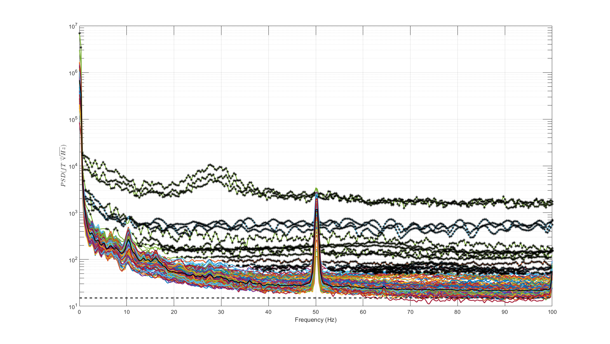
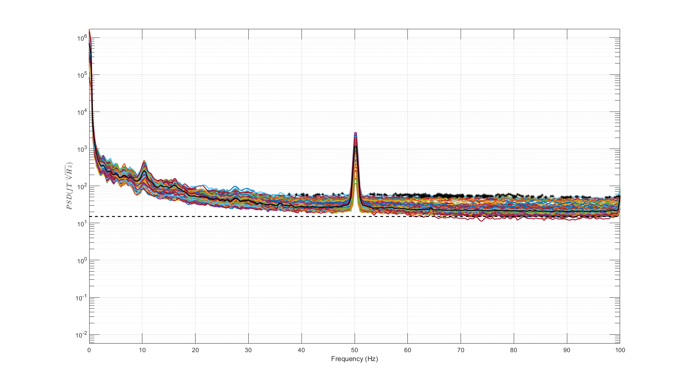
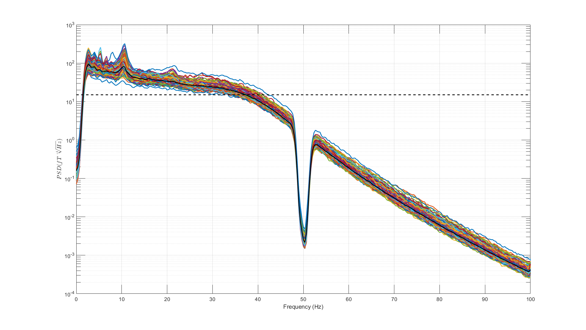
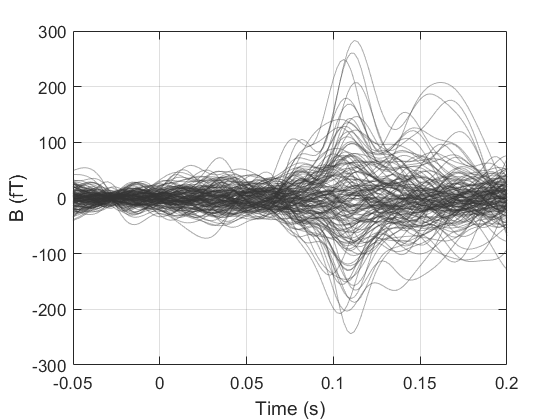
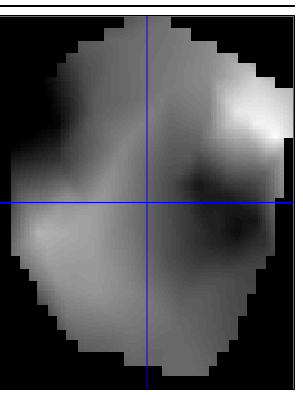
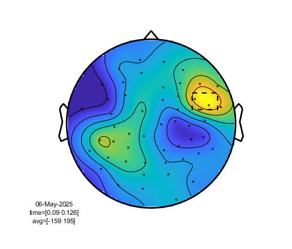

# Neuro-1 example: auditory evoked field

## Introduction

This code example will read in, process and analyse OPM-MEG data from a single subject recorded using a Neuro-1 QuSpin system. The aim here is to show how, with spm, a code-only approach can be used for reading in data, pre-processing, analysing and plotting data at sensor level.

## Download example data

The data used can be downloaded [here](https://www.fil.ion.ucl.ac.uk/spm/data/opm/opm-tutorial-neuro1.zip).

```matlab
data_dir = 'D:\data\opm-tutorial-neuro1';
cd(data_dir)
```

## Read in the data

This data is in MEG BIDS format, so if there were more subjects the same script could be used by changing only these parameters.

```matlab
BIDS = [];
BIDS.sub = '001';
BIDS.task = 'aef';
BIDS.run = '001';
BIDS.directory = data_dir;
```
Now use SPM to read in the Neuro-1 data and peripheral files. 

Make sure you have downloaded spm. This tutorial has been tested on development version (spm/spm)
[commit download link](https://github.com/spm/spm/archive/49e95f2d570528e2d8cccc95b621896a2456a3d5.zip)

```matlab
% Run spm (change path as appropriate)
addpath('D:\GitHub\spm')
spm eeg

% Reference the meg and peripheral files
S = [];
S.category = 'meg';
S.description = 'meg';
S.type = '.lvm';
S.derivative = 0;
S.BIDS = BIDS;
meg_dir = spm_BIDS_file(S);

S.description = 'positions';
S.type = '.tsv';
pos_dir = spm_BIDS_file(S);

S.description = 'channels';
chan_dir = spm_BIDS_file(S);

S.category = 'anat';
S.description = 'mri';
S.type = '.nii';
S.detailed = 0;
anat_dir = spm_BIDS_file(S);

% Load the raw data
S = [];
S.data = meg_dir.file;
S.sMRI = anat_dir.file;
S.channels = chan_dir.file;
S.positions = pos_dir.file;
S.lead = 0; % We will calculate leadfields later
S.fs = 375;
D = spm_opm_create(S)
```

Running spm_opm_create may take a few minutes while it processes the anatomical information. Files will be saved to disk which will speed up future loading.

## Pre-processing

We can now prepare the data for analysis by selecting bad channels, and applying temporal and spatial filters.
One method for removing channels is to visually inspect the power spectral density (PSD). You can use spm_opm_psd to do this. By enabling S.selectbad, you can click on channels to inspect them and click and drag on the plot to select channels for removal. Outlier channel information is highlighted by a black star. Just close the figure when done and it outputs the selected (bad) indices. 

```matlab
% Identify and remove bad channels
S = [];
S.plot = 1;
S.triallength = 3000;
S.D = D;
S.channels = 'MEG';
S.selectbad = 1;
S.plot = 1;
[~,~,indices] = spm_opm_psd(S);

% Set bad channels
sel_lab = chanlabels(S.D, S.channels);
sel_indices = indchannel(D, sel_lab(indices));

D = badchannels(D, sel_indices, 1);
D.save();

```

In this case we first see this figure:
<figure markdown>
  <div class="center">
    
  </div>
</figure>

After selecting bad channels
<figure markdown>
  <div class="center">
    
  </div>
</figure>

Working with only the remaining good channels, apply some filters. 

```matlab
% Bandpass filter (2-40 Hz)
S = [];
S.D = D;
S.freq = [2 40];
S.band = 'bandpass';
S.prefix = 'filt_';
filt_D = spm_eeg_ffilter(S);

% Bandstop filter (50 Hz)
S = [];
S.D = filt_D;
S.freq = [48 52];
S.band = 'stop';
S.prefix = '';
filt_D = spm_eeg_ffilter(S);

% Adaptive multipole modelling (AMM; https://doi.org/10.1002/hbm.26596)
S = [];
S.D = filt_D;
S.prefix = '';
filt_D = spm_opm_amm(S);
```

Inspect the result

```matlab
% Only consider good channels
good_channels = filt_D.chanlabels(setdiff(indchantype(filt_D, 'MEG'),...
	badchannels(filt_D)));

% Plot the PSD, this time without selecting channels.
S = [];
S.plot = 1;
S.triallength = 3000;
S.D = filt_D;
S.channels = good_channels;
spm_opm_psd(S);
```

<figure markdown>
  <div class="center">
    
  </div>
</figure>

## Epoch the data

To avoid pre-processing the data each time you reload matlab or work with another dataset, it can be useful to load previously worked on data from disk. It is not necessary for this tutorial, but let's assume that is the case now. 

```matlab
% Restore the workspace
try
	spm quit
catch
end
restoredefaultpath
clearvars
close all
addpath('D:\GitHub\spm')
spm eeg

% BIDS
data_dir = 'D:\data\opm-tutorial-neuro1';
cd(data_dir)
BIDS = [];
BIDS.sub = '001';
BIDS.task = 'aef';
BIDS.run = '001';
BIDS.directory = data_dir;

% Reference preprocessed data
S = [];
S.category = 'meg';
S.description = 'meg';
S.type = '.mat';
S.derivative = 0;
S.prefix = 'filt_';
S.BIDS = BIDS;
proc_dir = spm_BIDS_file(S);
filt_D = spm_eeg_load(proc_dir.file);
```

To calculate the event related field, we first need to identify events in the data. Contained within the data is a trigger channel 'A10' which receieved input from the system generating the auditory tones. Process that trigger.

```matlab
S = [];
S.D = filt_D;
S.timewin = [-50 200];
S.condLabels = {'tone'};
S.bc = 1;
S.triggerChannels = {'A10'};
S.thresh = -0.16;
[e_filt_D] = spm_opm_epoch_trigger(S);
```

This should result in 603 trials. 

## Sensor level analysis

```matlab
% Average
S = [];
S.D = e_filt_D;
S.prefix = 'avg_';
avg_e_filt_D = spm_eeg_average(S);

% Plot ERF
MEGind = indchantype(avg_e_filt_D,'MEGMAG');
used = setdiff(MEGind,badchannels(avg_e_filt_D));
pl = avg_e_filt_D(used,:,1)';
figure();
plot(avg_e_filt_D.time(),pl,"Color",[0.2 0.2 0.2 0.4])
xlabel('Time (s)')
ylabel('B (fT)')
grid on
ax = gca; % current axes
ax.FontSize = 13;
ax.TickLength = [0.02 0.02];
fig= gcf;
fig.Color=[1,1,1];
xlim([-0.05 0.2])
```

We can see the characteristic M100 peaking at ~110ms.

<figure markdown>
  <div class="center">
    
  </div>
</figure>


```matlab
% Make topoplot of radial channels around M100.
S = [];
S.D = avg_e_filt_D;
S.mode = 'scalp';
S.timewin = [90 125];
S.channels = 'regexp_.*-Z.*';
S.optimise = 1;
S.prefix = 'M100_';
spm_eeg_convert2images(S);

% Plot image
image_dir = fullfile(BIDS.directory,['sub-', BIDS.sub], 'meg', ...
			['M100_avg_e_filt_','sub-', BIDS.sub, '_task-',BIDS.task, '_run-', BIDS.run,'_meg'] ...
			,['condition_', avg_e_filt_D.conditions{1}, '.nii']);
spm_image('display',image_dir)
```

The topography is sensible, showing two dipoles, left and right.

<figure markdown>
  <div class="center">
    
  </div>
</figure>

We can also visualise the image using Fieldtrip functions contained within SPM

```matlab
% Convert to Fieldtrip structure and select good MEG channels only.
ft_D = avg_e_filt_D.ftraw;
cfg = [];
cfg.channel = avg_e_filt_D.chanlabels(used);
ft_D = ft_selectdata(cfg, ft_D);

% Use the layout produced from subject anatomy and sensor positions
% https://doi.org/10.1111/ejn.70060)
lay = avg_e_filt_D.lay;
lay.mask{1} = lay.outline{1}; % Extrapolate to fill circle (demo purposes only!)

% Topoplot
cfg = [];
cfg.layout = lay;
cfg.channel = {'*-Z'};
cfg.xlim = [0.09 0.125];
ft_topoplotER(cfg,ft_D);
```

<figure markdown>
  <div class="center">
    
  </div>
</figure>

--8<-- "addons/abbreviations.md"
