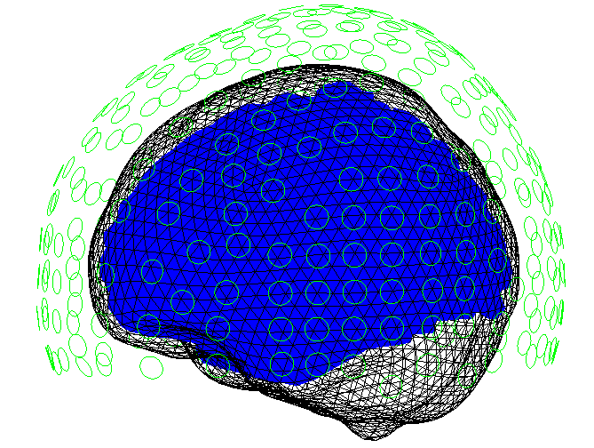
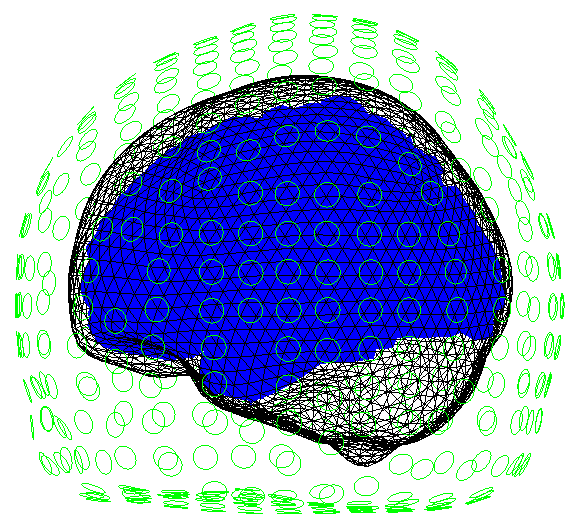

# Simulation of OPM lead fields

## MNI Space
If you want to simulate MEG data you need to supply sensor positions and  orientations which should be in the same coordinate space as some brain image. If you don't not have a brain image or sensor positions(and orientations) you can simulate data on an average template brain with automatically generated positions of fixed spacing using `spm_opm_sim`. The following code snippet automatically generates sensors in this average space that are a fixed `space` apart. In this case the spacing is 15mm.

```matlab
S =[];  
S.space = 15;  
D = spm_opm_sim(S);  
```
Once you run this code you will generate a figure like this. 


<figure markdown>
  <div class="center">
    
  </div>
</figure>


## Whole-Head MNI space
For some simulations you may want the entire scalp surface to be covered. In this case you just need to set the `wholehead` flag to 1.
```matlab
S =[];
S.space = 15;
S.wholehead=1;
D = spm_opm_sim(S);
```
Running this code snippet should generate a figure like this.


<figure markdown>
  <div class="center">
    
  </div>
</figure>


--8<-- "addons/abbreviations.md"

