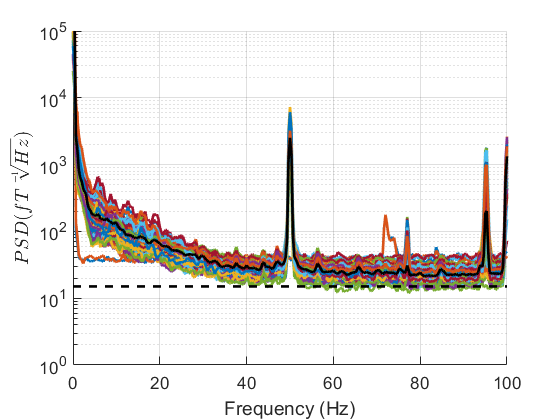
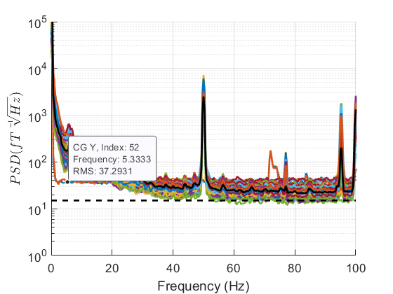

# Evoked response pipeline

## Introduction

This page goes through an example preprocessing pipeline for a sensor-level evoked response analysis. 

## Data import 

Currently SPM supports a file format that has the raw data stored in a binary file and all the metadata stored in 'TSV' and '.json' files. This is design to be as aligned as possible to the BIDS file structure. Data from Cerca Magnetics is stored in a similar format and we will analyse such a dataset in this tutorial. The necessary input arguments are the path to the binary file(`S.data`) and the path to the TSV file that contains the position information(`S.positions`)

```matlab
S = [];
S.data ='20230320_115853_meg_001.cMEG';
S.positions= '20230320_115853_HelmConfig.tsv';
D = spm_opm_create(S);
```

!!! note
    If you would like your file format to be supported by SPM please open an issue on Github

## Identifying bad channels

Once OPM data is imported the first step should be to identify any bad channels by looking at the PSD (power spectral density). This plot tells us if any channels are deviating notably from their manufacturer specifications or are clear outlier channels. 


```matlab
S=[];
S.D=D;
S.triallength = 3000; % time in ms: longer windows provide more frequency resolution but are noisier
S.plot=1;
S.channels='MEG';     % select only MEG channels
spm_opm_psd(S);
ylim([1,1e5])         % set y axis limits between 1fT and 100,000 fT
```

<figure markdown>
  {}
  <figcaption>Power Spectral Density</figcaption>
</figure>


We can now interactively identify the bad channels by clicking on the plot. We can then set then set the bad channels with the following code. 

<figure markdown>
  {}
  <figcaption>Bad Channels</figcaption>
</figure>

```matlab 
D = badchannels(D,[51,52],1);
D.save();
```
!!! note
    If you change an M/EEG object(`D`) you should call the `save` method to make your changes permanent.

## Filtering 

We can also filter our data to remove very low frequency interference and very high frequency interference. 
The key arguments are `S.freq` which set the cut-off frequency and `S.band` which sets the type of filter(high-pass or low-pass)

```matlab
S=[];
S.D=D;
S.freq=[2];
S.band = 'high';
fD = spm_eeg_ffilter(S);

S=[];
S.D=fD;
S.freq=[70];
S.band = 'low';
fD = spm_eeg_ffilter(S);

```
We can also optionally apply a stop-band filter for removing the line noise by changing the `S.band` argument

```matlab
S=[];
S.D=fD;
S.freq=[48,52];
S.band = 'stop';
fD = spm_eeg_ffilter(S);
```


## Harmonic Models of OPM data
While OPM sensors are sensitive to brain signal they are also incredibly sensitive to environmental interference. Unlike modern MEG systems OPMs come with no built in interference rejection. As such, all interference must be removed post-hoc using software. Here we will review some principled approaches to removing environmental interference based on solutions to Laplace's equation. 

### Spatial models of interference 

By solving Laplace's equation in spherical coordinates we can model OPM interference as a linear combination of vector spherical harmonics. The key arguments are the M/EEG object argument `S.D` and the order argument `S.L`. The order argument reflects how complicated the model of interference is. The number of regressors used in the interference model scales as `S.L^2+2*S.L`. As such, for this method it is recommended to have many more channels than this number. It is only not recommended to increase the order above `S.L=1` for radial samplings of the magnetic field. It is also strongly recommended that higher orders are only used for multi-axis OPM systems.

```matlab
S=[];
S.D=fD;
S.L=1;
[hfD]=spm_opm_hfc(S);
``` 
### Spatial models of interference and brain signal 
If you have a an OPM array with more than 120 channels it is possible to not only fit a model of the interference but also a compact model of the brain signal using spheroidal harmonics. The advantage of fitting both these models is that as you spatially oversample the data the white noise will reduce increasing the SNR of the data. Fitting the brain signal model also helps minimise the impact of interference that may be common to just a few channels. 


```matlab
S=[];
S.D= fD;
mD = spm_opm_amm(S);

``` 
### Spatio-temporal models of interference and brain signal 
if you still have remaining inteference in your data 

```matlab
S=[];
S.D= fD;
S.corrLim=.95
mD = spm_opm_amm(S);
``` 


## Epoching

```matlab

``` 

## Averaging 

```matlab

``` 

## Topoplots

```matlab

``` 


--8<-- "addons/abbreviations.md"