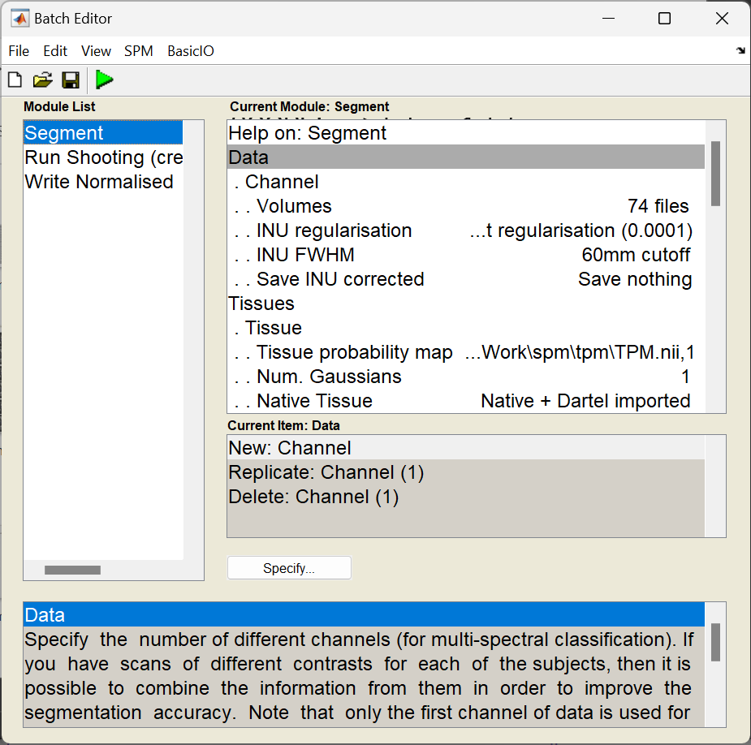
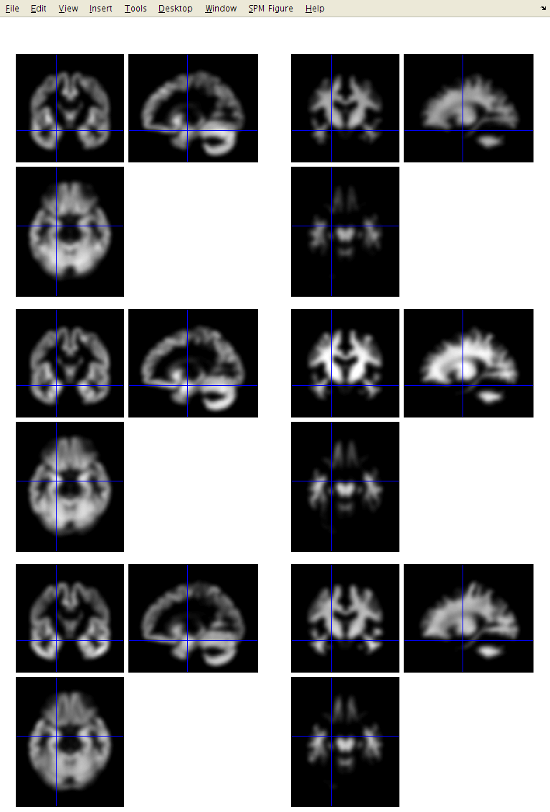
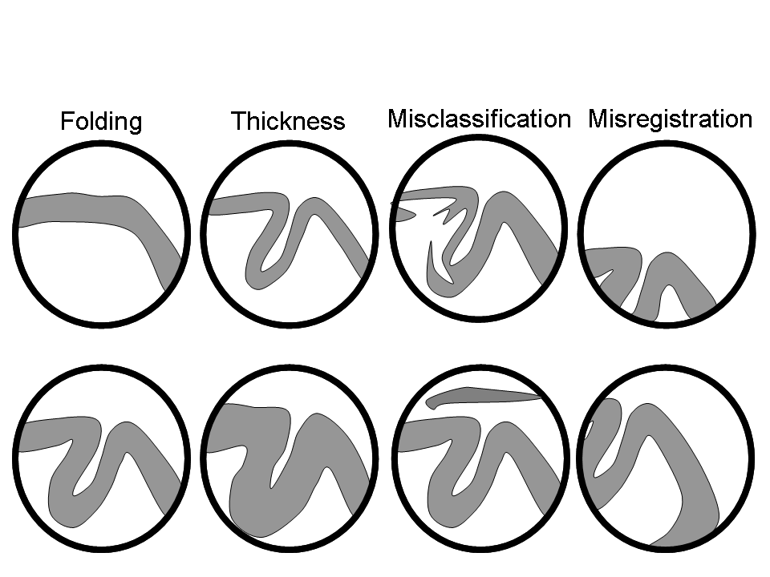

# Image processing for VBM

??? info "For MSc Advanced Neuroimaging students"
    Work with the images from the ``examples`` folder.

At this point, the images should all be in a suitable format for SPM to work with them.  NIfTI files contain some positioning and orientation information in their headers but sometimes this needs "improving". By having the images approximately aligned with MNI space, it makes it easier to align the data with MNI space, using local optimisation procedures such as those in SPM.

The following procedures will be used.  For the tutorial, you should specify them one at a time.
In practice though, it is much easier to use the batching system, by clicking the **Batch** button of the top-left figure.
The sequence of jobs in the batching system would be:

* **Module List**

    * **SPM:material-arrow-right-bold:Spatial:material-arrow-right-bold:Segment**: To generate the roughly (via a rigid-body) aligned grey and white matter images of the subjects.

    * **SPM:material-arrow-right-bold:Tools:material-arrow-right-bold:Shoot Tools:material-arrow-right-bold:Run Shooting (create Template)**: Determine the nonlinear deformations for warping all the grey and white matter images so that they match each other.

    * **SPM:material-arrow-right-bold:Tools:material-arrow-right-bold:Shoot Tools:material-arrow-right-bold:Write normalised**: Actually generate the smoothed "modulated" warped grey and white matter images.


## **Segment**

The objective now is to automatically identify different tissue types within the images, using **Segment** (Ashburner and Friston 2005).
The output of the segmentation will be used for achieving more accurate inter-subject alignment using Shoot (to be explained later).
Segmentation can be found within **SPM:material-arrow-right-bold:Spatial:material-arrow-right-bold:Segment** in the batching system.
It is suggested that **Native Space** versions of the tissues in which you are interested are generated, along with **Imported** versions of grey and white matter.
It is useful to also have either a native or "imported" version of the CSF, so that intra-cranial volumes may be computed (see later).

For VBM, the native space images are usually the ``c1*.nii`` files, as it is these images that will eventually be warped to MNI space.
Both the imported and native tissue class image sets can be specified via the **Native Space** options of the user interface.

Segmentation in SPM can work with images collected using a variety of sequences, but the accuracy of the resulting segmentation will depend on the particular properties of the images.
Although multiple scans of each subject were available, the dataset to be used only includes the T1-weighted scans.
There won't be time to segment all scans, so the plan is to demonstrate how one or two scans would be segmented, and then continue with data that was segmented previously.  If you know how to segment one image with SPM, then doing lots of them is pretty trivial.  The **Segment** module should be set up as follows:

* **Data**: Clicking here allows more channels of images to be defined.  This is useful for multi-spectral segmentation (eg if there are T2-weighted and PD-weighted images of the same subjects), but as we will just be working with a single image per subject, we just need one channel.

    * **Channel**

        * **Volumes**: Here you specify all the IXI scans to be segmented.

        * **Bias regularisation**: Leave this as it is.  It works reasonably well for most images.

        * **Bias FWHM**: Again, leave this as it is.

        * **Save Bias Corrected**: This gives the option to save intensity inhomogeneity corrected version of the images, or a field that encodes the inhomogeneity. Leave this at **Save nothing** because we don't have a use for them here.

* **Tissues**: This is a list of the tissues to identify.

    * **Tissue**: The first tissue usually corresponds to grey matter.

        * **Tissue probability map**: Leave this at the default setting, which points to a volume of grey matter tissue probability in one of the images released with SPM12.

        * **Num. Gaussians**: This can usually be left as it is.

        * **Native Tissue**: We want to save **Native + Imported**.  This gives images of grey matter at the resolution of the original scans, along with some lower resolution "imported" versions that can be used for the Shoot registration.

        * **Warped Tissue**: Leave this at **None**, as grey matter images will be aligned together with Shoot to give closer alignment.

    * **Tissue**: The second tissue is usually white matter.

        * **Tissue probability map**: Leave alone, so it points to a white matter tissue probability map.

        * **Num. Gaussians**: Leave alone.

        *  **Native Tissue**: We want **Native + Imported**.

        * **Warped Tissue**: Leave at **None**.

    * **Tissue**: The third tissue is usually CSF.

        * **Tissue probability map**

        * **Num. Gaussians**

        * **Native Tissue**: Just chose **Native Space**.  This will give a map of CSF, which can be useful for computing total intra-cranial volume.

        * **Warped Tissue**: Leave at **None**.

    * **Tissue**: Usually skull.

        * **Tissue probability map**

        * **Num. Gaussians**

        * **Native Tissue**: Leave at **None**.

        * **Warped Tissue**: Leave at **None**.

    * **Tissue**: Usually soft tissue outside the brain.

        * **Tissue probability map**

        * **Num. Gaussians**

        * **Native Tissue**: Leave at **None**.

        * **Warped Tissue**: Leave at **None**.

    * **Tissue**: Usually air and other stuff outside the head.

        * **Tissue probability map**

        * **Num. Gaussians**

        * **Native Tissue**: Leave at **None**.

        * **Warped Tissue**: Leave at **None**

* **Warping & MRF**

    * **MRF Parameter**: This tries to remove isolated mis-classified voxels, and generally tidy up the tissue classes. It's probably best to leave this at the default setting of 1.

    * **Clean Up**: This is a bit of an ad hoc procedure that tries even harder to eliminate mis-classified tissues outside the brain. Classification of fluid in eyeballs is very different with and without the cleanup.  Without it, eyeballs are in the same class as CSF, because they are both a sort of fluid.  With the cleanup, eyeballs fall into the non-brain soft tissue class (making it easier to compute intra-cranial volumes). Again the default settings should work reasonably well.

    * **Warping regularisation**: This is a penalty term to keep deformations smooth. Leave alone.

    * **Affine regularisation**: Another penalty term. Leave alone.

    * **Sampling distance**: A speed/accuracy balance.  Sampling every few voxels will speed up the segmentation, but may reduce the accuracy. Leave alone.

    * **Deformation fields**: Not needed here, so leave at **None**.

<figure id="Fig:segjob" markdown>
{width=50%}
<figcaption> The form of a Segment job. </figcaption>
</figure>

Once everything is set up (and there are no ``<-`` symbols, which indicate that more information is needed), then you could click the **Run** button (the green triangle) - and wait for a while as it runs.
This is a good time for questions. If there are hundreds of images, then it is chance to spend a couple of days away from the computer.

After the segmentation is complete, there should be a bunch of new image files generated.
Files containing ``c1`` in their name are what the algorithm identifies as grey matter.
If they have a ``c2`` then they are supposed to be white matter.
The ``c3`` images, are CSF.
The file names beginning with ``r`` (as in ``rc1``) are the "imported" versions of the tissue class images, which will be aligned together next.

I suggest that you click the **Check Reg** button, and take a look at some of the resulting images.
For one of the subjects, select the original, the ``c1``, ``c2`` and ``c3``.  This should give an idea about which voxels the algorithm identifies as the different tissue types. Also try this for some of the other subjects.

<p>

 
<figure id="Fig:segoutput" markdown>
<figcaption> Left: An image, along with grey matter (``c1``), white matter (``c2``) and CSF (``c3``) identified by **Segment**.  Right: Imported grey (``rc1``) and white matter (``rc2``) for three subjects.  </figcaption>
</figure>
</p>

## **Run Shooting (create Templates)**

The idea behind Shoot (Ashburner, 2011) is to increase the accuracy of inter-subject alignment by modelling the shape of each brain using millions of parameters (three parameters for each voxel).
Shoot works by aligning grey matter among the images, while simultaneously aligning white matter.
This is achieved by generating its own increasingly crisp average template data, to which the data are iteratively aligned (Ashburner and Friston, 2008).
This uses the imported ``rc1`` and ``rc2`` images, and generates ``y_rc1`` (deformation) files, as well as Jacobian determinant maps (``j_``), velocity fields that parameterise the deformations (``v_``), and a series of template images.
The Run Shooting module would be set up as follows:

* **Images**: Two channels of images need to be created.

    * **Images**: Select the imported grey matter images (``rc1*.nii``).

    * **Images**: Select the imported white matter images (``rc2*.nii``).  These should be specified in the same order as the grey matter, so that the grey matter image for any subject corresponds with the appropriate white matter image.

<p>

  
<figure id="Fig:Shoot" markdown>
<figcaption> The form of a **Run Shooting** job (left) and the template data after different numbers of iterations (right).  </figcaption>
</figure>
</p>

Shooting takes a long time to run.
If you were to hit the **Run** button, then the job would be executed.
This would take a long time to finish, so I suggest you don't do it now.
If you have actually just clicked the **Run** button, then find the main MATLAB window and type Ctrl-C to stop the job.
This will bring up a long error message, and there may be some partially generated files to remove.

??? failure "SPM error messages"
    If you become a regular SPM user, and it crashes for some reason, then you may want to ask about why it crashed.  Such error messages (as well as the MATLAB and SPM version you use, and something about the computer platform) are helpful for diagnosing the cause of the problem. You are unlikely to receive much help if you just ask why it crashed, without providing useful information.

    The developers of SPM always appreciate bug reports. There are about half a million lines of code in SPM12, so it's bound to contain a few mistcakes.

## **Write Normalised**

This step uses the resulting `y_rc1`` files (deformation fields), to generate smoothed, spatially normalised and Jacobian scaled grey matter images in MNI space (Mechelli et al, 2005; Ashburner, 2009).

* **Shoot Template**: Select the final template image created in the previous step.  This is usually called Template\_4.nii.  This template is registered to MNI space (affine transform), allowing the transformations to be combined so that all the individual spatially normalised scans can also be brought into MNI space.

* **Select according to**: Choose **Many Subjects**, as this allows all deformation fields to be selected at once, and then all grey matter images to be selected at once.

    * **Many Subjects**

        * **Deformation fields**: Select all the deformation fields created by the previous step (``y_*.nii``).

        * **Images**: Need one channel of images if only analysing grey matter.

            * **Images**: Select all the grey matter images (``c1*.nii``), in the same order as the deformation fields.

* **Voxel Sizes**: Specify voxel sizes for spatially normalised images.  Leave as is ```NaN NaN NaN```, to have 1.5 mm voxels.

* **Bounding box**: The field of view to be included in the spatially normalised images can be specified here.  For now though, just leave at the default settings.

* **Preserve**: For VBM, this should be set to **Preserve Amount ("modulation")**, so that tissue volumes are compared.

* **Gaussian FWHM**: Specify the size of the Gaussian (in mm) for smoothing the processed data by.  This is typically between about 4mm and 12mm.  Use 10mm for now.

The optimal value for FWHM depends on many things, but one of the main ones is the accuracy with which the images can be registered.
If spatial normalisation (inter-subject alignment to some reference space) is done using a simple model with fewer than a few thousand parameters, then more smoothing (eg about 12 mm FWHM) would be suggested.
For more accurately aligned images, the amount of smoothing can be decreased.
About 8mm may be suitable, but I don't much have empirical evidence to suggest appropriate values.
The optimal value is likely to vary from region to region: lower for subcortical regions with less variability, and more for the highly variable cortex.

<figure id="Fig:Processed" markdown>
{width=50%}
<figcaption> Processed grey and white matter data for three subjects, which are smoothed by 8 mm FWHM. Note that all data are shown scaled the same, which illustrates the effect of different global brain sizes (darker for smaller brains because structures are smaller).  </figcaption>
</figure>

The smoothed images represent the regional volume of tissue.
Statistical analysis is done using these data, so one would hope that differences among the processed data actually reflect differences among the regional volumes of grey matter.

<figure id="Fig:interpretation" markdown>
{width=90%}
<figcaption> We generally hope that the results of VBM analyses can be interpreted as systematic volumetric differences (such as folding or thickness), rather than artifacts (such as misclassification or misregistration).  Because of this, it is essential that the processing be as accurate as possible. Note that exactly the same argument can be made of the results of manual volumetry, which depend on the accuracy with which the regions are defined, and on whether there is any systematic error made.  </figcaption>
</figure>


After specifying all those files, you may wish to keep a record of what you do.
This can be achieved by clicking the **Save** button (with a floppy disk icon) and specifying a filename.  Filenames can either end with a ``.mat`` suffix or a ``.m``.
Such jobs can be re-loaded at a later time (hint: **Load** button).

??? note "Floppy disks"
    Floppy disks are from a time long ago when people felt that "640K ought to be enough for anybody". A typical T1-weighted scan would require more than 50 floppy disks to store it.

<div id="refs" class="references csl-bib-body hanging-indent footnote">

<div id="ref-ashburner05" class="csl-entry">

Ashburner, J., and K. J. Friston. 2005. "Unified Segmentation."
*NeuroImage* 26: 839--51.
<https://doi.org/doi:10.1016/j.neuroimage.2005.02.018>.
</div>

<div id="ref-ashburner07" class="csl-entry">

Ashburner, J. 2007. "A Fast Diffeomorphic Image Registration Algorithm."
*NeuroImage* 38 (1): 95--113.
<http://dx.doi.org/10.1016/j.neuroimage.2007.07.007>.

</div>

<div id="ref-john_averageshape" class="csl-entry">

Ashburner, J., and K. J. Friston. 2008. "Computing Average Shaped Tissue Probability
Templates." *NeuroImage* 45 (2): 333--41.
<https://doi.org/10.1016/j.neuroimage.2008.12.008>.

</div>

<div id="ref-ashburner2011diffeomorphic" class="csl-entry">

Ashburner, J. and Friston, K.J., 2011. "Diffeomorphic registration using
geodesic shooting and Gauss–Newton optimisation." *NeuroImage* 55 (3): 954--967.
<https://doi.org/10.1016/j.neuroimage.2010.12.049>.

</div>

<div>

Ashburner, J., 2009. "Computational anatomy with the SPM software". *Magnetic Resonance Imaging* 27 (8): 1163--1174.
<https://doi.org/10.1016/j.mri.2009.01.006>.

</div>

<div>

Mechelli, A., C.J. Price, K.J. Friston and J. Ashburner. 2005. "Voxel-Based Morphometry of the Human Brain: Methods and Applications." *Current Medical Imaging Reviews* 1:105--113.
<https://www.fil.ion.ucl.ac.uk/spm/doc/papers/am_vbmreview.pdf>.

</div>

