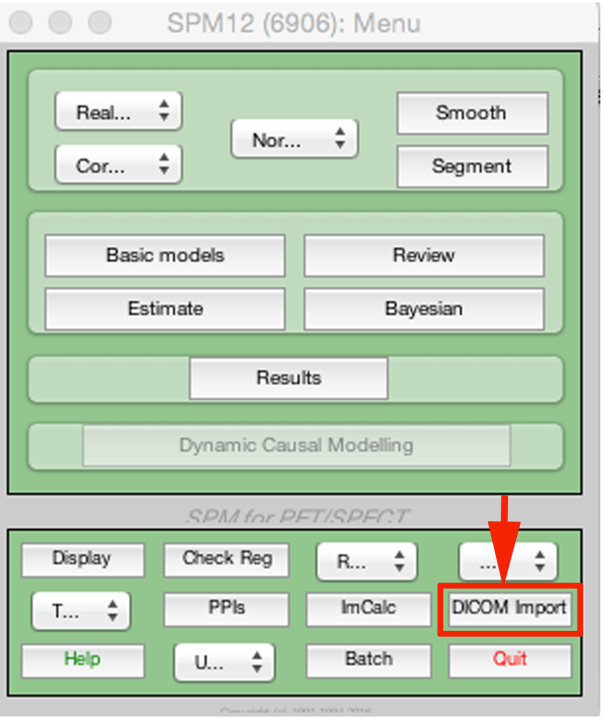
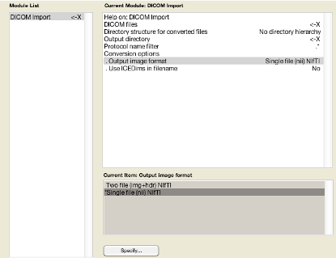
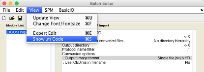

# Data preparation

## 1. Setting up the directory structure

Neuroimaging experiments result in complicated data that can be arranged in many different ways.  Historically, individuals have tended to use their own unique naming/directory structures. The “Brain Imaging Data Structure” (BIDS) Specification has been designed to standardise this to help others understand the data, aiding replication, data-sharing and collaborations. For more details see: https://bids.neuroimaging.io/

For this demo, we will use the anatomical and naming convention as per BIDS:

`[some path]/spm_vbm_tutorial/start/sub-001/anat/`

See the end of this section for a code snippit to combine this with dicom import.

## 2. DICOM import

Normally, MRI data comes from the scanner in dicom file format (`.dcm`). To use this we first need to import the data and convert it into nifti file format. It is preferable to use “single file nifti format” rather than two-file (`.img` and `.hdr`).

Dicom import is located on the main SPM menu:



This will open up a GUI, where you can select the `.dcm` data, output directory and output file format.



Obviously this could get a bit tedious with lots of data, so the easiest thing is to write a short section of code to do this. A really useful function in SPM is the `View` :material-arrow-right-bold: `Show .m code`:



This will open a window with the corresponding code for that function. You can then copy and paste it into your own script. Over is a short example for the data import. I have modified it a bit to restructure the data following BIDs. 

```Matlab
%Modify naming as required:
study='vbmdemo/';%Study
group{1}='group-01/'; %subgroup1 - For simplicity with analysis
group{2}='group-02/'; %subgroup2
 
%Select path
OP=spm_select(1,'dir','Select path/location to build data directory');
 
%Some BIDS stuff
sub='sub-00n/';%subject numbering (N will be 1 -> max)
bidsanatomy='/anat/'; %bids anatomy format
 
X{1}=spm_select(inf,'dir','Directories containing GROUP1 .dcm');
X{2}=spm_select(inf,'dir','Directories containing GROUP2 .dcm');
 
for j=1:2
for i=1:size(X{j},1);
    target=char(strcat(OP,'/',study,group{j},sub(1:end-2),num2str(i),bidsanatomy));
    mkdir(target);
    clear matlabbatch
    %Select dicom data in directory
    data=spm_select('FPListRec',deblank(X{j}(i,:)),'.*.dcm');
    
    %This was copied from show .m code, and the variables above plugged in
    matlabbatch{1}.spm.util.import.dicom.data = cellstr(data);
    matlabbatch{1}.spm.util.import.dicom.root = 'flat';
    matlabbatch{1}.spm.util.import.dicom.outdir = cellstr(target);
    matlabbatch{1}.spm.util.import.dicom.protfilter = '.*';
    matlabbatch{1}.spm.util.import.dicom.convopts.format = 'nii';
    matlabbatch{1}.spm.util.import.dicom.convopts.icedims = 0;
    
    %Command to make matlabbatch run in spm
    spm_jobman('run',matlabbatch)
    
    %Now need to rename output to be consistent with BIDS
    NiiFile=spm_select('FPList',target,'.nii');
    newfilename=char(strcat(target,sub(1:end-2),num2str(i),'_T1w.nii'));
    movefile(NiiFile,newfilename);
end
end
 
clear X group sub bidsanatomy data matlabbatch target study
```