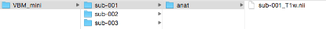
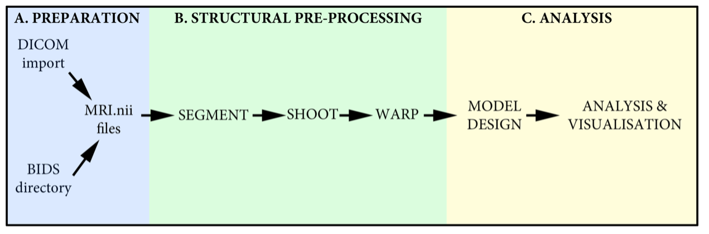

# Voxel Based Morphometry Tutorial using the Geodesic Shooting Toolbox

## Requirements
•	T1w MRI data for two groups (suggest ~10 subjects in each group)
•	Basic demographic details for each subject (Age, Gender + any other covariates)
•	MATLAB running SPM12. Make sure SPM12 and all subdirectories is in the MATLAB path (test by typing “which spm” in MATLAB prompt)

 

## Overview
This tutorial will go through the full processing pipeline for a two group VBM analysis using the Geodesic Shooting toolbox in SPM. The full analysis, depending on your computer, will take ~6h to run. If this is a live demo, then sub-select three datasets to test, and then set up the full analysis in your own time.

## Notes on the SPM VBM demo data
For the SPM workshop, a demo analysis looking for left-right brain asymmetry will be performed. This data consists of 12 R1 maps (1/T1) that have also been left-right flipped providing a total cohort size of 24. These have already been dicom imported and are supplied as native space .nii files. Note the DICOM import will not be covered in the workshop but is detailed below for reference.  

To speed up the demo, folders are organized into:

-	Start: This is where you begin to run the whole thing
-	Middle: Spm segment completed, ready for shoot warping
-	End: Completed warped, modulated data ready for VBM analysis

To note, if you just run the pipeline on all the data in “start”, that will output all of the data in the raw folder, for each subject. You can then double check what you find with the actual end result.

In the ‘middle’ and ‘end’ folders I have re-organised the data to more closely follow how it would be structured in a BIDS dataset. This means all the various outputs can be found in the derivatives folder.
 
