# Analysis

If you have got to this stage, then hopefully in every subjects folder you have a `swm[tissue-class][filename].nii`.

Before we construct a model, we will need one additional covariate in addition to those we already have for our study population – total intracranial volume

In SPM, there is a function to do this. Open the batch menu, select `SPM` :material-arrow-right-bold: `Util` :material-arrow-right-bold: `Tissue volumes`. 

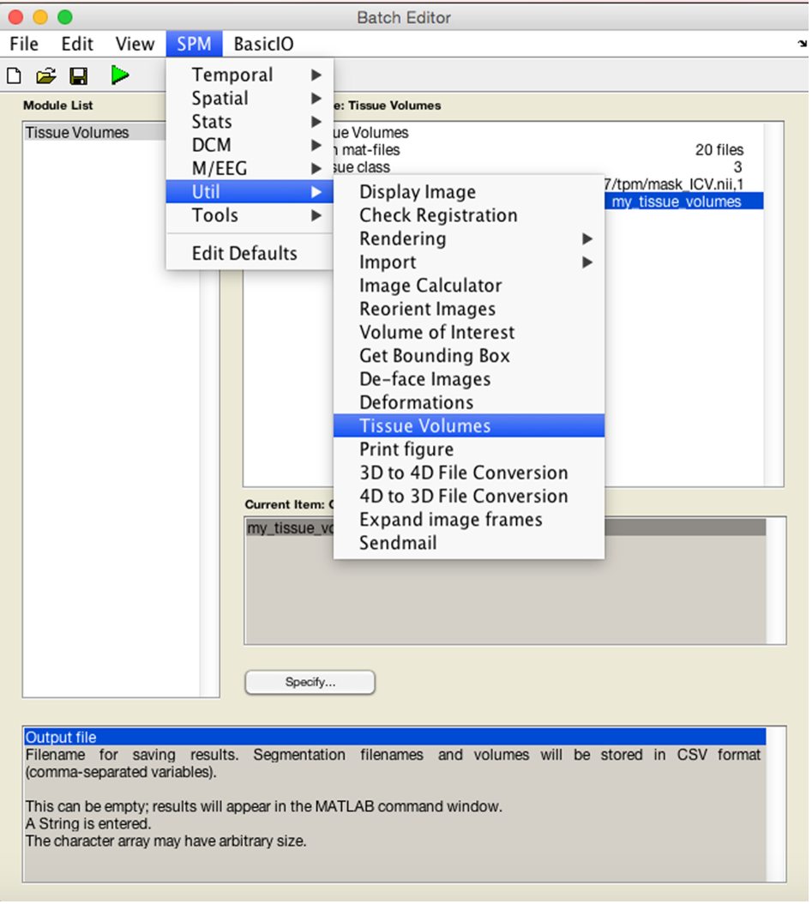

You will need to input the `seg8.mat` from the segmentation steps earlier. Recursively search using `.*seg8.mat`.

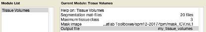

It will either output in MATLAB prompt, or if you specify a file it will generate a `.csv` you can use in excel. You will need to sum the three tissue classes (GM, WM, CSF) to obtain a volume in litres for each subject.
 
## Model

First make a new directory for your specific analysis. You will need one directory for each analysis you do.

Then from the SPM menu, select `Basic models`. 

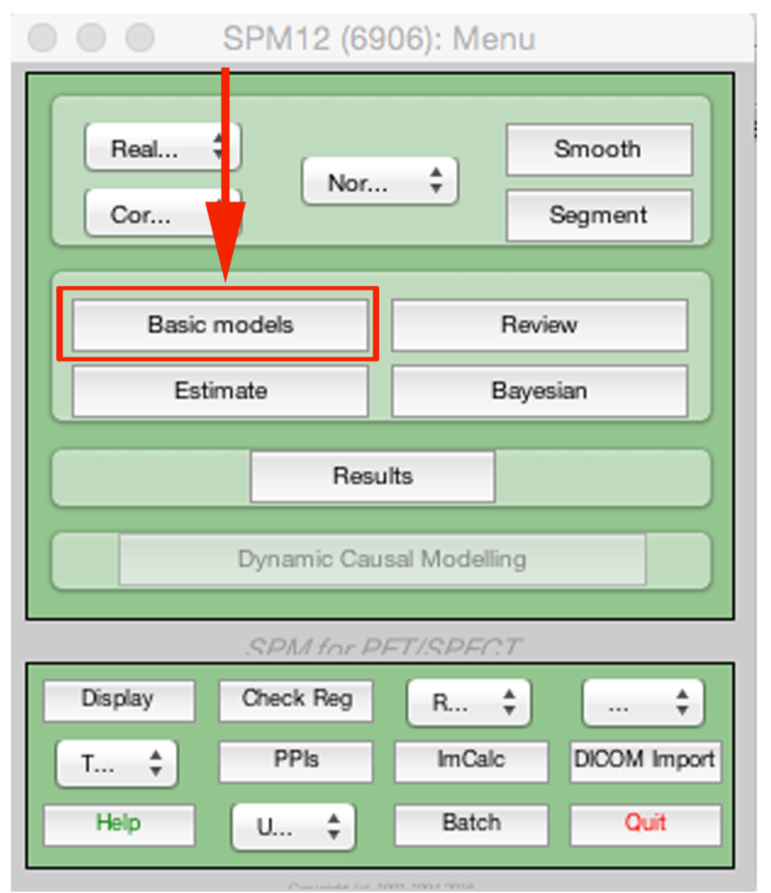

The precise set-up will depend on your study. Over I have provided an example for a two-sample t-test, controlling for age, gender and total intracranial volume.

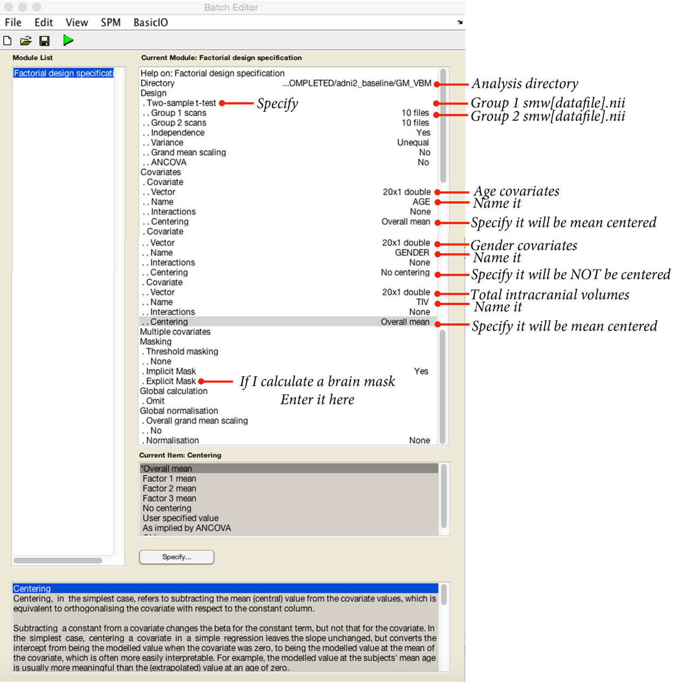

Again save your batch before proceeding. If you have done everything right, you will see the design matrix corresponding to your model (see next page). Now select `Estimate` from the SPM menu, select the `SPM.mat` in the folder you are using, and hit go.

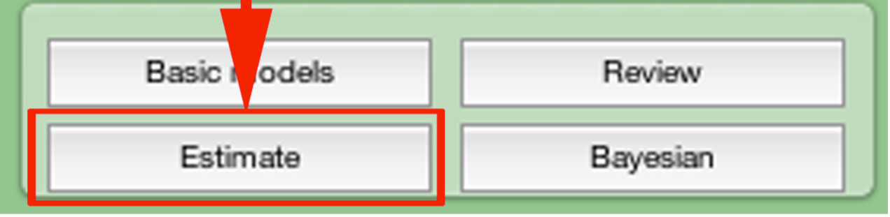

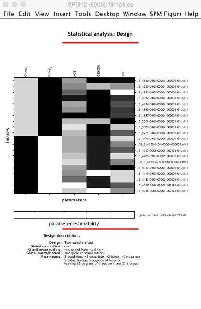

## Analysis and visualisation

Before we finish, it is a good idea to generate a population average brain for projecting our data onto (because it is not precisely MNI). To do this, we simply warp the intensity nonuniformity corrected T1s to our group average space. You can do this using `SPM` :material-arrow-right-bold: `Tools` :material-arrow-right-bold: `Shoot tools` :material-arrow-right-bold: `Write normalised`

* **Shoot Template**: As before, select the final template image created in the previous step (`Template_4.nii`).

* **Select according to**: Choose **Many Subjects**.

    * **Many Subjects**

        * **Deformation fields**: Select all the ``y_*.nii``.

        * **Images**: Need one channel of images for warping the intensity nonuniformity corrected scans.

            * **Images**: Select the intensity nonuniformity corrected images (``m*.nii``), in the same order as the deformation fields.

* **Voxel Sizes**: Specify voxel sizes for spatially normalised images (1mm might be a good choice).

* **Bounding box**: The field of view to be included in the spatially normalised images can be specified here.  For now though, just leave at the default settings.

* **Preserve**: For warping images, this should be set to **Preserve concentrations (no "modulation")**.

* **Gaussian FWHM**: We don't want to smooth, so choose 0 mm.

All being well, this will generate a `w[filename].nii` in each folder.

Now to generate an average image, select `Imcalc` from the SPM menu:

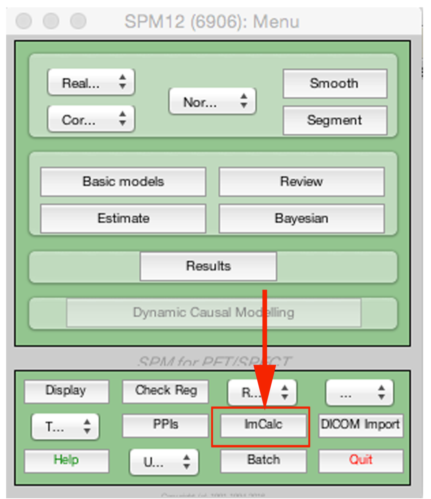

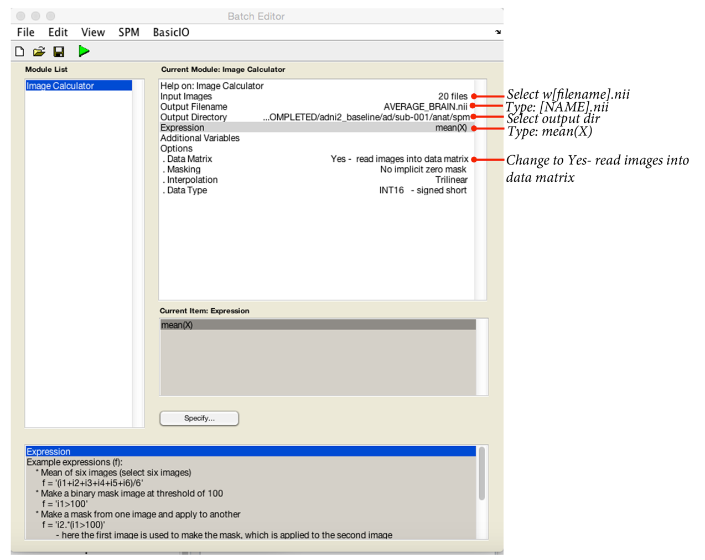

This will read in all the `w[filenames].nii` and calculate a population average:

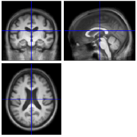

Now onto looking at our results:

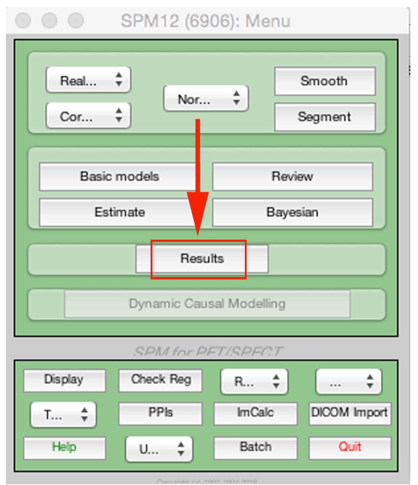

This will open a file select, you need to go to your analysis folder and pick the `SPM.mat`. Following this, the contrast manager will open. Click `Define new contrast`.

Enter a name.

To test for regions of the brain significantly bigger in group 1 vs. group 2, enter `1 -1` into the contrast, then click `Ok`. To do the opposite analysis (group 2 regions > group 1) enter `-1 1`.

Then:

- `Apply masking` :material-arrow-right-bold: `None` (or enter a mask if you have one)
- `Correction` :material-arrow-right-bold: `FWE`
- `P value` :material-arrow-right-bold: `0.05`
- `Extent threshold` :material-arrow-right-bold: `0`

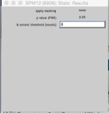

The next window displays any results that survive FWE correction at P < 0.05, displayed on a glass brain.

If you want to see these results on an actual MRI, click (overlay) and select `sections` and then input the average brain you just calculated.

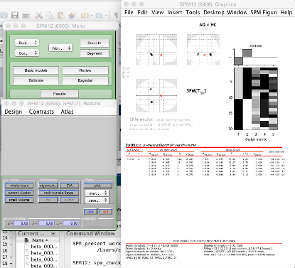

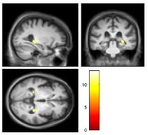

If you want to change the contrast, or inspect a different threshold (P < 0.001 uncorrected), use the `Contrasts` menu.

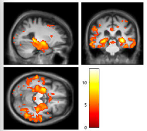

You can save your thresholded SPM result in the save menu (the one under the overlay menu). You can then use your data visualization program of choice to generate results.

