# Structural preprocessing

Here is an overview of the structural pre-processing steps we are aiming to achieve:

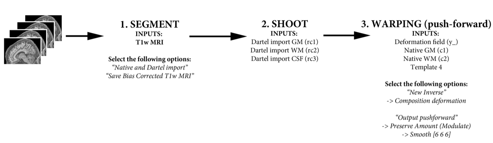

!!! tip "Important before starting"
    While the SPM pipelines do an excellent job of combining and realigning data, they do rely on the source data (i.e. all of the T1w MRIs in native subject space) being in reasonably close alignment to one another.
     
    Before starting any analysis, you should always visually check your data. This is by far and away the most common source of errors/mistakes, and it is much easier to correct at the start.
     
    To do this, use the `Check registration` function in the SPM main menu. You can select up to 24 images at a time:
    
    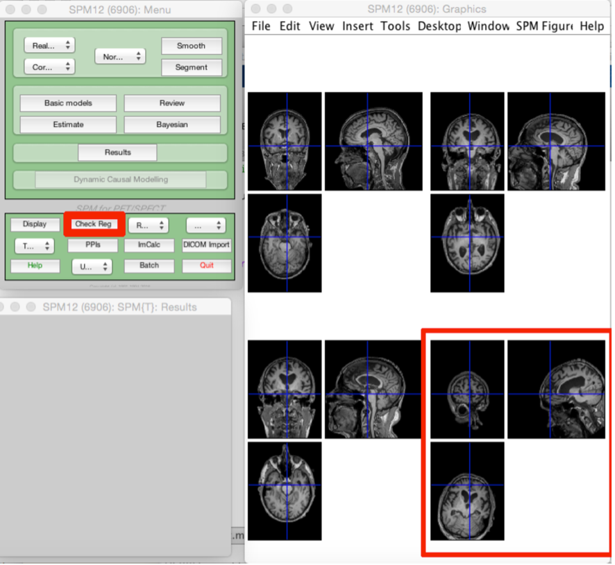

    In the example above, we can see that the bottom right MRI is very poorly aligned with the rest. This is unlikely to be successfully processed and may cause problems later. It is easier to manually realign images like these at the start. 

    To do this, right click on the MRI with the issue, and select `Re-orientate image` and `Current image` from the menu:
    
    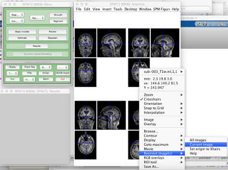    
    
    This will open a window with 9 affine transforms you can manually specify until you have reasonably good alignment. Then just `Apply to images`. It is a good idea to store the transformation matrix for reference.

    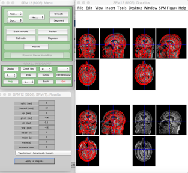

## Segmentation

Assuming your data has been successfully imported, you have checked it for any problems and corrected any issues, the next step is to segment the brain into different tissue types. SPM12 will produce up to six tissues:

- c1 – Grey Matter
- c2 – White Matter
- c3 - CSF
- c4 - Bone
- c5 – Soft tissue
- c6 – Everything else

For VBM, we are interested in analyzing the grey and white matter. In these processing steps, we will also include the CSF for generating the group template, brain mask, and calculating total intracranial volume.

First select `Segment` from the SPM menu:

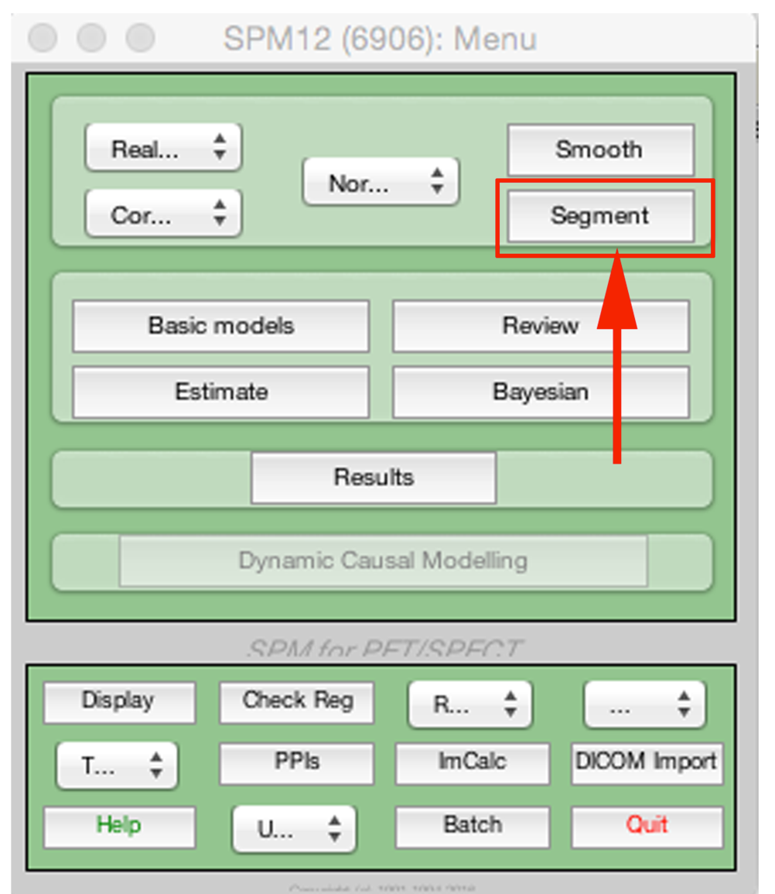

This will open up the segmentation batch menu. There are a lot of options available that we will not explore here.

First double click on volumes. This will open a file select box, where we will select all of the T1w images we want to analyse:

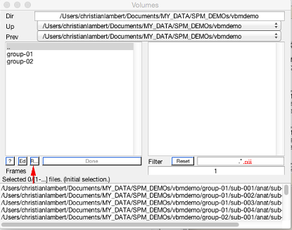

Rather than selecting each file manually, you can speed this up using recursive search (shown above). At the end of the filter add `.nii` (to specify you want to look for all of the nifti files within the directories above) and then hit `Rec` (arrow). We will use this again later with other file specifiers. 

You will now need to modify the following options (summarized on the figure over):
- `Save bias corrected` :material-arrow-right-bold: `Save bias corrected` (for making group average brain to project results on later).
- `Native tissue` :material-arrow-right-bold: `Native and Dartel imported` for tissue classes 1-3
- `Native tissue` :material-arrow-right-bold: `None` for tissue classes 4-6

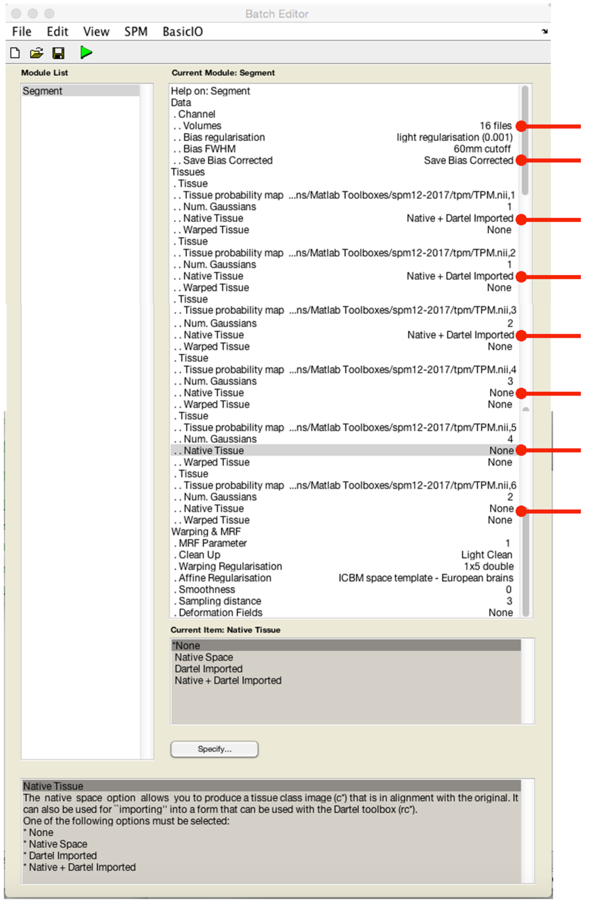

Before processing the data, it is a good idea to save the batch in-case you need to re-do/check again later: 


This may take a little while to complete, depending on the size of your dataset and computer. The output in each file directory will be:
- `c1[filename].nii` – Native space grey matter segmentation  
- `c2[filename].nii` – Native space white matter segmentation  
- `c3[filename].nii` – Native space CSF segmentation  
- `rc1[filename].nii` – Dartel import space grey matter segmentation  
- `rc2[filename].nii` – Dartel import space white matter segmentation  
- `rc3[filename].nii` – Dartel import space CSF segmentation  
- `m[filename].nii` – Native space bias corrected T1w  
- `[filename]_seg8.mat` – Various normalization transform data

Below is a figure showing native `c1` (left) and `dartel import` (right) segmentations. Basically, `dartel import` is orientated (rigidly aligned) with MNI space, meaning every subject’s data is in reasonably close alignment with one another which will help produce better results using the warping algorithms. 

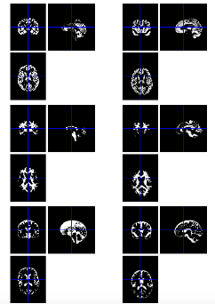

!!! tip "Visual inspection"
    It is a good idea to visually check your segmentation results for errors/problems at this stage before moving onto Shoot.

## Shoot

Geodesic shooting is a diffeomorphic warping algorithm designed to non-linearly align the brain data. It has recently been developed building on the earlier Dartel pipeline. As such, it does not yet have as many additional functions compared to Dartel (e.g. normalise to MNI space, warp many etc.,), and therefore requires some additional manual steps to use (covered here). However, the overall impression is that it is better than Dartel and will be increasingly used in the future, therefore it is the pipeline used here. 

To use, first open the SPM batch window:

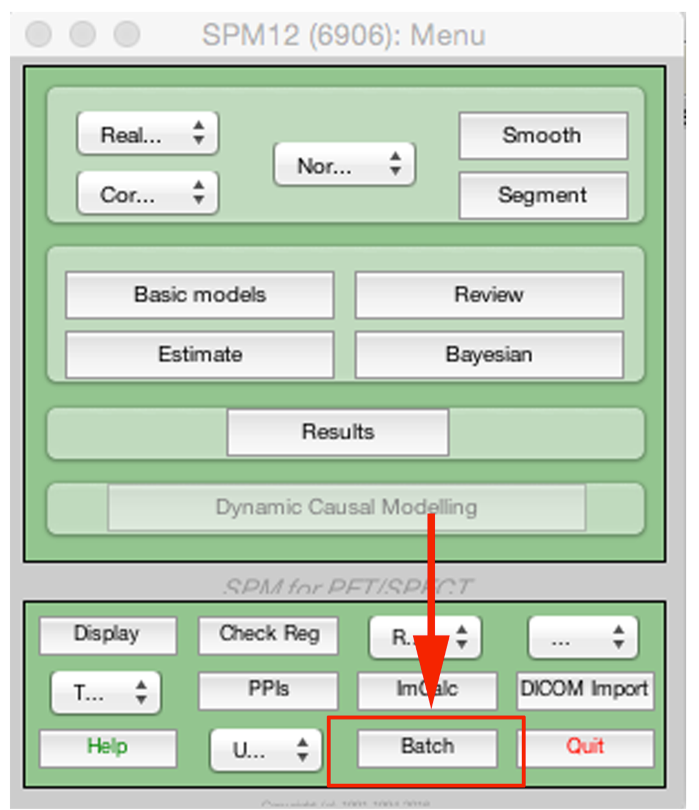

From there, you want to select `SPM` :material-arrow-right-bold: `Tools` :material-arrow-right-bold: `Shoot tools` :material-arrow-right-bold: `Run shooting (create templates)`:


This will open up the Shoot batch window:

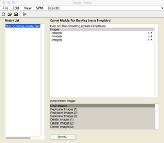

Click on `New: Images` for each tissue class you are going to use for generating the population average template. Here I am going to use GM, WM and CSF so I create three `Images` channels.

Now double click on each image channel to add the data. Here you will need to select your `Dartel import` tissue classes. Again I’m going to use recursive search by typing `^rc1.*` and pressing `Rec`. This will find all the GM. Then click `Done`.

Repeat this process for the remaining two channels, using `^rc2.*` for WM and `^rc3.*` for CSF.

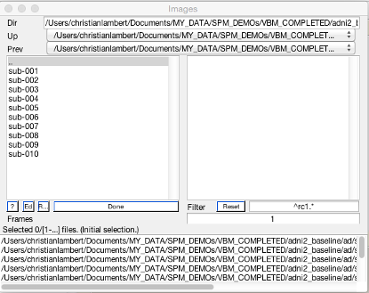

When you inputted the data correctly, the arrow should go green. Again it is sensible to save your batch at this stage.

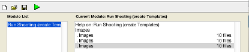

!!! info "Time considerations"
    This is the slowest part of the entire pipeline, and may take hours-days depending on data size/computer.  

The output in each file directory will be:
- `y_rc1[filename].nii` – Deformation field
- `j_rc1[filename].nii` – Jacobian determinants
- `v_rc1[filename].nii` – Velocity field

Additionally, in the first directory you will find five template images (0-4). These are 4D files (containing GM, WM, CSF, other) showing various stages in estimating the population average:

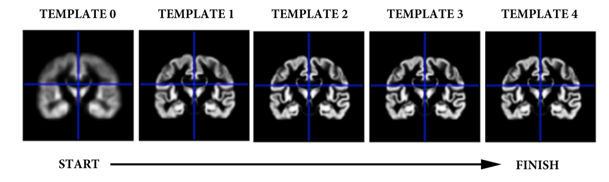

Importantly, this process estimates a population average template. This is a type of group average space that is unique to your study population. This is **not** MNI space (MNI is a type of population average space), however it will be very close. 

!!! info "Template spaces"
    You can do and publish your entire analysis in your specific population average space.
    
    If you really want your results in MNI space (e.g. for data-sharing results maps/coordinates), you can do this using the `Co-registration` function (MNI = reference, population average = source, other = any results/data you want to move to MNI).
 
## Warping

To analyse our brain data, we need to warp it to the group average space. To do this, we will use the deformation fields (`y_[filename].nii`) we have just generated using the Shoot Toobox.

To do this, we need to open the SPM batch menu again

From here we need to select `SPM` :material-arrow-right-bold: `Util` :material-arrow-right-bold: `Deformations`

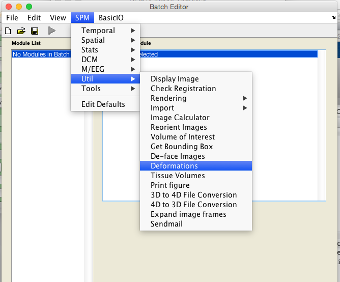

This will provide a menu with a lot of options for normalizing data. The approach we will use is called `push-forward`. This has the advantage that we can also simultaneously modulate and smooth the data, cutting down the number of steps we have to do.

To use push-forward, we need to select:
- `Composition` :material-arrow-right-bold: `New Inverse` (this will add a new submenu)  
- `Inverse` :material-arrow-right-bold: `Composition: New deformation`:material-arrow-right-bold: `Deformation Field`   
- Input the `y_[filename].nii`  
- `Image to base inverse on` :material-arrow-right-bold: Input `Template_4.nii`  
- `Output` :material-arrow-right-bold: `New pushforward` (this will add a new submenu)  
- `Pushforward`:material-arrow-right-bold: `Apply to` :material-arrow-right-bold: Put in image(s) to be warped (i.e. `c1` and `c2`, **not** dartel import)  
- `Output destination` :material-arrow-right-bold: `Source directory`  
- `Field of view` :material-arrow-right-bold: `Image defined` (this will add a new submenu)  
- `Image defined` :material-arrow-right-bold: Input `Template_4.nii`  
- `Preserve` :material-arrow-right-bold: `Preserve amount (“modulation”)`  
- `Gaussian FWHM` :material-arrow-right-bold: `[6 6 6]` (smoothing kernel)  

This is summarized in the figure below:

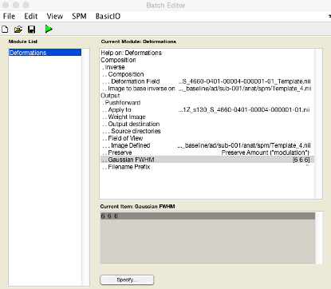

Save the batch. When you hit go, it should output `smw[inputfilename].nii` files in the folder containing the MRI data. This is the smoothed modulated warped images that you will use for your VBM analysis:

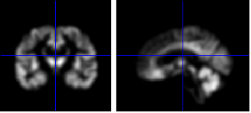

Repeating this for every subject would be a bit tedious. Unfortunately there is not yet an `apply to many` option for this (though may be soon). Attached is a script to do that for you for now. Copy and paste into a blank script, save as `spm_warpshoot`, make sure it is in your path and simply type `spm_warpshoot` to run. This can also be used to create a group average brain (with adaptations, detailed later).

```Matlab
function spm_warpshoot
%Geodesic shooting does not currently have a GUI for warping many subjects
%This is a simple wrapper script to help. 
%--------------------------------------------------------------------------
%C.Lambert, July 2018
%--------------------------------------------------------------------------
 
%Just check number of tissue classes to normalise
answer = inputdlg('Number of tissue classes (default 2)','INPUT');
if isempty(str2num(answer{1})),classes=2;else classes=str2num(answer{1});end
 
%Modulate or not
answer = inputdlg('Modulate (0 = No, 1 = Yes, default YES)','INPUT');
if isempty(str2num(answer{1})),mod=1;else mod=str2num(answer{1});end
if mod~=1,mod=0;end %Make sure no silly inputs
 
answer = inputdlg('Smoothing FWHM (default 0 0 0)','INPUT');
if isempty(str2num(answer{1})),fwhm=[0 0 0];else fwhm=str2num(answer{1});end
 
%SELECT WARP FIELDS:
W=spm_select(inf,'any','INPUT WARP FIELDS');Sw=size(W,1);
T=spm_select(1,'any','TARGET TEMPLATE');
 
%Now select INPUTS SEGMENTATIONS:
for i=1:classes
    S{i}=spm_select(inf,'any',char(strcat('Input tissue class',32,num2str(i))));
end
 
for i=1:Sw,
    INPUT=deblank(S{1}(i,:));[OP,~,~]=fileparts(INPUT);clear matlabbatch
    
    if classes>1
        for j=2:classes,INPUT=char(INPUT,deblank(S{j}(i,:)));end
    end
    
    matlabbatch{1}.spm.util.defs.comp{1}.inv.comp{1}.def = cellstr(deblank(W(i,:)));
    matlabbatch{1}.spm.util.defs.comp{1}.inv.space = cellstr(T);
    matlabbatch{1}.spm.util.defs.out{1}.push.fnames = cellstr(INPUT);
    matlabbatch{1}.spm.util.defs.out{1}.push.weight = {''};
    matlabbatch{1}.spm.util.defs.out{1}.push.savedir.saveusr = cellstr(OP);
    matlabbatch{1}.spm.util.defs.out{1}.push.fov.file = cellstr(T);
    matlabbatch{1}.spm.util.defs.out{1}.push.preserve = mod;
    matlabbatch{1}.spm.util.defs.out{1}.push.fwhm = fwhm;
    matlabbatch{1}.spm.util.defs.out{1}.push.prefix = '';
    spm_jobman('run',matlabbatch);
end
end
```