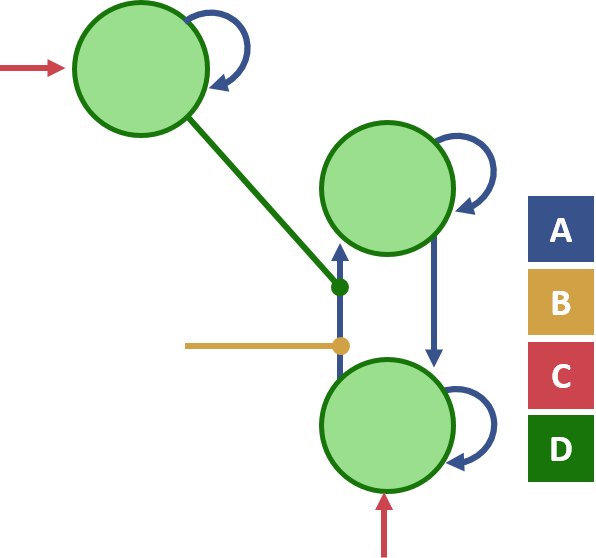
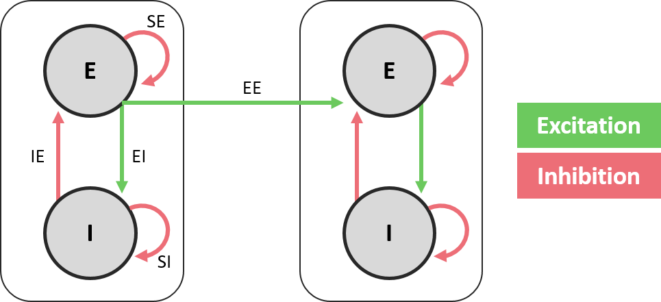

# DCM models for fMRI

This page gives an overview of the different neural models available for analysing fMRI data.

| Model | Description |
| --- | --- |
| [One-state DCM](#one-state-dcm) | The basic DCM model for fMRI |
| [Non-linear DCM](#non-linear-dcm) | Extended model enabling regions to gate connectivity between other regions |
| [Two-state DCM](#two-state-dcm) | Extended model with excitatory and inhibitory neural populations per region |

---

## One-state DCM

This is the basic neuronal model for DCM for fMRI and was the first DCM to be introduced. The model represents activity in each region \(which may be interpreted as average post-synaptic firing\) by a single number. This is referred to as a \(hidden state\) in that the neuronal activity cannot be measured directly and must be inferred.

### The model

The level of neural activity in each brain region is summarised by a vector $$z$$, where $$z_i$$ is the activity of region $$i$$. The change in z over time \(i.e. its derivative with respect to time\), for which we use the notation $$\dot{z}$$, is written as follows:
$$
\dot{z}=f(z,u,\theta^n)
$$
In words, the rate of change in each brain region's activity is a function $$f$$ of its current activity$$z$$, experimental inputs $$u$$ and connection parameters $$\theta^n$$. 

The definition of $$f$$ depends on the DCM model being used. With enough data, $$f$$ could be a tremendously detailed biophysical model, taking into account many possible causes of changes in neural activity. However, in the context of fMRI, we use a simple approximation of $$f$$. The approximation used here is a \[Taylor series\]\(https://en.wikipedia.org/wiki/Taylor\_series\), which gets closer to representing the true function as more terms are included. 

In the one-state DCM model, $$f$$ is approximated as follows:

$$
\dot{z} = \(A + \sum{u\_jB^j}\)z + Cu
$$

This is a function of three sets of parameters: matrix $$A$$ \(the baseline or average connectivity\), matrix $$B^j$$ \(the modulatory influence of experimental input $$j$$ on each connection\) and matrix $$C$$ \(the driving input of each experimental input on each region\). Matrix $$u$$ contains the experimental timeseries (e.g. boxcar on-off regressors) which are hypothesised to drive or modulate the network. 

### Mathematical background
As mentioned, the neural state equation above is the Taylor approximation of the function $$f$$. We include the first three terms of the approximation:

$$
\begin{aligned}  
\dot{z}&=f\(z,u\) \  
&\approx f\(z\_0,u\)+\frac{\partial f}{\partial z}z + \frac{\partial f}{\partial u}u + \frac{\partial^2 f}{\partial z \partial u}uz  
\end{aligned}
$$

The first expression, $$f\(z\_o,u\)$$, is the response of the neural system at rest, which we typically assume is zero. By including the three terms which follow, we ensure that the first and second derivatives of our approximation match the first and second derivatives of the real response function.

We would like to parameterize this approximation - so that we have parameters estimated from the data which have some biologically relevant meaning. To do this we substitute the derivative terms for parameters $$A$$, $$B$$ and $$C$$:

$$
\begin{aligned}
&f(z_0,u)+\frac{\partial f}{\partial z}z + \frac{\partial f}{\partial u}u + \frac{\partial^2 f}{\partial z \partial u}uz \\[2ex]
&= f(z_0,u) + Az + Cu + Buz  \\[2ex]
&= (A + \sum{u_jB^j})z + Cu
\end{aligned}
$$

(Where $$A$$ is evaluated at $$u=0$$ and $$C$$ is evaluated at $$z=0$$.) We detail the interpretation of $$A$$, $$B$$ and $$C$$ in the next section. If you wish to learn more about the Taylor approximation, see the lecture series at [Kahn Academy](https://www.khanacademy.org/math/calculus-home/series-calc/taylor-series-calc/v/maclauren-and-taylor-series-intuition).

### Parameters

Given n regions and u experimental inputs:

| Parameter | Dimension | Directory |
| --- | --- | --- |
| A | n x n | Average or baseline connectivity within and between regions. |
| B | n x n x u | The modulatory influence of each experimental input on each connection. |
| C | n x u | The driving effect of each experimental input on each region. |

#### Matrix A

Matrix $$A$$ represents the causal influence of one neural population on another \(the effective connectivity\). This is implemented as a Matlab matrix, where $$A(x,y)$$ is the strength of the connection from region $$y$$ to region $$x$$. Entries on the diagonal of the matrix are self-connections and the off-diagonal entries are between-region connections.

The units for matrix $$A$$ \(as well as $$B$$ and $$C$$\) are Hz, because they are rates of change. Note that the self-connections on the $$A$$ and $$B$$ go through an extra stage of processing. In order to force them  always to be negative, the self-connections are log scaling parameters, which scale the prior value of -0.5Hz. The strength of the self-connection $$S_{i}$$ for region $$i$$ is given by:

$$
S_{i}=-0.5*exp(A_{ii} + B_{ii})
$$

#### Matrix B

Parameters in matrix $$B^j$$ represent the change in the effective connectivity of particular connections  caused by the $$j^{th}$$ experimental input. It is implemented as a 3D matrix in Matlab, where element $$B(x,y,j)$$ is the influence of condition $$j$$ on the connection from region $$y$$ to region $$x$$.

Matrix $$B$$, which is sometimes called the 'bilinear' term of the DCM equation, may be used to represent the context of an experimental manipulation. For instance, an experiment may involve participants seeing visual stimuli, with the instruction to pay attention to some feature of the stimuli on a subset of trials. The $$B$$-matrix could then be used to represent the change in connection strengths on attention trials, relative to connectivity during trials without attention.

#### Matrix C

Experimental inputs $$u$$ enter the model in two places. They modulate the strength of connections, as described above. Additionally, they enter specific regions to drive the dynamics in the network.

The driving inputs are represented in matrix $$C$$, where element $$C(i,j)$$ represents the strength of input $$j$$ on region $$i$$, in units of Hz. Note that in the absence of driving input, there would be no activity in the model, so this model is not suited to representing resting state dynamics.

[Back to top](#dcm-models-for-fmri)

---

## Non-linear DCM

Non-linear DCM is an extension to the basic DCM described above, but includes an extra term which enables individual regions to modulate the connectivity between other regions. This was developed to enable "neuronal gain control" to be modelled, which is the generic mechanism by which the response of a neuron $$N_1$$ to inputs from a second neuron $$N_2$$ depends on a third neuron, $$N_3$$. In other words, $$N_3$$ has a gating effect on the communication between two other neurons. This is nonlinear in the sense that $$N_1$$ depends on the interaction \(multiplication\) of inputs from $$N_2$$ and $$N_3$$. This may be of particular interest in the study of attention, where a high level brain region may influence the sensitivity of lower level brain regions to inputs from early sensory cortex.

### The model

The neural model is the same as that described above, but it includes one more term $$D$$ to represent the influence of each region on each connection:

$$
 \dot{z} = (A + \sum{u_jB^j} + \color{#38528C}{\sum{z_kD^k}})z + Cu
$$

Where $$z_k$$ is the activity \(state\) of region $$k$$ and $$D^k$$ is a matrix representing the non-linear influences of region $$k$$.

### Mathematical background

The basic DCM neural model described above consists of the first 3 terms of the Taylor series approximation of the system $$\dot{z}=f(z,u,\theta)$$. Extending this to the nonlinear model involves including one more term from the Taylor series:

$$
\begin{aligned}
&f(z_0,u)+\frac{\partial f}{\partial z}z + \frac{\partial f}{\partial u}u + \frac{\partial^2 f}{\partial z \partial u}uz + \frac{1}{2}\frac{\partial ^2 f}{\partial z^2}\frac{z^2}{2} \\[2ex]
&= f(z_0,u) + Az + Cu + Buz + Dz^2 \\[2ex]
&= (A + \sum{u_jB^j} + \sum{z_jD^j})z + Cu
\end{aligned}
$$

Here a nonlinear term has been added involving the matrix $$D$$, which depends only on the current activity in the network.

### The parameters

| Parameter | Dimension | Directory |
| --- | --- | --- |
| D | n x n x n | Influence of each region on each connection |

The parameter $$D(i,j,k)$$ represents the influence of region $$k$$ on the connection from $$j$$ to region $$i$$.

[Back to top](#dcm-models-for-fmri)

---

## Two-state DCM

Two-state DCM is an extension to the standard neuronal model in DCM for fMRI. Whereas the standard neuronal model in DCM represents the activity in each region as a single quantity, two-state DCM has an inhibitory and excitatory population of neurons in each region. This gives an explicit model of intrinsic connectivity within each region, and was adopted to be more plausible and less constrained than the original model. Two-state DCM imposes positivity constraints - all connections between regions are excitatory, which conforms to the organisation of real cortical hierarchies, where long-range connections are glutamatergic. With these richer dynamics, two-state DCM may provide a better fit to fMRI data. Furthermore, the inhibitory and excitatory populations add stability to the model, allowing the priors on the connections to be relaxed, which also may improve the model's ability to explain the data.

### The model

The model \(see figure\) involves recurrent connections between the excitatory \(E\) and inhibitory \(I\) populations in each region. There is an excitatory connection from E to I, denoted EI, and an inhibitory connection from I to E, denoted IE. There are inhibitory self-connections on E and I, which are referred to as SE and SI respectively. The connections between regions \(EE\) link the excitatory populations in each. In its current implementation in SPM12, the values assigned to these connections are either estimated when fitting the model to the data \(EE and IE\), or have fixed values \(EI, SI, SE; see table below\). The EE extrinsic connections are based on the off-diagonal of the A-matrix \(plus modulatory input B if available\), whereas the IE self-inhibitory connections take their value from the diagonal of the A-matrix \(plus modulatory input B if available\).

| Connection | Description | Value |
| --- | --- | --- |
| IE | intrinsic inhibitory to excitatory | Estimated |
| EE | extrinsic excitatory to excitatory | Estimated |
| EI | intrinsic excitatory to inhibitory | 1 |
| SI | intrinsic self-inhibition \(inhibitory\) | 1 |
| SE | intrinsic self-inhibition \(excitatory\) | 0.5 |

### Parameters

To enable certain connections to always have a positive effect and others to always have a negative effect, the parameters of the connections \(A-matrix\) and modulatory inputs \(B\) are log scaling parameters that increase or decrease the prior values.

The between-regions EE \(excitatory to excitatory\) connection strength is computed as follows:

$$
EE_{ij} = 1/8 * exp(J_{ij}(t))
$$

Where $$J_{ij}(t)$$ is the connection strength \(summed across A and B matrices\) between a pair of regions i and j at time t:

$$
J_{ij}(t) = A_{ij} + B_{ij}*u(t)
$$

The inhibitory self connections IE are transformed in the same way, but they are always negative, to ensure stability:

$$
IE_{ij} = -1/8 * exp(J_{ij}(t))
$$

The values in the A- and B-matrices therefore scale the prior connection strength, 1/8Hz. A value of 0 in the A-matrix and 0 in the B-matrix for a between-regions connection would equate to a connection strength of 1/8 _ exp\(0 + 0\) = 1/8Hz. Values of 0 for a self-connection would give -1/8 _ exp\(0+0\) = -1/8Hz.

All this means that in order to inspect the results of model estimation, one should first take the exponential of the A- and B-matrices, i.e. exp\(DCM.Ep.A\) or exp\(DCM.Ep.B\). \(This is done automatically if using the Review tool in the GUI.\) The number which results is a scaling factor, which scales the prior. A value of 1 means no effect, values larger than 1 mean a larger amplitude effect than the prior, and values smaller than 1 mean a smaller amplitude effect than the prior. The values in the C-matrix remain in units of Hz.

Here are some more examples of how to interpret the parameters:

**A-matrix between-region connections**

A between-region connection exp\(DCM.Ep.A\(i,j\)\) larger than 1 would mean the excitatory influence of region j on region i is larger than the prior \(1/8Hz\). A value smaller than 1 would mean the excitatory influence is smaller than the prior.

**A-matrix self connections**

A self-connection exp\(DCM.Ep.A\(i,i\)\) larger than 1 would mean stronger \(more negative\) self-inhibition in region i than the prior \(-1/8Hz\). A self-connection smaller than 1 would mean weaker \(less negative\) self-inhibition in region i than the prior.

**Modulatory \(task\) effects on the self-connections**

An estimated parameter exp\(DCM.Ep.B\(i,i\)\) larger than 1 would mean an increase in self-inhibition in region i caused by the task. Whereas, a value smaller than 1 on this connection would mean a decrease in self-inhibition caused by the task.

**Modulatory \(task\) effects on the between-region connections**

An estimated parameter exp\(DCM.Ep.B\(i,j\)\) larger than 1 on a between-regions connection would mean an increase in the connection strength from region j to region i caused by the task. A value smaller than 1 would mean a decrease in this connection due to the task.

### Notes

#### Difference between the paper and SPM12

The implementation of the model in SPM12, which is described here, has certain differences from its description in the original scientific paper by Marreiros and colleagues. In the paper, all possible intrinsic connections between the excitatory and inhibitory states are modulated and estimated explicitly. Therefore the matrices A and B have size \[2xm,2xn\] as opposed to \[m,n\]. This implementation wasn't adopted in SPM, in order to allow a more straightforward model comparison \(BMS\) with the other single-state and non-linear DCM options. As described above, the software uses a simplified scheme where an estimated parameter larger than 1 on a self-connection on the B-matrix contributes to the IE intrinsic inhibitory to excitatory connection, and therefore an increase in self-inhibition in that region caused by the task.

[Back to top](#dcm-models-for-fmri)

---

## Summary

There have been several refinements and extensions to the DCM model since its original formulation, which are detailed in this section. A key constraint on these models is that neural dynamics are caused by the experimenter via the task. In the next section, we introduce DCM models for fMRI which are particularly suited to modelling endogenous neural activity, such as in the context of resting state fMRI data.

[Back to top](#dcm-models-for-fmri)

